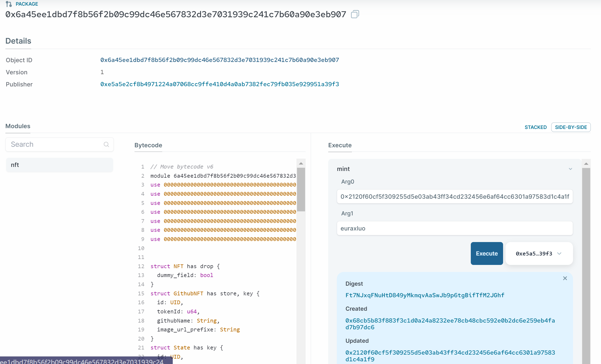

# NFT Development 
##### Auth:github/Euraxluo
##### Email:euraxluo@outlook.com


## 1. 创建一个新的NFT package
<!--
footer: https://docs.sui.io/guides/developer/sui-101/create-nft
-->
```bash
sui move new mynft
```

## 2. 编写NFT代码
```move
module mynft::nft{
    use sui::object::{Self, UID};
    use sui::transfer;
    use sui::tx_context::{Self, TxContext};
    use sui::display;
    use sui::package;
    use std::string::utf8;
    struct NFT has drop {}

    struct GithubNFT has key,store{
        id: UID,
        tokenId: u64,
        githubName: std::ascii::String,
        image_url_prefixe: std::ascii::String,
    }


    fun init(witness: NFT, ctx:&mut TxContext){
        let keys = vector[
            utf8(b"token_id"),
            utf8(b"name"),
            utf8(b"collection"),
            utf8(b"image_url"),
            utf8(b"description")
        ];

        let values = vector[
            utf8(b"GithubNFT #{tokenId}"),
            utf8(b"Github #{githubName}"),
            utf8(b"Github Avatars Collection"),
            utf8(b"{image_url_prefixe}/{githubName}"),
            utf8(b"This is Github User {githubName} Avatar NFT")
        ];

        let publisher = package::claim(witness,ctx);
        let display = display::new_with_fields<GithubNFT>(&publisher, keys, values, ctx);
        display::update_version(&mut display);
        transfer::public_transfer(publisher, tx_context::sender(ctx));
        transfer::public_transfer(display, tx_context::sender(ctx));

        transfer::share_object(State{
            id: object::new(ctx),
            count: 0
        });
    
    }
    struct State has key {
        id: UID,
        count: u64
    }


    entry public fun mint( state:&mut State,github_name:std::ascii::String, ctx: &mut TxContext){
        let sender = tx_context::sender(ctx);
        state.count = state.count + 1;
        transfer::public_transfer(createGithubNFT(state.count,github_name,ctx), sender);
    }

    public fun createGithubNFT(state_count:u64,github_name:std::ascii::String, ctx: &mut TxContext): GithubNFT {
        GithubNFT {
            id: object::new(ctx),
            tokenId: state_count,
            githubName: github_name,
            image_url_prefixe: std::ascii::string(b"https://avatars.githubusercontent.com/")
        }
    }

    public entry fun update_name(nft: &mut GithubNFT,github_name:std::ascii::String) {
        nft.githubName = github_name;
    }    
}
```

## 3. 编写测试代码
```move
#[test]
public fun test_create_nft() {
    use std::debug;
    // Create a dummy TxContext for testing
    let ctx = tx_context::dummy();

    // Create a State
    let state_obj = State {
        id: object::new(&mut ctx),
        count: 0
    };
    let nft:GithubNFT = createGithubNFT(state_obj.count, std::ascii::string(b"euraxluo"), &mut ctx);

    debug::print(&nft); 
    // Check if accessor functions return correct values
    assert!(nft.githubName ==  std::ascii::string(b"euraxluo"), 1);

    let dummy_address = @0xCAFE;
    transfer::transfer(state_obj, dummy_address);
    transfer::transfer(nft, dummy_address);
}
```

## 4. 测试&构建
```bash
@Euraxluo ➜ .../members/euraxluo/code/mynft (main) $ sui move test
UPDATING GIT DEPENDENCY https://github.com/MystenLabs/sui.git
INCLUDING DEPENDENCY Sui
INCLUDING DEPENDENCY MoveStdlib
BUILDING mynft
Running Move unit tests
[debug] 0x0::nft::GithubNFT {
  id: 0x2::object::UID {
    id: 0x2::object::ID {
      bytes: @0xeefed4f2b7f6ad5f65d6ea2eef50b4f1d1e98c39ca8eecbc9736da801b8387e6
    }
  },
  tokenId: 0,
  githubName: "euraxluo",
  image_url_prefixe: "https://avatars.githubusercontent.com/"
}
[ PASS    ] 0x0::nft::test_create_nft
Test result: OK. Total tests: 1; passed: 1; failed: 0
@Euraxluo ➜ .../members/euraxluo/code/mynft (main) $ sui move build
UPDATING GIT DEPENDENCY https://github.com/MystenLabs/sui.git
INCLUDING DEPENDENCY Sui
INCLUDING DEPENDENCY MoveStdlib
BUILDING mynft
```

## 5. 发布到主网
```bash
@Euraxluo ➜ .../members/euraxluo/code/mynft (main) $ sui client publish --gas-budget 50000000
[warn] Client/Server api version mismatch, client api version : 1.13.0, server api version : 1.14.2
UPDATING GIT DEPENDENCY https://github.com/MystenLabs/sui.git
INCLUDING DEPENDENCY Sui
INCLUDING DEPENDENCY MoveStdlib
BUILDING mynft
Successfully verified dependencies on-chain against source.
----- Transaction Digest ----
6cLG4eZw5vXu1ntGaZLD4n7Z6URS3a2bVddrYyYmSUXe
----- Transaction Data ----
Transaction Signature: [Signature(Ed25519SuiSignature(Ed25519SuiSignature([0, 204, 149, 213, 26, 88, 118, 253, 87, 7, 33, 80, 237, 24, 13, 22, 8, 134, 120, 74, 144, 100, 209, 247, 157, 4, 90, 160, 226, 25, 128, 41, 155, 150, 215, 31, 212, 48, 208, 119, 181, 238, 69, 102, 17, 186, 172, 44, 132, 171, 166, 87, 38, 179, 107, 71, 61, 252, 69, 121, 193, 2, 216, 243, 13, 240, 42, 51, 155, 18, 85, 124, 218, 144, 31, 57, 48, 205, 112, 117, 6, 35, 161, 17, 100, 143, 36, 91, 251, 22, 35, 70, 86, 180, 11, 248, 237])))]
Transaction Kind : Programmable
Inputs: [Pure(SuiPureValue { value_type: Some(Address), value: "0x1a5ca0b08b06f9996ce11edf7e2f6ddde7c8a05fbb0d053b787662a940fbdf70" })]
Commands: [
  Publish(<modules>,0x0000000000000000000000000000000000000000000000000000000000000001,0x0000000000000000000000000000000000000000000000000000000000000002),
  TransferObjects([Result(0)],Input(0)),
]

Sender: 0x1a5ca0b08b06f9996ce11edf7e2f6ddde7c8a05fbb0d053b787662a940fbdf70
Gas Payment: Object ID: 0x9d9431251ce33eb566a0aefe449e6f7d0882e8914338f7cdf2d8aac9a6c00a42, version: 0xd33ec, digest: BmSxr7f4LKoYnNTxSx7SLvU2eGhmjXSW6CBMtfECgUWC 
Gas Owner: 0x1a5ca0b08b06f9996ce11edf7e2f6ddde7c8a05fbb0d053b787662a940fbdf70
Gas Price: 1000
Gas Budget: 50000000

----- Transaction Effects ----
Status : Success
Created Objects:
  - ID: 0x2ec874b9d4571cdc3064e8055fcab210d93b03efa5feb63bbaadc1bdb053b97c , Owner: Shared
  - ID: 0x55a60e68bcb712403ef3bcb96c92940f954a682d593c5630987c84a0592e60ef , Owner: Account Address ( 0x1a5ca0b08b06f9996ce11edf7e2f6ddde7c8a05fbb0d053b787662a940fbdf70 )
  - ID: 0x889f74d62354160fe3450e2b6428dc4a432ba04008a7641eb00d19e69fae9cb8 , Owner: Immutable
  - ID: 0x9e67ab7251536141860d054071ddac796b43e0d00133954ad25e7de015cdda63 , Owner: Account Address ( 0x1a5ca0b08b06f9996ce11edf7e2f6ddde7c8a05fbb0d053b787662a940fbdf70 )
  - ID: 0xdedb83b5f5bf83d4d2109497061c265d7ecd5803f2f0d9918aa183b5851c72ac , Owner: Account Address ( 0x1a5ca0b08b06f9996ce11edf7e2f6ddde7c8a05fbb0d053b787662a940fbdf70 )
Mutated Objects:
  - ID: 0x9d9431251ce33eb566a0aefe449e6f7d0882e8914338f7cdf2d8aac9a6c00a42 , Owner: Account Address ( 0x1a5ca0b08b06f9996ce11edf7e2f6ddde7c8a05fbb0d053b787662a940fbdf70 )

----- Events ----
Array [
    Object {
        "id": Object {
            "txDigest": String("6cLG4eZw5vXu1ntGaZLD4n7Z6URS3a2bVddrYyYmSUXe"),
            "eventSeq": String("0"),
        },
        "packageId": String("0x889f74d62354160fe3450e2b6428dc4a432ba04008a7641eb00d19e69fae9cb8"),
        "transactionModule": String("nft"),
        "sender": String("0x1a5ca0b08b06f9996ce11edf7e2f6ddde7c8a05fbb0d053b787662a940fbdf70"),
        "type": String("0x2::display::DisplayCreated<0x889f74d62354160fe3450e2b6428dc4a432ba04008a7641eb00d19e69fae9cb8::nft::GithubNFT>"),
        "parsedJson": Object {
            "id": String("0x9e67ab7251536141860d054071ddac796b43e0d00133954ad25e7de015cdda63"),
        },
        "bcs": String("BfM6w2Lj13MuhRmsDmz7yfhDEraeTsssNKWBVkeuYbox"),
    },
    Object {
        "id": Object {
            "txDigest": String("6cLG4eZw5vXu1ntGaZLD4n7Z6URS3a2bVddrYyYmSUXe"),
            "eventSeq": String("1"),
        },
        "packageId": String("0x889f74d62354160fe3450e2b6428dc4a432ba04008a7641eb00d19e69fae9cb8"),
        "transactionModule": String("nft"),
        "sender": String("0x1a5ca0b08b06f9996ce11edf7e2f6ddde7c8a05fbb0d053b787662a940fbdf70"),
        "type": String("0x2::display::VersionUpdated<0x889f74d62354160fe3450e2b6428dc4a432ba04008a7641eb00d19e69fae9cb8::nft::GithubNFT>"),
        "parsedJson": Object {
            "fields": Object {
                "contents": Array [
                    Object {
                        "key": String("token_id"),
                        "value": String("GithubNFT #{tokenId}"),
                    },
                    Object {
                        "key": String("name"),
                        "value": String("Github #{githubName}"),
                    },
                    Object {
                        "key": String("collection"),
                        "value": String("Github Avatars Collection"),
                    },
                    Object {
                        "key": String("image_url"),
                        "value": String("{image_url_prefixe}/{githubName}"),
                    },
                    Object {
                        "key": String("description"),
                        "value": String("This is Github User {githubName} Avatar NFT"),
                    },
                ],
            },
            "id": String("0x9e67ab7251536141860d054071ddac796b43e0d00133954ad25e7de015cdda63"),
            "version": Number(1),
        },
        "bcs": String("dYEaGijj3hKzg66154sDW2W8YU41hFpLeL4gD7Xv8E5wN64uDW3sX5ur1AGeLdSPGoYJMJsfhBoksUq5Ab9xqkRFUe2gaDggUEtj7JzdCK2LqPJzRL3oh8hfjPSS1gshLFqfY7ZbNQyEC3PUbyQVgYrJ4tUZrKBcTPwDJF7aKS3xmY6DEGHvawYSVKEb7BNJVSa31maKPA4tdJpzb1MNkjEpMJMwL7dBKqWjDLyoFZCyiQPAvtonnqrcJsUWDCTUzepfxs7pfEEaxv39txZxUhFGHUPN9u8fBfzXGcXYjSyNP5ogrgGvju"),
    },
]
----- Object changes ----
Array [
    Object {
        "type": String("mutated"),
        "sender": String("0x1a5ca0b08b06f9996ce11edf7e2f6ddde7c8a05fbb0d053b787662a940fbdf70"),
        "owner": Object {
            "AddressOwner": String("0x1a5ca0b08b06f9996ce11edf7e2f6ddde7c8a05fbb0d053b787662a940fbdf70"),
        },
        "objectType": String("0x2::coin::Coin<0x2::sui::SUI>"),
        "objectId": String("0x9d9431251ce33eb566a0aefe449e6f7d0882e8914338f7cdf2d8aac9a6c00a42"),
        "version": String("865261"),
        "previousVersion": String("865260"),
        "digest": String("5vrh4S1Xsp7ezAg1QrBL7QggFdeYSXvt8buyLmZTRbDT"),
    },
    Object {
        "type": String("created"),
        "sender": String("0x1a5ca0b08b06f9996ce11edf7e2f6ddde7c8a05fbb0d053b787662a940fbdf70"),
        "owner": Object {
            "Shared": Object {
                "initial_shared_version": Number(865261),
            },
        },
        "objectType": String("0x889f74d62354160fe3450e2b6428dc4a432ba04008a7641eb00d19e69fae9cb8::nft::State"),
        "objectId": String("0x2ec874b9d4571cdc3064e8055fcab210d93b03efa5feb63bbaadc1bdb053b97c"),
        "version": String("865261"),
        "digest": String("9AijDKMkLQf9Xc3JEWXwdZnvpSYqHhsknrm7UGBVsCft"),
    },
    Object {
        "type": String("created"),
        "sender": String("0x1a5ca0b08b06f9996ce11edf7e2f6ddde7c8a05fbb0d053b787662a940fbdf70"),
        "owner": Object {
            "AddressOwner": String("0x1a5ca0b08b06f9996ce11edf7e2f6ddde7c8a05fbb0d053b787662a940fbdf70"),
        },
        "objectType": String("0x2::package::UpgradeCap"),
        "objectId": String("0x55a60e68bcb712403ef3bcb96c92940f954a682d593c5630987c84a0592e60ef"),
        "version": String("865261"),
        "digest": String("FMiu4B3LGbb8Tar8B8776gkCgDU235LttT51SYcUqXxH"),
    },
    Object {
        "type": String("published"),
        "packageId": String("0x889f74d62354160fe3450e2b6428dc4a432ba04008a7641eb00d19e69fae9cb8"),
        "version": String("1"),
        "digest": String("6NfTjkX4fE3gN4soSZG4ca9HFKnjM2bh3WVzTEdD6PYt"),
        "modules": Array [
            String("nft"),
        ],
    },
    Object {
        "type": String("created"),
        "sender": String("0x1a5ca0b08b06f9996ce11edf7e2f6ddde7c8a05fbb0d053b787662a940fbdf70"),
        "owner": Object {
            "AddressOwner": String("0x1a5ca0b08b06f9996ce11edf7e2f6ddde7c8a05fbb0d053b787662a940fbdf70"),
        },
        "objectType": String("0x2::display::Display<0x889f74d62354160fe3450e2b6428dc4a432ba04008a7641eb00d19e69fae9cb8::nft::GithubNFT>"),
        "objectId": String("0x9e67ab7251536141860d054071ddac796b43e0d00133954ad25e7de015cdda63"),
        "version": String("865261"),
        "digest": String("FGCgyqgye1iH4feacdnG7hC8d3nFC6tbW9dQD1naAdah"),
    },
    Object {
        "type": String("created"),
        "sender": String("0x1a5ca0b08b06f9996ce11edf7e2f6ddde7c8a05fbb0d053b787662a940fbdf70"),
        "owner": Object {
            "AddressOwner": String("0x1a5ca0b08b06f9996ce11edf7e2f6ddde7c8a05fbb0d053b787662a940fbdf70"),
        },
        "objectType": String("0x2::package::Publisher"),
        "objectId": String("0xdedb83b5f5bf83d4d2109497061c265d7ecd5803f2f0d9918aa183b5851c72ac"),
        "version": String("865261"),
        "digest": String("T7CUQLHtvL7PuTdKcLgLhvqwExk1mcxGEHamdKeNmo3"),
    },
]
----- Balance changes ----
Array [
    Object {
        "owner": Object {
            "AddressOwner": String("0x1a5ca0b08b06f9996ce11edf7e2f6ddde7c8a05fbb0d053b787662a940fbdf70"),
        },
        "coinType": String("0x2::sui::SUI"),
        "amount": String("-20891480"),
    },
]
```

## 6. 在测试网上进行交互
package:https://suiexplorer.com/object/0x889f74d62354160fe3450e2b6428dc4a432ba04008a7641eb00d19e69fae9cb8?network=testnet

---


---


## 7. 发布到主网
1. 切换网络
```
@Euraxluo ➜ .../members/euraxluo/code/mynft (main) $ sui client envs
╭──────────┬───────────────────────────────────────┬────────╮
│ alias    │ url                                   │ active │
├──────────┼───────────────────────────────────────┼────────┤
│ devnet   │ https://fullnode.devnet.sui.io:443    │        │
│ localnet │ http://127.0.0.1:9000                 │        │
│ testnet  │ https://fullnode.testnet.sui.io:443   │ *      │
│ mainnet  │ https://sui-mainnet.nodeinfra.com:443 │        │
╰──────────┴───────────────────────────────────────┴────────╯
@Euraxluo ➜ .../members/euraxluo/code/mynft (main) $ sui client switch --env mainnet
Active environment switched to [mainnet]
@Euraxluo ➜ .../members/euraxluo/code/mynft (main) $ sui client gas
[warn] Client/Server api version mismatch, client api version : 1.13.0, server api version : 1.14.2
No gas coins are owned by this address
```

---
2. 添加一个具有gas的主网账号
```bash
@Euraxluo ➜ .../members/euraxluo/code/mynft (main) $ sui keytool import <private key> ed25519
╭─────────────────┬──────────────────────────────────────────────────────────────────────╮
│ suiAddress      │  0xe5a5e2cf8b4971224a07068cc9ffe410d4a0ab7382fec79fb035e929951a39f3  │
│ publicBase64Key │  AACjeyzp+Ksc9U9vp28j0mCAsm43M9NeLTRuWFeRvSQQ                        │
│ keyScheme       │  ed25519                                                             │
│ flag            │  0                                                                   │
│ peerId          │  00a37b2ce9f8ab1cf54f6fa76f23d26080b26e3733d35e2d346e585791bd2410    │
╰─────────────────┴──────────────────────────────────────────────────────────────────────╯
```

---
3. 查看所有的账号
```bash
@Euraxluo ➜ .../members/euraxluo/code/mynft (main) $ sui client active-address 
0x1a5ca0b08b06f9996ce11edf7e2f6ddde7c8a05fbb0d053b787662a940fbdf70
@Euraxluo ➜ .../members/euraxluo/code/mynft (main) $ sui client addresses
╭───────────────┬──────────────────────────────────────────────────────────────────────────╮
│ activeAddress │  0x1a5ca0b08b06f9996ce11edf7e2f6ddde7c8a05fbb0d053b787662a940fbdf70      │
│ addresses     │ ╭──────────────────────────────────────────────────────────────────────╮ │
│               │ │  0x1a5ca0b08b06f9996ce11edf7e2f6ddde7c8a05fbb0d053b787662a940fbdf70  │ │
│               │ │  0xe5a5e2cf8b4971224a07068cc9ffe410d4a0ab7382fec79fb035e929951a39f3  │ │
│               │ ╰──────────────────────────────────────────────────────────────────────╯ │
╰───────────────┴──────────────────────────────────────────────────────────────────────────╯
```
---
4. 切换到新的账号
```bash
@Euraxluo ➜ .../members/euraxluo/code/mynft (main) $ sui client switch --address 0xe5a5e2cf8b4971224a07068cc9ffe410d4a0ab7382fec79fb035e929951a39f3
Active address switched to 0xe5a5e2cf8b4971224a07068cc9ffe410d4a0ab7382fec79fb035e929951a39f3

@Euraxluo ➜ .../members/euraxluo/code/mynft (main) $ sui client gas
[warn] Client/Server api version mismatch, client api version : 1.13.0, server api version : 1.14.2
╭────────────────────────────────────────────────────────────────────┬────────────╮
│ gasCoinId                                                          │ gasBalance │
├────────────────────────────────────────────────────────────────────┼────────────┤
│ 0xa27e8e2af3f350d29b31d0cdb57cb3b97d545027c6b690d6068dd78befd30a1a │ 2065915927 │
│ 0xc58aa019ac7cf795021c307fd11e1272c40d7e877196575e75a7e7752d10b41d │ 43109082   │
╰────────────────────────────────────────────────────────────────────┴────────────╯
```

---
5. 发布和mint
```bash
@Euraxluo ➜ .../members/euraxluo/code/mynft (main) $ sui client publish --gas-budget 50000000 --skip-dependency-verification
[warn] Client/Server api version mismatch, client api version : 1.13.0, server api version : 1.14.2
UPDATING GIT DEPENDENCY https://github.com/MystenLabs/sui.git
INCLUDING DEPENDENCY Sui
INCLUDING DEPENDENCY MoveStdlib
BUILDING mynft
Skipping dependency verification
----- Transaction Digest ----
FQsKgFSnBRx5gyGyjhGZhvaVnXoGdzS8FvuEnebJVvsc
----- Transaction Data ----
Transaction Signature: [Signature(Ed25519SuiSignature(Ed25519SuiSignature([0, 142, 114, 230, 214, 127, 118, 249, 33, 156, 31, 77, 209, 107, 226, 244, 93, 25, 206, 150, 253, 74, 103, 137, 101, 51, 17, 148, 235, 245, 16, 253, 156, 92, 205, 135, 44, 96, 6, 247, 21, 159, 163, 85, 20, 185, 2, 59, 151, 211, 243, 7, 29, 170, 161, 134, 167, 1, 115, 247, 198, 35, 146, 163, 7, 0, 163, 123, 44, 233, 248, 171, 28, 245, 79, 111, 167, 111, 35, 210, 96, 128, 178, 110, 55, 51, 211, 94, 45, 52, 110, 88, 87, 145, 189, 36, 16])))]
Transaction Kind : Programmable
Inputs: [Pure(SuiPureValue { value_type: Some(Address), value: "0xe5a5e2cf8b4971224a07068cc9ffe410d4a0ab7382fec79fb035e929951a39f3" })]
Commands: [
  Publish(<modules>,0x0000000000000000000000000000000000000000000000000000000000000001,0x0000000000000000000000000000000000000000000000000000000000000002),
  TransferObjects([Result(0)],Input(0)),
]

Sender: 0xe5a5e2cf8b4971224a07068cc9ffe410d4a0ab7382fec79fb035e929951a39f3
Gas Payment: Object ID: 0xa27e8e2af3f350d29b31d0cdb57cb3b97d545027c6b690d6068dd78befd30a1a, version: 0x25d0b50, digest: FYeT1GjFQRKqT4hLa5Ncpm3PxDirjMZ6Ww8H8KEKheAF 
Gas Owner: 0xe5a5e2cf8b4971224a07068cc9ffe410d4a0ab7382fec79fb035e929951a39f3
Gas Price: 750
Gas Budget: 50000000

----- Transaction Effects ----
Status : Success
Created Objects:
  - ID: 0x2120f60cf5f309255d5e03ab43ff34cd232456e6af64cc6301a97583d1c4a1f9 , Owner: Shared
  - ID: 0x36be1d512dd41898d9ad1635ce051df7fc7fc020f82ffc25f841406c6e391517 , Owner: Account Address ( 0xe5a5e2cf8b4971224a07068cc9ffe410d4a0ab7382fec79fb035e929951a39f3 )
  - ID: 0x6a45ee1dbd7f8b56f2b09c99dc46e567832d3e7031939c241c7b60a90e3eb907 , Owner: Immutable
  - ID: 0x9c94109a75bb169c83d0a3469d8c565419c60fcfbaeca9b12955eb5b11472e6c , Owner: Account Address ( 0xe5a5e2cf8b4971224a07068cc9ffe410d4a0ab7382fec79fb035e929951a39f3 )
  - ID: 0xb43d6016b4316396ca13e99ac995a539236303b21dab7d99bd777c5722e55918 , Owner: Account Address ( 0xe5a5e2cf8b4971224a07068cc9ffe410d4a0ab7382fec79fb035e929951a39f3 )
Mutated Objects:
  - ID: 0xa27e8e2af3f350d29b31d0cdb57cb3b97d545027c6b690d6068dd78befd30a1a , Owner: Account Address ( 0xe5a5e2cf8b4971224a07068cc9ffe410d4a0ab7382fec79fb035e929951a39f3 )

----- Events ----
Array [
    Object {
        "id": Object {
            "txDigest": String("FQsKgFSnBRx5gyGyjhGZhvaVnXoGdzS8FvuEnebJVvsc"),
            "eventSeq": String("0"),
        },
        "packageId": String("0x6a45ee1dbd7f8b56f2b09c99dc46e567832d3e7031939c241c7b60a90e3eb907"),
        "transactionModule": String("nft"),
        "sender": String("0xe5a5e2cf8b4971224a07068cc9ffe410d4a0ab7382fec79fb035e929951a39f3"),
        "type": String("0x2::display::DisplayCreated<0x6a45ee1dbd7f8b56f2b09c99dc46e567832d3e7031939c241c7b60a90e3eb907::nft::GithubNFT>"),
        "parsedJson": Object {
            "id": String("0x9c94109a75bb169c83d0a3469d8c565419c60fcfbaeca9b12955eb5b11472e6c"),
        },
        "bcs": String("BYDYujy8kWxHozdRXGhkd2WW59wgibJS4T5HYKAdtArw"),
    },
    Object {
        "id": Object {
            "txDigest": String("FQsKgFSnBRx5gyGyjhGZhvaVnXoGdzS8FvuEnebJVvsc"),
            "eventSeq": String("1"),
        },
        "packageId": String("0x6a45ee1dbd7f8b56f2b09c99dc46e567832d3e7031939c241c7b60a90e3eb907"),
        "transactionModule": String("nft"),
        "sender": String("0xe5a5e2cf8b4971224a07068cc9ffe410d4a0ab7382fec79fb035e929951a39f3"),
        "type": String("0x2::display::VersionUpdated<0x6a45ee1dbd7f8b56f2b09c99dc46e567832d3e7031939c241c7b60a90e3eb907::nft::GithubNFT>"),
        "parsedJson": Object {
            "fields": Object {
                "contents": Array [
                    Object {
                        "key": String("token_id"),
                        "value": String("GithubNFT #{tokenId}"),
                    },
                    Object {
                        "key": String("name"),
                        "value": String("Github #{githubName}"),
                    },
                    Object {
                        "key": String("collection"),
                        "value": String("Github Avatars Collection"),
                    },
                    Object {
                        "key": String("image_url"),
                        "value": String("{image_url_prefixe}/{githubName}"),
                    },
                    Object {
                        "key": String("description"),
                        "value": String("This is Github User {githubName} Avatar NFT"),
                    },
                ],
            },
            "id": String("0x9c94109a75bb169c83d0a3469d8c565419c60fcfbaeca9b12955eb5b11472e6c"),
            "version": Number(1),
        },
        "bcs": String("d7oDxV5WuKrxZf3ndoyG59S4Ltsg7pdTdpNkNTH3okHQgaey189FnwWUfGFQTw7UrrEDHK3cutQGXnLNyhVDgQoAhnN55wUGbXJ7xbLeFKgESJKtKemKwMHZiK5ewa1zU1UVALN39m9Dc2LmDyjdyFFx2fwGmU8mB9EtT1QkQpCRTAY1ixe42UaMfzDAFqL1eEDYMssN8aMHycRUKRpUHqEjr9NEXCEj7RXYhhBneV4ZPLtscTBzyfLX3kwPTzngATYKSwufBs66wuPrTBWT1fLqQpZ5kqvVwBNCsWZqoMZKFpAxBwM451"),
    },
]
----- Object changes ----
Array [
    Object {
        "type": String("mutated"),
        "sender": String("0xe5a5e2cf8b4971224a07068cc9ffe410d4a0ab7382fec79fb035e929951a39f3"),
        "owner": Object {
            "AddressOwner": String("0xe5a5e2cf8b4971224a07068cc9ffe410d4a0ab7382fec79fb035e929951a39f3"),
        },
        "objectType": String("0x2::coin::Coin<0x2::sui::SUI>"),
        "objectId": String("0xa27e8e2af3f350d29b31d0cdb57cb3b97d545027c6b690d6068dd78befd30a1a"),
        "version": String("39652177"),
        "previousVersion": String("39652176"),
        "digest": String("DbjMmWL5TqMoGKRmz2JS99nLqi1NDehzthaqbqH9zNSc"),
    },
    Object {
        "type": String("created"),
        "sender": String("0xe5a5e2cf8b4971224a07068cc9ffe410d4a0ab7382fec79fb035e929951a39f3"),
        "owner": Object {
            "Shared": Object {
                "initial_shared_version": Number(39652177),
            },
        },
        "objectType": String("0x6a45ee1dbd7f8b56f2b09c99dc46e567832d3e7031939c241c7b60a90e3eb907::nft::State"),
        "objectId": String("0x2120f60cf5f309255d5e03ab43ff34cd232456e6af64cc6301a97583d1c4a1f9"),
        "version": String("39652177"),
        "digest": String("BRfr3Hk6w6BN7SaEdAa465tkyH1eXjzWozpU2xRDENH"),
    },
    Object {
        "type": String("created"),
        "sender": String("0xe5a5e2cf8b4971224a07068cc9ffe410d4a0ab7382fec79fb035e929951a39f3"),
        "owner": Object {
            "AddressOwner": String("0xe5a5e2cf8b4971224a07068cc9ffe410d4a0ab7382fec79fb035e929951a39f3"),
        },
        "objectType": String("0x2::package::Publisher"),
        "objectId": String("0x36be1d512dd41898d9ad1635ce051df7fc7fc020f82ffc25f841406c6e391517"),
        "version": String("39652177"),
        "digest": String("22fhAddxu1YKMRUTtjzwnd9oP6tB7twTT2TwDp6PTXqi"),
    },
    Object {
        "type": String("published"),
        "packageId": String("0x6a45ee1dbd7f8b56f2b09c99dc46e567832d3e7031939c241c7b60a90e3eb907"),
        "version": String("1"),
        "digest": String("5Q62UnDjbDEG2aBSj83o9491U2qkH2z8hcSmxQb8TBNG"),
        "modules": Array [
            String("nft"),
        ],
    },
    Object {
        "type": String("created"),
        "sender": String("0xe5a5e2cf8b4971224a07068cc9ffe410d4a0ab7382fec79fb035e929951a39f3"),
        "owner": Object {
            "AddressOwner": String("0xe5a5e2cf8b4971224a07068cc9ffe410d4a0ab7382fec79fb035e929951a39f3"),
        },
        "objectType": String("0x2::display::Display<0x6a45ee1dbd7f8b56f2b09c99dc46e567832d3e7031939c241c7b60a90e3eb907::nft::GithubNFT>"),
        "objectId": String("0x9c94109a75bb169c83d0a3469d8c565419c60fcfbaeca9b12955eb5b11472e6c"),
        "version": String("39652177"),
        "digest": String("7PZZ4sHXjtkpJdcqajQq6f4X3td7N2DMdN91T92NiCqD"),
    },
    Object {
        "type": String("created"),
        "sender": String("0xe5a5e2cf8b4971224a07068cc9ffe410d4a0ab7382fec79fb035e929951a39f3"),
        "owner": Object {
            "AddressOwner": String("0xe5a5e2cf8b4971224a07068cc9ffe410d4a0ab7382fec79fb035e929951a39f3"),
        },
        "objectType": String("0x2::package::UpgradeCap"),
        "objectId": String("0xb43d6016b4316396ca13e99ac995a539236303b21dab7d99bd777c5722e55918"),
        "version": String("39652177"),
        "digest": String("Eq2VXWx2vRRP679v9WwqC6Aq9mJzf23RxCSsRhLUMdnL"),
    },
]
----- Balance changes ----
Array [
    Object {
        "owner": Object {
            "AddressOwner": String("0xe5a5e2cf8b4971224a07068cc9ffe410d4a0ab7382fec79fb035e929951a39f3"),
        },
        "coinType": String("0x2::sui::SUI"),
        "amount": String("-20641480"),
    },
]
```

---
6. mint
[package](https://suiexplorer.com/object/0x6a45ee1dbd7f8b56f2b09c99dc46e567832d3e7031939c241c7b60a90e3eb907?network=mainnet)



---
[nft-object](https://suiexplorer.com/object/0x6a45ee1dbd7f8b56f2b09c99dc46e567832d3e7031939c241c7b60a90e3eb907?network=mainnet)
