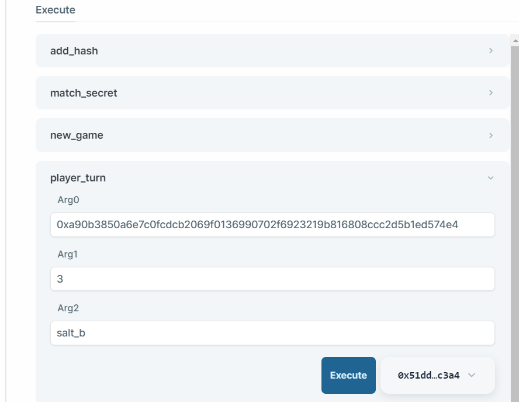

#### 石头剪刀布源码解析

1. 定义手势的枚举类型，方便引用。实际是u8类型。

```
    const NONE: u8 = 0;     // 游戏新建时的手势为空的状态
    const ROCK: u8 = 1;
    const PAPER: u8 = 2;
    const SCISSORS: u8 = 3;
    
    const CHEAT: u8 = 111;	// 玩家承诺最初承诺的手势和最终的手势不一致则定义为欺骗
```

2. new_game   new_game调用者为该局 游戏 的 所有者

```
    public entry fun new_game(player_one: address, player_two: address, ctx: &mut TxContext) {
        transfer::transfer(Game {
            id: object::new(ctx),
            prize: ThePrize { id: object::new(ctx) },
            player_one,
            player_two,
            hash_one: vector[],
            hash_two: vector[],
            gesture_one: NONE,		// 状态揭晓时 根据salt和hash中揭露出来
            gesture_two: NONE,		// 状态揭晓时 根据salt和hash中揭露出来
        }, tx_context::sender(ctx));
    }
```

传入两个玩家，只有这两个玩家才能玩这一局ID的游戏

3. player_turn   玩家调用

```
    public entry fun player_turn(at: address, gesture: u8, salt: vector<u8>, ctx: &mut TxContext) {
        let hash_gesture = hash(gesture,salt);
        transfer::transfer(PlayerTurn {
            hash: hash_gesture,
            id: object::new(ctx),
            player: tx_context::sender(ctx),
        }, at);
    }
```

创建一个playerTurn给所有者，里面包含一个玩家哈希后的手势。PlayerTurn结构体中存储调用者（两个玩家之一）的地址，方便下次调用add_hash时判断是哪个玩家

4. reveal   玩家调用

```
public entry fun reveal(at: address, salt: vector<u8>, ctx: &mut TxContext) {
        transfer::transfer(Secret {
            id: object::new(ctx),
            salt,
            player: tx_context::sender(ctx),
        }, at);
    }
```

5. add_hash  所有者调用

```
    public entry fun add_hash(game: &mut Game, cap: PlayerTurn) {
        let PlayerTurn { hash, id, player } = cap;
        let status = status(game);

        assert!(status == STATUS_HASH_SUBMISSION || status == STATUS_READY, 0);
        assert!(game.player_one == player || game.player_two == player, 0);

        if (player == game.player_one && vector::length(&game.hash_one) == 0) {
            game.hash_one = hash;
        } else if (player == game.player_two && vector::length(&game.hash_two) == 0) {
            game.hash_two = hash;
        } else {
            abort 0 // unreachable!()
        };

        object::delete(id);
    }
```

6. match_secret 所有者调用

```
    public entry fun match_secret(game: &mut Game, secret: Secret) {
        let Secret { salt, player, id } = secret;

        assert!(player == game.player_one || player == game.player_two, 0);

        if (player == game.player_one) {
            game.gesture_one = find_gesture(salt, &game.hash_one);
        } else if (player == game.player_two) {
            game.gesture_two = find_gesture(salt, &game.hash_two);
        };

        object::delete(id);
    }
```

7. select_winner 所有者调用

```
    public entry fun select_winner(game: Game, ctx: &TxContext) {
        assert!(status(&game) == STATUS_REVEALED, 0);

        let Game {
            id,
            prize,
            player_one,
            player_two,
            hash_one: _,
            hash_two: _,
            gesture_one,
            gesture_two,
        } = game;

        let p1_wins = play(gesture_one, gesture_two);
        let p2_wins = play(gesture_two, gesture_one);

        object::delete(id);

        // If one of the players wins, he takes the prize.
        // If there's a tie, the game owner gets the prize.
        if (p1_wins) {
            transfer::public_transfer(prize, player_one)
        } else if (p2_wins) {
            transfer::public_transfer(prize, player_two)
        } else {
            transfer::public_transfer(prize, tx_context::sender(ctx))
        };
    }
```


### 玩一局游戏的调用流程

假设有三个用户 A  B  C

1. A调用new_game()创建一局游戏，传入玩家为B和C 的地址
2. B和C 分别调用 player_turn，将PlayerTurn{hash}传给 A
3. B和C 分别调用 reveal，将Secret{salt}传给 A， 确保A到时候有 统一揭露 手势 的钥匙

4. A调用add_hash，传入B和C的PlayerTurn，将hash加入到当局Game中

5. A调用match_secret ，将B和C的手势进行解密，并放到当局Game中

6. A调用select_winner ，选出本局胜利者并发放奖励

部署合约到devnet，并提前准备好三个账户

A:  0xa90b3850a6e7c0fcdcb2069f0136990702f6923219b816808ccc2d5b1ed574e4

B:  0x51ddc644ac869714c115650874a7b0cd9cda5f211f2354b41930460f8e04c3a4

C:  0xc45ee29236f4a77a91f3d96224b45ad970a59c9a8281a19fd22ce379855d8d0d

#### 一. 用A账户部署合约 并 调用 new_game() 创建一局游戏

packageID： 0xadb64c3392c8f67fcf2b62109b58d5725cd33686332ca861eb850c189b37d918

```
sui client call --package $p_id --module rock_paper_scissors --function new_game --args $addB $addC  --gas-budget 300000000
```

找到 gameID: 0x5f46045fcbd6030d50158872224e5103945c56644780e34ca9b5283019c0dc78


切换活跃账户为 C:

`sui client switch --address 0xc45ee29236f4a77a91f3d96224b45ad970a59c9a8281a19fd22ce379855d8d0d`

切换活跃账户为A:

`sui client switch --address 0xa90b3850a6e7c0fcdcb2069f0136990702f6923219b816808ccc2d5b1ed574e4`


#### 二. B和C分别调用play_turn函数，传入自己的     A地址 手势 salt

B：剪刀(3)    salt_b               play_turn_b_id       0xef49d00199b3272c9119ceabeda7df7c47bbd25b06b30cb50219907eae3634a7

C:   石头(1)    salt_c                play_turn_c_id      0x3f695a94a894f615634c2b197e6f673de81c1dce87fb43c3419253f3559a6b5b

- B 连接地址钱包可在浏览器packageID下进行调用



- C 在命令行调用

```
sui client call --package $p_id --module rock_paper_scissors --function player_turn --args $owner  1 salt_c  --gas-budget 300000000
```

找到新生成的 PlayerTurn 的id 记下或存入环境变量

#### 三. B和C 分别调用 reveal，将Secret{salt}传给 A， 确保A到时候有 统一揭露 手势 的钥匙

- B：salt_b

在浏览器连接钱包直接调用


secret_b: 0x9260447c29d6f9d02a5e436fd70b35694dc1796e1611a33118407ab9cdd17a4a

- C在命令行调用

```
sui client call --package $p_id --module rock_paper_scissors --function reveal --args $owner salt_c  --gas-budget 300000000
```

运行后找到secret_c:  0x45d4a2c33ff987766075b81b8a35d6984c6cdf186ef3bf866d60edefcbbb9cc7

均存入环境变量

#### 四：A调用add_hash，传入B和C的PlayerTurn，将hash加入到当局Game中

```
sui client call --package $p_id --module rock_paper_scissors --function add_hash --args $game $player_turn_b  --gas-budget 300000000


sui client call --package $p_id --module rock_paper_scissors --function add_hash --args $game $player_turn_c  --gas-budget 300000000
```

可以看到均成功调用

```
╭───────────────────────────────────────────────────────────────────────────────────────────────────╮
│ Transaction Effects                                                                               │
├───────────────────────────────────────────────────────────────────────────────────────────────────┤
│ Digest: EuxZTm6rc3QKj4VX3NioQvsntD2tCHAeRumVGizi8LC4                                              │
│ Status: Success                                                                                   │
│ Executed Epoch: 416 
```

​                     

#### 五：A调用match_secret，验证B和C  是否 作假

```
sui client call --package $p_id --module rock_paper_scissors --function match_secret --args $game $secret_b  --gas-budget 300000000


sui client call --package $p_id --module rock_paper_scissors --function match_secret --args $game $secret_c  --gas-budget 300000000
```

可以看到均success！

```
╭───────────────────────────────────────────────────────────────────────────────────────────────────╮
│ Transaction Effects                                                                               │
├───────────────────────────────────────────────────────────────────────────────────────────────────┤
│ Digest: 8Zwt1DyGbtjBaeQpSVBon1gdgdoQkTxC4r6ZMkrBiBN2                                              │
│ Status: Success                                                                                   │
│ Executed Epoch: 417 
```

#### 六：A调用select_winner，判断出本局game获胜者，并给winner发放奖励

```
sui client call --package $p_id --module rock_paper_scissors --function select_winner --args $game  --gas-budget 300000000
```

成功调用后去浏览器查询

可以看到 unwrapped出来的 奖励 最后 去了 **C** 用户 (石头)


而B(剪刀) loser 则得不到奖励