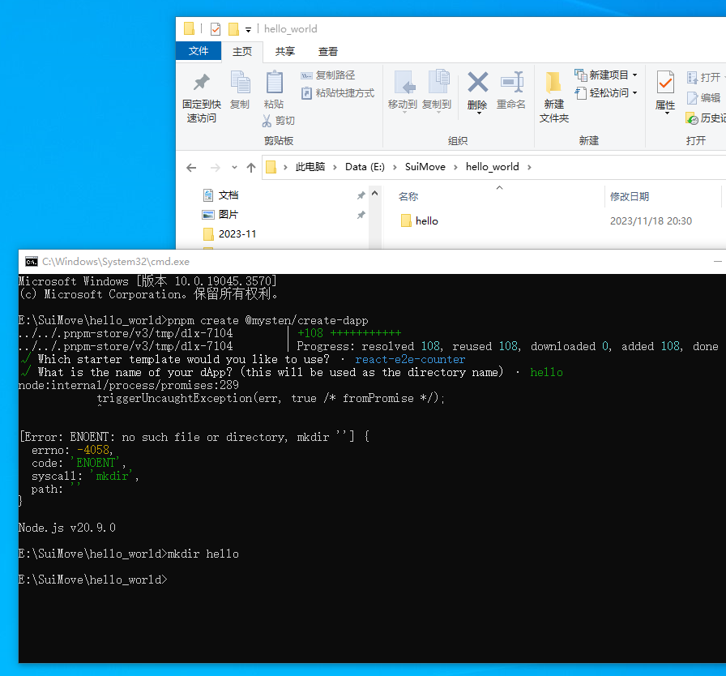
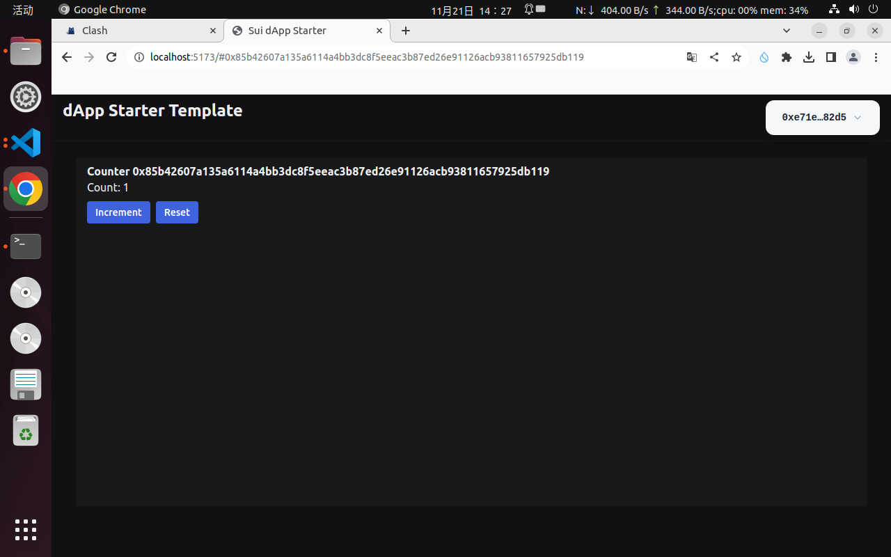

# 学习日志
## 环境配置（给我整麻了）
刚开始用的win10，因为之前正好在学rust，所以直接跳过了rust安装这一步，结果发现按照官网的教程还得安装一堆依赖，但是安装依赖过程还好，除了因为网络问题有点慢。安装完依赖后安装sui，一开始挂了香港的节点想用git直接拉，但是不行；按官网教程去下载了二进制文件，然后双击exe，黑框一闪然后就没然后了，于是放弃（后来看群友说把exe添加到环境变量里就可以用了，但是我没试，如果你还没开始，劝你别试，直接挂Linux虚拟机或者用mac吧），尝试换了台湾的节点用git拉，网速虽然比较慢，但是还是拉下来了。
接着因为要完成脚手架的作业，装了nodejs和pnpm，但是按照教程执行<pnpm create @mysten/create-dapp>的时候出现了下面这个问题，搜了老半天，找不到解决方案，放弃win10了，挂了个Ubuntu虚拟机，然后根据官网教程配置环境，整个过程，抛开网络问题，无比流畅，没有出现各种各样离谱的问题（不过Ubuntu挂梯子比较麻烦）。终于配置好开发环境了，泪目。

## dAPP Kit作业
按照教程执行<pnpm create @mysten/create-dapp>命令后，打开readme，按步骤操作就行，非常详细。先切换到move文件夹，把包发布到devnet（用sui client添加rpc的时候一定要记得加 :443，不然会报错，刚开始的时候我就添加错了。发包之前需要领水，我是直接把生成钱包时的助记词导入到浏览器的插件里直接领水了（后面交互dAPP也要用到钱包插件）。发布完后终端会报一堆信息，找到package ID，复制下来，然后到constant.ts里面把DEVNET后面的字符串换成复制的这个就行。然后切换到上一级目录，先<pnpm install>然后<pnpm dev>，选local那个就行了，浏览器打开以后连接钱包，然后交互。
package ID（devnet）：x2987b361588b6cfa95cdf2aace085aca2114660f4d00568e89428d4e8f71bf34

## 发币作业
这个非常简单，直接<sui move new 文件名>新建一个move文件就行了，然后在source下面新建一个move文件，把官网的代码复制一下，不过需要注意的是官网的那个包名是example，需要改成文件名，不然编译不通过。
package ID（testnet）：0xa4fefd50fc6d02a0194e56eb90c82211aefdf976374183933590154bc6b67550