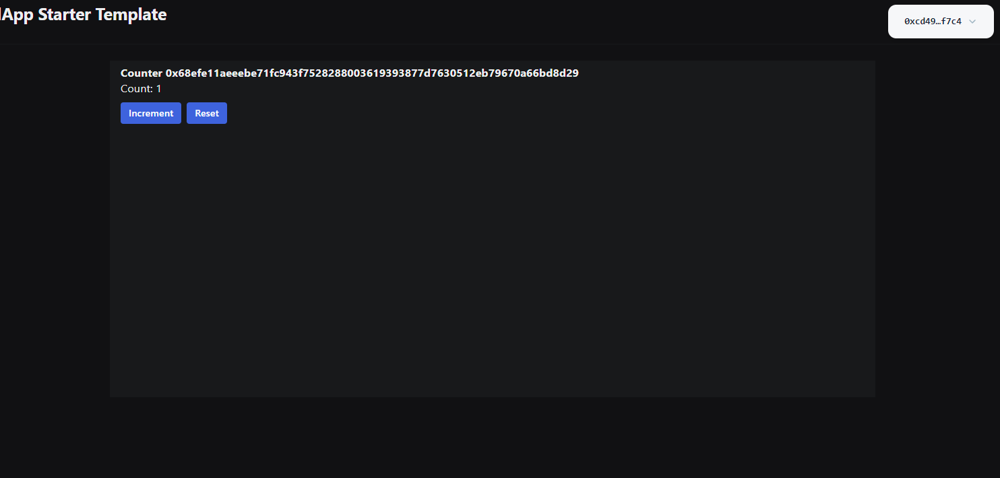
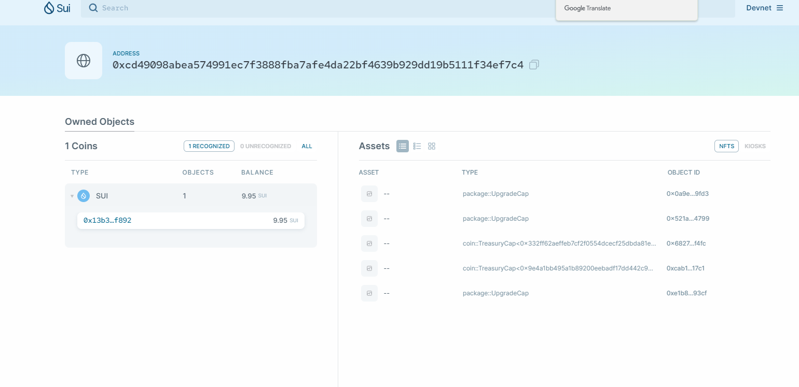

# 学习日志

## 开发环境配置（windows11 wsl2下开发）

1. 安装wsl2系统（Ubuntu 20.04发行版），安装vscode wsl插件

2. wsl2翻墙  
        这里感谢热心群友0xbirch的总结  
        https://sui-startrek-birch.vercel.app/docs#%E7%A7%91%E5%AD%A6%E4%B8%8A%E7%BD%91  

3. wsl2安装rust, node.js, sui  
        这里感谢热心群友Maintainer_d-ethan3的总结  
        https://dethan3.xlog.app/wsl2-install-sui-by-ubuntu20_04  
        注意事项：  
        &ensp;&ensp;每个包安装完后需要重启终端才能打印版本信息  
        &ensp;&ensp;安装sui等待时间很长，注意不要让电脑休眠不然会中断安装

## 一 完成dapp-kit Hello world 的交互

1. 执行命令 `pnpm create @mysten/create-dapp` 过程中选择安装`react-e2e-counter`

2. 按照其文件夹下readme文件执行操作生成address， 发布包

3. 启动项目，这里不确定其他人启动项目后点击connect wallet, 选择账号时会不会有本地sui client生成的对应address的选项，我这里好像只有google登录的address选项没法使用，解决办法如下  
    &ensp;&ensp;sui钱包插件新建一个sui地址，然后导出私钥  
    &ensp;&ensp;本地sui client导入私钥 `sui keytool import "私钥" ed25519`

    
    
## 二 完成两个 coin 合约的发布
这里老师给的官方文档 https://docs.sui.io/guides/developer/first-app/publish 好像没什么用，没有用到coin合约，发布命令sui client publish具体参数及其含义也没有写，甚至文档的例子最后还是故意留个错当个小测验，emmmmm....  
1. 执行命令 `sui move new my_first_package` 生成包文件夹

2. 对应文件夹下新增move文件 my_first_package/sources/my_module.move
    这里参考老师给的文档 https://examples.sui-book.com/samples/coin.html 如果要修改名称的话要注意按照注释中的大小写要求
    ```
    module examples::mycoin {
    use std::option;
    use sui::coin;
    use sui::transfer;
    use sui::tx_context::{Self, TxContext};

    /// 这个结构体代表代币类型，每种代币都需要一个类型：`Coin<package_object::mycoin::MYCOIN>`
    /// 确保结构体名与模块名匹配
    /// The type identifier of coin. The coin will have a type
    /// tag of kind: `Coin<package_object::mycoin::MYCOIN>`
    /// Make sure that the name of the type matches the module's name.
    struct MYCOIN has drop {}

    /// 模块初始化函数在模块发布时被调用。
    /// `TreasuryCap`会被发送给模块的发布者，因此发布者可以控制代币铸造和销毁。
    /// Module initializer is called once on module publish. A treasury
    /// cap is sent to the publisher, who then controls minting and burning
    fun init(witness: MYCOIN, ctx: &mut TxContext) {
        let (treasury, metadata) = coin::create_currency(witness, 6, b"MYCOIN", b"", b"", option::none(), ctx);
        transfer::public_freeze_object(metadata);
        transfer::public_transfer(treasury, tx_context::sender(ctx))
    }
}
    ```  

3. 执行打包命令`sui move build`,注意move.toml 里的名称和move文件里的名称统一，不然可能报错  

4. 执行发布命令 `sui client publish --gas-budget 100000000`

```
----- Transaction Digest ----
Du5o7Krqg8gJybo9UXsY2kG5uRmKHYBVhnHv2Wi4Asu3
╭─────────────────────────────────────────────────────────────────────────────────────────────────────────────────────────────────────────────────────────────╮
│ Transaction Data                                                                                                                                            │
├─────────────────────────────────────────────────────────────────────────────────────────────────────────────────────────────────────────────────────────────┤
│ Sender: 0xcd49098abea574991ec7f3888fba7afe4da22bf4639b929dd19b5111f34ef7c4                                                                                  │
│ Gas Owner: 0xcd49098abea574991ec7f3888fba7afe4da22bf4639b929dd19b5111f34ef7c4                                                                               │
│ Gas Budget: 100000000                                                                                                                                       │
│ Gas Price: 1000                                                                                                                                             │
│ Gas Payment:                                                                                                                                                │
│  ┌──                                                                                                                                                        │
│  │ ID: 0x13b3591959d8780659d14c199fa5ae0162446ce988aad6d02cb1b937cd35f892                                                                                   │
│  │ Version: 21                                                                                                                                              │
│  │ Digest: 2pfRjPCkvEy9tGVRReG7EmQiX5AxxLTtqwfg8H6Nq4eV                                                                                                     │
│  └──                                                                                                                                                        │
│                                                                                                                                                             │
│ Transaction Kind : Programmable                                                                                                                             │
│ Inputs: [Pure(SuiPureValue { value_type: Some(Address), value: "0xcd49098abea574991ec7f3888fba7afe4da22bf4639b929dd19b5111f34ef7c4" })]                     │
│ Commands: [                                                                                                                                                 │
│   Publish(<modules>,0x0000000000000000000000000000000000000000000000000000000000000001,0x0000000000000000000000000000000000000000000000000000000000000002), │
│   TransferObjects([Result(0)],Input(0)),                                                                                                                    │
│ ]                                                                                                                                                           │
│                                                                                                                                                             │
│                                                                                                                                                             │
│ Signatures:                                                                                                                                                 │
│    ayWr14x6oR1crmdgPyJpQfHOooJpK87unY0PFv0+PZCnJxQi8OdoHjCX1WWcMOpsqcVdjVu03U/eUBWdNqb0CQ==                                                                 │
│                                                                                                                                                             │
╰─────────────────────────────────────────────────────────────────────────────────────────────────────────────────────────────────────────────────────────────╯
╭───────────────────────────────────────────────────────────────────────────────────────────────────╮
│ Transaction Effects                                                                               │
├───────────────────────────────────────────────────────────────────────────────────────────────────┤
│ Digest: Du5o7Krqg8gJybo9UXsY2kG5uRmKHYBVhnHv2Wi4Asu3                                              │
│ Status: Success                                                                                   │
│ Executed Epoch: 4                                                                                 │
│                                                                                                   │
│ Created Objects:                                                                                  │
│  ┌──                                                                                              │
│  │ ID: 0x9e4a1bb495a1b89200eebadf17dd442c9632c477fba58036976066dceab44307                         │
│  │ Owner: Immutable                                                                               │
│  │ Version: 1                                                                                     │
│  │ Digest: GS87FNVUZzPSDfhTXRQDgjWJofXTbRq1Y7enAsiAukib                                           │
│  └──                                                                                              │
│  ┌──                                                                                              │
│  │ ID: 0xcab19b13fb412c5d707126bf5b5b6da0b21f71c7641b39aad5bff67c8a9117c1                         │
│  │ Owner: Account Address ( 0xcd49098abea574991ec7f3888fba7afe4da22bf4639b929dd19b5111f34ef7c4 )  │
│  │ Version: 22                                                                                    │
│  │ Digest: 86Br4V7XLzzy3NPYNG7bWHnDg7Y7Xjyk3jZMVzissyHP                                           │
│  └──                                                                                              │
│  ┌──                                                                                              │
│  │ ID: 0xce67c96e58e470f26905d962af38c9c1563531981a775418317ae46adb61286e                         │
│  │ Owner: Immutable                                                                               │
│  │ Version: 22                                                                                    │
│  │ Digest: CBg6F2GnLopGbL8MjqCxzGjSjtYzmgvHGe7JxYXfTGAB                                           │
│  └──                                                                                              │
│  ┌──                                                                                              │
│  │ ID: 0xe1b8d147bf9584d3232b3eb60b02aabafad414adf1d5245ef0345ec0472293cf                         │
│  │ Owner: Account Address ( 0xcd49098abea574991ec7f3888fba7afe4da22bf4639b929dd19b5111f34ef7c4 )  │
│  │ Version: 22                                                                                    │
│  │ Digest: 3LR9ir3aSrEsHGDAJVrZTUSaprK6WPjYKpqgL1kXELXj                                           │
│  └──                                                                                              │
│                                                                                                   │
│ Mutated Objects:                                                                                  │
│  ┌──                                                                                              │
│  │ ID: 0x13b3591959d8780659d14c199fa5ae0162446ce988aad6d02cb1b937cd35f892                         │
│  │ Owner: Account Address ( 0xcd49098abea574991ec7f3888fba7afe4da22bf4639b929dd19b5111f34ef7c4 )  │
│  │ Version: 22                                                                                    │
│  │ Digest: 5bgdsrLh82Sphu86R63SkR2VrMcWNotrnKuSfETCaxjZ                                           │
│  └──                                                                                              │
│                                                                                                   │
│ Gas Object:                                                                                       │
│  ┌──                                                                                              │
│  │ ID: 0x13b3591959d8780659d14c199fa5ae0162446ce988aad6d02cb1b937cd35f892                         │
│  │ Owner: Account Address ( 0xcd49098abea574991ec7f3888fba7afe4da22bf4639b929dd19b5111f34ef7c4 )  │
│  │ Version: 22                                                                                    │
│  │ Digest: 5bgdsrLh82Sphu86R63SkR2VrMcWNotrnKuSfETCaxjZ                                           │
│  └──                                                                                              │
│                                                                                                   │
│ Gas Cost Summary:                                                                                 │
│    Storage Cost: 12334800                                                                         │
│    Computation Cost: 1000000                                                                      │
│    Storage Rebate: 978120                                                                         │
│    Non-refundable Storage Fee: 9880                                                               │
│                                                                                                   │
│ Transaction Dependencies:                                                                         │
│    8wx7AP9NYP9Be4oKqpUh8t69n53ZrAFbpTNuiHRq7ewp                                                   │
│    HUKvecodFjttC4143fQ7LKpCNEwswvq8QyLJHiN8bJBg                                                   │
╰───────────────────────────────────────────────────────────────────────────────────────────────────╯
----- Events ----
Array []
----- Object changes ----

Created Objects: 
 ┌──
 │ ObjectID: 0xcab19b13fb412c5d707126bf5b5b6da0b21f71c7641b39aad5bff67c8a9117c1
 │ Sender: 0xcd49098abea574991ec7f3888fba7afe4da22bf4639b929dd19b5111f34ef7c4 
 │ Owner: Account Address ( 0xcd49098abea574991ec7f3888fba7afe4da22bf4639b929dd19b5111f34ef7c4 )
 │ ObjectType: 0x2::coin::TreasuryCap<0x9e4a1bb495a1b89200eebadf17dd442c9632c477fba58036976066dceab44307::luobo::LUOBO> 
 │ Version: 22
 │ Digest: 86Br4V7XLzzy3NPYNG7bWHnDg7Y7Xjyk3jZMVzissyHP
 └──
 ┌──
 │ ObjectID: 0xce67c96e58e470f26905d962af38c9c1563531981a775418317ae46adb61286e
 │ Sender: 0xcd49098abea574991ec7f3888fba7afe4da22bf4639b929dd19b5111f34ef7c4 
 │ Owner: Immutable
 │ ObjectType: 0x2::coin::CoinMetadata<0x9e4a1bb495a1b89200eebadf17dd442c9632c477fba58036976066dceab44307::luobo::LUOBO> 
 │ Version: 22
 │ Digest: CBg6F2GnLopGbL8MjqCxzGjSjtYzmgvHGe7JxYXfTGAB
 └──
 ┌──
 │ ObjectID: 0xe1b8d147bf9584d3232b3eb60b02aabafad414adf1d5245ef0345ec0472293cf
 │ Sender: 0xcd49098abea574991ec7f3888fba7afe4da22bf4639b929dd19b5111f34ef7c4 
 │ Owner: Account Address ( 0xcd49098abea574991ec7f3888fba7afe4da22bf4639b929dd19b5111f34ef7c4 )
 │ ObjectType: 0x2::package::UpgradeCap 
 │ Version: 22
 │ Digest: 3LR9ir3aSrEsHGDAJVrZTUSaprK6WPjYKpqgL1kXELXj
 └──

Mutated Objects: 
 ┌──
 │ ObjectID: 0x13b3591959d8780659d14c199fa5ae0162446ce988aad6d02cb1b937cd35f892
 │ Sender: 0xcd49098abea574991ec7f3888fba7afe4da22bf4639b929dd19b5111f34ef7c4 
 │ Owner: Account Address ( 0xcd49098abea574991ec7f3888fba7afe4da22bf4639b929dd19b5111f34ef7c4 )
 │ ObjectType: 0x2::coin::Coin<0x2::sui::SUI> 
 │ Version: 22
 │ Digest: 5bgdsrLh82Sphu86R63SkR2VrMcWNotrnKuSfETCaxjZ
 └──

Published Objects: 
 ┌──
 │ PackageID: 0x9e4a1bb495a1b89200eebadf17dd442c9632c477fba58036976066dceab44307 
 │ Version: 1 
 │ Digest: GS87FNVUZzPSDfhTXRQDgjWJofXTbRq1Y7enAsiAukib
 | Modules: luobo
 └──
----- Balance changes ----
 ┌──
 │ Owner: Account Address ( 0xcd49098abea574991ec7f3888fba7afe4da22bf4639b929dd19b5111f34ef7c4 ) 
 │ CoinType: 0x2::sui::SUI 
 │ Amount: -12356680
 └──
```
```
----- Transaction Digest ----
8wx7AP9NYP9Be4oKqpUh8t69n53ZrAFbpTNuiHRq7ewp
╭─────────────────────────────────────────────────────────────────────────────────────────────────────────────────────────────────────────────────────────────╮
│ Transaction Data                                                                                                                                            │
├─────────────────────────────────────────────────────────────────────────────────────────────────────────────────────────────────────────────────────────────┤
│ Sender: 0xcd49098abea574991ec7f3888fba7afe4da22bf4639b929dd19b5111f34ef7c4                                                                                  │
│ Gas Owner: 0xcd49098abea574991ec7f3888fba7afe4da22bf4639b929dd19b5111f34ef7c4                                                                               │
│ Gas Budget: 100000000                                                                                                                                       │
│ Gas Price: 1000                                                                                                                                             │
│ Gas Payment:                                                                                                                                                │
│  ┌──                                                                                                                                                        │
│  │ ID: 0x13b3591959d8780659d14c199fa5ae0162446ce988aad6d02cb1b937cd35f892                                                                                   │
│  │ Version: 20                                                                                                                                              │
│  │ Digest: 5ycLLcT1KGGWHz7Je9PR2cMhBt3kVXevea3VTHNMVyhD                                                                                                     │
│  └──                                                                                                                                                        │
│                                                                                                                                                             │
│ Transaction Kind : Programmable                                                                                                                             │
│ Inputs: [Pure(SuiPureValue { value_type: Some(Address), value: "0xcd49098abea574991ec7f3888fba7afe4da22bf4639b929dd19b5111f34ef7c4" })]                     │
│ Commands: [                                                                                                                                                 │
│   Publish(<modules>,0x0000000000000000000000000000000000000000000000000000000000000001,0x0000000000000000000000000000000000000000000000000000000000000002), │
│   TransferObjects([Result(0)],Input(0)),                                                                                                                    │
│ ]                                                                                                                                                           │
│                                                                                                                                                             │
│                                                                                                                                                             │
│ Signatures:                                                                                                                                                 │
│    E5x55jXtNS+TWYavCyQUCGigrGYLHKFO/N/mJ9FocNYFOS3n0drvcxAndPRUWiYCf+inzBT2ir+YSVW3Zd92Cw==                                                                 │
│                                                                                                                                                             │
╰─────────────────────────────────────────────────────────────────────────────────────────────────────────────────────────────────────────────────────────────╯
╭───────────────────────────────────────────────────────────────────────────────────────────────────╮
│ Transaction Effects                                                                               │
├───────────────────────────────────────────────────────────────────────────────────────────────────┤
│ Digest: 8wx7AP9NYP9Be4oKqpUh8t69n53ZrAFbpTNuiHRq7ewp                                              │
│ Status: Success                                                                                   │
│ Executed Epoch: 4                                                                                 │
│                                                                                                   │
│ Created Objects:                                                                                  │
│  ┌──                                                                                              │
│  │ ID: 0x0a9e01ceee4fe3f170d954fecaebdd0b5db2ab48a0cbbcf5c7c788151e829fd3                         │
│  │ Owner: Account Address ( 0xcd49098abea574991ec7f3888fba7afe4da22bf4639b929dd19b5111f34ef7c4 )  │
│  │ Version: 21                                                                                    │
│  │ Digest: dStawLEaRZ7Ch3pB1k7Lkr9fsCJaXexAgvLfk53SKqz                                            │
│  └──                                                                                              │
│  ┌──                                                                                              │
│  │ ID: 0x197915c0808e83c9179de95ff22aa43f34cc9b625321b216967b809a9e87fed8                         │
│  │ Owner: Immutable                                                                               │
│  │ Version: 21                                                                                    │
│  │ Digest: AAH6DxH6yrEZ65ShjPrKSmSzoixQUJq83fLKej15Moop                                           │
│  └──                                                                                              │
│  ┌──                                                                                              │
│  │ ID: 0x332ff62aeffeb7cf2f0554dcecf25dbda81ed244fb0b3208ec5dfbfc06cde784                         │
│  │ Owner: Immutable                                                                               │
│  │ Version: 1                                                                                     │
│  │ Digest: 6sgSLkUDPX3WSFBLQ1J44UakpMhXeviG4HascS4r6yYz                                           │
│  └──                                                                                              │
│  ┌──                                                                                              │
│  │ ID: 0x68273d5e4bb4887277f27d2c7150c0baffbeeaafa14e24140d7bbb6d632ef4fc                         │
│  │ Owner: Account Address ( 0xcd49098abea574991ec7f3888fba7afe4da22bf4639b929dd19b5111f34ef7c4 )  │
│  │ Version: 21                                                                                    │
│  │ Digest: AmPoNYeAx3sRVKahk9LtKyP5gUntP3Kah4cK5DLT88nd                                           │
│  └──                                                                                              │
│                                                                                                   │
│ Mutated Objects:                                                                                  │
│  ┌──                                                                                              │
│  │ ID: 0x13b3591959d8780659d14c199fa5ae0162446ce988aad6d02cb1b937cd35f892                         │
│  │ Owner: Account Address ( 0xcd49098abea574991ec7f3888fba7afe4da22bf4639b929dd19b5111f34ef7c4 )  │
│  │ Version: 21                                                                                    │
│  │ Digest: 2pfRjPCkvEy9tGVRReG7EmQiX5AxxLTtqwfg8H6Nq4eV                                           │
│  └──                                                                                              │
│                                                                                                   │
│ Gas Object:                                                                                       │
│  ┌──                                                                                              │
│  │ ID: 0x13b3591959d8780659d14c199fa5ae0162446ce988aad6d02cb1b937cd35f892                         │
│  │ Owner: Account Address ( 0xcd49098abea574991ec7f3888fba7afe4da22bf4639b929dd19b5111f34ef7c4 )  │
│  │ Version: 21                                                                                    │
│  │ Digest: 2pfRjPCkvEy9tGVRReG7EmQiX5AxxLTtqwfg8H6Nq4eV                                           │
│  └──                                                                                              │
│                                                                                                   │
│ Gas Cost Summary:                                                                                 │
│    Storage Cost: 12334800                                                                         │
│    Computation Cost: 1000000                                                                      │
│    Storage Rebate: 978120                                                                         │
│    Non-refundable Storage Fee: 9880                                                               │
│                                                                                                   │
│ Transaction Dependencies:                                                                         │
│    EvsV8JDQZcjfP1tuexmGVYrWNA5nQnMjG53ZymRx6cVZ                                                   │
│    HUKvecodFjttC4143fQ7LKpCNEwswvq8QyLJHiN8bJBg                                                   │
╰───────────────────────────────────────────────────────────────────────────────────────────────────╯
----- Events ----
Array []
----- Object changes ----

Created Objects: 
 ┌──
 │ ObjectID: 0x0a9e01ceee4fe3f170d954fecaebdd0b5db2ab48a0cbbcf5c7c788151e829fd3
 │ Sender: 0xcd49098abea574991ec7f3888fba7afe4da22bf4639b929dd19b5111f34ef7c4 
 │ Owner: Account Address ( 0xcd49098abea574991ec7f3888fba7afe4da22bf4639b929dd19b5111f34ef7c4 )
 │ ObjectType: 0x2::package::UpgradeCap 
 │ Version: 21
 │ Digest: dStawLEaRZ7Ch3pB1k7Lkr9fsCJaXexAgvLfk53SKqz
 └──
 ┌──
 │ ObjectID: 0x197915c0808e83c9179de95ff22aa43f34cc9b625321b216967b809a9e87fed8
 │ Sender: 0xcd49098abea574991ec7f3888fba7afe4da22bf4639b929dd19b5111f34ef7c4 
 │ Owner: Immutable
 │ ObjectType: 0x2::coin::CoinMetadata<0x332ff62aeffeb7cf2f0554dcecf25dbda81ed244fb0b3208ec5dfbfc06cde784::boluo::BOLUO> 
 │ Version: 21
 │ Digest: AAH6DxH6yrEZ65ShjPrKSmSzoixQUJq83fLKej15Moop
 └──
 ┌──
 │ ObjectID: 0x68273d5e4bb4887277f27d2c7150c0baffbeeaafa14e24140d7bbb6d632ef4fc
 │ Sender: 0xcd49098abea574991ec7f3888fba7afe4da22bf4639b929dd19b5111f34ef7c4 
 │ Owner: Account Address ( 0xcd49098abea574991ec7f3888fba7afe4da22bf4639b929dd19b5111f34ef7c4 )
 │ ObjectType: 0x2::coin::TreasuryCap<0x332ff62aeffeb7cf2f0554dcecf25dbda81ed244fb0b3208ec5dfbfc06cde784::boluo::BOLUO> 
 │ Version: 21
 │ Digest: AmPoNYeAx3sRVKahk9LtKyP5gUntP3Kah4cK5DLT88nd
 └──

Mutated Objects: 
 ┌──
 │ ObjectID: 0x13b3591959d8780659d14c199fa5ae0162446ce988aad6d02cb1b937cd35f892
 │ Sender: 0xcd49098abea574991ec7f3888fba7afe4da22bf4639b929dd19b5111f34ef7c4 
 │ Owner: Account Address ( 0xcd49098abea574991ec7f3888fba7afe4da22bf4639b929dd19b5111f34ef7c4 )
 │ ObjectType: 0x2::coin::Coin<0x2::sui::SUI> 
 │ Version: 21
 │ Digest: 2pfRjPCkvEy9tGVRReG7EmQiX5AxxLTtqwfg8H6Nq4eV
 └──

Published Objects: 
 ┌──
 │ PackageID: 0x332ff62aeffeb7cf2f0554dcecf25dbda81ed244fb0b3208ec5dfbfc06cde784 
 │ Version: 1 
 │ Digest: 6sgSLkUDPX3WSFBLQ1J44UakpMhXeviG4HascS4r6yYz
 | Modules: boluo
 └──
----- Balance changes ----
 ┌──
 │ Owner: Account Address ( 0xcd49098abea574991ec7f3888fba7afe4da22bf4639b929dd19b5111f34ef7c4 ) 
 │ CoinType: 0x2::sui::SUI 
 │ Amount: -12356680
 └──
```
## 其他吐槽
1. https://sui-typescript-docs.vercel.app/dapp-kit 官网没有icon图标，感觉不够专业
2. pnpm create @mysten/create-dapp 生成的项目没有.gitignore, 对于初学者来说并不知道那些是可以提交的哪些是不用提交的

    


