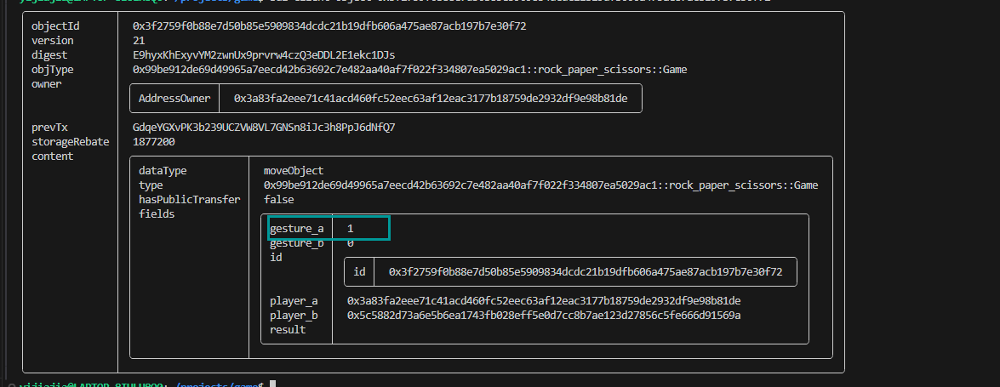
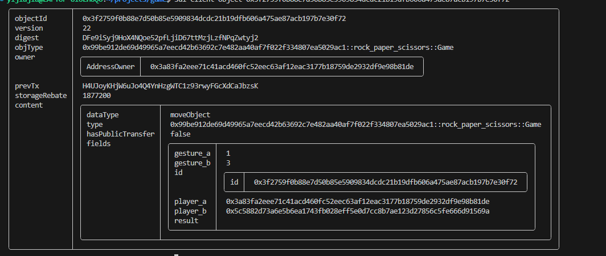
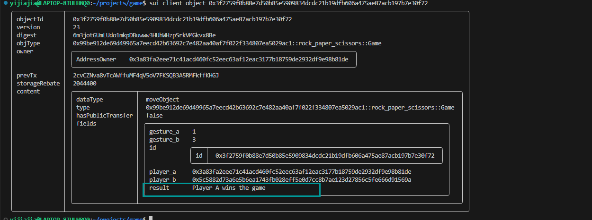

# 学习日志

### 第一天：搭建环境

系统：win10

#### 安装子系统Ubuntu

直接在MicroSoft Store安装即可

#### 安装rust

```bash
 # 安装rustup
curl --proto '=https' --tlsv1.2 -sSf https://sh.rustup.rs | sh
# 遇到Proceed with installation (default)时按enter键
# 安装完成后，提示Rust is installed now. Great!
# 会提示让你配置环境变量，跟着他的提示做
# 例如：
# To configure your current shell, run:
# source "$HOME/.cargo/env"
# 检测安装是否成功
cargo --version
#给cargo安装设置代码
vim ~/.cargo/config.yaml 
#在config文件中添加如下设置：
[http]
proxy="socks5://192.168.3.8:7890"
[https]
proxy="socks5://192.168.3.8:7890"
```

### 安装move cli

```bash
# 在用户目录下创建项目集目录
mkdir -p ~/projects && cd ~/projects
# clone项目
git clone https://github.com/move-language/move.git
# 安装编译依赖工具
cd move
./scripts/dev_setup.sh -ypt
# 安装所需依赖
# Proceed with installing necessary dependencies? (y/N) > y
# 更新终端环境
source ~/.profile
# 编译并安装 move cli（需要一段时间）
cargo install --path language/tools/move-cli
# 检测安装是否成功
move --version
```

###### 安装move cli报错

```bash
error: failed to compile `move-cli v0.1.0 (/Data/yjj/move-cli/move/language/tools/move-cli)`, intermediate artifacts can be found at `/Data/yjj/move-cli/move/target`

Caused by:
  package `colored v2.1.0` cannot be built because it requires rustc 1.70 or newer, while the currently active rustc version is 1.65.0
  Either upgrade to rustc 1.70 or newer, or use
  cargo update -p colored@2.1.0 --precise ver
  where `ver` is the latest version of `colored` supporting rustc 1.65.0
```

解决：

更新rustc版本为stable的最新版

```bash
#安装最新版
rustup update stable
#切换最新版本
rustup default 1.76.0-x86_64-unknown-linux-gnu
#查看切换是否成功
```

### 安装SUI

```bash
cargo install --locked --git https://github.com/MystenLabs/sui.git --branch devnet sui
#查看是否安装成功
sui --version
```

### 第二天：编写一个智能合约，并发布

###### 创建一个项目

```bash
sui move new hello_sui
cd hello_sui/sources
touch my.move
```

###### 编写一个计数器

```move
module hello_sui::counter {
    use sui::transfer;
    use sui::object::{Self, UID};
    use sui::tx_context::{Self, TxContext};

    struct Counter has key {
        id: UID,
        value: u64,
    }

    entry public fun getCounter(ctx: &mut TxContext) {
        let sender = tx_context::sender(ctx);
        let counter_obj = Counter {
            id: object::new(ctx),//这里创建了一个全局唯一的ID
            value: 0
        };
        //转让counter_obj所有权给sender
        transfer::transfer(counter_obj, sender);
    }
    public entry fun incr(counter: &mut Counter) {
        counter.value = counter.value + 1;
    } 
}
```

###### 编译

```bash
sui move build
```

###### 部署到devnet

```bash
# 默认当前目录，如果最大金额设置小了会报错,并且也会消耗我的gas!
sui client publish --gas-budget 1000000
```

执行结束，会返回一个所有者是imutable的对象，就是package地址

package:0x95233ae0d8431b76c60b97bb4861ac391b45279c0833220f450798499c173b10

###### 调用接口函数

```bash
#调用getCounter函数，返回计数器对象
sui client call --function getCounter --module counter --package 0x3e424c3a425f28a1fb316239dd0b3d219ff0447806f016d04eb80b3f10f2577a --gas-budget 10000000
#使用计数器对象，调用incr函数，给对象计数
sui client call --function incr --module counter --package 0x95233ae0d8431b76c60b97bb4861ac391b45279c0833220f450798499c173b10 --args 0xe79dae0c18e6522ffae2c43bf2ae1d5961433a269a8c55d0e0d63e0a22e84825    --gas-budget 10000000
```

>可以看到返回对象的version在变大，从浏览器也能看到计数器在增加（https://suiexplorer.com/object/0xe79dae0c18e6522ffae2c43bf2ae1d5961433a269a8c55d0e0d63e0a22e84825?network=devnet）

### 第三天 完成NFT发布

###### 创建项目

```bash
sui move new mynft
cd mynft/sources
touch mynft.move
```

###### 编写一个简单的nft生成功能

```move
module mynft::devnet_nft {
    use sui::url::{Self, Url};
    use std::string;
    use sui::object::{Self, ID, UID};
    use sui::event;
    use sui::transfer;
    use sui::tx_context::{Self, TxContext};

    struct MyNft has key, store {
        id: UID,
        name: string::String,
        description: string::String,
        url: Url,
    }


    struct NFTMinted has copy, drop {
        object_id: ID,
        creator: address,
        name: string::String,
    }


    public fun name(nft: &MyNft): &string::String {
        &nft.name
    }

    public fun description(nft: &MyNft): &string::String {
        &nft.description
    }

    public fun url(nft: &MyNft): &Url {
        &nft.url
    }

    public fun mint_to_sender(
        name: vector<u8>,
        description: vector<u8>,
        url: vector<u8>,
        ctx: &mut TxContext
    ) {
        let sender = tx_context::sender(ctx);
        let nft = MyNft {
            id: object::new(ctx),
            name: string::utf8(name),
            description: string::utf8(description),
            url: url::new_unsafe_from_bytes(url)
        };

        event::emit(NFTMinted {
            object_id: object::id(&nft),
            creator: sender,
            name: nft.name,
        });

        transfer::public_transfer(nft, sender);
    }

    public fun transfer(
        nft: MyNft, recipient: address, _: &mut TxContext
    ) {
        transfer::public_transfer(nft, recipient)
    }

    public fun update_description(
        nft: &mut MyNft,
        new_description: vector<u8>,
        _: &mut TxContext
    ) {
        nft.description = string::utf8(new_description)
    }

    public fun burn(nft: MyNft, _: &mut TxContext) {
        let MyNft { id, name: _, description: _, url: _ } = nft;
        object::delete(id)
    }
}
```

###### 编译代码

```bash
sui move build
```

###### 发布nft

```bash
sui move publish --gas-budget 10000000
```

[浏览器查看交易详情]: https://suiexplorer.com/txblock/BTE3oDkxxTDPFK5eks12ucEsQ97X4Gns3RZya62i28z?network=devnet
[浏览器查看包详情]: https://suiexplorer.com/object/0x3ffa51f9c0037afd65a7adb6ef23e5606296a016366f0283b2e370004bb50a13?network=devnet

package:0x0d4a42cbb9ae98dcc0cdbe6e0114716487492efbc3f618fb2beacc5f49474d6b

###### 使用微信个人信息进行mint

```bash 
sui client call --package 0x3ffa51f9c0037afd65a7adb6ef23e5606296a016366f0283b2e370004bb50a13 --function mint_to_sender --args "保加利亚" "Crazyjs123 s my name on github" "https://imgloc.com/image/Q1OfJ" --module devnet_nft --gas-budget 100000000
```

[浏览器查看交易详情]: https://suiexplorer.com/txblock/QdUX1burgnA6ZAro7HiScxuz8VgE2At26pjvij5Xikg?network=devnet
[浏览器查看nft对象详情]: https://suiexplorer.com/object/0x6c14a1ac5cc85dbe9a8b0e3256e5371286e0f1ee13833421b306ebd625f92ef1?network=devnet

nft对象ID:0x6c14a1ac5cc85dbe9a8b0e3256e5371286e0f1ee13833421b306ebd625f92ef1

### 第四天 编写一个剪刀石头布小游戏

###### 创建项目

```bash
sui move new game
cd game/sources
touch game.move
```

###### 编写一个剪刀石头布游戏

```move
/*
由三方构成：裁判方（中立第三方）、玩家A、玩家B
具体玩法是：

    裁判方调用接口new_game创建游戏，指定双方玩家并设置奖励
    玩家A、B分别进行出拳，通过调用player_turn接口将手势代表的整数保存在游戏对象中
    裁判方调用select_winner接口，得到获胜者，保存在游戏对象中
*/

module game::rock_paper_scissors {
    use sui::object::{Self, UID};
    use sui::tx_context::{Self, TxContext};
    use sui::transfer;
    use std::string;

    //手势对应数值
    const NONE: u8 = 0;
    const ROCK: u8 = 1;
    const PAPER: u8 = 2;
    const SCISSORS: u8 = 3;

    public fun rock(): u8 { ROCK }
    public fun paper(): u8 { PAPER }
    public fun scissors(): u8 { SCISSORS }

  

    struct Game has key {
        id: UID,
        result: string::String,
        player_a: address,
        player_b: address,
        gesture_a: u8,
        gesture_b: u8,

    }

   //开始一个游戏，把游戏对象转移给发送者
    public entry fun new_game(player_a: address, player_b: address, ctx: &mut TxContext) {
        transfer::transfer(Game {
            id: object::new(ctx),
            result: string::utf8(b""),
            player_a,
            player_b,
            gesture_a: NONE,
            gesture_b: NONE,
        }, tx_context::sender(ctx));
    }

    //生成一个手势对象给裁判
    public entry fun player_turn(game: &mut Game, at: address, gesture: u8) {
        assert!(at == game.player_a || at == game.player_b, 0);
        if (game.player_a == at) {
            game.gesture_a = gesture
        } else {
            game.gesture_b = gesture
        }
    }
    // 比大小，选赢家，保存比赛结果
    public entry fun select_winner(game: &mut Game) {
        assert!(game.gesture_a != NONE && game.gesture_b != NONE, 0);
        
        let a_wins = play(game.gesture_a, game.gesture_b);
        let b_wins = play(game.gesture_b, game.gesture_a);
        if (a_wins) {
            game.result = string::utf8(b"Player A wins the game");
        } else if (b_wins) {
            game.result = string::utf8(b"Player B wins the game");
        } else {
            game.result = string::utf8(b"No one win the game");
        };
    }
    /// 比大小
    fun play(one: u8, two: u8): bool {
        if (one == ROCK && two == SCISSORS) { true }
        else if (one == PAPER && two == ROCK) { true }
        else if (one == SCISSORS && two == PAPER) { true }
        else if (one != CHEAT && two == CHEAT) { true }
        else { false }
    }
}
```

###### 部署到devnet

```bash
sui move publish --gas-budget 100000000
```

package:0x99be912de69d49965a7eecd42b63692c7e482aa40af7f022f334807ea5029ac1

###### 开始游戏

- 新建游戏

  ```bash
  sui client call --package 0x99be912de69d49965a7eecd42b63692c7e482aa40af7f022f334807ea5029ac1 --module rock_paper_scissors --function new_game --args "0x3a83fa2eee71c41acd460fc52eec63af12eac3177b18759de2932df9e98b81de" "0x5c5882d73a6e5b6ea1743fb028eff5e0d7cc8b7ae123d27856c5fe666d91569a" --gas-budget 1000000000  
  ```

  游戏对象ID:0x3f2759f0b88e7d50b85e5909834dcdc21b19dfb606a475ae87acb197b7e30f72

- 玩家A出石头，调用player_turn生成手势给裁判

  ```bash
  sui client call --package 0x99be912de69d49965a7eecd42b63692c7e482aa40af7f022f334807ea5029ac1 --module rock_paper_scissors --function player_turn --args "0x3f2759f0b88e7d50b85e5909834dcdc21b19dfb606a475ae87acb197b7e30f72" "0x3a83fa2eee71c41acd460fc52eec63af12eac3177b18759de2932df9e98b81de" 1 --gas-budget 1000000000
  ```

  执行完成后，查看游戏对象，可以发现，gesture_a属性值已经变成1

  ```bash
  sui client obejct 0x3f2759f0b88e7d50b85e5909834dcdc21b19dfb606a475ae87acb197b7e30f72
  ```

  

- 玩家B出剪刀，调用player_turn生成手势给裁判

  ```bash
  sui client call --package 0x99be912de69d49965a7eecd42b63692c7e482aa40af7f022f334807ea5029ac1 --module rock_paper_scissors --function player_turn --args "0x3f2759f0b88e7d50b85e5909834dcdc21b19dfb606a475ae87acb197b7e30f72" "0x5c5882d73a6e5b6ea1743fb028eff5e0d7cc8b7ae123d27856c5fe666d91569a" 3 --gas-budget 1000000000
  ```

  查看游戏对象，可以看到B出的是剪刀

  

- 生成比赛结果

  ```bash
  sui client call --package 0x99be912de69d49965a7eecd42b63692c7e482aa40af7f022f334807ea5029ac1 --module rock_paper_scissors --function select_winner --args "0x3f2759f0b88e7d50b85e5909834dcdc21b19dfb606a475ae87acb197b7e30f72" --gas-budget 1000000000
  ```

  最后从生成的比赛结果看到，玩家A使用石头赢了出剪刀的玩家B

  

