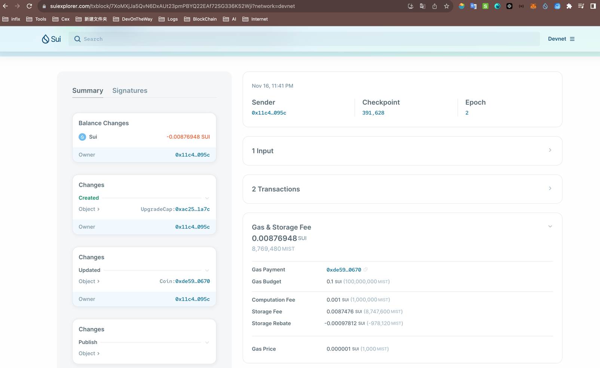
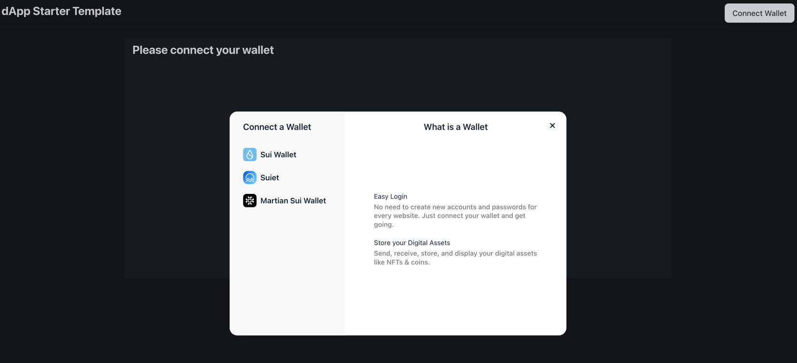
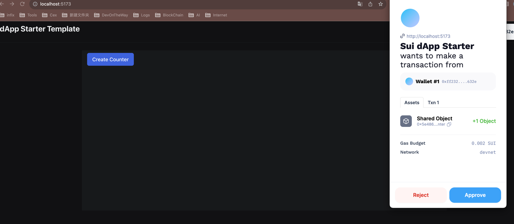

# 星航计划加入申请表

### 个人介绍

* Github ID: [github](https://github.com/Himau1010)

* Telegram ID: https://t.me/MauHahhh

* Discord ID: Hlhahhh#0486
*
* Sui 账号地址: 0xff2328f145c7ce5329e2c7967e95d9f54d41b04eae35d75f1a32553d26c9632e

主要是Java后端开发，业余玩过前端页面，参与过跨链领域从0到1，学习了解区块链继承，目前正在玩solidity语言，
有幸跟大家一直共学move，希望在区块链领域扎根，跟大家一起玩更多有意思项目。

### 学习日志

- [学习日志](journal.md)
- [学习总结](summary.md)

### 学习成果

Roadmap  1
- 项目源码: [HelloSui](https://github.com/Himau1010/Hello_sui.git)
- Dapp: 
- [HelloSui Contract Publish](https://suiexplorer.com/txblock/7XoMXjJa5QvN6DxAUt23pmPBYQ22EAf72SG336K52Wji?network=devnet)
- 
- 
- 
- 

- 项目源码:发布的ERC20
  package1: xx
  package2: xx

  