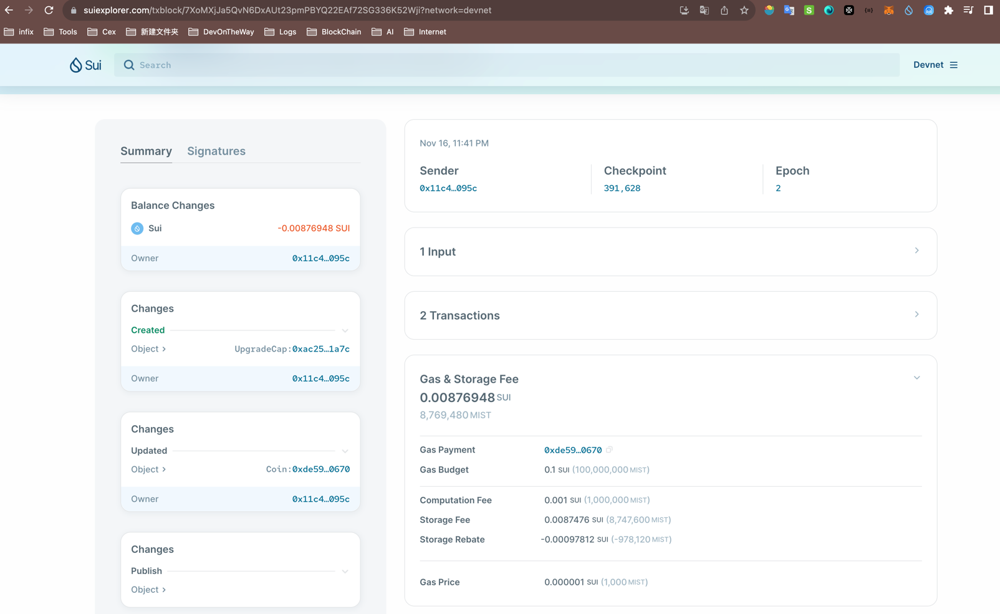
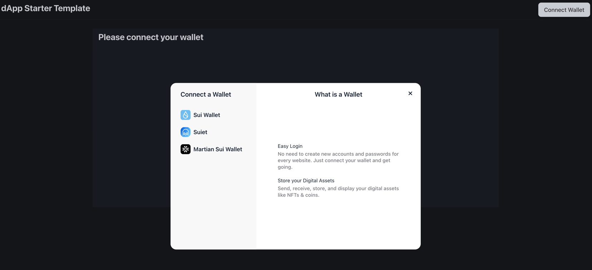
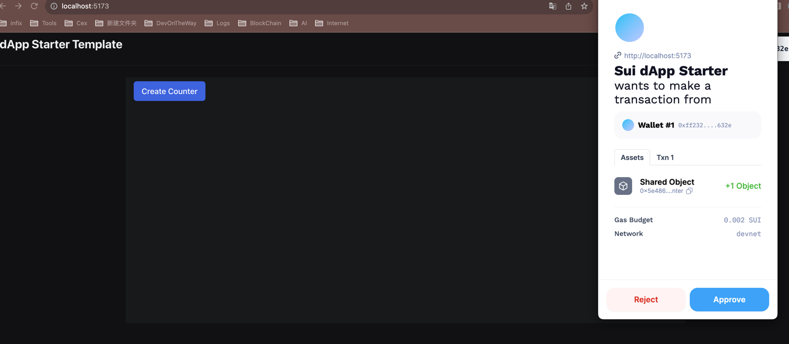
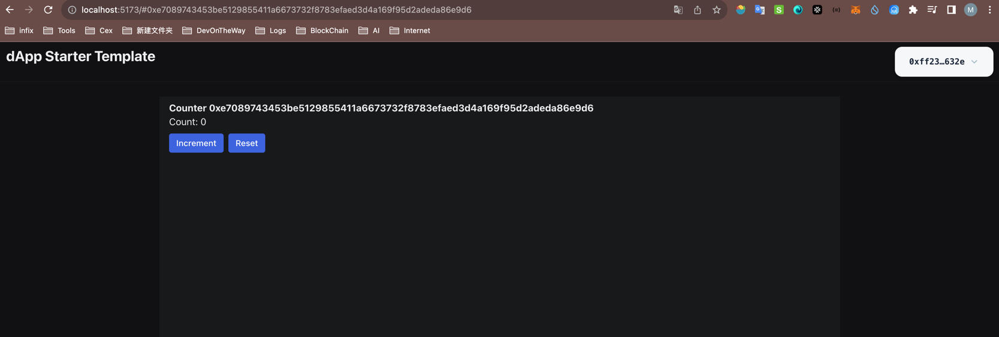

### 学习成果

Roadmap  1
- 项目源码: [HelloSui](https://github.com/Himau1010/Hello_sui.git)
- Dapp:
- [HelloSui Contract Publish](https://suiexplorer.com/txblock/7XoMXjJa5QvN6DxAUt23pmPBYQ22EAf72SG336K52Wji?network=devnet)
- 
- 
- 
- 

- 项目源码:[HULU](https://github.com/Himau1010/Hello_sui.git)
  coin：[HULU](https://suiexplorer.com/txblock/2sxcwkLaCWqQhzv2wbfk617GcVhDNCWdrseJnu8EiYiL?network=devnet)
  发行数量：999999
  package: 0x1a0911a2f8bee96fe9ce54323684628b8f0d658a6a7bfb4e6883624ba64e41fa

- 项目源码:[MAU](https://github.com/Himau1010/Hello_sui.git)
  coin：[MAU](https://suiexplorer.com/txblock/EC2N5TnB6taQhwzgZcvcCzvBvPeffG22Bz1GAsLoskFS?network=devnet)
  发行数量：999999
  package: 0xa0cecd61afd12653b08e3711dc7e151dda64ab418b69f78d8ae12b021dcab77c

