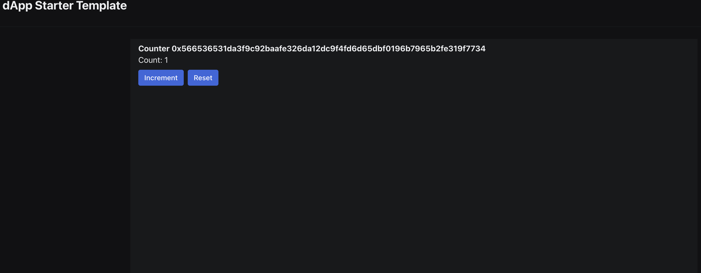

# 星航计划加入申请表

### 个人介绍

* Github ID: [github](https://github.com/KavenLE)

* Sui 账号地址: 0xb92f175195c834d566608c7534777e3cd546219b6152d9f028ed76765475d9b3

主要是做智能合约开发（solidity），和一些后端开发（主要是golang），钱包开发等，掌握golang，solidity，正在学习rust和move

### 学习日志

- [学习日志](journal.md)
- [学习总结](summary.md)

### 学习成果

Roadmap  1  
- 项目源码: https://github.com/KavenLE/sui_hello

- 发布的ERC20
transaction id :AzbYUo4Zgkjpx3pt2qczGxfQtmW2D2h8sYZweM417Nps
package1: 0x835ef1171f519e57fc516efc90c567d04ba1c9abb1cf934e59e1be85b7328c7c
package2: 0x93603f24ef5a28dd0db24f471faf433768e5749ecb69f40e2c5d7d5c59235d71
package3: 0xf02224b205cafa37e2475a3f4856d115f149b315262972017cea5bdb971a4b61

2.

3. 