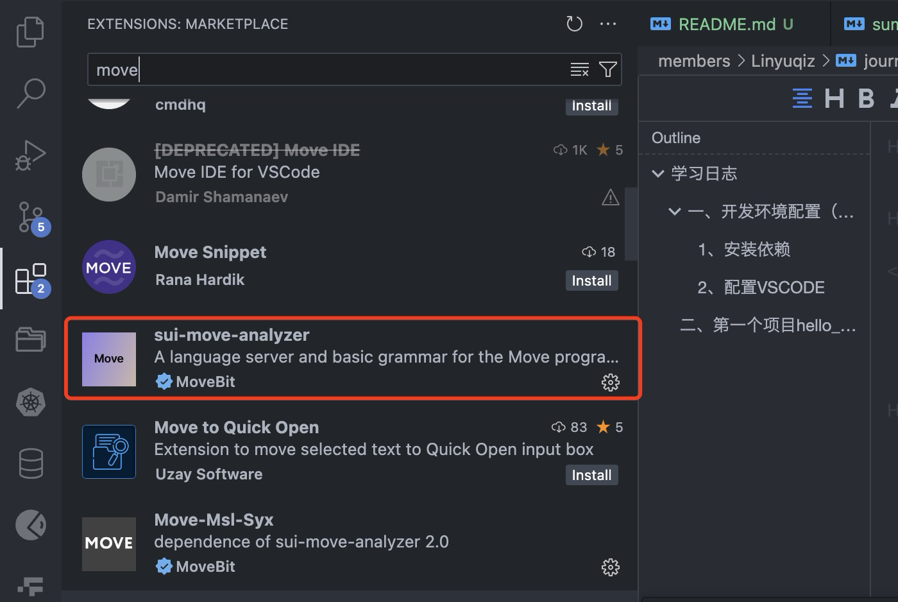
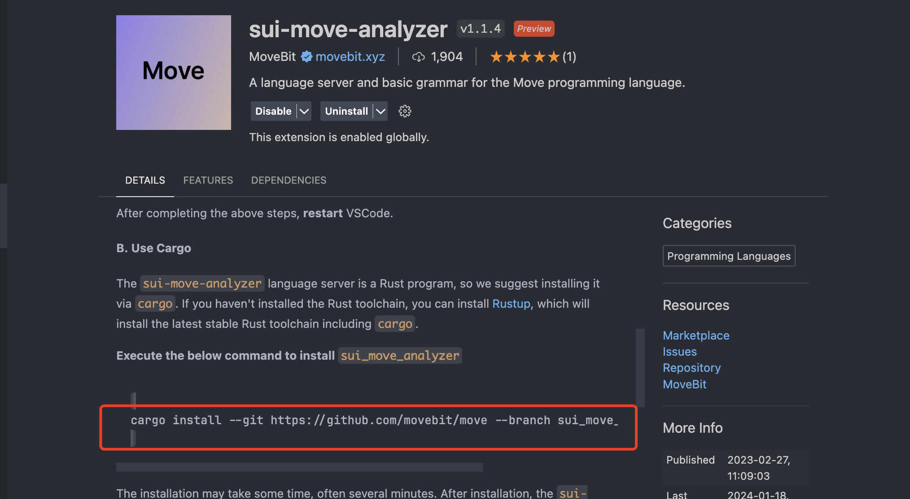
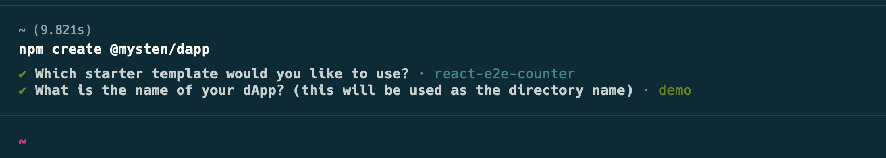
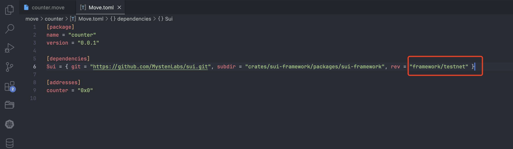
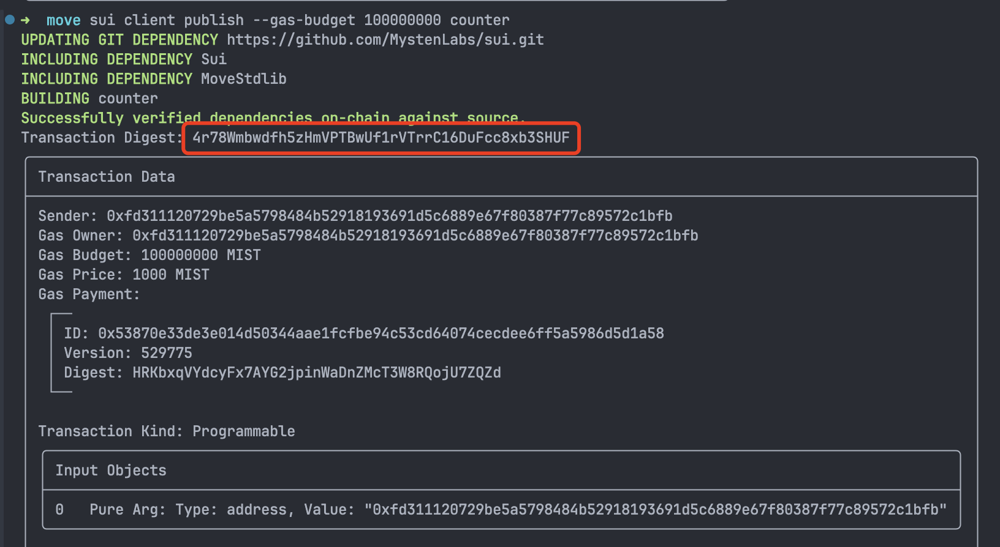
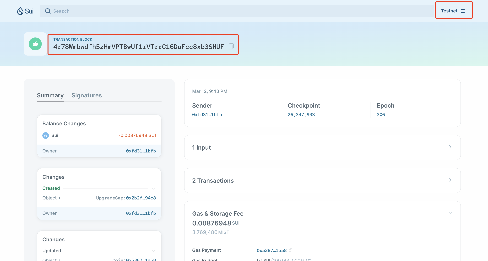
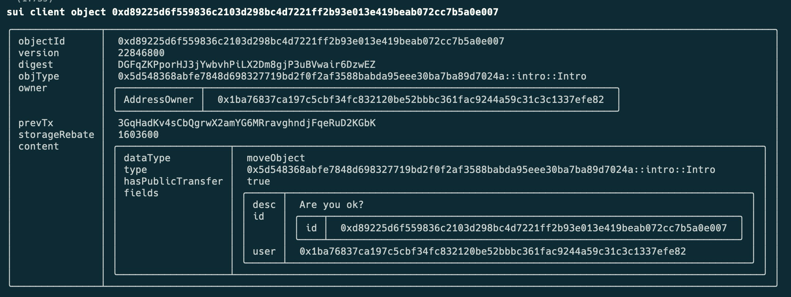
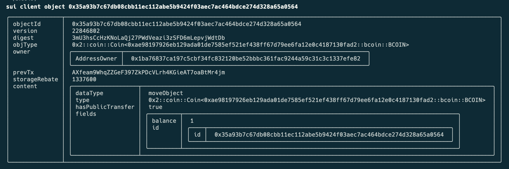
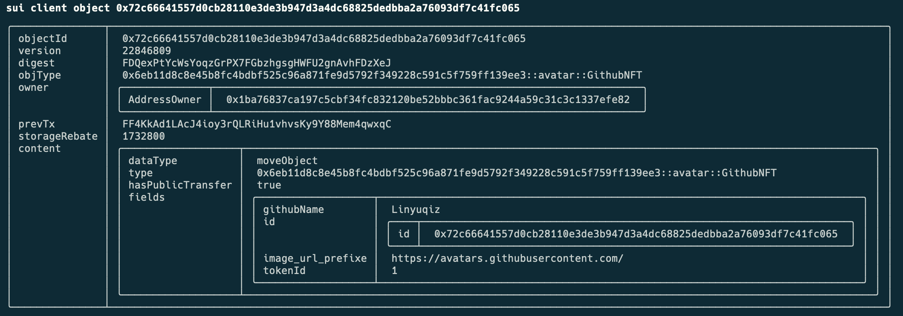

# 学习日志

## 一 开发环境配置（Mac）

### 1 安装依赖

```
# rust 环境：用于后续部分工具的编译
brew install rustup-init

# sui 工具安装: sui中包含了move语言
brew install sui
```

### 2 配置VSCODE

#### 2.1 安装插件



#### 2.2 Move LSP

```
# 通过 cargo 编译安装 move 的 LSP 服务执行程序
# 注意：建议配置字节的crate源，加快下载：https://rsproxy.cn/
cargo install --git https://github.com/movebit/move --branch sui_move_analyzer sui-move-analyzer

```



## 二 第一个项目

### 1 创建项目

```
# 通过模版创建项目：选择第二个包含move的和前端的
npm create @mysten/dapp
```



### 2 编译项目

```
# 解决 move 项目没有语法提示问题
# 简单说就是需要下载 move 对应的 sdk，再加上配置的 vscode Move 插件提供语法提示 
cd move && sui move build # 网络问题记得挂上代理
```

### 3 开发网发布

这部分基本依照 README.md 中提供的内容发布就可以了， 一步一步执行，注意理解每一步的用意

### 4 测试网发布

#### 4.1 修改依赖

```
# 修改项目中 Move.toml 中依赖的 sui 的分支版本：因为发布的是测试环境了
```



#### 4.2 修改本地配置

```
# 添加测试网
sui client new-env --alias 'testnet' --rpc 'https://fullnode.testnet.sui.io:443'

# 切换到测试网络
sui client switch --env testnet

# 获取测试币和查看
sui client faucet
sui slient gas
```

#### 4.3 发布项目

```
# 发布命令不变
sui client publish --gas-budget 100000000 counter

```



#### 4.4 测试网查看

测试网： https://suiexplorer.com/?network=testn



# 三 第二阶段

**三个项目目前是基于测试网部署调用**

## 1 个人介绍

合约代码： [https://github.com/Linyuqiz/sui-move/blob/main/move/intro/sources/intro.move](https://github.com/Linyuqiz/sui-move/blob/main/move/intro/sources/intro.move)

package id：0x5d548368abfe7848d698327719bd2f0f2af3588babda95eee30ba7ba89d7024a

client call：sui client call --package 0x5d548368abfe7848d698327719bd2f0f2af3588babda95eee30ba7ba89d7024a --module intro --function mint --args 'Are you ok?' --gas-budget 10000000

object id: 0xd89225d6f559836c2103d298bc4d7221ff2b93e013e419beab072cc7b5a0e007



## 2 B 币

合约代码：[https://github.com/Linyuqiz/sui-move/blob/main/move/bcoin/sources/bcoin.move](https://github.com/Linyuqiz/sui-move/blob/main/move/bcoin/sources/bcoin.move)

package id: 0xae98197926eb129ada01de7585ef521ef438ff67d79ee6fa12e0c4187130fad2

client call: sui client call --package 0xae98197926eb129ada01de7585ef521ef438ff67d79ee6fa12e0c4187130fad2 --module bcoin --function mint --args 0x795600a2202d64e050a5d1105153cc1d9d3f2adaa6a746fe7af2d310a383961e 1 0x1ba76837ca197c5cbf34fc832120be52bbbc361fac9244a59c31c3c1337efe82 --gas-budget 10000000

object id: 0x35a93b7c67db08cbb11ec112abe5b9424f03aec7ac464bdce274d328a65a0564



## 3 头像

合约代码：[https://github.com/Linyuqiz/sui-move/blob/main/move/avatar/sources/avatar.move](https://github.com/Linyuqiz/sui-move/blob/main/move/avatar/sources/avatar.move)

package id: 0x6eb11d8c8e45b8fc4bdbf525c96a871fe9d5792f349228c591c5f759ff139ee3

client call: sui client call --package 0x6eb11d8c8e45b8fc4bdbf525c96a871fe9d5792f349228c591c5f759ff139ee3 --module avatar --function mint --args 0xed815c1fd94deadf4314d2d47230520c81360051078ed6c5aad472282c178fdd Linyuqiz --gas-budget 10000000

object id: 0x72c66641557d0cb28110e3de3b947d3a4dc68825dedbba2a76093df7c41fc065



## 4 猜数字

合约地址： [https://github.com/Linyuqiz/sui-move/blob/main/move/guess/sources/guess.move](https://github.com/Linyuqiz/sui-move/blob/main/move/guess/sources/guess.move)

package id: 0xfa61612878d8348eca4fc0229f902ca8c44cf290eec8995227a188afca47d09f

sui client call --package 0xfa61612878d8348eca4fc0229f902ca8c44cf290eec8995227a188afca47d09f --module guess --function play --args 7 0x6 --gas-budget 10000000

object id: 0x1dcf6a171572006ed0fc81157b5e659c0cb012fdfc7c9c12a488c5b5d077a854


# 问题总结

## 问题一：开发网发布的合约交易为什么有时候查不到？

在群里问大佬说：开发网生成交易块不是很快导致的，所以大多时候在开发网不能立即查到交易块的信息

## 问题二：为什么合约开发者要使用测试网开发合约？

在传统项目开发中，都是发自己在开发环境自测完毕才上测试环境；但是在公链合约开发有点不同，开发公链是给公链维护的那批人使用的，而基于这个公链开发合约的开发者在测试网上开发会体验好点
