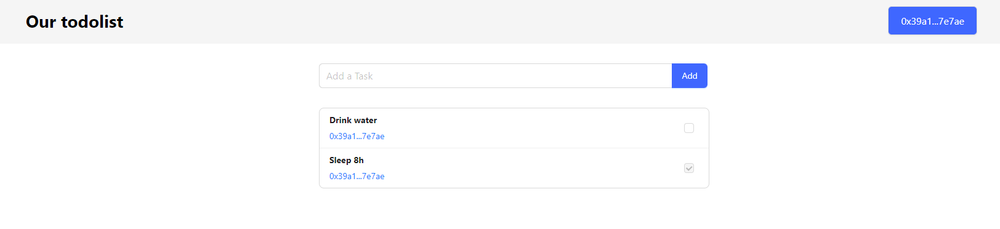

# Learn-003: [Aptos.Tutorial:build-e2e-dapp](https://aptos.dev/tutorials/build-e2e-dapp/e2e-dapp-index)

## 1.Create a smart contract

See the completed code in the [my_first_dapp](https://github.com/aptos-labs/aptos-core/tree/main/aptos-move/move-examples/my_first_dapp).

### 1.1.Init contract(move) workspace

```bash
➜  mkdir -p  aptos-todo/move
➜  cd aptos-todo/move
➜  aptos move init --name my_todo_list
{
  "Result": "Success"
}

➜ ll -a
total 24K
drwxr-xr-x 5 mulander mulander 4.0K Feb  4 15:56 .
drwxr-xr-x 3 mulander mulander 4.0K Feb  4 15:56 ..
-rw-r--r-- 1 mulander mulander  261 Feb  4 15:56 Move.toml
drwxr-xr-x 2 mulander mulander 4.0K Feb  4 15:56 scripts
drwxr-xr-x 2 mulander mulander 4.0K Feb  4 15:56 sources
drwxr-xr-x 2 mulander mulander 4.0K Feb  4 15:56 tests
```

### 1.2.Init account profile

> A Move module is stored under an address (so when it published anyone can access it using that address); the syntax for a Move module is
>```rust
>module <account-address>::<module-name> {}
>```
>In our module, the account-address is todolist_addr (a variable we just declared on the Move.toml file in the previous step that holds an address), and the module-name is todolist (a random name we selected).

```bash
➜  aptos init --network devnet
Configuring for profile default
Configuring for network Devnet
Enter your private key as a hex literal (0x...) [Current: None | No input: Generate new key (or keep one if present)]
******************************************************************
Account 0x381c6bfb874cef7e995ec059ce7e008989dccd6b6973252b1bb8d3b61da5b326 has been already found onchain

---
Aptos CLI is now set up for account 0x381c6bfb874cef7e995ec059ce7e008989dccd6b6973252b1bb8d3b61da5b326 as profile default!  Run `aptos --help` for more information about commands
{
  "Result": "Success"
}
```

```yaml
# Move.toml
[addresses]
todolist_addr='<default-profile-account-address>'
```

```rust
// sources/todolist.move
module todolist_addr::todolist {}
```

### 1.3.Compile & test & publish

Coding contract logic...

```bash
➜  move aptos move compile
Compiling, may take a little while to download git dependencies...
UPDATING GIT DEPENDENCY https://github.com/aptos-labs/aptos-core.git
INCLUDING DEPENDENCY AptosFramework
INCLUDING DEPENDENCY AptosStdlib
INCLUDING DEPENDENCY MoveStdlib
BUILDING my_todo_list
{
  "Result": [
    "381c6bfb874cef7e995ec059ce7e008989dccd6b6973252b1bb8d3b61da5b326::todolist"
  ]
}

➜  move aptos move test   
INCLUDING DEPENDENCY AptosFramework
INCLUDING DEPENDENCY AptosStdlib
INCLUDING DEPENDENCY MoveStdlib
BUILDING my_todo_list
Running Move unit tests
[ PASS    ] 0x381c6bfb874cef7e995ec059ce7e008989dccd6b6973252b1bb8d3b61da5b326::todolist::account_can_not_update_task
[ PASS    ] 0x381c6bfb874cef7e995ec059ce7e008989dccd6b6973252b1bb8d3b61da5b326::todolist::test_flow
Test result: OK. Total tests: 2; passed: 2; failed: 0
{
  "Result": "Success"
}

➜  move aptos move publish
Compiling, may take a little while to download git dependencies...
UPDATING GIT DEPENDENCY https://github.com/aptos-labs/aptos-core.git
INCLUDING DEPENDENCY AptosFramework
INCLUDING DEPENDENCY AptosStdlib
INCLUDING DEPENDENCY MoveStdlib
BUILDING my_todo_list
package size 2685 bytes
Do you want to submit a transaction for a range of [185600 - 278400] Octas at a gas unit price of 100 Octas? [yes/no] >
yes
{
  "Result": {
    "transaction_hash": "0x22269529933f631c4e436fb1ab522f69747a13bdf69b05b3fc60556085147798",
    "gas_used": 1856,
    "gas_unit_price": 100,
    "sender": "381c6bfb874cef7e995ec059ce7e008989dccd6b6973252b1bb8d3b61da5b326",
    "sequence_number": 0,
    "success": true,
    "timestamp_us": 1707116527792370,
    "version": 536099204,
    "vm_status": "Executed successfully"
  }
}
```

Done! We can explore this todo module on [explorer.aptoslabs](https://explorer.aptoslabs.com/account/0x381c6bfb874cef7e995ec059ce7e008989dccd6b6973252b1bb8d3b61da5b326/modules/code/todolist?network=devnet).

**Issues**

```bash
# 运行构建失败，如遇github网络问题
➜  aptos move compile
Compiling, may take a little while to download git dependencies...
UPDATING GIT DEPENDENCY https://github.com/aptos-labs/aptos-core.git
While processing dependency 'AptosFramework': Unable to find package manifest for 'AptosFramework'
# 修改`git config`下`http`配置可解决
# 全局设置 set
➜  git config --global http.sslVerify false
➜  git config --global http.version HTTP/1.1
➜  git config --global http.postBuffer 1048576000
# 查看全局设置
➜  git config --global -l
http.sslverify=false
http.version=HTTP/1.1
http.postbuffer=1048576000
...
# 不需要时可以 unset
➜  git config --global --unset http.sslVerify
➜  git config --global --unset http.version
➜  git config --global --unset http.postbuffer
```

## 2~6.Set up React App

```bash
#  create react templaet
➜  npx create-react-app client --template typescript
Need to install the following packages:
  create-react-app@5.0.1
Ok to proceed? (y) y

# Install deps
➜  npm i antd@5.1.4  
➜  npm i @aptos-labs/wallet-adapter-react @aptos-labs/wallet-adapter-ant-design 
➜  npm i petra-plugin-wallet-adapter
➜  npm i @aptos-labs/ts-sdk
```

**Issues**

```bash
# certificate has expired
➜  npx create-react-app client --template typescript
npm ERR! code CERT_HAS_EXPIRED
npm ERR! errno CERT_HAS_EXPIRED
npm ERR! request to https://registry.npm.taobao.org/create-react-app failed, reason: certificate has expired

npm ERR! A complete log of this run can be found in:
npm ERR!     /home/user/.npm/_logs/2024-02-04T09_05_46_452Z-debug-0.log
# 解决方案
➜  npm config set strict-ssl false
```

Some wallet logic

```js
// ≈hooks:useWeb3/useWagmi
import { useWallet } from "@aptos-labs/wallet-adapter-react";
// ≈Web3js/ethersjs/viem
import { Aptos } from "@aptos-labs/ts-sdk";
// ≈ConnectWalletModal
import { WalletSelector } from "@aptos-labs/wallet-adapter-ant-design";

// window?.aptos≈window.ethereum
export const aptos = new Aptos();

export function App() {
  ...
  const { account, signAndSubmitTransaction } = useWallet();
  ...
  /*
    The moduleAddress is the address we publish the module under, i.e the account address you have in your Move.toml file (myaddr).
    The provider.getAccountResource()expects an account address that holds the resource we are looking for and a string representation of an on-chain Move struct type.
  */
  await aptos.getAccountResource({
    accountAddress: account?.address,
      resourceType: `${moduleAddress}::todolist::TodoList`,
  });
  ...
  // sign and submit transaction to chain
  const response = await signAndSubmitTransaction({
    data: {
      // function- is built from the module address, module name and the function name.
      function: `${moduleAddress}::todolist::create_list`,
      // functionArguments - the arguments the function expects, in our case it doesn’t expect any arguments.
      functionArguments: [],
    },
  });
  // wait for transaction
  // ≈await ethers.tx.wait()
  await aptos.waitForTransaction({ transactionHash: response.hash });
```

View my code of [aptos-todo](../codes/aptos-todo/)



## Short Summary

相比`EVM`，`Aptos`整体跑一圈下来除了网络问题卡了会壳，其他都还算流畅，交易确认也快很多。

cli控制台提示信息一般，个人觉得`{"Result": "Success"}`有点丑。

Contract
- ✅Support: Test, Compile, Publish, Faucet...
- 🖍️Advice: Make `.gitignore` with `aptos move init`.

Frondend
- ✅Support: SDK, Wallet Modal UI, Wallet Hooks...
- 🖍️Advice: Only React? Search for vue implementation.
