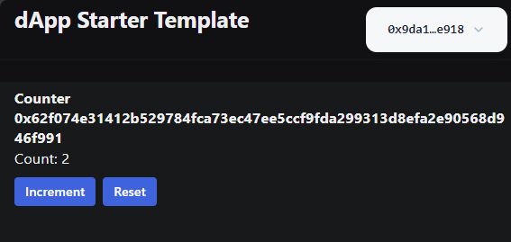

# Learn-005: Sui:dApp-Kit

**Sui dApp Kit** | [@mysten/dapp-kit](https://sdk.mystenlabs.com/dapp-kit)

The Sui dApp Kit is a set of React components, hooks, and utilities that make it easy to build a dApp for the Sui ecosystem. It provides hooks and components for querying data from the Sui blockchain, and connecting to Sui wallets.

**Core Features**
- Query Hooks: dApp Kit provides a set of hooks for making rpc calls to the Sui blockchain, making it easy to load any information needed for your dApp.
- Automatic Wallet State Management: dApp Kit removes the complexity of state management related to wallet connections. You can focus on building your dApp.
- Supports all Sui wallets: No need to manually define wallets you support. All Sui wallets are automatically supported.
- Easy to integrate: dApp Kit provides pre-built React Components that you can drop right into your dApp, for easier integration
- Flexible: dApp Kit ships both fully functional React Component, and lower level hooks that you can use to build your own custom components.

```bash
# 运行简单的前端Hello World
➜  pnpm create @mysten/dapp
.../share/pnpm/store/v3/tmp/dlx-69862    |  +97 ++++++++++
Packages are hard linked from the content-addressable store to the virtual store.
  Content-addressable store is at: /home/user/.local/share/pnpm/store/v3
  Virtual store is at:             ../../.local/share/pnpm/store/v3/tmp/dlx-69862/node_modules/.pnpm
.../share/pnpm/store/v3/tmp/dlx-69862    | Progress: resolved 97, reused 97, downloaded 0, added 97, done
? Which starter template would you like to use? …
  react-client-dapp React Client dApp that reads data from wallet and the blockchain
▸ react-e2e-counter React dApp with a move smart contract that implements a distributed counter
➜  cd project
➜  pnpm i
➜  pnpm dev
# 部署counter合约（testnent）
➜  move git:(main) ✗ sui client publish --gas-budget 100000000 counter
[warn] Client/Server api version mismatch, client api version : 1.17.3, server api version : 1.18.0
UPDATING GIT DEPENDENCY https://github.com/MystenLabs/sui.git
INCLUDING DEPENDENCY Sui
INCLUDING DEPENDENCY MoveStdlib
BUILDING counter
Successfully verified dependencies on-chain against source.
Transaction Digest: 23yLHCuz28CNtdf4f2qYR3n62DdUzY1L4TEgdejvybeq
╭─────────────────────────────────────────────────────────────────────────────────────────────────────────────────────────────────────────────────────────────╮
│ Transaction Data                                                                                                                                            │
├─────────────────────────────────────────────────────────────────────────────────────────────────────────────────────────────────────────────────────────────┤
│ Sender: 0x9da100344b78791774119ed087abae1d111c36276369accbf72ac2c8d8c8e918                                                                                  │
│ Gas Owner: 0x9da100344b78791774119ed087abae1d111c36276369accbf72ac2c8d8c8e918                                                                               │
│ Gas Budget: 100000000 MIST                                                                                                                                  │
│ Gas Price: 1000 MIST                                                                                                                                        │
│ Gas Payment:                                                                                                                                                │
│  ┌──                                                                                                                                                        │
│  │ ID: 0x8f2e5b9187142addf098f5cd32ef59ab07a770ce4bb0beaaffddf1d76a30ef69                                                                                   │
│  │ Version: 892590                                                                                                                                          │
│  │ Digest: 9cmxJPvudkjdGXs9KhcWR8k1883G2piVRm1GogrtKasC                                                                                                     │
│  └──                                                                                                                                                        │
│                                                                                                                                                             │
│ Transaction Kind : Programmable                                                                                                                             │
│ Inputs: [Pure(SuiPureValue { value_type: Some(Address), value: "0x9da100344b78791774119ed087abae1d111c36276369accbf72ac2c8d8c8e918" })]                     │
│ Commands: [                                                                                                                                                 │
│   Publish(<modules>,0x0000000000000000000000000000000000000000000000000000000000000001,0x0000000000000000000000000000000000000000000000000000000000000002), │
│   TransferObjects([Result(0)],Input(0)),                                                                                                                    │
│ ]                                                                                                                                                           │
│                                                                                                                                                             │
│                                                                                                                                                             │
│ Signatures:                                                                                                                                                 │
│    0zdlDoP25bNlP1H5AvTq6mMPISa2EV53mOesCBq+lZHGB4PWRH+/RaR3oVFMpG779k7bM1GwuWDufV42WxOoCg==                                                                 │
│                                                                                                                                                             │
╰─────────────────────────────────────────────────────────────────────────────────────────────────────────────────────────────────────────────────────────────╯
╭───────────────────────────────────────────────────────────────────────────────────────────────────╮
│ Transaction Effects                                                                               │
├───────────────────────────────────────────────────────────────────────────────────────────────────┤
│ Digest: 23yLHCuz28CNtdf4f2qYR3n62DdUzY1L4TEgdejvybeq                                              │
│ Status: Success                                                                                   │
│ Executed Epoch: 272                                                                               │
│                                                                                                   │
│ Created Objects:                                                                                  │
│  ┌──                                                                                              │
│  │ ID: 0x76d7b56860a99eb7748c16ed5e0dac61b5871ee9ad11f7842d64478c441490a1                         │
│  │ Owner: Account Address ( 0x9da100344b78791774119ed087abae1d111c36276369accbf72ac2c8d8c8e918 )  │
│  │ Version: 892591                                                                                │
│  │ Digest: 9MEnnMsdhA94E5MEW8Nb2fpEit5GKtM9AibrsiHKXKEe                                           │
│  └──                                                                                              │
│  ┌──                                                                                              │
│  │ ID: 0x95719a0d9d0f5a39eb06166c813ebe53ecbe5429fcaba498de3bfa39d6be509e                         │
│  │ Owner: Immutable                                                                               │
│  │ Version: 1                                                                                     │
│  │ Digest: 5eWCYEXFqc1cpJymu1MRhVqxV8KAkYZm75nhu3GDk29w                                           │
│  └──                                                                                              │
│                                                                                                   │
│ Mutated Objects:                                                                                  │
│  ┌──                                                                                              │
│  │ ID: 0x8f2e5b9187142addf098f5cd32ef59ab07a770ce4bb0beaaffddf1d76a30ef69                         │
│  │ Owner: Account Address ( 0x9da100344b78791774119ed087abae1d111c36276369accbf72ac2c8d8c8e918 )  │
│  │ Version: 892591                                                                                │
│  │ Digest: BH4evzxSwb7UzWK1Wf3UZ5E3yHdmGEKwc8ThNWgKo8Jo                                           │
│  └──                                                                                              │
│                                                                                                   │
│ Gas Object:                                                                                       │
│  ┌──                                                                                              │
│  │ ID: 0x8f2e5b9187142addf098f5cd32ef59ab07a770ce4bb0beaaffddf1d76a30ef69                         │
│  │ Owner: Account Address ( 0x9da100344b78791774119ed087abae1d111c36276369accbf72ac2c8d8c8e918 )  │
│  │ Version: 892591                                                                                │
│  │ Digest: BH4evzxSwb7UzWK1Wf3UZ5E3yHdmGEKwc8ThNWgKo8Jo                                           │
│  └──                                                                                              │
│                                                                                                   │
│ Gas Cost Summary:                                                                                 │
│    Storage Cost: 8747600                                                                          │
│    Computation Cost: 1000000                                                                      │
│    Storage Rebate: 978120                                                                         │
│    Non-refundable Storage Fee: 9880                                                               │
│                                                                                                   │
│ Transaction Dependencies:                                                                         │
│    4MY7mz6jtPuQNHgcHGDJDy87fpGiKWwbUw4v8gvjsSk3                                                   │
│    GZcMfNx5jvGHsfSKEHJD7jZss7yCHqEGfhVk8Jx8a2N1                                                   │
╰───────────────────────────────────────────────────────────────────────────────────────────────────╯
╭─────────────────────────────╮
│ No transaction block events │
╰─────────────────────────────╯

╭──────────────────────────────────────────────────────────────────────────────────────────────────╮
│ Object Changes                                                                                   │
├──────────────────────────────────────────────────────────────────────────────────────────────────┤
│                                                                                                  │
│ Created Objects:                                                                                 │
│  ┌──                                                                                             │
│  │ ObjectID: 0x76d7b56860a99eb7748c16ed5e0dac61b5871ee9ad11f7842d64478c441490a1                  │
│  │ Sender: 0x9da100344b78791774119ed087abae1d111c36276369accbf72ac2c8d8c8e918                    │
│  │ Owner: Account Address ( 0x9da100344b78791774119ed087abae1d111c36276369accbf72ac2c8d8c8e918 ) │
│  │ ObjectType: 0x2::package::UpgradeCap                                                          │
│  │ Version: 892591                                                                               │
│  │ Digest: 9MEnnMsdhA94E5MEW8Nb2fpEit5GKtM9AibrsiHKXKEe                                          │
│  └──                                                                                             │
│                                                                                                  │
│ Mutated Objects:                                                                                 │
│  ┌──                                                                                             │
│  │ ObjectID: 0x8f2e5b9187142addf098f5cd32ef59ab07a770ce4bb0beaaffddf1d76a30ef69                  │
│  │ Sender: 0x9da100344b78791774119ed087abae1d111c36276369accbf72ac2c8d8c8e918                    │
│  │ Owner: Account Address ( 0x9da100344b78791774119ed087abae1d111c36276369accbf72ac2c8d8c8e918 ) │
│  │ ObjectType: 0x2::coin::Coin<0x2::sui::SUI>                                                    │
│  │ Version: 892591                                                                               │
│  │ Digest: BH4evzxSwb7UzWK1Wf3UZ5E3yHdmGEKwc8ThNWgKo8Jo                                          │
│  └──                                                                                             │
│                                                                                                  │
│ Published Objects:                                                                               │
│  ┌──                                                                                             │
│  │ PackageID: 0x95719a0d9d0f5a39eb06166c813ebe53ecbe5429fcaba498de3bfa39d6be509e                 │
│  │ Version: 1                                                                                    │
│  │ Digest: 5eWCYEXFqc1cpJymu1MRhVqxV8KAkYZm75nhu3GDk29w                                          │
│  │ Modules: counter                                                                              │
│  └──                                                                                             │
╰──────────────────────────────────────────────────────────────────────────────────────────────────╯
╭───────────────────────────────────────────────────────────────────────────────────────────────────╮
│ Balance Changes                                                                                   │
├───────────────────────────────────────────────────────────────────────────────────────────────────┤
│  ┌──                                                                                              │
│  │ Owner: Account Address ( 0x9da100344b78791774119ed087abae1d111c36276369accbf72ac2c8d8c8e918 )  │
│  │ CoinType: 0x2::sui::SUI                                                                        │
│  │ Amount: -8769480                                                                               │
│  └──                                                                                              │
╰───────────────────────────────────────────────────────────────────────────────────────────────────╯
```



## Short Summary

[dapp-kit](https://github.com/MystenLabs/sui/tree/main/sdk/dapp-kit)相当于前端web3开发的瑞士军刀，集合了Hooks，Wallet-State，Wallet-Connectors...
- sdk模块更集中🆙
- 教程指引比较简洁，可能对新手不友好❌
- React版本为主，vue实现❓
