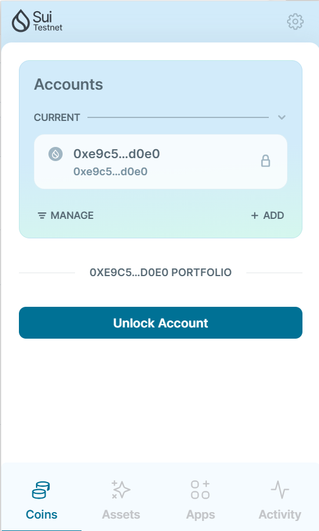

# 学习日志
## 配置sui move环境
Windows——使用Powershell脚本：
`Invoke-Expression (Invoke-WebRequest -Uri "https://gist.githubusercontent.com/WGB5445/73b3b54f8293125d4ba74260ea5a39ce/raw" -UseBasicParsing).Content`

Liunx Ubuntu——二进制自动化构建（要配置丝滑的代理）：
`curl -fsSL https://raw.githubusercontent.com/ProbiusOfficial/Sui-DevSetup/main/sui-ubuntu-x86_64.sh | bash`

## 安装Sui Wallet
浏览器插件安装即可


## 区块链浏览器
- https://suiexplorer.com/
- https://suivision.xyz/

# 语法学习：
## 快速创建一个 Sui package 框架
`sui move new <PACKAGE NAME>`<br />这条指令创建了:

- 项目根文件夹 `hello_world`
- `Move.toml` 配置文件
- 用于存放 Sui Move 智能合约的 `sources` 子文件夹

`Move.toml` 包含三个部分:

- `[package]` 声明了该 package 的命名和版本数
- `[dependencies]` 声明了该 package 依赖的其他 packages, 包括 Sui 标准库和其他第三方依赖库
- `[addresses]` 声明了该 packages 源代码中地址的别名
<a name="yLGq1"></a>
## 基本数据类型
`Integers` (u8, u64, u128), `boolean` and `address`.<br />即整型、布尔型、地址型。
<a name="nyQLI"></a>
### Integer types 整数类型

- `u8` 表示一个无符号的 8 位整数，也就是一个字节。
- `u64` 表示一个无符号的 64 位整数，也就是 8 字节。
- `u128` 表示一个无符号的 128 位整数，也就是 16 字节。

这些类型后面的数字表示整数分配的内存空间的大小。所以，u8 表示的是 1 个字节的内存空间大小，u64 表示的是 8 个字节的内存空间大小，而 u128 表示的是 16 个字节的内存空间大小。<br />定义方式：<br />
<a name="Lnzez"></a>
### Boolean 布尔类型
`false` and `true`<br />一些定义方式：<br />
<a name="UxNkN"></a>
### Address 地址
地址是区块链中发送者（或钱包）的标识符。需要地址类型的最基本的操作是发送硬币和导入模块（module）。<br />
<a name="n8VwL"></a>
### 数值比较
使用运算符 as 将整数变量转换为另一个大小：<br /><br />同等大小类型的整数才可以比较
<a name="vEem1"></a>
## 注释
语法和C一样，但不能使用utf-8（就是注释不能写汉字）
<a name="x2yQM"></a>
## 初始化变量
使用 `let` 在当前范围内创建新变量，并选择性地使用 `value` 初始化此变量<br />`let <VARIABLE> : <TYPE>; `or `let <VARIABLE> = <EXPRESSION>`<br />
<a name="SRcXD"></a>
## 下划线——未使用
在 Move 中，必须使用每个变量（否则您的代码将无法编译），因此您不能初始化一个变量并保持其不变。虽然您有一种方法可以将变量标记为故意未使用 - 通过使用下划线 `_` 。<br /><br />Move 允许您定义相同的变量两次，但有一个限制 - 它仍然需要使用。
<a name="i1GKr"></a>
## 块表达式与作用域
块是一个表达式;它标有大括号 - `{}` 。块可以包含其他表达式（和其他块）。<br />在定义块时，您实际上定义了一个范围。<br />
<a name="nau1l"></a>
## 变量的生命周期
变量仅存在于定义它的作用域（或块）内。当其作用域结束时，变量将死亡。
<a name="oGGLN"></a>
## 块返回值
作用域中的最后一个表达式（不带分号）是此作用域的返回值。<br />
<a name="KFKPn"></a>
## 控制流
<a name="B1DVD"></a>
### if表达式
`if (<bool_expression>) <expression> else <expression>;`<br />

- 分支兼容性：两个分支必须返回兼容（相同）类型
- `if` 可以单独使用 - 没有 `else`
- 没有`else` 分支的表达式不能用于赋值

<a name="qL7yF"></a>
### 条件while循环
`while (<bool_expression>) <expression>;`

-  `while` 不能返回值
<a name="UdMwj"></a>
### 无限loop循环
无限循环是用关键字`loop`定义的。<br />
<a name="gkLAv"></a>
### break与continue
关于分号。如果 break 和 continue 是块中的最后一个关键字，则不能在它们后面加上分号，因为 after 之后的任何代码都不会被执行。<br />
<a name="wF8Sm"></a>
### 有条件的中止abort
关键字 `abort`允许您中止执行，并在其后放置错误代码。<br />
<a name="NEvLg"></a>
### assert条件中止
内置 `assert!(<bool expression>, <code>)` 方法已经包装了 `abort + 条件`，并且可以在代码中的任何位置访问。**左边的条件必须为真，否则执行右边。**<br />`assert()` 当不满足条件时将中止执行，或者在相反的情况下将不执行任何操作。<br />

- 错误码赋值：`const ENotIntendedAddress: u64  = 1;`
<a name="A2xq1"></a>
## 模块module
模块以 `module` 关键字开头，后跟模块名称和大括号 - 其中放置了模块内容。<br />默认情况下，您的模块将从您的地址编译和发布。但是，如果您需要在本地使用某些模块（例如用于测试或开发）或想在模块文件中指定您的地址，请使用 `address <ADDR> {}`语法<br />
<a name="UmpFp"></a>
## 导入模块或标准库

- 您可以直接在代码中按模块的地址使用模块：

<br />在此示例中，我们从地址`0x1`（标准库）导入了模块`Offer` 并使用了它的方法

- 关键字导入

 `use <Address/Alias>::<ModuleName>;`<br />`<Address>` 是发布者的地址，也是 `<ModuleName>` 模块的名称。

- 成员导入：可以扩展 `import` 语句 - 您可以指定要导入的模块的哪些成员：
- 用于`Self`将模块与其成员一起导入
- 使用关键字 `as` 更改导入模块的名称。              `use <Address>::<ModuleName> as <Alias>;`
<a name="ZZTak"></a>
## 常量
您可以定义模块级或脚本级常量。一旦定义，常量就无法更改。
<a name="Y4ucf"></a>
## 函数

- 函数参数
<a name="IkGDL"></a>
### 定制类型
Structure 使用关键词 struct 声明。一个 structure 最多拥有 4 项能力。<br />四类能力特性：

- **Copy**: 值可以被复制
- **Drop**: 在作用域范围结束后值可以被丢弃
- **Key**: 在全局存储操作中值可以被用为key键
- **Store**: 值可以在全局存储中被存储
<a name="gHSVq"></a>
### 函数可见性

- **private**: 作为函数可见性的默认设置；只允许同一 module 内的函数获取
- **public**: 该函数既可以被同一 module 内的函数获取，也可以被其他 module 定义的函数获取
- **public(friend)**: 该函数既可以被同一 module 内的函数获取，同时也可以被该 module 的 friends 清单上包含的 module 所定义的函数获取。
<a name="aOZfV"></a>
### Entry 函数
在 Sui Move 中，entry 函数可以被交易 transactions 直接调用。它们需要满足下面三个条件:

- 被关键词 entry 标注
- 没有返回值
- (可选) 最后一个参数是 TxContext 类型实例的可变引用

<a name="fqq73"></a>
## 部署智能合约
`sui client publish --path <absolute local path to the Sui Move package> --gas-budget 100000000`（要是提示gas不够就多加几个0）

- 获取测试币

Win：（Powershell中执行）
```powershell
$body = @{
    FixedAmountRequest = @{
        recipient = '钱包地址'
    }
} | ConvertTo-Json

Invoke-WebRequest -Uri 'https://faucet.devnet.sui.io/gas' -Method POST -Body $body -Headers @{
    'Content-Type' = 'application/json'
}
```
Linux：
```powershell
curl --location --request POST 'https://faucet.devnet.sui.io/gas' --header 'Content-Type: application/json' --data-raw '{ "FixedAmountRequest": { "recipient": "替换为你的钱包地址" } }'
```

- 跳过版本检查：`--skip-fetch-latest-git-deps`
- 跳过依赖性检查：`--skip-dependency-verification`


- 输出中文


```
module hello::hello{
    use std::string;
    use sui::object::{Self, UID};
    use sui::transfer;
    use sui::tx_context::{Self, TxContext};
    
        ///include any string object
    struct HelloWorldObject has key, store {
        id: UID,
        /// strings included by object 
        text: string::String
    }
    
    public entry fun mint(text: vector<u8>,ctx: &mut TxContext){
        let object = HelloWorldObject{
            id: object::new(ctx),
            text: string::utf8(text)
        };
        transfer::transfer(object, tx_context::sender(ctx));
    }
}
```
使用vector来定义字符串变量<br />再次发布智能合约 <br />`sui client publish --gas-budget 100000000 --skip-fetch-latest-git-deps --skip-dependency-verification`<br /><br />调用函数，传入参数args <br />`sui client call --function mint --module hello --package 0x0379266c1b772298bd93d0da5f8f684f30f9c5eb2be5af36d9f06f5ee7c47179 --args "你好，世界" --gas-budget 10000000`<br /><br />在sui explorer上查看相关信息，输入 `Transaction Effects` 下的 `Created Objects ID`<br /><br />可以看到text信息

<a name="ThwyG"></a>
## Sui Objects 所有权
在 Sui Move 中总共有四种类型的所有权。

- 被拥有
   - 被一个地址拥有
   - 被另一个 object 拥有
- 共享
   - 不可变的共享
   - 可变的共享
<a name="lefHY"></a>
### 被拥有的 Objects

- 被一个地址拥有：使用transfer方法将一个object转移到一个地址

**（transfer的函数方法调用会完全消耗掉object，即transfer之后object在当前交易中是不能再次被获取的）**<br />之后对object的读写操作都必须由object所有者发起交易<br />`use sui::transfer`<br />`transfer::transfer(obj, recipient);`
<a name="erOpc"></a>
### 被另一object拥有的object（子object）
使用`dynamic_object_field`方法创建的`object`

<a name="dwI2D"></a>
### 不可变的共享object（不能被修改和删除，也不能解冻）
`transfer::freeze_object(obj);`
<a name="Jb6kf"></a>
### 可变的共享object
可被任何人读写<br />`transfer::share_object(obj);`
<a name="MKIkd"></a>
## 参数传递与删除Object

<a name="A8xff"></a>
## 结构体嵌套（Object Wrapping）
<br />实现成绩单信息的请求和解包<br />

<a name="igaZs"></a>
## 用与权限管理的Capability模式
把带有管理员权限的能力也设计成一个Object并赋予给特定账户，同时限定需要管理员运行的函数方法<br /><br />增加传入的参数`TeacherCap`，并用下划线将它标注为未使用的变量或参数<br /><br />添加管理员<br />
<a name="PkBIG"></a>
## 日志（Events）
要引用`use sui::event;`<br /><br />在函数中添加发送events信息

<a name="X6ycj"></a>
## 泛型
_泛型是具体类型或其他属性的抽象替代品_。

—————————————————————————2024.1.21笔记更新——————————————————————————

<a name="yYEU7"></a>
# 泛型
避免重复的模板函数<br />在没有范型的情况下，我们可以定义一个包含 u64 类型的 Box<br /><br />但是，这种类型只能保存 u64 类型的值，为了能够存储其他类型显然我们不能把所有类型的box都枚举完，所以这个时候就需要使用泛型。<br />（加上尖括号）
<a name="j2NCr"></a>
## 能力限制
我们可以添加条件去强制传递给泛型的类型必须具有某些能力。（能多不能少）<br /><br /><br />phantom可以绕过规则
<a name="jplnt"></a>
### 示例：generics.move
先部署智能合约：`sui client publish --gas-budget 100000000 --skip-fetch-latest-git-deps --skip-dependency-verification` <br /><br />类型参数 type-args<br />`sui client call --package 0x92321dc9b575a77207129d0321bb65041fe455f0e1c0c37b95ad0f363b274028 --module g1 --function "create_box" --args 0x2ffb33f9f1516e890e46d07739fecf38cdb4373920dd186d1977203c6771f84c --type-args "0x2::coin::Coin<0x2::sui::SUI>" --gas-budget 10000`
<a name="z2b6S"></a>
# Witness（见证者模式）
<br />

- Phantom：我们还想把 witness 资源 PEACE 传入 Guardian，但 PEACE 只有 drop 的能力。回顾我们之前关于能力约束和内部类型的讨论，该规则暗示PEACE也应该有key和storage，因为外部类型Guardian有。但是在这种情况下，我们不想给我们的witness类型添加不必要的能力，因为这样做可能会导致不符合预期的行为和漏洞。我们可以使用关键字`phantom`来解决这种情况。当一个类型参数没有在结构定义中使用，或者它只是作为另一个`phantom`类型参数的参数使用时，我们可以使用phantom关键字来要求Move类型系统放松对内部类型的能力约束规则。


- One Time Witness：一次性见证One Time Witness（OTW）是Witness模式的一个子模式，我们利用模块init函数来确保只创建一个witness资源的实例（所以A类型被保证是唯一的）。
<a name="KcyoY"></a>
# 发行代币
<a name="bKdh5"></a>
## Coin资源
<br />Balance没有Key能力，不能进行全局查找和transfer。而Coin可以，因此把Balance包在Coin里面。
<a name="PAWxP"></a>
## create_currency 方法
<br />使用Sui框架中的sui::types::is_one_time_witness 方法检查传入的witness资源是否是一次性见证。<br />该方法创建并返回两个对象，一个是TreasuryCap资源，另一个是CoinMetadata资源。
<a name="Bgowj"></a>
### TreasuryCap

<a name="kozzK"></a>
### CoinMetadata
这是一个存储已创建的可替换代币的元数据的资源。它包括以下字段。

- `decimals`: 这个自定义可替换代币的精度
- `name`：这个自定义可替换标记的名称
- `symbol`：这个自定义可替换标记的标记符号
- `description`: 这个自定义可替换标记的描述
- ``icon_url'`: 这个自定义可替换代币的图标文件的网址。
<a name="rsScX"></a>
## Manage Coin案例
合约部署后，创建的两个不可变对象分别是 `package` 本身和 `Managed Coin` 的 `CoinMetadata object`，交易发送人收到并拥有的对象就是 `Managed Coin` 的 `TreasuryCap` 对象。
<a name="H3xPB"></a>
### package
<br />

- <br />

<a name="RAQLZ"></a>
### CoinMetadata
<br />
<a name="N8S8A"></a>
### TreasuryCap
<br />
<a name="UKvyj"></a>
## 铸造代币（mint函数）

- `sui client call --function mint --module managed --package $PACKAGE_ID --args $TREASURYCAP_ID \"<amount to mint>\" <recipient address> --gas-budget 3000`

可以看到三个参数分别是 TreasuryCapID、铸造代币数量、接受者地址<br />实际代码 `sui client call --function mint --module managed --package 0x97a0b24e24d5103bbad0b47688356814c7e8e6b1f94b7907344a505459e677dc --args 0xb805040af4c66a770b9daa1c4646b5f8aac9f257fcd4535c7a45cd717ded29be 100 0xf1a3394e4cfbc855ffcad1774b7505eff2d87659ad135a9fecf2755b1097bb8f --gas-budget 10000000`<br /><br /><br />运行成功

<a name="HSuBV"></a>
## 销毁代币（burn函数）

- `sui client call --function burn --module managed --package $PACKAGE_ID --args $TREASURYCAP_ID $COIN_ID --gas-budget 3000`

需要的参数有两个：`TreasuryCapID`和`CoinID`

- Coin ID

<br />实际代码 `sui client call --function burn --module managed --package 0x97a0b24e24d5103bbad0b47688356814c7e8e6b1f94b7907344a505459e677dc --args 0xb805040af4c66a770b9daa1c4646b5f8aac9f257fcd4535c7a45cd717ded29be 0x6ede12fb9c98d6bca757689bca94b8cf6a4aac8b0453e49e791fb9cc071890dc --gas-budget 10000000`<br /><br />

## @mysten/create-dapp 工具
### 模板
- react-client-dapp ：一个简单的 React dApp，用于获取连接钱包拥有的对象列表
- react-e2e-counter ：包含简单计数器应用的移动代码和 UI 的端到端示例