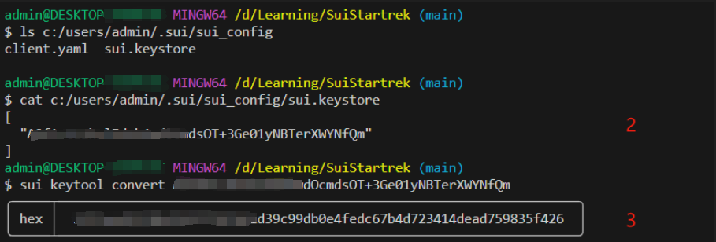
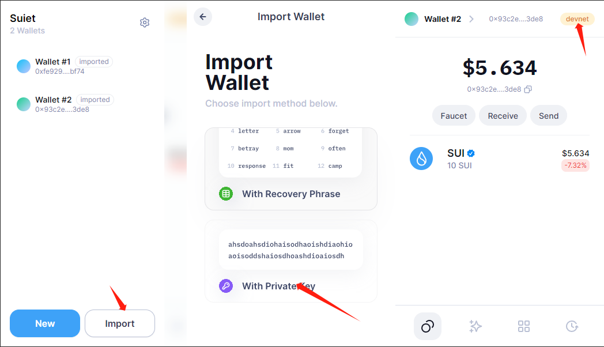

# Learning Journal

## 一， 通过钱包APP查看地址资产情况
1. 通过`sui client active-address`查看是否有可用地址
2. 通过`cat`查看当前地址的privite-key
    + Windows系统下位置一般存放在`C:/users/admin/.sui/sui_config/sui.keystore`下
    + Linux系统一般在 `~/.sui/sui_config/sui.keystore`
3. 复制地址通过`sui keytool convert <address>`方法获取地址的hex值

4. 复制hex值，选择通过Private Key 生成，粘贴进去再设置密码就可以正常使用了。（我这里使用的是Suiet Wallet）
5. 注意切换钱包的网络地址

