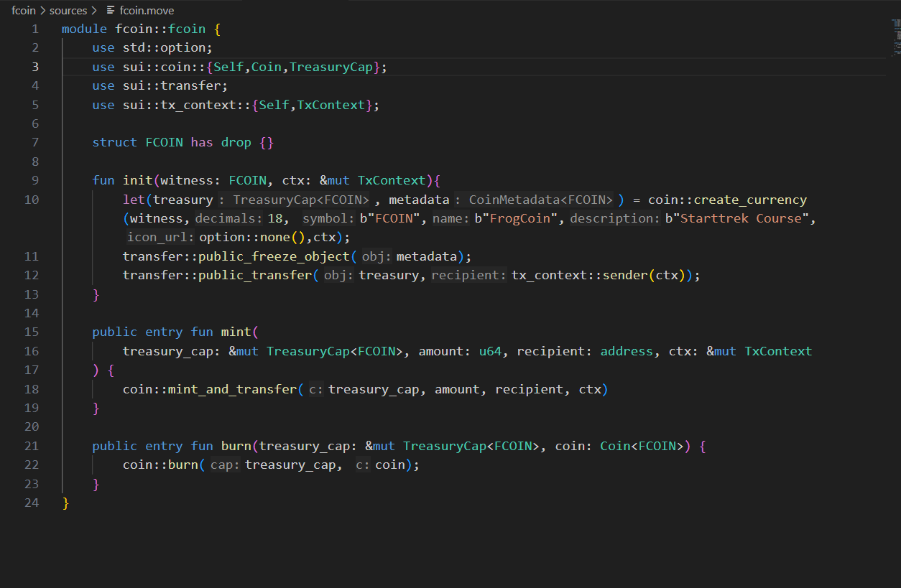
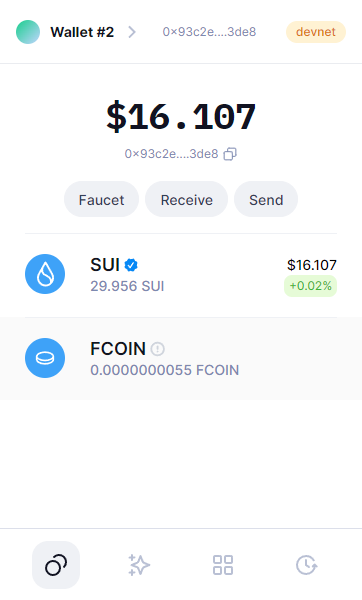

# Learning Journal

## 一， 通过钱包APP查看地址资产情况
1. 通过`sui client active-address`查看是否有可用地址
2. 通过`cat`查看当前地址的privite-key
    + Windows系统下位置一般存放在`C:/users/admin/.sui/sui_config/sui.keystore`下
    + Linux系统一般在 `~/.sui/sui_config/sui.keystore`
3. 复制地址通过`sui keytool convert <address>`方法获取地址的hex值

4. 复制hex值，选择通过Private Key 生成，粘贴进去再设置密码就可以正常使用了。（我这里使用的是Suiet Wallet）
5. 注意切换钱包的网络地址

## 二， 0~1 发型一个自己的代币
1. `sui move new fcoin` 创建一个名为fcoin的Sui代币项目
2. 在`fcoin/sources`目录下新建`fcoin.move`文件
3. `coin::create_currency`方法接受7个参数，包括见证对象`witness`,精度18，货币名称和简称以及描述，icon_url 这里使用的option::none()表示不使用
4. `transfer::public_freeze_object(metadata)` 调用此函数来冻结`metadata`对象，让他的状态不可更改
5. 最后调用 `transfer::public_transfer` 函数将 treasury 对象转移到交易的发送方。这里使用 tx_context::sender(ctx) 来获取交易的发送方地址。
    + 在这段 Sui-move 代码中，treasury 对象代表新创建的加密货币的 "财政部" 或 "资金库"。在加密货币和区块链的语境中，"财政部" 或 "资金库" 通常指代控制货币供应或储备的中心实体或账户。这里的 treasury 对象在创建新的 FCOIN 货币时生成，作为该货币的初始储备。
    + 具体来说，当 coin::create_currency 函数被调用时，它返回两个对象：treasury 和 metadata。treasury 是一个代表新货币储备的对象，而 metadata 是描述这种货币特性（如名称、符号等）的元数据对象。
    + treasury 对象包含了新创建的货币的初始供应量。在实际应用中，这个对象可以用来分配或转移货币，实施货币政策，或作为项目资金的储备。
    + 在 init 函数的最后一行中，treasury 对象被转移到交易的发起者，这意味着发起创建货币的用户或实体接收了这个新货币的初始供应量。
    
6. 我们可以先运行`sui move build`来检查一下编译是否有错误，之后使用`sui client publish --gas-budget 1000000000`来部署我们的代币发行合约,成功后会返回详细的信息.
7. 使用
`sui client call --function mint --module fcoin --package <Package Address> --args <TreasuryCap Address> <Amount> <Receive Address > --gas-budget 100000000` 来获取你的代币到你的钱包，args需要的三个参数分别是TreasuryCap，数量，以及mint地址。
8. 最后查看自己的钱包，可以发现代币已经到账~

