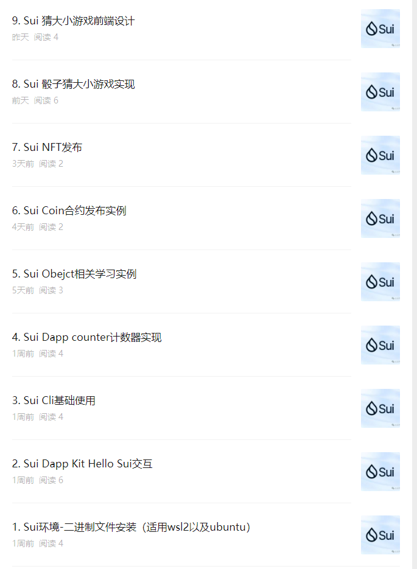

# 星航计划加入申请表

### 个人介绍

* Github ID: [baicaiyihao](https://github.com/baicaiyihao)

* Telegram ID: stom698

* Discord ID: stom.ark

* QQ ID:326562410

* Sui 账号地址: 0x3c54103db151f05f698705b76427cc03f80f1b3a092353bc84c2fd88a6b56c85

* 微信公众号：move学习


长期从事渗透测试和安全开发，2024 年进入区块链领域，学习区块链基础，智能合约开发。  
常用语言 Python, Java, JS等，对区块链系统研发以及智能合约编程方向感兴趣。

### 学习日志

- [学习日志](journal.md)
- [学习总结](summary.md)

### 学习成果

## Roadmap 1
1.  
- 项目源码:https://github.com/baicaiyihao/hello_sui  
- 发布的hello_sui实现前端交互项目  
（testnet）packageid:0x2ddc2bd1445a8046487b645cb4626764ea812f62bdaef8253182719a96c81426  
  
2.  
- 项目源码:https://github.com/baicaiyihao/counter  
- 发布的counter实现前端交互项目  
（testnet）packageid:0xef7e9f18db243cd1391eb735c84e7293257682db11888b722510627a7ef42b93  

3.  
- 项目源码:https://github.com/baicaiyihao/sui_program/tree/main/stomcoin
- 发布STOMCOIN coin合约  
（testnet）packageid:0x33b47e6048ab066bc17bc444b5593e93e423e685bc17a6576f49aa98948d176f  
Transaction Digest: EXMiYy4E4W7sgEes79vbo2HjfpicTsqnzFs9U9W22CYK  

4.  
- 项目源码:https://github.com/baicaiyihao/sui_program/tree/main/stomlockcoin
- 发布STOMLOCKCOIN coin合约  
（testnet）packageid:0x61bb5e5be66748013c6b65f1096329cbcaa29c537cbe12b1fa28d2dcb9e2c3c2  
Transaction Digest: 9U3LLiR6U7CMrwPS54iLaRwaaKAVsdKMyHBb7j1FPciv  

## Roadmap 2

1.  
- 项目源码:https://github.com/baicaiyihao/sui_program/tree/main/stomnft  
- 发布STOMNFT合约  
（testnet）packageid:0x2ab3a7d840fd2b13573e1d9cad4826b3300b355b990905d4df2c1dd9e876492b  
NFT objectid: 0x2058f902e71baa1e69167b395773e5ba61dea383b2edc048a7ed494da8bd7e91  
Transaction Digest: AWdv2dAUBhwfvodeyPkTJjp1vjHEH3gsQZ5BNw9nB3kw  

2.  
- 项目源码:https://github.com/baicaiyihao/sui_program/blob/main/sicbogame  
- 发布sicbogame合约  
（testnet）PackageID: 0x4047ca9d7990e25abe3dea249e54eb5ed079212dd976f1ccc30700a96d01608f  
Transaction Digest: CT4xf89srjuUz2exEkuwDMXHzFibT6DX3V7XYshGPD4F  
Transaction Digest: B2L7t4HibAmE1ZeLqpEv3Hvovr2tQqJomdwD8QnEPDVV  


## Roadmap 3  

1.发布各阶段的学习文章到```move学习```公众号  
  
同步更新其他三个平台   
[掘金](https://juejin.cn/column/7342067642881277986 "掘金")  
[登链](https://learnblockchain.cn/column/45 "登链")  
[知乎](https://www.zhihu.com/column/c_1747981678679928832 "知乎")  
[CSDN](https://blog.csdn.net/baicai1hao/category_12594909.html "CSDN")  
2.sui官方的PR贡献  
https://github.com/MystenLabs/sui/pull/16082  