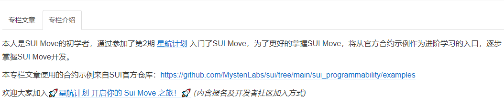

# 学习日志

## Roadmap 01

[1.1_Sui开发环境配置及CLI和钱包使用](./roadmap/week01/1.1_Sui开发环境配置及CLI和钱包使用.md)

[1.2_Sui合约开发入门](./roadmap/week01/1.2_Sui合约开发入门.md)

[1.3_SuidAppKitHelloWorld交互](./roadmap/week01/1.3_SuidAppKitHelloWorld交互.md)

[1.4_创建并发布MoveERC20合约](./roadmap/week01/1.4_创建并发布MoveERC20合约.md)

## Roadmap 02

[1.5_NFT发行](https://learnblockchain.cn/article/7172)

[1.6_Move猜数字合约开发](./roadmap/week02/1.6_Move猜数字合约开发.md)

## Roadmap 03

PR：
https://github.com/MystenLabs/sui/pull/15491
文章：
https://learnblockchain.cn/article/7172
https://learnblockchain.cn/article/7173
https://learnblockchain.cn/article/7174

## 专栏《SUI Move官方示例合约实践》

https://learnblockchain.cn/column/42

- [SUI Move官方示例合约实践——DeFi类：闪电贷（flash_lender）](https://learnblockchain.cn/article/7395)                                                                                             
- [SUI Move官方示例合约实践——DeFi类：第三方托管（escrow）](https://learnblockchain.cn/article/7393)
- [SUI Move官方示例合约实践——DeFi类：共享托管（shared_escrow）](https://learnblockchain.cn/article/7325)
- [SUI Move官方示例合约实践——FT类：资产金库锁（treasury_lock）](https://learnblockchain.cn/article/7339)
- [SUI Move官方示例合约实践——FT类：篮子代币（basket）](https://learnblockchain.cn/article/7345)
- [SUI Move官方示例合约实践——FT类：监管币（regulated_coin）](https://learnblockchain.cn/article/7355)
- [SUI Move官方示例合约实践——游戏类：英雄游戏（hero）](https://learnblockchain.cn/article/7365)
- [SUI Move官方示例合约实践——游戏类：海洋英雄游戏（sea hero）](https://learnblockchain.cn/article/7369)
- [SUI Move官方示例合约实践——游戏类：剪刀石头布游戏（rock_paper_scissors）](https://learnblockchain.cn/article/7371)
- [SUI Move官方示例合约实践——游戏类：井字游戏（tic_tac_toe）](https://learnblockchain.cn/article/7375)
- [SUI Move官方示例合约实践——游戏类：共享对象版井字游戏（shared_tic_tac_toe）](https://learnblockchain.cn/article/7378)
- [SUI Move官方示例合约实践——游戏类：基于drand的抽奖游戏（drand_based_lottery）](https://learnblockchain.cn/article/7382)
- [SUI Move官方示例合约实践——游戏类：基于drand随机数的刮刮卡游戏（drand_based_scratch_card）](https://learnblockchain.cn/article/7398)

