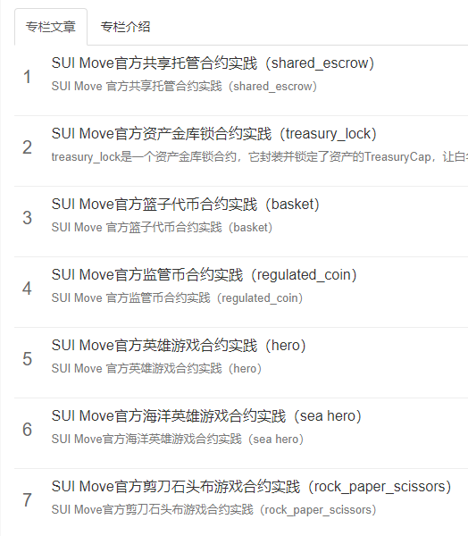

# 学习日志

## Roadmap 01

[1.1_Sui开发环境配置及CLI和钱包使用](./roadmap/week01/1.1_Sui开发环境配置及CLI和钱包使用.md)

[1.2_Sui合约开发入门](./roadmap/week01/1.2_Sui合约开发入门.md)

[1.3_SuidAppKitHelloWorld交互](./roadmap/week01/1.3_SuidAppKitHelloWorld交互.md)

[1.4_创建并发布MoveERC20合约](./roadmap/week01/1.4_创建并发布MoveERC20合约.md)

## Roadmap 02

[1.5_NFT发行](https://learnblockchain.cn/article/7172)

[1.6_Move猜数字合约开发](./roadmap/week02/1.6_Move猜数字合约开发.md)

## Roadmap 03

PR：
https://github.com/MystenLabs/sui/pull/15491
文章：
https://learnblockchain.cn/article/7172
https://learnblockchain.cn/article/7173
https://learnblockchain.cn/article/7174

## 创建专栏持续做教程输出

- [SUI Move官方共享托管合约实践（shared_escrow）](https://learnblockchain.cn/article/7325)
- [SUI Move官方资产金库锁合约实践（treasury_lock）](https://learnblockchain.cn/article/7339)
- [SUI Move官方篮子代币合约实践（basket）](https://learnblockchain.cn/article/7345)
- [SUI Move官方监管币合约实践（regulated_coin）](https://learnblockchain.cn/article/7355)
- [SUI Move官方英雄游戏合约实践（hero）](https://learnblockchain.cn/article/7365)
- [SUI Move官方海洋英雄游戏合约实践（sea hero） ](https://learnblockchain.cn/article/7369)
- [SUI Move官方剪刀石头布游戏合约实践（rock_paper_scissors）](https://learnblockchain.cn/article/7371)

