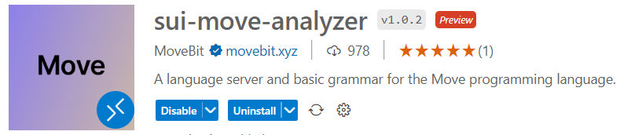
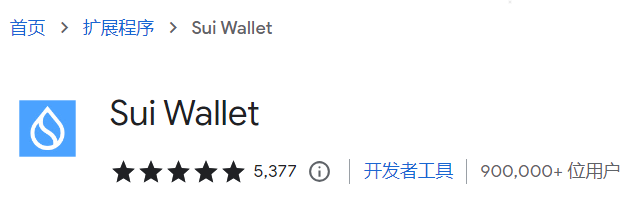
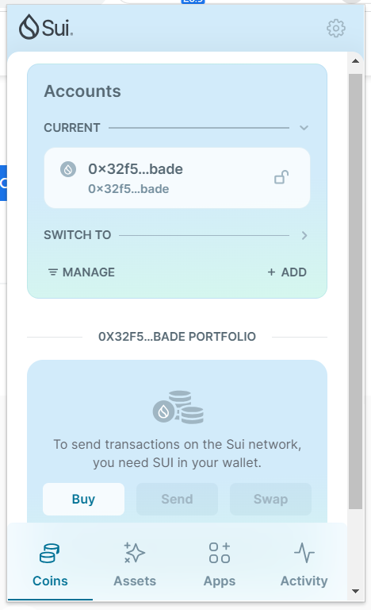
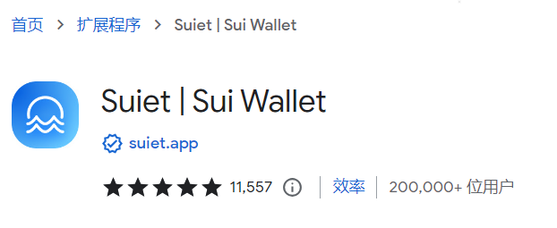
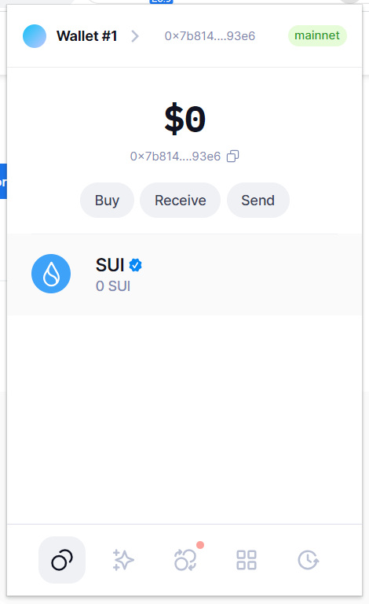
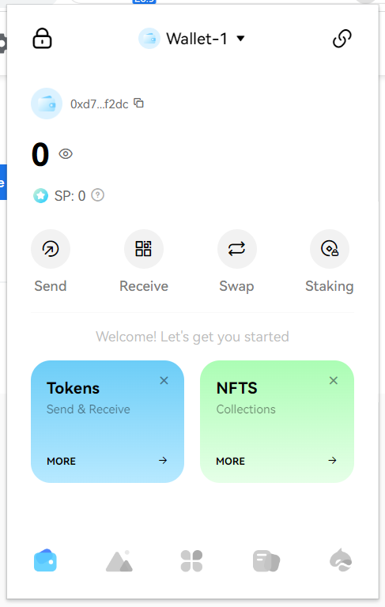

# 1.1 Sui开发环境配置及CLI和钱包使用

## 1 安装Move开发环境

### 1.1 依赖安装

#### （1）Rust安装

```bash
curl --proto '=https' --tlsv1.2 -sSf https://sh.rustup.rs | sh
```

#### （2）依赖安装

```bash
sudo apt-get install curl git-all cmake gcc libssl-dev pkg-config libclang-dev libpq-dev build-essential
```

### 1.2 本地二进制安装

> 下载位置位于 `$HOME/.cargo/bin/sui`

```bash
cargo install --locked --git https://github.com/MystenLabs/sui.git --branch testnet sui
```

### 1.3 源码编译安装

```bash
# 切换到最新的发布分支
(main)$ git checkout -b mainnet-v1.13.0 mainnet-v1.13.0
Switched to a new branch 'mainnet-v1.13.0'

# 编译
(mainnet-v1.13.0)$ cargo build --release
......漫长等待......
   Finished release [optimized + debuginfo] target(s) in 23m 10s
```

### 1.4 版本查看

```bash
$ sui --version
sui 1.13.0-64fe2b687
```

### 1.5 安装插件

#### （1）安装语言服务器

```bash
 $ cargo install --git https://github.com/movebit/move --branch sui_move_analyzer sui-move-analyzer
 ......
    Finished release [optimized] target(s) in 4m 46s
  Installing /root/.cargo/bin/sui-move-analyzer
   Installed package `sui-move-analyzer v1.1.1 (https://github.com/movebit/move?branch=sui_move_analyzer#b3f681df)` (executable `sui-move-analyzer`)
```

> 注：如果你打算使用这个语言服务器来处理不同于核心Move的Move语言风格，你应该在`cargo install`命令中指定一个额外的选项。不同的Move语言风格可能会强制实施不同长度的Move地址类型。
>
> - 对于需要20字节长地址的Move语言风格（例如Sui Move），你可以使用`--features "address20"`选项。
> - 对于需要32字节长地址的Move语言风格（例如Aptos Move），你可以使用`--features "address32"`选项。

#### （2）插件安装

`vscode`插件市场搜索并安装插件：`sui-move-analyzer`



## 2 Sui CLI基本使用

### 2.1 创建Sui客户端

```bash
$ sui client switch --env devnet
Config file ["/root/.sui/sui_config/client.yaml"] doesn't exist, do you want to connect to a Sui Full node server [y/N]?y
Sui Full node server URL (Defaults to Sui Devnet if not specified) : 
Select key scheme to generate keypair (0 for ed25519, 1 for secp256k1, 2: for secp256r1):
0
Generated new keypair for address with scheme "ed25519" [0xfd0d0d1367c584c1299a51cd7371b9ef86881a3fb7eeb7f80f6c53d7ec12cc8c]
Secret Recovery Phrase : [february entire anger weekend split one tobacco wing cheese mad appear ensure]
Active environment switched to [devnet]
```

### 2.2 查看当前网络

```bash
$ sui client ens
╭────────┬────────────────────────────────────┬────────╮
│ alias  │ url                                │ active │
├────────┼────────────────────────────────────┼────────┤
│ devnet │ https://fullnode.devnet.sui.io:443 │ *      │
╰────────┴────────────────────────────────────┴────────╯
```

### 2.3 添加新的网络别名

```bash
# 添加测试网rpc到本地cli环境
$ sui client new-env --alias js --rpc https://fullnode.testnet.sui.io:443
Added new Sui env [js] to config.

# 添加主网rpc到本地cli环境
$ sui client new-env --alias mainnet --rpc https://sui-mainnet.nodeinfra.com:443
Added new Sui env [mainnet] to config.

# 添加本地网rpc到本地cli环境
$ sui client new-env --alias localnet --rpc http://127.0.0.1:9000
Added new Sui env [localnet] to config.

$ sui client envs
╭─────────┬───────────────────────────────────────┬────────╮
│ alias   │ url                                   │ active │
├─────────┼───────────────────────────────────────┼────────┤
│ devnet  │ https://fullnode.devnet.sui.io:443    │ *      │
│ js      │ https://fullnode.testnet.sui.io:443   │        │
│ mainnet │ https://sui-mainnet.nodeinfra.com:443 │        │
╰─────────┴───────────────────────────────────────┴────────╯
```

### 2.4 切换网络

```bash
$ sui client switch --env js
Active environment switched to [js]

$ sui client envs
╭────────┬─────────────────────────────────────┬────────╮
│ alias  │ url                                 │ active │
├────────┼─────────────────────────────────────┼────────┤
│ devnet │ https://fullnode.devnet.sui.io:443  │        │
│ js     │ https://fullnode.testnet.sui.io:443 │ *      │
╰────────┴─────────────────────────────────────┴────────╯
```

### 2.5 领水

- **请求**

```bash
$ curl --location --request POST 'https://faucet.devnet.sui.io/gas' --header 'Content-Type: application/json' --data-raw '{
    "FixedAmountRequest": {
        "recipient": "0xfd0d0d1367c584c1299a51cd7371b9ef86881a3fb7eeb7f80f6c53d7ec12cc8c"
    }
}'
```

- **响应**
```json
{"transferredGasObjects":[{"amount":10000000000,"id":"0x364d3c0acd282d9bf2c4390023d77c00a5a8244d81c15a9892ef6c0906baa5d9","transferTxDigest":"2UKiXkUJ17iqU1HehYXWUxVwNTod3Rrdn2d3JTCC7bcY"}],"error":null}
```

### 2.6 查看地址余额

```bash
$ sui client gas

╭────────────────────────────────────────────────────────────────────┬─────────────╮
│ gasCoinId                                                          │ gasBalance  │
├────────────────────────────────────────────────────────────────────┼─────────────┤
│ 0x364d3c0acd282d9bf2c4390023d77c00a5a8244d81c15a9892ef6c0906baa5d9 │ 10000000000 │
│ 0x4b01e6c3508215ac880b91776fc3e80b4da8958806420bd399b5e6ff2f09355f │ 10000000000 │
│ 0x98c6dba798ba9d9320578b6cf3fb2a4ea008a283d520f839478420f7698de263 │ 10000000000 │
╰────────────────────────────────────────────────────────────────────┴─────────────╯
```

### 2.7 查询当前保存了密钥的地址

```bash
$ sui client addresses
╭───────────────┬──────────────────────────────────────────────────────────────────────────╮
│ activeAddress │  0xfd0d0d1367c584c1299a51cd7371b9ef86881a3fb7eeb7f80f6c53d7ec12cc8c      │
│ addresses     │ ╭──────────────────────────────────────────────────────────────────────╮ │
│               │ │  0xfd0d0d1367c584c1299a51cd7371b9ef86881a3fb7eeb7f80f6c53d7ec12cc8c  │ │
│               │ ╰──────────────────────────────────────────────────────────────────────╯ │
╰───────────────┴──────────────────────────────────────────────────────────────────────────╯
```

### 2.8 查询当前启用的地址

```bash
$ sui client active-address
0xfd0d0d1367c584c1299a51cd7371b9ef86881a3fb7eeb7f80f6c53d7ec12cc8c
```


## 3 Sui钱包安装

在谷歌应用商店搜索并安装钱包插件，创建钱包后，保存好助记词或私钥。

可选的钱包有：

### 3.1 Sui Wallet





### 3.2 Suiet Wallet





### 3.3 Surf Wallet





## 参考资料

https://github.com/movefuns/SuiStartrek/blob/main/roadmap/01.start.md

https://docs.sui.io/guides/developer/getting-started/sui-install

https://docs.sui.io/guides/developer/getting-started/connect

https://docs.sui.io/guides/developer/getting-started/get-coins
