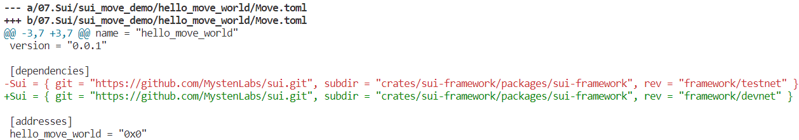
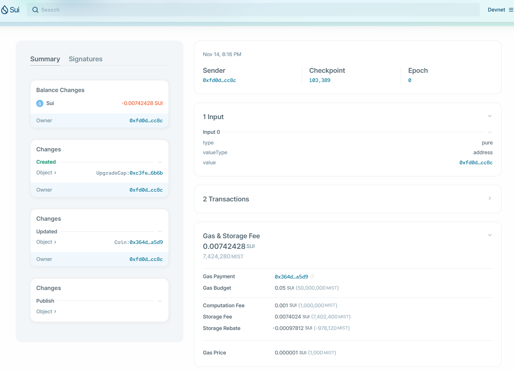
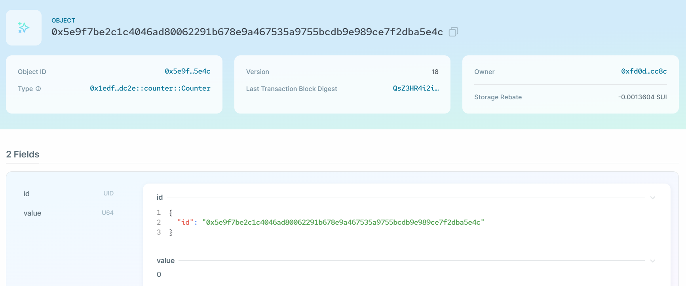
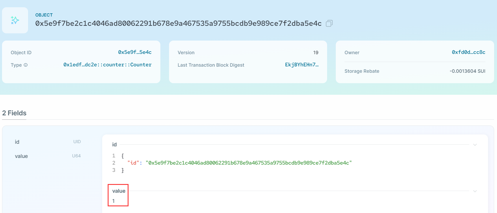

# 1.2 Sui合约开发入门

## HelloWorld

### 创建move工程

```bash
$ sui move new hello_move_world

$ tree hello_move_world/
hello_move_world/
├── Move.toml
└── sources
```

### 修改Move.toml

因为是在`devent`上测试，将默认的`testnet`改为`devnet`：



### 开发合约代码

```rust
module hello_move_world::counter {
    // Part 1: imports
    use sui::transfer;
    use sui::object::{Self, UID};
    use sui::tx_context::{Self, TxContext};

    // Part 2: struct definition
    struct Counter has key {
        id: UID,
        value: u64,
    }

    // Part 3: transfer the counter object to the sender
    entry public fun getCounter(ctx: &mut TxContext) {
        // sender address
        let sender = tx_context::sender(ctx);
        let counter_obj = Counter {
            id: object::new(ctx),
            value: 0
        };
        transfer::transfer(counter_obj, sender);
    }

    // part 4: public/ entry functions
    public entry fun incr(counter: &mut Counter) {
        counter.value = counter.value + 1;
    } 
}
```

### 编译合约

```bash
$ sui move build
UPDATING GIT DEPENDENCY https://github.com/MystenLabs/sui.git
INCLUDING DEPENDENCY Sui
INCLUDING DEPENDENCY MoveStdlib
BUILDING hello_move_world
```

### 合约部署

```bash
$ sui client publish --gas-budget 50000000

UPDATING GIT DEPENDENCY https://github.com/MystenLabs/sui.git
INCLUDING DEPENDENCY Sui
INCLUDING DEPENDENCY MoveStdlib
BUILDING hello_move_world
Successfully verified dependencies on-chain against source.
----- Transaction Digest ----
4YHqFqr8sqW5BbEyEkdhyAUgkFF4c4CYF43rjr6qsyuv
----- Transaction Data ----
Transaction Signature: [Signature(Ed25519SuiSignature(Ed25519SuiSignature([0, 87, 130, 161, 109, 173, 245, 123, 35, 136, 111, 215, 33, 147, 51, 145, 70, 30, 131, 133, 207, 244, 184, 68, 227, 245, 34, 91, 164, 165, 107, 114, 169, 58, 171, 87, 48, 211, 163, 10, 227, 160, 0, 109, 134, 134, 37, 225, 108, 211, 82, 225, 162, 231, 204, 19, 134, 99, 76, 58, 177, 227, 34, 210, 15, 243, 42, 253, 154, 139, 124, 173, 83, 124, 187, 97, 115, 222, 249, 44, 173, 21, 243, 38, 123, 57, 137, 27, 104, 192, 132, 80, 58, 164, 214, 197, 131])))]
Transaction Kind : Programmable
Inputs: [Pure(SuiPureValue { value_type: Some(Address), value: "0xfd0d0d1367c584c1299a51cd7371b9ef86881a3fb7eeb7f80f6c53d7ec12cc8c" })]
Commands: [
  Publish(<modules>,0x0000000000000000000000000000000000000000000000000000000000000001,0x0000000000000000000000000000000000000000000000000000000000000002),
  TransferObjects([Result(0)],Input(0)),
]

Sender: 0xfd0d0d1367c584c1299a51cd7371b9ef86881a3fb7eeb7f80f6c53d7ec12cc8c
Gas Payment: Object ID: 0x364d3c0acd282d9bf2c4390023d77c00a5a8244d81c15a9892ef6c0906baa5d9, version: 0xe, digest: CJWZz6bgi5jekKY2AqhcYWtAcHrqb9335TqbhK8kYSK1 
Gas Owner: 0xfd0d0d1367c584c1299a51cd7371b9ef86881a3fb7eeb7f80f6c53d7ec12cc8c
Gas Price: 1000
Gas Budget: 50000000

----- Transaction Effects ----
Status : Success
Created Objects:
  - ID: 0x1edf71c1acd4afb5a017c450918870be4cdf23e94bc9884f25f08c3a561adc2e , Owner: Immutable
  - ID: 0xc3fe5ddcc7a7e81e30211c486ab77b3e09c22a8a51963c12215c0e14c2f36b6b , Owner: Account Address ( 0xfd0d0d1367c584c1299a51cd7371b9ef86881a3fb7eeb7f80f6c53d7ec12cc8c )
Mutated Objects:
  - ID: 0x364d3c0acd282d9bf2c4390023d77c00a5a8244d81c15a9892ef6c0906baa5d9 , Owner: Account Address ( 0xfd0d0d1367c584c1299a51cd7371b9ef86881a3fb7eeb7f80f6c53d7ec12cc8c )

----- Events ----
Array []
----- Object changes ----
Array [
    Object {
        "type": String("mutated"),
        "sender": String("0xfd0d0d1367c584c1299a51cd7371b9ef86881a3fb7eeb7f80f6c53d7ec12cc8c"),
        "owner": Object {
            "AddressOwner": String("0xfd0d0d1367c584c1299a51cd7371b9ef86881a3fb7eeb7f80f6c53d7ec12cc8c"),
        },
        "objectType": String("0x2::coin::Coin<0x2::sui::SUI>"),
        "objectId": String("0x364d3c0acd282d9bf2c4390023d77c00a5a8244d81c15a9892ef6c0906baa5d9"),
        "version": String("15"),
        "previousVersion": String("14"),
        "digest": String("8HN66D9dtDr37FYQa7h4nnWyrWc2aKkCh5nVf2fK6HCz"),
    },
    Object {
        "type": String("published"),
        "packageId": String("0x1edf71c1acd4afb5a017c450918870be4cdf23e94bc9884f25f08c3a561adc2e"),
        "version": String("1"),
        "digest": String("D3AZmC7KN5eAiesw5V4RZt9JdpWML5e7fXTJFHahhUio"),
        "modules": Array [
            String("counter"),
        ],
    },
    Object {
        "type": String("created"),
        "sender": String("0xfd0d0d1367c584c1299a51cd7371b9ef86881a3fb7eeb7f80f6c53d7ec12cc8c"),
        "owner": Object {
            "AddressOwner": String("0xfd0d0d1367c584c1299a51cd7371b9ef86881a3fb7eeb7f80f6c53d7ec12cc8c"),
        },
        "objectType": String("0x2::package::UpgradeCap"),
        "objectId": String("0xc3fe5ddcc7a7e81e30211c486ab77b3e09c22a8a51963c12215c0e14c2f36b6b"),
        "version": String("15"),
        "digest": String("2augoQaYcLFCWd9c17qJouD6zZVx1mVFM7gqvgXdGoLr"),
    },
]
----- Balance changes ----
Array [
    Object {
        "owner": Object {
            "AddressOwner": String("0xfd0d0d1367c584c1299a51cd7371b9ef86881a3fb7eeb7f80f6c53d7ec12cc8c"),
        },
        "coinType": String("0x2::sui::SUI"),
        "amount": String("-7424280"),
    },
]
```

### 浏览器查看

https://suiexplorer.com/txblock/4YHqFqr8sqW5BbEyEkdhyAUgkFF4c4CYF43rjr6qsyuv?network=devnet



### 合约接口调用

#### （1）查询计数器值

```bash
$ sui client call \
    --function getCounter \
    --module counter \
    --package 0x1edf71c1acd4afb5a017c450918870be4cdf23e94bc9884f25f08c3a561adc2e \
    --gas-budget 10000000

----- Transaction Digest ----
QsZ3HR4i2iNTx8jjcnHEanW1pkWUxkuvYfkBm39SkCh
----- Transaction Data ----
Transaction Signature: [Signature(Ed25519SuiSignature(Ed25519SuiSignature([0, 21, 53, 128, 245, 105, 92, 172, 115, 253, 135, 198, 212, 144, 135, 210, 46, 66, 225, 24, 134, 179, 97, 187, 93, 30, 5, 142, 42, 6, 163, 72, 237, 26, 234, 143, 231, 195, 12, 232, 239, 125, 152, 9, 159, 7, 123, 144, 121, 117, 197, 4, 33, 69, 102, 228, 186, 84, 6, 120, 45, 251, 132, 153, 8, 243, 42, 253, 154, 139, 124, 173, 83, 124, 187, 97, 115, 222, 249, 44, 173, 21, 243, 38, 123, 57, 137, 27, 104, 192, 132, 80, 58, 164, 214, 197, 131])))]
Transaction Kind : Programmable
Inputs: []
Commands: [
  MoveCall(0x1edf71c1acd4afb5a017c450918870be4cdf23e94bc9884f25f08c3a561adc2e::counter::getCounter()),
]

Sender: 0xfd0d0d1367c584c1299a51cd7371b9ef86881a3fb7eeb7f80f6c53d7ec12cc8c
Gas Payment: Object ID: 0x364d3c0acd282d9bf2c4390023d77c00a5a8244d81c15a9892ef6c0906baa5d9, version: 0x11, digest: 29wVx3VCJazc7uSgYAEXuLw8p6JqnaeNb5AFTxtN2kQ8 
Gas Owner: 0xfd0d0d1367c584c1299a51cd7371b9ef86881a3fb7eeb7f80f6c53d7ec12cc8c
Gas Price: 1000
Gas Budget: 10000000

----- Transaction Effects ----
Status : Success
Created Objects:
  - ID: 0x5e9f7be2c1c4046ad80062291b678e9a467535a9755bcdb9e989ce7f2dba5e4c , Owner: Account Address ( 0xfd0d0d1367c584c1299a51cd7371b9ef86881a3fb7eeb7f80f6c53d7ec12cc8c )
Mutated Objects:
  - ID: 0x364d3c0acd282d9bf2c4390023d77c00a5a8244d81c15a9892ef6c0906baa5d9 , Owner: Account Address ( 0xfd0d0d1367c584c1299a51cd7371b9ef86881a3fb7eeb7f80f6c53d7ec12cc8c )

----- Events ----
Array []
----- Object changes ----
Array [
    Object {
        "type": String("mutated"),
        "sender": String("0xfd0d0d1367c584c1299a51cd7371b9ef86881a3fb7eeb7f80f6c53d7ec12cc8c"),
        "owner": Object {
            "AddressOwner": String("0xfd0d0d1367c584c1299a51cd7371b9ef86881a3fb7eeb7f80f6c53d7ec12cc8c"),
        },
        "objectType": String("0x2::coin::Coin<0x2::sui::SUI>"),
        "objectId": String("0x364d3c0acd282d9bf2c4390023d77c00a5a8244d81c15a9892ef6c0906baa5d9"),
        "version": String("18"),
        "previousVersion": String("17"),
        "digest": String("9UQEd31V9uBGurZciP5jWhwLd7yTkEeqGSuSetwscJrC"),
    },
    Object {
        "type": String("created"),
        "sender": String("0xfd0d0d1367c584c1299a51cd7371b9ef86881a3fb7eeb7f80f6c53d7ec12cc8c"),
        "owner": Object {
            "AddressOwner": String("0xfd0d0d1367c584c1299a51cd7371b9ef86881a3fb7eeb7f80f6c53d7ec12cc8c"),
        },
        "objectType": String("0x1edf71c1acd4afb5a017c450918870be4cdf23e94bc9884f25f08c3a561adc2e::counter::Counter"),
        "objectId": String("0x5e9f7be2c1c4046ad80062291b678e9a467535a9755bcdb9e989ce7f2dba5e4c"),
        "version": String("18"),
        "digest": String("EmgXX2BS9954qyhGncLxvP4HtQajgJGGqSCdZksUpmi2"),
    },
]
----- Balance changes ----
Array [
    Object {
        "owner": Object {
            "AddressOwner": String("0xfd0d0d1367c584c1299a51cd7371b9ef86881a3fb7eeb7f80f6c53d7ec12cc8c"),
        },
        "coinType": String("0x2::sui::SUI"),
        "amount": String("-2370280"),
    },
]
```

交易结果中返回了一个新创建的对象`ID`（`0x5e9f7be2c1c4046ad80062291b678e9a467535a9755bcdb9e989ce7f2dba5e4c`），这就是我们获得的`Counter`对象，在浏览器上课通过该对象`ID`看到`counter`的`value`字段的具体值：

https://suiexplorer.com/object/0x5e9f7be2c1c4046ad80062291b678e9a467535a9755bcdb9e989ce7f2dba5e4c?network=devnet




#### （2）增加计数器值

```bash
$ sui client call \
    --function incr \
    --module counter \
    --package 0x1edf71c1acd4afb5a017c450918870be4cdf23e94bc9884f25f08c3a561adc2e \
    --args 0x5e9f7be2c1c4046ad80062291b678e9a467535a9755bcdb9e989ce7f2dba5e4c \
    --gas-budget 10000000
    
----- Transaction Digest ----
EkjBYhEHn7HpHdpmnkvrJUFz8QogD1Kp5tdTvQmxyLwT
----- Transaction Data ----
Transaction Signature: [Signature(Ed25519SuiSignature(Ed25519SuiSignature([0, 67, 232, 248, 22, 118, 98, 190, 39, 177, 78, 214, 2, 44, 55, 128, 226, 46, 75, 151, 120, 185, 80, 155, 106, 141, 121, 107, 226, 78, 57, 0, 146, 209, 157, 97, 135, 183, 208, 212, 144, 61, 45, 13, 205, 31, 168, 199, 182, 111, 174, 254, 108, 91, 0, 53, 131, 96, 27, 246, 171, 155, 93, 237, 5, 243, 42, 253, 154, 139, 124, 173, 83, 124, 187, 97, 115, 222, 249, 44, 173, 21, 243, 38, 123, 57, 137, 27, 104, 192, 132, 80, 58, 164, 214, 197, 131])))]
Transaction Kind : Programmable
Inputs: [Object(ImmOrOwnedObject { object_id: 0x5e9f7be2c1c4046ad80062291b678e9a467535a9755bcdb9e989ce7f2dba5e4c, version: SequenceNumber(18), digest: o#EmgXX2BS9954qyhGncLxvP4HtQajgJGGqSCdZksUpmi2 })]
Commands: [
  MoveCall(0x1edf71c1acd4afb5a017c450918870be4cdf23e94bc9884f25f08c3a561adc2e::counter::incr(Input(0))),
]

Sender: 0xfd0d0d1367c584c1299a51cd7371b9ef86881a3fb7eeb7f80f6c53d7ec12cc8c
Gas Payment: Object ID: 0x364d3c0acd282d9bf2c4390023d77c00a5a8244d81c15a9892ef6c0906baa5d9, version: 0x12, digest: 9UQEd31V9uBGurZciP5jWhwLd7yTkEeqGSuSetwscJrC 
Gas Owner: 0xfd0d0d1367c584c1299a51cd7371b9ef86881a3fb7eeb7f80f6c53d7ec12cc8c
Gas Price: 1000
Gas Budget: 10000000

----- Transaction Effects ----
Status : Success
Mutated Objects:
  - ID: 0x364d3c0acd282d9bf2c4390023d77c00a5a8244d81c15a9892ef6c0906baa5d9 , Owner: Account Address ( 0xfd0d0d1367c584c1299a51cd7371b9ef86881a3fb7eeb7f80f6c53d7ec12cc8c )
  - ID: 0x5e9f7be2c1c4046ad80062291b678e9a467535a9755bcdb9e989ce7f2dba5e4c , Owner: Account Address ( 0xfd0d0d1367c584c1299a51cd7371b9ef86881a3fb7eeb7f80f6c53d7ec12cc8c )

----- Events ----
Array []
----- Object changes ----
Array [
    Object {
        "type": String("mutated"),
        "sender": String("0xfd0d0d1367c584c1299a51cd7371b9ef86881a3fb7eeb7f80f6c53d7ec12cc8c"),
        "owner": Object {
            "AddressOwner": String("0xfd0d0d1367c584c1299a51cd7371b9ef86881a3fb7eeb7f80f6c53d7ec12cc8c"),
        },
        "objectType": String("0x2::coin::Coin<0x2::sui::SUI>"),
        "objectId": String("0x364d3c0acd282d9bf2c4390023d77c00a5a8244d81c15a9892ef6c0906baa5d9"),
        "version": String("19"),
        "previousVersion": String("18"),
        "digest": String("3t6dF5TFSnPfUg23v1pKzcSX4f8zewwca9XZnPq8JfN7"),
    },
    Object {
        "type": String("mutated"),
        "sender": String("0xfd0d0d1367c584c1299a51cd7371b9ef86881a3fb7eeb7f80f6c53d7ec12cc8c"),
        "owner": Object {
            "AddressOwner": String("0xfd0d0d1367c584c1299a51cd7371b9ef86881a3fb7eeb7f80f6c53d7ec12cc8c"),
        },
        "objectType": String("0x1edf71c1acd4afb5a017c450918870be4cdf23e94bc9884f25f08c3a561adc2e::counter::Counter"),
        "objectId": String("0x5e9f7be2c1c4046ad80062291b678e9a467535a9755bcdb9e989ce7f2dba5e4c"),
        "version": String("19"),
        "previousVersion": String("18"),
        "digest": String("2mMXwQNhWhjz4hMgs8sD9kPSRvba49fqoENqD3k3ECPF"),
    },
]
----- Balance changes ----
Array [
    Object {
        "owner": Object {
            "AddressOwner": String("0xfd0d0d1367c584c1299a51cd7371b9ef86881a3fb7eeb7f80f6c53d7ec12cc8c"),
        },
        "coinType": String("0x2::sui::SUI"),
        "amount": String("-1023484"),
    },
]
```

再次查看浏览器，可以看到`value`已经自增：


