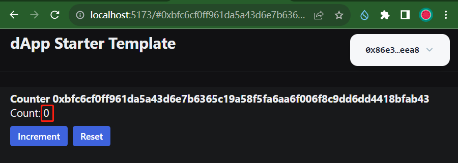

# 1.3_Sui dApp Kit Hello World交互
## 环境安装
### （1）升级node

```
$ nvm use v20
Now using node v20.9.0 (npm v10.1.0)
```

### （2）安装pnpm

```bash
$ npm install -g pnpm
added 1 package in 334ms
```

## 工程创建

```bash
$ mkdir 02.hello_sui_dapp_kit && cd 02.hello_sui_dapp_kit

$ pnpm add @mysten/dapp-kit @mysten/sui.js @tanstack/react-query
Packages: +101
+++++++++++++++++++++++++++++++++++++++++++++++++++++++++++++++++++++++++++++++++++++++++++++++++++++
Progress: resolved 101, reused 0, downloaded 101, added 101, done

dependencies:
+ @mysten/dapp-kit 0.9.0
+ @mysten/sui.js 0.46.1
+ @tanstack/react-query 5.8.4

Done in 11.7s

$ pnpm create @mysten/create-dapp
.../share/pnpm/store/v3/tmp/dlx-3959943  | +108 +++++++++++
.../share/pnpm/store/v3/tmp/dlx-3959943  | Progress: resolved 108, reused 101, downloaded 7, added 108, done
✔ Which starter template would you like to use? · react-e2e-counter
✔ What is the name of your dApp? (this will be used as the directory name) · my-first-sui-dapp
```


- **生成的框架和示例代码**


## 部署Move合约

### （1）创建并切换到devnet

```bash
$ sui client new-env --alias devnet --rpc https://fullnode.devnet.sui.io:443
Added new Sui env [devnet] to config.

$ sui client switch --env devnet
Active environment switched to [devnet]

$ sui client envs
╭─────────┬───────────────────────────────────────┬────────╮
│ alias   │ url                                   │ active │
├─────────┼───────────────────────────────────────┼────────┤
│ devnet  │ https://fullnode.devnet.sui.io:443    │ *      │
│ testnet │ https://fullnode.testnet.sui.io:443   │        │
│ mainnet │ https://sui-mainnet.nodeinfra.com:443 │        │
╰─────────┴───────────────────────────────────────┴────────╯
```

### （2）新建sui钱包地址

```bash
$ sui client new-address ed25519
╭──────────────────────────────────────────────────────────────────────────────────────────────────────╮
│ Created new keypair and saved it to keystore.                                                        │
├────────────────┬─────────────────────────────────────────────────────────────────────────────────────┤
│ address        │ 0x86e3621005f4d8f4cd85b06416d6c22c81e43acd6948cc7dbc3058fdd9bfeea8                  │
│ keyScheme      │ ed25519                                                                             │
│ recoveryPhrase │ lawsuit ability increase service twist year heavy pattern source vibrant sort phone │
╰────────────────┴─────────────────────────────────────────────────────────────────────────────────────╯

$ sui client new-address secp256k1
╭─────────────────────────────────────────────────────────────────────────────────────────────────╮
│ Created new keypair and saved it to keystore.                                                   │
├────────────────┬────────────────────────────────────────────────────────────────────────────────┤
│ address        │ 0xfc0e78ed2d6b107dfde6beccde562a6ea8a24375d15a0e874020cadaca42d9c8             │
│ keyScheme      │ secp256k1                                                                      │
│ recoveryPhrase │ reward shock defense render parent exercise cost subject entire pizza ask left │
╰────────────────┴────────────────────────────────────────────────────────────────────────────────╯
```

### （3）切换活动钱包地址

```bash
$ sui client switch --address 0x86e3621005f4d8f4cd85b06416d6c22c81e43acd6948cc7dbc3058fdd9bfeea8
Active address switched to 0x86e3621005f4d8f4cd85b06416d6c22c81e43acd6948cc7dbc3058fdd9bfeea8

$ sui client active-address
0x86e3621005f4d8f4cd85b06416d6c22c81e43acd6948cc7dbc3058fdd9bfeea8
```

### （4）领水

```bash
$ curl --location --request POST 'https://faucet.devnet.sui.io/gas' \
--header 'Content-Type: application/json' \
--data-raw '{
    "FixedAmountRequest": {
        "recipient": "0x86e3621005f4d8f4cd85b06416d6c22c81e43acd6948cc7dbc3058fdd9bfeea8"
    }
}'

{"transferredGasObjects":[{"amount":10000000000,"id":"0x510505dcc20baa02649911ecace51682e8f7c64263744aafef2c54c0ec3f104a","transferTxDigest":"8NAc46MRutUJB8iPgjDnheEDwNVsJuk1VM4w3hiUdaWf"}],"error":null}
```

### （5）查看余额

> 执行3次后，查看到的余额情况，执行第4次，报错：`error code: 1015`

```bash
$ sui client gas
╭────────────────────────────────────────────────────────────────────┬─────────────╮
│ gasCoinId                                                          │ gasBalance  │
├────────────────────────────────────────────────────────────────────┼─────────────┤
│ 0x424d6912ec3fa09572730e51c8f0d0d2fef37bd55a4a2f154e2993b7f6e993e2 │ 10000000000 │
│ 0x510505dcc20baa02649911ecace51682e8f7c64263744aafef2c54c0ec3f104a │ 10000000000 │
│ 0x55150110500d0e840108d7ab0deec89558276cd451a49cbb97d9e00b1c3e8344 │ 10000000000 │
╰────────────────────────────────────────────────────────────────────┴─────────────╯
```

### （6）部署Sui合约

```bash
$ cd move
$ sui client publish --gas-budget 100000000 counter
```

输出部署日志：
> ```json
> UPDATING GIT DEPENDENCY https://github.com/MystenLabs/sui.git
> INCLUDING DEPENDENCY Sui
> INCLUDING DEPENDENCY MoveStdlib
> BUILDING counter
> Successfully verified dependencies on-chain against source.
> ----- Transaction Digest ----
> BEdK7FiHfAKSzLs4G83UaQ1ypiZHQW87z4Mr2RVpDpBd
> ----- Transaction Data ----
> Transaction Signature: [Signature(Ed25519SuiSignature(Ed25519SuiSignature([0, 143, 225, 38, 104, 97, 232, 238, 185, 90, 234, 236, 153, 254, 161, 202, 119, 243, 0, 119, 33, 173, 123, 120, 60, 121, 15, 56, 60, 74, 201, 233, 18, 140, 1, 243, 232, 2, 48, 125, 206, 2, 163, 2, 197, 60, 160, 56, 190, 74, 9, 36, 113, 205, 147, 216, 123, 113, 249, 26, 139, 207, 78, 130, 1, 10, 114, 213, 219, 204, 52, 207, 244, 13, 153, 120, 74, 160, 105, 143, 215, 148, 31, 191, 38, 109, 189, 36, 37, 133, 219, 150, 189, 73, 195, 80, 167])))]
> Transaction Kind : Programmable
> Inputs: [Pure(SuiPureValue { value_type: Some(Address), value: "0x86e3621005f4d8f4cd85b06416d6c22c81e43acd6948cc7dbc3058fdd9bfeea8" })]
> Commands: [
>   Publish(<modules>,0x0000000000000000000000000000000000000000000000000000000000000001,0x0000000000000000000000000000000000000000000000000000000000000002),
>   TransferObjects([Result(0)],Input(0)),
> ]
> 
> Sender: 0x86e3621005f4d8f4cd85b06416d6c22c81e43acd6948cc7dbc3058fdd9bfeea8
> Gas Payment: Object ID: 0x424d6912ec3fa09572730e51c8f0d0d2fef37bd55a4a2f154e2993b7f6e993e2, version: 0x27, digest: Q67Gz1ZAe1yAAis8qhXZXU8yppVTuKtrgkK6Uroiey9 
> Gas Owner: 0x86e3621005f4d8f4cd85b06416d6c22c81e43acd6948cc7dbc3058fdd9bfeea8
> Gas Price: 1000
> Gas Budget: 100000000
> 
> ----- Transaction Effects ----
> Status : Success
> Created Objects:
>   - ID: 0x141222eeb17747941db7e1383009713dbebed95e6439a6015200bf9ff6760914 , Owner: Immutable
>   - ID: 0x8fe564b04b369b8f9bfa5453a9388f8bc4fd29ac7fee1d2aba3a58d7a3ca8ed6 , Owner: Account Address ( 0x86e3621005f4d8f4cd85b06416d6c22c81e43acd6948cc7dbc3058fdd9bfeea8 )
> Mutated Objects:
>   - ID: 0x424d6912ec3fa09572730e51c8f0d0d2fef37bd55a4a2f154e2993b7f6e993e2 , Owner: Account Address ( 0x86e3621005f4d8f4cd85b06416d6c22c81e43acd6948cc7dbc3058fdd9bfeea8 )
> 
> ----- Events ----
> Array []
> ----- Object changes ----
> Array [
>     Object {
>         "type": String("mutated"),
>         "sender": String("0x86e3621005f4d8f4cd85b06416d6c22c81e43acd6948cc7dbc3058fdd9bfeea8"),
>         "owner": Object {
>             "AddressOwner": String("0x86e3621005f4d8f4cd85b06416d6c22c81e43acd6948cc7dbc3058fdd9bfeea8"),
>         },
>         "objectType": String("0x2::coin::Coin<0x2::sui::SUI>"),
>         "objectId": String("0x424d6912ec3fa09572730e51c8f0d0d2fef37bd55a4a2f154e2993b7f6e993e2"),
>         "version": String("40"),
>         "previousVersion": String("39"),
>         "digest": String("29mp9NCFXhjpSCCXzMm6XmAVvxMUbBbiHY8zAMDPyjD2"),
>     },
>     Object {
>         "type": String("published"),
>         "packageId": String("0x141222eeb17747941db7e1383009713dbebed95e6439a6015200bf9ff6760914"),
>         "version": String("1"),
>         "digest": String("EHtEKgCuSzFtHx9aYUjg8CXWz2dXzDMso41v7YBK1mfR"),
>         "modules": Array [
>             String("counter"),
>         ],
>     },
>     Object {
>         "type": String("created"),
>         "sender": String("0x86e3621005f4d8f4cd85b06416d6c22c81e43acd6948cc7dbc3058fdd9bfeea8"),
>         "owner": Object {
>             "AddressOwner": String("0x86e3621005f4d8f4cd85b06416d6c22c81e43acd6948cc7dbc3058fdd9bfeea8"),
>         },
>         "objectType": String("0x2::package::UpgradeCap"),
>         "objectId": String("0x8fe564b04b369b8f9bfa5453a9388f8bc4fd29ac7fee1d2aba3a58d7a3ca8ed6"),
>         "version": String("40"),
>         "digest": String("8HR8D9hTmPiP9HgcbePBs3yR9RGbtufB9RucFi6S7mmk"),
>     },
> ]
> ----- Balance changes ----
> Array [
>     Object {
>         "owner": Object {
>             "AddressOwner": String("0x86e3621005f4d8f4cd85b06416d6c22c81e43acd6948cc7dbc3058fdd9bfeea8"),
>         },
>         "coinType": String("0x2::sui::SUI"),
>         "amount": String("-8769480"),
>     },
> ]
> ```

## 部署前端

### （1）更新前端代码

更新`src/constants.ts`中的`DEVNET_COUNTER_PACKAGE_ID`为上一步部署所创建的：

```json
"packageId": String("0x141222eeb17747941db7e1383009713dbebed95e6439a6015200bf9ff6760914"),
```

修改为：

```tsx
export const DEVNET_COUNTER_PACKAGE_ID = "0x141222eeb17747941db7e1383009713dbebed95e6439a6015200bf9ff6760914";
export const MAINNET_COUNTER_PACKAGE_ID = "0xTODO";
```

### （2）依赖安装

```bash
$ pnpm install
```

### （3）启动前端

```bash
$ pnpm dev
```

## 前端交互

### （1）创建计数器

https://suiexplorer.com/txblock/BLamC1XMHppm8MJsh2iDxK8DeBzqBLpJVih3xLpqrzDA?network=devnet


### （2）自增计数器

https://suiexplorer.com/txblock/26PoKA58NWuJbCxWoJyA2DaRAs6nYVp7k1qcKgC9ZKGB?network=devnet


### （3）复位计数器

https://suiexplorer.com/txblock/HvvZVRTvi2iWqZ5oXWY7XhEx6gtSKUu8b54gU1UbyHHd?network=devnet




