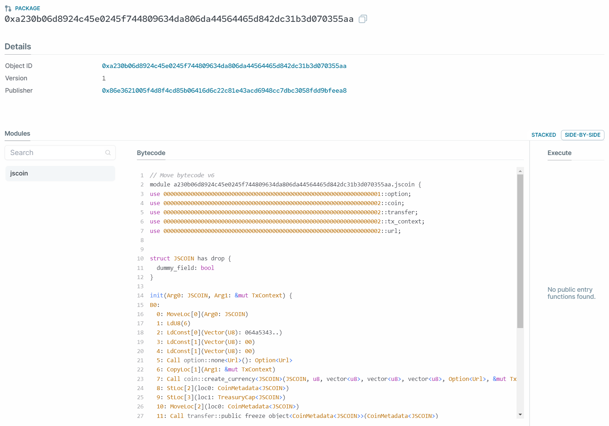
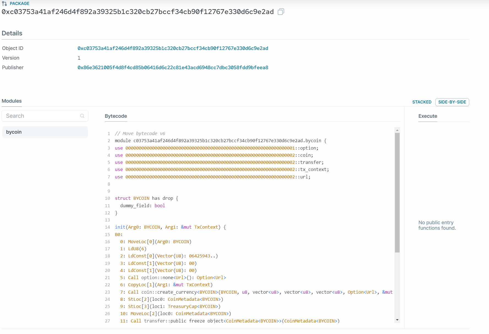

# 1.4 创建并发布Move ERC20合约

## 创建jscoin

```bash
$ sui move new jscoin
```

## 添加jscoin代码

```rust
module jscoin::jscoin {
    use std::option;
    use sui::coin;
    use sui::transfer;
    use sui::tx_context::{Self, TxContext};

    /// 这个结构体代表代币类型，每种代币都需要一个类型：`Coin<package_object::jscoin::JSCOIN>`
    /// 确保结构体名与模块名匹配
    /// The type identifier of coin. The coin will have a type
    /// tag of kind: `Coin<package_object::jscoin::JSCOIN>`
    /// Make sure that the name of the type matches the module's name.
    struct JSCOIN has drop {}

    /// 模块初始化函数在模块发布时被调用。
    /// `TreasuryCap`会被发送给模块的发布者，因此发布者可以控制代币铸造和销毁。
    /// Module initializer is called once on module publish. A treasury
    /// cap is sent to the publisher, who then controls minting and burning
    fun init(witness: JSCOIN, ctx: &mut TxContext) {
        let (treasury, metadata) = coin::create_currency(witness, 6, b"JSCOIN", b"", b"", option::none(), ctx);
        transfer::public_freeze_object(metadata);
        transfer::public_transfer(treasury, tx_context::sender(ctx))
    }
}

```

## 编译合约

```bash
$ sui move build
UPDATING GIT DEPENDENCY https://github.com/MystenLabs/sui.git
INCLUDING DEPENDENCY Sui
INCLUDING DEPENDENCY MoveStdlib
BUILDING jscoin
```

## 部署合约

```bash
$ sui client publish --gas-budget 100000000 jscoin

UPDATING GIT DEPENDENCY https://github.com/MystenLabs/sui.git
INCLUDING DEPENDENCY Sui
INCLUDING DEPENDENCY MoveStdlib
BUILDING jscoin
Successfully verified dependencies on-chain against source.
----- Transaction Digest ----
B6TyUWfemRWPBHTM4VxmYzY3Ra98kggBWruiW48j3vFo
----- Transaction Data ----
Transaction Signature: [Signature(Ed25519SuiSignature(Ed25519SuiSignature([0, 201, 219, 210, 17, 188, 43, 235, 125, 88, 105, 250, 154, 176, 92, 130, 182, 215, 5, 86, 145, 149, 180, 108, 84, 106, 242, 184, 37, 7, 2, 57, 199, 191, 2, 78, 113, 2, 47, 57, 70, 82, 128, 166, 238, 110, 70, 252, 63, 231, 135, 196, 134, 165, 176, 199, 67, 39, 155, 17, 16, 237, 49, 40, 5, 10, 114, 213, 219, 204, 52, 207, 244, 13, 153, 120, 74, 160, 105, 143, 215, 148, 31, 191, 38, 109, 189, 36, 37, 133, 219, 150, 189, 73, 195, 80, 167])))]
Transaction Kind : Programmable
Inputs: [Pure(SuiPureValue { value_type: Some(Address), value: "0x86e3621005f4d8f4cd85b06416d6c22c81e43acd6948cc7dbc3058fdd9bfeea8" })]
Commands: [
  Publish(<modules>,0x0000000000000000000000000000000000000000000000000000000000000001,0x0000000000000000000000000000000000000000000000000000000000000002),
  TransferObjects([Result(0)],Input(0)),
]

Sender: 0x86e3621005f4d8f4cd85b06416d6c22c81e43acd6948cc7dbc3058fdd9bfeea8
Gas Payment: Object ID: 0x424d6912ec3fa09572730e51c8f0d0d2fef37bd55a4a2f154e2993b7f6e993e2, version: 0x2b, digest: 6m42aEuYfrtB39iGX69S3BBbu7MuRyGK2MKGFJpL7TZj 
Gas Owner: 0x86e3621005f4d8f4cd85b06416d6c22c81e43acd6948cc7dbc3058fdd9bfeea8
Gas Price: 1000
Gas Budget: 100000000

----- Transaction Effects ----
Status : Success
Created Objects:
  - ID: 0x1044a41bec9d13ad606df9ec40be33a4e83de897fea7dfcf9a2713393f2cae0e , Owner: Account Address ( 0x86e3621005f4d8f4cd85b06416d6c22c81e43acd6948cc7dbc3058fdd9bfeea8 )
  - ID: 0x37cfdf5647903bbcbcc18b71f132c7e0d9351fa68caa02aabe483da4600aaac0 , Owner: Immutable
  - ID: 0xa230b06d8924c45e0245f744809634da806da44564465d842dc31b3d070355aa , Owner: Immutable
  - ID: 0xac55337dc220ba6c1b9d5aba579b67ebe79f8078dac1e64b2b00fc6983b304c2 , Owner: Account Address ( 0x86e3621005f4d8f4cd85b06416d6c22c81e43acd6948cc7dbc3058fdd9bfeea8 )
Mutated Objects:
  - ID: 0x424d6912ec3fa09572730e51c8f0d0d2fef37bd55a4a2f154e2993b7f6e993e2 , Owner: Account Address ( 0x86e3621005f4d8f4cd85b06416d6c22c81e43acd6948cc7dbc3058fdd9bfeea8 )

----- Events ----
Array []
----- Object changes ----
Array [
    Object {
        "type": String("mutated"),
        "sender": String("0x86e3621005f4d8f4cd85b06416d6c22c81e43acd6948cc7dbc3058fdd9bfeea8"),
        "owner": Object {
            "AddressOwner": String("0x86e3621005f4d8f4cd85b06416d6c22c81e43acd6948cc7dbc3058fdd9bfeea8"),
        },
        "objectType": String("0x2::coin::Coin<0x2::sui::SUI>"),
        "objectId": String("0x424d6912ec3fa09572730e51c8f0d0d2fef37bd55a4a2f154e2993b7f6e993e2"),
        "version": String("44"),
        "previousVersion": String("43"),
        "digest": String("FEsZcDP2wdzj3iiRcDFRjKhse6TYTYcfV76VTs8xuXye"),
    },
    Object {
        "type": String("created"),
        "sender": String("0x86e3621005f4d8f4cd85b06416d6c22c81e43acd6948cc7dbc3058fdd9bfeea8"),
        "owner": Object {
            "AddressOwner": String("0x86e3621005f4d8f4cd85b06416d6c22c81e43acd6948cc7dbc3058fdd9bfeea8"),
        },
        "objectType": String("0x2::coin::TreasuryCap<0xa230b06d8924c45e0245f744809634da806da44564465d842dc31b3d070355aa::jscoin::JSCOIN>"),
        "objectId": String("0x1044a41bec9d13ad606df9ec40be33a4e83de897fea7dfcf9a2713393f2cae0e"),
        "version": String("44"),
        "digest": String("F8UhxHkRZdgFzYQLpB5C9vFrP9fWBqXExZ5LWf5Fa3WS"),
    },
    Object {
        "type": String("created"),
        "sender": String("0x86e3621005f4d8f4cd85b06416d6c22c81e43acd6948cc7dbc3058fdd9bfeea8"),
        "owner": String("Immutable"),
        "objectType": String("0x2::coin::CoinMetadata<0xa230b06d8924c45e0245f744809634da806da44564465d842dc31b3d070355aa::jscoin::JSCOIN>"),
        "objectId": String("0x37cfdf5647903bbcbcc18b71f132c7e0d9351fa68caa02aabe483da4600aaac0"),
        "version": String("44"),
        "digest": String("CcC7nVkQkioALvhW8cRyXT5DWyLWfQZCmk44wPy1Bvzv"),
    },
    Object {
        "type": String("published"),
        "packageId": String("0xa230b06d8924c45e0245f744809634da806da44564465d842dc31b3d070355aa"),
        "version": String("1"),
        "digest": String("339zx9J8duX9BKgZ4izU6uTBkGeG9bvkhf8VbFxbNH6o"),
        "modules": Array [
            String("jscoin"),
        ],
    },
    Object {
        "type": String("created"),
        "sender": String("0x86e3621005f4d8f4cd85b06416d6c22c81e43acd6948cc7dbc3058fdd9bfeea8"),
        "owner": Object {
            "AddressOwner": String("0x86e3621005f4d8f4cd85b06416d6c22c81e43acd6948cc7dbc3058fdd9bfeea8"),
        },
        "objectType": String("0x2::package::UpgradeCap"),
        "objectId": String("0xac55337dc220ba6c1b9d5aba579b67ebe79f8078dac1e64b2b00fc6983b304c2"),
        "version": String("44"),
        "digest": String("ExWBxony95cLkhxHSfSTjyiYG5k6kRMhQMVjgjvtzhLg"),
    },
]
----- Balance changes ----
Array [
    Object {
        "owner": Object {
            "AddressOwner": String("0x86e3621005f4d8f4cd85b06416d6c22c81e43acd6948cc7dbc3058fdd9bfeea8"),
        },
        "coinType": String("0x2::sui::SUI"),
        "amount": String("-12440280"),
    },
]
```

## 浏览器上查看合约

https://suiexplorer.com/object/0xa230b06d8924c45e0245f744809634da806da44564465d842dc31b3d070355aa?network=devnet



## 同样方式再创建bycoin

```bash
$ sui client publish --gas-budget 100000000 bycoin

UPDATING GIT DEPENDENCY https://github.com/MystenLabs/sui.git
INCLUDING DEPENDENCY Sui
INCLUDING DEPENDENCY MoveStdlib
BUILDING bycoin
Successfully verified dependencies on-chain against source.
----- Transaction Digest ----
HJmemUGQ5vM2SkXmPVJoHjCakvBwF9CmZFBf2oAs3Ei7
----- Transaction Data ----
Transaction Signature: [Signature(Ed25519SuiSignature(Ed25519SuiSignature([0, 250, 67, 62, 50, 169, 216, 9, 105, 117, 81, 17, 203, 100, 61, 113, 174, 196, 69, 108, 1, 205, 156, 103, 47, 142, 177, 214, 127, 179, 160, 46, 76, 9, 46, 65, 210, 241, 216, 64, 9, 255, 205, 135, 173, 74, 143, 143, 22, 36, 123, 42, 242, 70, 58, 188, 175, 56, 171, 49, 104, 246, 109, 111, 5, 10, 114, 213, 219, 204, 52, 207, 244, 13, 153, 120, 74, 160, 105, 143, 215, 148, 31, 191, 38, 109, 189, 36, 37, 133, 219, 150, 189, 73, 195, 80, 167])))]
Transaction Kind : Programmable
Inputs: [Pure(SuiPureValue { value_type: Some(Address), value: "0x86e3621005f4d8f4cd85b06416d6c22c81e43acd6948cc7dbc3058fdd9bfeea8" })]
Commands: [
  Publish(<modules>,0x0000000000000000000000000000000000000000000000000000000000000001,0x0000000000000000000000000000000000000000000000000000000000000002),
  TransferObjects([Result(0)],Input(0)),
]

Sender: 0x86e3621005f4d8f4cd85b06416d6c22c81e43acd6948cc7dbc3058fdd9bfeea8
Gas Payment: Object ID: 0x424d6912ec3fa09572730e51c8f0d0d2fef37bd55a4a2f154e2993b7f6e993e2, version: 0x2d, digest: 6VpEiFo9dfUMT1jHX55fELX7ia2goCGuBRQKRzDEhwQ3 
Gas Owner: 0x86e3621005f4d8f4cd85b06416d6c22c81e43acd6948cc7dbc3058fdd9bfeea8
Gas Price: 1000
Gas Budget: 100000000

----- Transaction Effects ----
Status : Success
Created Objects:
  - ID: 0x0c47dc0ba6c72dc9b3d48992bfc7b148d098bb321824637d9e9a14979c098c01 , Owner: Immutable
  - ID: 0x1c23482f3531440c28d436733c94468d2c7b14b5f446cded9919f14ffd97c1d7 , Owner: Account Address ( 0x86e3621005f4d8f4cd85b06416d6c22c81e43acd6948cc7dbc3058fdd9bfeea8 )
  - ID: 0xc03753a41af246d4f892a39325b1c320cb27bccf34cb90f12767e330d6c9e2ad , Owner: Immutable
  - ID: 0xf7ffb1cbf83f6b2aee7a1f6acf7a2101748be96b123475206b75c7edd12f520f , Owner: Account Address ( 0x86e3621005f4d8f4cd85b06416d6c22c81e43acd6948cc7dbc3058fdd9bfeea8 )
Mutated Objects:
  - ID: 0x424d6912ec3fa09572730e51c8f0d0d2fef37bd55a4a2f154e2993b7f6e993e2 , Owner: Account Address ( 0x86e3621005f4d8f4cd85b06416d6c22c81e43acd6948cc7dbc3058fdd9bfeea8 )

----- Events ----
Array []
----- Object changes ----
Array [
    Object {
        "type": String("mutated"),
        "sender": String("0x86e3621005f4d8f4cd85b06416d6c22c81e43acd6948cc7dbc3058fdd9bfeea8"),
        "owner": Object {
            "AddressOwner": String("0x86e3621005f4d8f4cd85b06416d6c22c81e43acd6948cc7dbc3058fdd9bfeea8"),
        },
        "objectType": String("0x2::coin::Coin<0x2::sui::SUI>"),
        "objectId": String("0x424d6912ec3fa09572730e51c8f0d0d2fef37bd55a4a2f154e2993b7f6e993e2"),
        "version": String("46"),
        "previousVersion": String("45"),
        "digest": String("78tM4CZKti7Bebu8ppZY6kU4EueLFR7auhPybCxHfZBp"),
    },
    Object {
        "type": String("created"),
        "sender": String("0x86e3621005f4d8f4cd85b06416d6c22c81e43acd6948cc7dbc3058fdd9bfeea8"),
        "owner": String("Immutable"),
        "objectType": String("0x2::coin::CoinMetadata<0xc03753a41af246d4f892a39325b1c320cb27bccf34cb90f12767e330d6c9e2ad::bycoin::BYCOIN>"),
        "objectId": String("0x0c47dc0ba6c72dc9b3d48992bfc7b148d098bb321824637d9e9a14979c098c01"),
        "version": String("46"),
        "digest": String("AK9Ei5YS4UEbGf1oi5LYRfQnQtGWK8Nab6j2ZUQk2Awg"),
    },
    Object {
        "type": String("created"),
        "sender": String("0x86e3621005f4d8f4cd85b06416d6c22c81e43acd6948cc7dbc3058fdd9bfeea8"),
        "owner": Object {
            "AddressOwner": String("0x86e3621005f4d8f4cd85b06416d6c22c81e43acd6948cc7dbc3058fdd9bfeea8"),
        },
        "objectType": String("0x2::package::UpgradeCap"),
        "objectId": String("0x1c23482f3531440c28d436733c94468d2c7b14b5f446cded9919f14ffd97c1d7"),
        "version": String("46"),
        "digest": String("Lm41N3NwQVq71ksACH7hwX8pybkSXfTU43ymwjmCGGS"),
    },
    Object {
        "type": String("published"),
        "packageId": String("0xc03753a41af246d4f892a39325b1c320cb27bccf34cb90f12767e330d6c9e2ad"),
        "version": String("1"),
        "digest": String("54JE41Xs3vLtjp9V4sp9mcakY8auMZC1FVKKmRtn76yZ"),
        "modules": Array [
            String("bycoin"),
        ],
    },
    Object {
        "type": String("created"),
        "sender": String("0x86e3621005f4d8f4cd85b06416d6c22c81e43acd6948cc7dbc3058fdd9bfeea8"),
        "owner": Object {
            "AddressOwner": String("0x86e3621005f4d8f4cd85b06416d6c22c81e43acd6948cc7dbc3058fdd9bfeea8"),
        },
        "objectType": String("0x2::coin::TreasuryCap<0xc03753a41af246d4f892a39325b1c320cb27bccf34cb90f12767e330d6c9e2ad::bycoin::BYCOIN>"),
        "objectId": String("0xf7ffb1cbf83f6b2aee7a1f6acf7a2101748be96b123475206b75c7edd12f520f"),
        "version": String("46"),
        "digest": String("2LmQTbmjN67eqdYiJpM4uVj2mp2HMd6YYYnZ9PBnbpnH"),
    },
]
----- Balance changes ----
Array [
    Object {
        "owner": Object {
            "AddressOwner": String("0x86e3621005f4d8f4cd85b06416d6c22c81e43acd6948cc7dbc3058fdd9bfeea8"),
        },
        "coinType": String("0x2::sui::SUI"),
        "amount": String("-12440280"),
    },
]
```

https://suiexplorer.com/object/0xc03753a41af246d4f892a39325b1c320cb27bccf34cb90f12767e330d6c9e2ad?network=devnet



