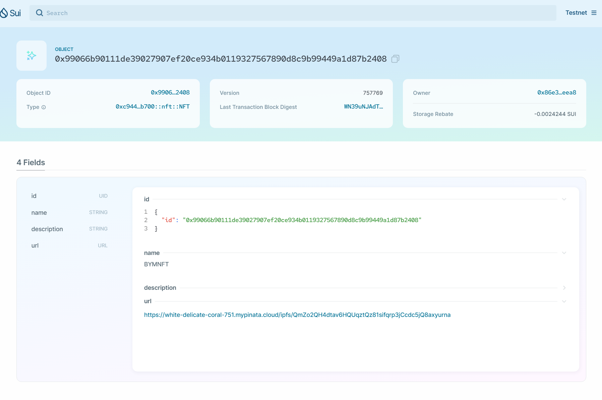
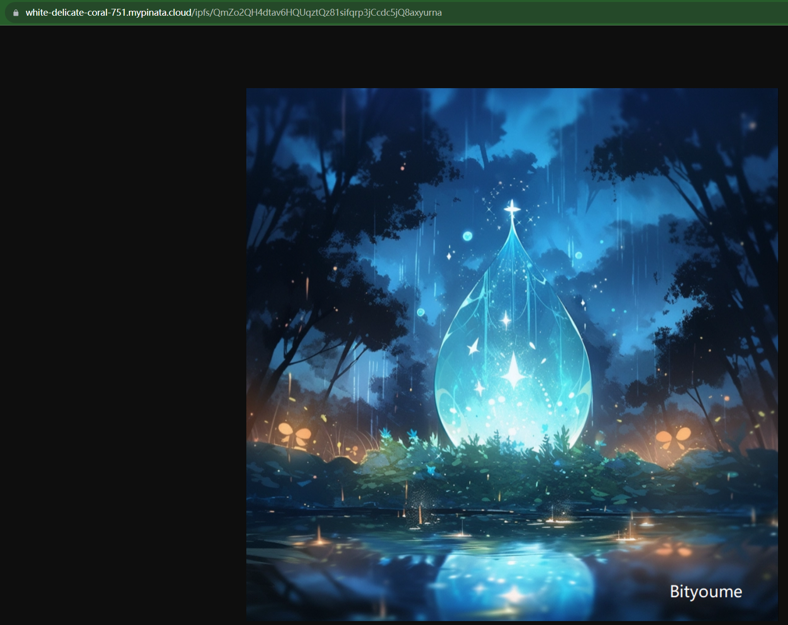

# 1.5 NFT发行

## 钱包准备

- **查看激活网络**

```bash
$ sui client envs
╭─────────┬───────────────────────────────────────┬────────╮
│ alias   │ url                                   │ active │
├─────────┼───────────────────────────────────────┼────────┤
│ devnet  │ https://fullnode.devnet.sui.io:443    │        │
│ mainnet │ https://sui-mainnet.nodeinfra.com:443 │        │
│ testnet │ https://fullnode.testnet.sui.io:443   │ *      │
╰─────────┴───────────────────────────────────────┴────────╯
```

- **查看激活钱包地址**

```bash
$ sui client active-address 
0x86e3621005f4d8f4cd85b06416d6c22c81e43acd6948cc7dbc3058fdd9bfeea8
```

- **查看gas**

```bash
$ sui client gas

╭────────────────────────────────────────────────────────────────────┬────────────╮
│ gasCoinId                                                          │ gasBalance │
├────────────────────────────────────────────────────────────────────┼────────────┤
│ 0x70b96720fadb6aa45620ab84efd9139e4674057207c93e4375350ec695865fab │ 1000000000 │
╰────────────────────────────────────────────────────────────────────┴────────────╯
```

## 工程创建

```bash
$ sui move new js_sui_nft
$ cd js_sui_nft/
```

## 合约开发

```rust
module js_sui_nft::nft {

  use sui::url::{Self, Url};
  use std::string;
  use sui::object::{Self, UID};
  use sui::transfer;
  use sui::tx_context::{Self, TxContext};
 
  struct NFT has key, store {
    id: UID, 
    name: string::String, 
    description: string::String,
    url: Url,
  }

  public entry fun mint(name: vector<u8>, description: vector<u8>, url: vector<u8>, ctx: &mut TxContext) {
    let nft = NFT {
      id: object::new(ctx),
      name: string::utf8(name),
      description: string::utf8(description),
      url: url::new_unsafe_from_bytes(url),
    };

    let sender = tx_context::sender(ctx);
    transfer::public_transfer(nft, sender);
  }

  // transfer an NFT to another address
  public entry fun transfer(nft: NFT, recipient: address) {
    transfer::transfer(nft, recipient);
  }
}
```

## 合约编译

```bash
$ sui move build
UPDATING GIT DEPENDENCY https://github.com/MystenLabs/sui.git
INCLUDING DEPENDENCY Sui
INCLUDING DEPENDENCY MoveStdlib
BUILDING js_sui_nft
```

## 合约部署

```bash
$ sui client publish --gas-budget 500000000

UPDATING GIT DEPENDENCY https://github.com/MystenLabs/sui.git
INCLUDING DEPENDENCY Sui
INCLUDING DEPENDENCY MoveStdlib
BUILDING js_sui_nft
Successfully verified dependencies on-chain against source.
----- Transaction Digest ----
WYfKXhnnZsuDpGwkqQcyJjnFpkVeimqwwBKTz2qbdW1
----- Transaction Data ----
Transaction Signature: [Signature(Ed25519SuiSignature(Ed25519SuiSignature([0, 126, 171, 98, 53, 222, 250, 104, 139, 225, 144, 169, 32, 65, 33, 27, 124, 59, 83, 41, 135, 54, 105, 189, 178, 114, 235, 138, 123, 139, 190, 224, 147, 81, 2, 61, 206, 44, 126, 14, 182, 43, 111, 162, 134, 224, 251, 159, 4, 173, 193, 52, 124, 47, 224, 57, 192, 193, 112, 98, 94, 14, 16, 115, 14, 10, 114, 213, 219, 204, 52, 207, 244, 13, 153, 120, 74, 160, 105, 143, 215, 148, 31, 191, 38, 109, 189, 36, 37, 133, 219, 150, 189, 73, 195, 80, 167])))]
Transaction Kind : Programmable
Inputs: [Pure(SuiPureValue { value_type: Some(Address), value: "0x86e3621005f4d8f4cd85b06416d6c22c81e43acd6948cc7dbc3058fdd9bfeea8" })]
Commands: [
  Publish(<modules>,0x0000000000000000000000000000000000000000000000000000000000000001,0x0000000000000000000000000000000000000000000000000000000000000002),
  TransferObjects([Result(0)],Input(0)),
]

Sender: 0x86e3621005f4d8f4cd85b06416d6c22c81e43acd6948cc7dbc3058fdd9bfeea8
Gas Payment: Object ID: 0x70b96720fadb6aa45620ab84efd9139e4674057207c93e4375350ec695865fab, version: 0xb9007, digest: 3UMF8nhWP5THQvDYiVNRoMvvvSvxh1KaqkDCGNTQXqNp 
Gas Owner: 0x86e3621005f4d8f4cd85b06416d6c22c81e43acd6948cc7dbc3058fdd9bfeea8
Gas Price: 1000
Gas Budget: 500000000

----- Transaction Effects ----
Status : Success
Created Objects:
  - ID: 0xc94464f26caa059636275c8d9f6e474d3c82ff77845ea49056354ffa012cb700 , Owner: Immutable
  - ID: 0xd9106d54ef40822322c5873fd0631104d32644743bbae16cd6b05f6c020e747d , Owner: Account Address ( 0x86e3621005f4d8f4cd85b06416d6c22c81e43acd6948cc7dbc3058fdd9bfeea8 )
Mutated Objects:
  - ID: 0x70b96720fadb6aa45620ab84efd9139e4674057207c93e4375350ec695865fab , Owner: Account Address ( 0x86e3621005f4d8f4cd85b06416d6c22c81e43acd6948cc7dbc3058fdd9bfeea8 )

----- Events ----
Array []
----- Object changes ----
Array [
    Object {
        "type": String("mutated"),
        "sender": String("0x86e3621005f4d8f4cd85b06416d6c22c81e43acd6948cc7dbc3058fdd9bfeea8"),
        "owner": Object {
            "AddressOwner": String("0x86e3621005f4d8f4cd85b06416d6c22c81e43acd6948cc7dbc3058fdd9bfeea8"),
        },
        "objectType": String("0x2::coin::Coin<0x2::sui::SUI>"),
        "objectId": String("0x70b96720fadb6aa45620ab84efd9139e4674057207c93e4375350ec695865fab"),
        "version": String("757768"),
        "previousVersion": String("757767"),
        "digest": String("69KSaj9yKn3KDTKpzs1DyCfLaUEBhJiKWbRazSzt5JLH"),
    },
    Object {
        "type": String("published"),
        "packageId": String("0xc94464f26caa059636275c8d9f6e474d3c82ff77845ea49056354ffa012cb700"),
        "version": String("1"),
        "digest": String("3XRD1ENmhhhYTC2nuHy1KpfHLJgKKNme9mP27kDu2p9p"),
        "modules": Array [
            String("nft"),
        ],
    },
    Object {
        "type": String("created"),
        "sender": String("0x86e3621005f4d8f4cd85b06416d6c22c81e43acd6948cc7dbc3058fdd9bfeea8"),
        "owner": Object {
            "AddressOwner": String("0x86e3621005f4d8f4cd85b06416d6c22c81e43acd6948cc7dbc3058fdd9bfeea8"),
        },
        "objectType": String("0x2::package::UpgradeCap"),
        "objectId": String("0xd9106d54ef40822322c5873fd0631104d32644743bbae16cd6b05f6c020e747d"),
        "version": String("757768"),
        "digest": String("FHXFe11LxwbNEqDvsKBdk4ps8sy79j48Wa1J7BpenPd7"),
    },
]
----- Balance changes ----
Array [
    Object {
        "owner": Object {
            "AddressOwner": String("0x86e3621005f4d8f4cd85b06416d6c22c81e43acd6948cc7dbc3058fdd9bfeea8"),
        },
        "coinType": String("0x2::sui::SUI"),
        "amount": String("-8343880"),
    },
]

$ sui client gas
╭────────────────────────────────────────────────────────────────────┬────────────╮
│ gasCoinId                                                          │ gasBalance │
├────────────────────────────────────────────────────────────────────┼────────────┤
│ 0x70b96720fadb6aa45620ab84efd9139e4674057207c93e4375350ec695865fab │ 991656120  │
╰────────────────────────────────────────────────────────────────────┴────────────╯
```

## 铸造NFT

```js
$ sui client call --package 0xc94464f26caa059636275c8d9f6e474d3c82ff77845ea49056354ffa012cb700 --module nft --function mint --args "BYMNFT" "This is bityoume first NFT on the SUI Blockchain" "https://white-delicate-coral-751.mypinata.cloud/ipfs/QmZo2QH4dtav6HQUqztQz81sifqrp3jCcdc5jQ8axyurna" --gas-budget 5000000
[warn] Client/Server api version mismatch, client api version : 1.13.0, server api version : 1.14.2
----- Transaction Digest ----
WN39uNJAdT8icuEqhryuAPBz8fXXgBckbjF8vHinX7t
----- Transaction Data ----
Transaction Signature: [Signature(Ed25519SuiSignature(Ed25519SuiSignature([0, 66, 94, 121, 214, 20, 98, 159, 207, 94, 248, 224, 170, 215, 21, 29, 125, 92, 197, 162, 130, 143, 11, 231, 72, 15, 218, 210, 43, 17, 89, 198, 124, 90, 4, 95, 156, 4, 189, 93, 79, 107, 181, 143, 101, 109, 72, 164, 38, 242, 198, 68, 43, 215, 90, 121, 209, 52, 0, 76, 92, 161, 92, 154, 10, 10, 114, 213, 219, 204, 52, 207, 244, 13, 153, 120, 74, 160, 105, 143, 215, 148, 31, 191, 38, 109, 189, 36, 37, 133, 219, 150, 189, 73, 195, 80, 167])))]
Transaction Kind : Programmable
Inputs: [Pure(SuiPureValue { value_type: Some(Vector(U8)), value: "BYMNFT" }), Pure(SuiPureValue { value_type: Some(Vector(U8)), value: "This is bityoume first NFT on the SUI Blockchain" }), Pure(SuiPureValue { value_type: Some(Vector(U8)), value: "https://white-delicate-coral-751.mypinata.cloud/ipfs/QmZo2QH4dtav6HQUqztQz81sifqrp3jCcdc5jQ8axyurna" })]
Commands: [
  MoveCall(0xc94464f26caa059636275c8d9f6e474d3c82ff77845ea49056354ffa012cb700::nft::mint(Input(0),Input(1),Input(2))),
]

Sender: 0x86e3621005f4d8f4cd85b06416d6c22c81e43acd6948cc7dbc3058fdd9bfeea8
Gas Payment: Object ID: 0x70b96720fadb6aa45620ab84efd9139e4674057207c93e4375350ec695865fab, version: 0xb9008, digest: 69KSaj9yKn3KDTKpzs1DyCfLaUEBhJiKWbRazSzt5JLH 
Gas Owner: 0x86e3621005f4d8f4cd85b06416d6c22c81e43acd6948cc7dbc3058fdd9bfeea8
Gas Price: 1000
Gas Budget: 5000000

----- Transaction Effects ----
Status : Success
Created Objects:
  - ID: 0x99066b90111de39027907ef20ce934b0119327567890d8c9b99449a1d87b2408 , Owner: Account Address ( 0x86e3621005f4d8f4cd85b06416d6c22c81e43acd6948cc7dbc3058fdd9bfeea8 )
Mutated Objects:
  - ID: 0x70b96720fadb6aa45620ab84efd9139e4674057207c93e4375350ec695865fab , Owner: Account Address ( 0x86e3621005f4d8f4cd85b06416d6c22c81e43acd6948cc7dbc3058fdd9bfeea8 )

----- Events ----
Array []
----- Object changes ----
Array [
    Object {
        "type": String("mutated"),
        "sender": String("0x86e3621005f4d8f4cd85b06416d6c22c81e43acd6948cc7dbc3058fdd9bfeea8"),
        "owner": Object {
            "AddressOwner": String("0x86e3621005f4d8f4cd85b06416d6c22c81e43acd6948cc7dbc3058fdd9bfeea8"),
        },
        "objectType": String("0x2::coin::Coin<0x2::sui::SUI>"),
        "objectId": String("0x70b96720fadb6aa45620ab84efd9139e4674057207c93e4375350ec695865fab"),
        "version": String("757769"),
        "previousVersion": String("757768"),
        "digest": String("4YYQzfn6qWg8EWxTiUKx45xgSTzq2SWJBgXVp3bfPfUS"),
    },
    Object {
        "type": String("created"),
        "sender": String("0x86e3621005f4d8f4cd85b06416d6c22c81e43acd6948cc7dbc3058fdd9bfeea8"),
        "owner": Object {
            "AddressOwner": String("0x86e3621005f4d8f4cd85b06416d6c22c81e43acd6948cc7dbc3058fdd9bfeea8"),
        },
        "objectType": String("0xc94464f26caa059636275c8d9f6e474d3c82ff77845ea49056354ffa012cb700::nft::NFT"),
        "objectId": String("0x99066b90111de39027907ef20ce934b0119327567890d8c9b99449a1d87b2408"),
        "version": String("757769"),
        "digest": String("8kJiydA2NmFAkBjtNrGou4rpsXm4bRzfyVQ8Jtc93mkS"),
    },
]
----- Balance changes ----
Array [
    Object {
        "owner": Object {
            "AddressOwner": String("0x86e3621005f4d8f4cd85b06416d6c22c81e43acd6948cc7dbc3058fdd9bfeea8"),
        },
        "coinType": String("0x2::sui::SUI"),
        "amount": String("-3434280"),
    },
]
```

## 查看NFT

https://suiexplorer.com/object/0x99066b90111de39027907ef20ce934b0119327567890d8c9b99449a1d87b2408?deviceId=d91bda4f-734e-4cf7-a391-0ab2fb23f9be&network=testnet



