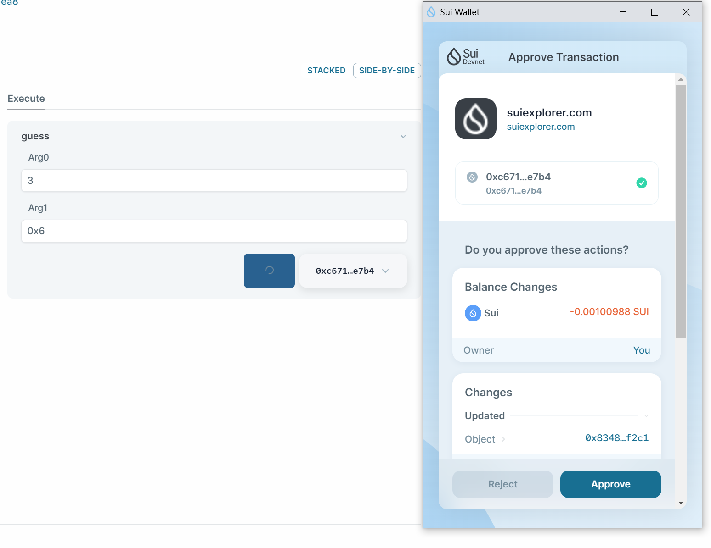
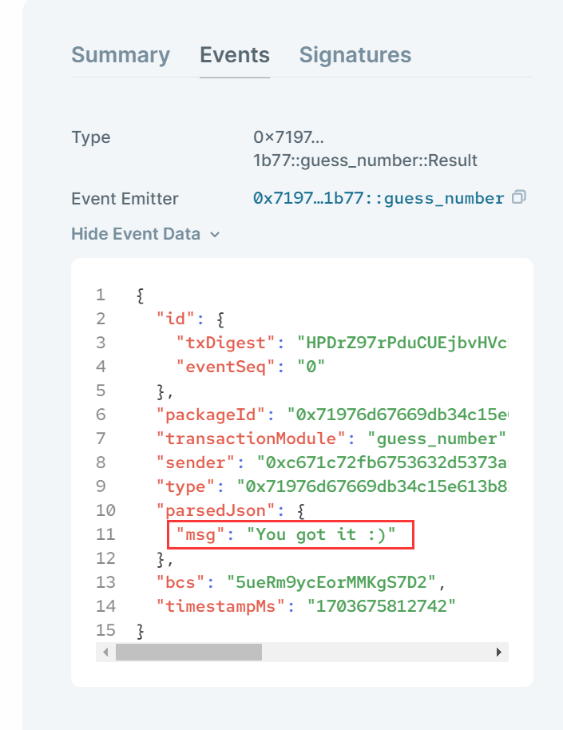
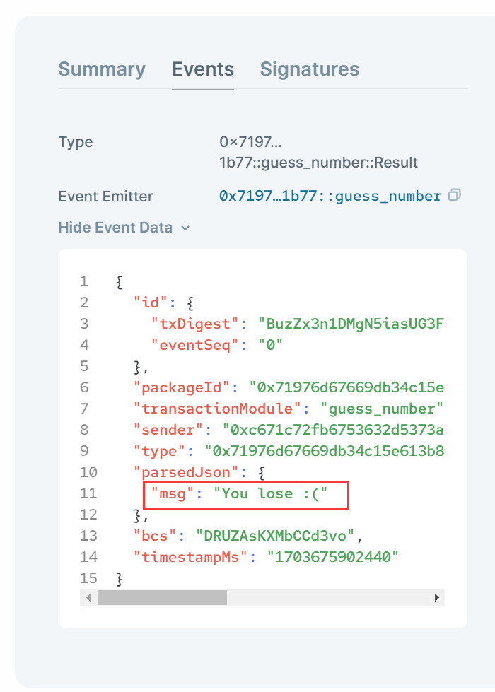

# Move猜数字合约开发

## 1 合约开发

```rust
module sui_game::guess_number {
    use sui::event;
    use std::string;
    use sui::tx_context::{ TxContext};
    use sui::clock::{Self, Clock};
    
    const ERROR_INPUT_NUM :u64 = 1;

    struct Result has copy,drop {
        msg: string::String
    }

    entry public fun guess(input_num: u64, clock: &Clock, ctx: &mut TxContext) {

        assert!((input_num >= 1 && input_num <=5), ERROR_INPUT_NUM);

        let ts_ms = clock::timestamp_ms(clock);
        let random = (ts_ms % 5) + 1;
        
        let resp;
        if (input_num == random) {
            resp = b"You got it :)";
        } else {
            resp = b"You lose :(";
        };

        event::emit(Result{msg: string::utf8(resp)});
    }
}
```

## 2 部署合约

```bash
$ sui client publish --gas-budget 300000000

......
│ Published Objects:                                                                               │
│  ┌──                                                                                             │
│  │ PackageID: 0x71976d67669db34c15e613b82840187b398827a9820df5e795bf583d95651b77                 │
│  │ Version: 1                                                                                    │
│  │ Digest: AoNv1mkKiSCZZXMuBjn7J5jV3m6MrhBnha3QnQVzeK4K                                          │
│  │ Modules: guess_number                                                                         │
│  └──                                                                                             │
......
```

## 3 网页交互

### 3.1 发起猜数字交易

https://suiexplorer.com/object/0x71976d67669db34c15e613b82840187b398827a9820df5e795bf583d95651b77?network=devnet



### 3.2 猜中数字事件

https://suiexplorer.com/txblock/HPDrZ97rPduCUEjbvHVcDQB9KJSvmYzEgMcqK2qpAoRD?network=devnet



### 3.3 未猜中数字事件

https://suiexplorer.com/txblock/BuzZx3n1DMgN5iasUG3FcjjUBU8SwXDTSKJzupMMD977?network=devnet

