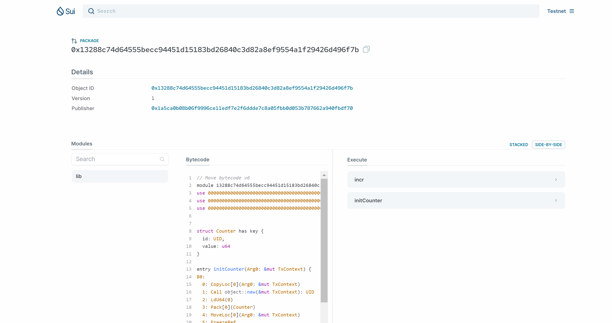
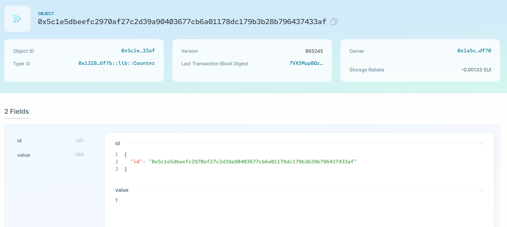

# Move Package dev

##### Auth:github/Euraxluo
##### Email:euraxluo@outlook.com
## 0. 安装语言服务器
直接在vscode中安装sui-move-analyzer插件

## 1. package开发
<!--
footer: https://docs.sui.io/guides/developer/first-app
-->
1. 创建新package：
    ```
    @Euraxluo ➜ .../SuiStartrek/members/euraxluo/code (main) $ sui move new counter
    @Euraxluo ➜ .../SuiStartrek/members/euraxluo/code (main) $ ls
    counter
    ```
---
2. 在sources文件夹中创建lib.move文件，并且写入以下代码：
    ```move
    module counter::lib {

        // Part 1: Imports
        use sui::object::{Self, UID};
        use sui::transfer;
        use sui::tx_context::{Self, TxContext};

        // Part 2: Struct definitions
        struct Counter has key {
            id: UID,
            value: u64,
        }
        // Part 3: transfer the counter object to the sender
        entry fun initCounter(ctx: &mut TxContext) {
            let counter_obj = Counter {
                id: object::new(ctx),
                value: 0,
            };
            // Transfer the counter object to the module/package publisher
            transfer::transfer(counter_obj, tx_context::sender(ctx));
        }

        // Part 4: Accessors required to read the struct attributes
        public entry fun incr(counter: &mut Counter): u64 {
            counter.value = counter.value+1;
            counter.value
        }
    }
    ```
---
3. 编译package
    ```
    @Euraxluo ➜ .../members/euraxluo/code/helloworld (main) $ sui move build
    UPDATING GIT DEPENDENCY https://github.com/MystenLabs/sui.git
    INCLUDING DEPENDENCY Sui
    INCLUDING DEPENDENCY MoveStdlib
    BUILDING counter
    ```
4. 测试package
    ```
    @Euraxluo ➜ .../members/euraxluo/code/helloworld (main) $ sui move test
    UPDATING GIT DEPENDENCY https://github.com/MystenLabs/sui.git
    INCLUDING DEPENDENCY Sui
    INCLUDING DEPENDENCY MoveStdlib
    BUILDING counter
    Running Move unit tests
    Test result: OK. Total tests: 0; passed: 0; failed: 0
    ```
---
5. 但是我们之前并没有编写测试代码，添加测试代码如下：
    ```move
    #[test]
    public fun test_counter_create() {

        // Create a dummy TxContext for testing
        let ctx = tx_context::dummy();

        // Create a counter
        let counter_obj = Counter {
            id: object::new(&mut ctx),
            value: 3
        };

        // Check if accessor functions return correct values
        assert!(incr(&mut counter_obj) == 4, 1);

        // Create a dummy address and transfer the counter obj
        let dummy_address = @0xCAFE;
        transfer::transfer(counter_obj, dummy_address);
    }
    ```
--- 
6. 构建并运行测试
    ```
    @Euraxluo ➜ .../members/euraxluo/code/helloworld (main) $ sui move test
    UPDATING GIT DEPENDENCY https://github.com/MystenLabs/sui.git
    INCLUDING DEPENDENCY Sui
    INCLUDING DEPENDENCY MoveStdlib
    BUILDING counter
    Running Move unit tests
    [ PASS    ] 0x0::lib::test_counter_create
    Test result: OK. Total tests: 1; passed: 1; failed: 0
    ```
--- 
7. 由于是一个新的client address，并且我们即将发布的package是在testnet.
需要先去领水,直接去discord,发送：`!faucet 0x1a5ca0b08b06f9996ce11edf7e2f6ddde7c8a05fbb0d053b787662a940fbdf70`
查看自己的gas:
    ```
    @Euraxluo ➜ .../members/euraxluo/code/helloworld (main) $ sui client gas
    [warn] Client/Server api version mismatch, client api version : 1.13.0, server api version : 1.14.1
    ╭────────────────────────────────────────────────────────────────────┬────────────╮
    │ gasCoinId                                                          │ gasBalance │
    ├────────────────────────────────────────────────────────────────────┼────────────┤
    │ 0x9d9431251ce33eb566a0aefe449e6f7d0882e8914338f7cdf2d8aac9a6c00a42 │ 990349840  │
    ╰────────────────────────────────────────────────────────────────────┴────────────╯
    ```

---
8. 发布：`sui client publish --gas-budget 50000000`
```
[warn] Client/Server api version mismatch, client api version : 1.13.0, server api version : 1.14.1
UPDATING GIT DEPENDENCY https://github.com/MystenLabs/sui.git
INCLUDING DEPENDENCY Sui
INCLUDING DEPENDENCY MoveStdlib
BUILDING counter
Successfully verified dependencies on-chain against source.
----- Transaction Digest ----
J92G5keFc3aLy22HsWLqMAzeTGsM4TigdGcGvxpPtgMp
----- Transaction Data ----
Transaction Signature: [Signature(Ed25519SuiSignature(Ed25519SuiSignature([0, 213, 227, 225, 193, 122, 165, 109, 153, 241, 162, 11, 118, 49, 64, 118, 196, 39, 151, 229, 75, 45, 125, 89, 130, 151, 169, 172, 0, 189, 115, 69, 246, 1, 45, 152, 36, 78, 164, 20, 168, 20, 238, 191, 203, 116, 40, 75, 0, 177, 172, 181, 48, 145, 73, 36, 19, 229, 238, 94, 231, 170, 239, 206, 11, 240, 42, 51, 155, 18, 85, 124, 218, 144, 31, 57, 48, 205, 112, 117, 6, 35, 161, 17, 100, 143, 36, 91, 251, 22, 35, 70, 86, 180, 11, 248, 237])))]
Transaction Kind : Programmable
Inputs: [Pure(SuiPureValue { value_type: Some(Address), value: "0x1a5ca0b08b06f9996ce11edf7e2f6ddde7c8a05fbb0d053b787662a940fbdf70" })]
Commands: [
  Publish(<modules>,0x0000000000000000000000000000000000000000000000000000000000000001,0x0000000000000000000000000000000000000000000000000000000000000002),
  TransferObjects([Result(0)],Input(0)),
]

Sender: 0x1a5ca0b08b06f9996ce11edf7e2f6ddde7c8a05fbb0d053b787662a940fbdf70
Gas Payment: Object ID: 0x9d9431251ce33eb566a0aefe449e6f7d0882e8914338f7cdf2d8aac9a6c00a42, version: 0xd33da, digest: Gcxk1ZFNRFGrL9HYsw8qzwydo4uaeNNpxR14smBTKfLs 
Gas Owner: 0x1a5ca0b08b06f9996ce11edf7e2f6ddde7c8a05fbb0d053b787662a940fbdf70
Gas Price: 1000
Gas Budget: 50000000

----- Transaction Effects ----
Status : Success
Created Objects:
  - ID: 0x13288c74d64555becc94451d15183bd26840c3d82a8ef9554a1f29426d496f7b , Owner: Immutable
  - ID: 0xda10fe042f7a4b6c076b84877b57823a0f9e7ee2d02468f0b1cb949f29afc10b , Owner: Account Address ( 0x1a5ca0b08b06f9996ce11edf7e2f6ddde7c8a05fbb0d053b787662a940fbdf70 )
Mutated Objects:
  - ID: 0x9d9431251ce33eb566a0aefe449e6f7d0882e8914338f7cdf2d8aac9a6c00a42 , Owner: Account Address ( 0x1a5ca0b08b06f9996ce11edf7e2f6ddde7c8a05fbb0d053b787662a940fbdf70 )

----- Events ----
Array []
----- Object changes ----
Array [
    Object {
        "type": String("mutated"),
        "sender": String("0x1a5ca0b08b06f9996ce11edf7e2f6ddde7c8a05fbb0d053b787662a940fbdf70"),
        "owner": Object {
            "AddressOwner": String("0x1a5ca0b08b06f9996ce11edf7e2f6ddde7c8a05fbb0d053b787662a940fbdf70"),
        },
        "objectType": String("0x2::coin::Coin<0x2::sui::SUI>"),
        "objectId": String("0x9d9431251ce33eb566a0aefe449e6f7d0882e8914338f7cdf2d8aac9a6c00a42"),
        "version": String("865243"),
        "previousVersion": String("865242"),
        "digest": String("8AYvQZdXvnqiV4dKAVKP1ZkYvrvJr5ccZpYkFqL28UuB"),
    },
    Object {
        "type": String("published"),
        "packageId": String("0x13288c74d64555becc94451d15183bd26840c3d82a8ef9554a1f29426d496f7b"),
        "version": String("1"),
        "digest": String("DuM4Df491kQgHXaVM2anVK3GMdcRvLEughftku26Sggg"),
        "modules": Array [
            String("lib"),
        ],
    },
    Object {
        "type": String("created"),
        "sender": String("0x1a5ca0b08b06f9996ce11edf7e2f6ddde7c8a05fbb0d053b787662a940fbdf70"),
        "owner": Object {
            "AddressOwner": String("0x1a5ca0b08b06f9996ce11edf7e2f6ddde7c8a05fbb0d053b787662a940fbdf70"),
        },
        "objectType": String("0x2::package::UpgradeCap"),
        "objectId": String("0xda10fe042f7a4b6c076b84877b57823a0f9e7ee2d02468f0b1cb949f29afc10b"),
        "version": String("865243"),
        "digest": String("6JQ7GHv3F4zbQExuxJyrGVPUWqSEgA3LEYavokPDhp12"),
    },
]
----- Balance changes ----
Array [
    Object {
        "owner": Object {
            "AddressOwner": String("0x1a5ca0b08b06f9996ce11edf7e2f6ddde7c8a05fbb0d053b787662a940fbdf70"),
        },
        "coinType": String("0x2::sui::SUI"),
        "amount": String("-7363480"),
    },
]
```
---
9. 通过发布的打印结果中获取交易hash，然后去浏览器中查询
https://suiexplorer.com/txblock/J92G5keFc3aLy22HsWLqMAzeTGsM4TigdGcGvxpPtgMp?network=testnet


--- 
10. 先调用package的initCounter函数获取counter
    ```
    $ sui client call \
        --function initCounter \
        --module lib \
        --package 0x13288c74d64555becc94451d15183bd26840c3d82a8ef9554a1f29426d496f7b \
        --gas-budget 10000000
    ```
---
11. 上述命令运行结果中会得到一个Object：`0x5c1e5dbeefc2970af27c2d39a90403677cb6a01178dc179b3b28b796437433af`
然后去浏览器查询fields：

---
12. 再调用incr函数增加counter，并且返回结果
    ```
    $ sui client call \
        --function incr \
        --module lib \
        --package 0x13288c74d64555becc94451d15183bd26840c3d82a8ef9554a1f29426d496f7b \
        --args 0x5c1e5dbeefc2970af27c2d39a90403677cb6a01178dc179b3b28b796437433af \
        --gas-budget 10000000
    ```
    执行后会看到value值增加了