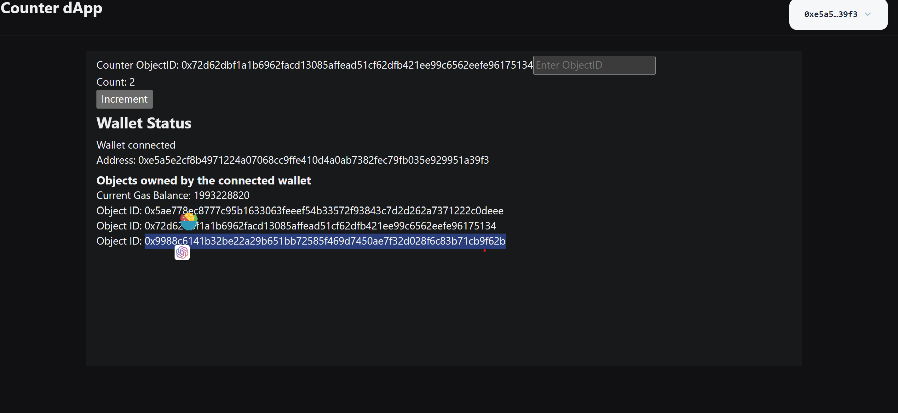
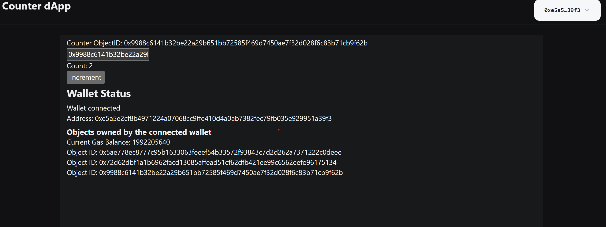

# DApp Development 
##### Auth:github/Euraxluo
##### Email:euraxluo@outlook.com


## 1. Setup
<!--
footer: https://docs.sui.io/guides/developer/app-examples/e2e-counter
-->
1. 检查node环境
    ```
    @Euraxluo ➜ /workspaces/SuiStartrek (main) $ node --version
    v20.9.0
    @Euraxluo ➜ /workspaces/SuiStartrek (main) $ pnpm --version
    8.10.2
    ```
2. 创建项目脚手架:
    ```
    @Euraxluo ➜ .../SuiStartrek/members/euraxluo/code (main) $ pnpm create @mysten/create-dapp --template react-client-dapp
    ../../../../.pnpm-store/v3/tmp/dlx-13001 | +108 +++++++++++
    ../../../../.pnpm-store/v3/tmp/dlx-13001 | Progress: resolved 108, reused 108, downloaded 0, added 108, done
    ✔ What is the name of your dApp? (this will be used as the directory name) · counter_dapp
    ```
3. 安装项目依赖:`npm i`
4. 运行项目：`npm run dev`

## 2. 编程
1. 修改脚手架的main.tsx,修改网络为testnet
```tsx
ReactDOM.createRoot(document.getElementById("root")!).render(
  <React.StrictMode>
    <Theme appearance="dark">
      <QueryClientProvider client={queryClient}>
        <SuiClientProvider networks={networkConfig} defaultNetwork="testnet">
          <WalletProvider autoConnect>
            <App />
          </WalletProvider>
        </SuiClientProvider>
      </QueryClientProvider>
    </Theme>
  </React.StrictMode>,
);
```
---
2. 创建新的constants.tsx文件，并且设置交互的package为上节创建的Counter Package
```tsx
export const COUNTER_PACKAGE_ID="0x13288c74d64555becc94451d15183bd26840c3d82a8ef9554a1f29426d496f7b"
```
---
3. 修改脚手架的OwnedObjects.tsx文件，我想增加显示连接的钱包的balance
```
export function OwnedObjects() {
  const account = useCurrentAccount();
  const { data: gasData, isPending: isGasPending, error: gasError } = useSuiClientQuery(
    "getBalance",
    {
      owner: account?.address as string,
    },
    {
      enabled: !!account,
    },
  );

  const { data, isPending, error } = useSuiClientQuery(
    "getOwnedObjects",
    {
      owner: account?.address as string,
    },
    {
      enabled: !!account,
    },
  );

  if (!account) {
    return;
  }

  if (gasError) {
    return <Flex>Error fetching gas balance: {gasError.message}</Flex>;
  }

  if (error) {
    return <Flex>Error: {error.message}</Flex>;
  }

  if (isPending || !data || isGasPending) {
    return <Flex>Loading...</Flex>;
  }

  return (
    <Flex direction="column" my="2">
      <Heading size="4">Objects owned by the connected wallet</Heading>
      <Text>Current Gas Balance: {gasData.totalBalance}</Text>
      {data.data.length === 0 ? (
        <Text>No objects owned by the connected wallet</Text>
      ) : (
        data.data.map((object) => (
          <Flex key={object.data?.objectId}>
            <Text>Object ID: {object.data?.objectId}</Text>
          </Flex>
        ))
      )}
    </Flex>
  );
}
```
---
4. 在脚手架的App.tsx文件中添加一个section，编写管理counter交互的代码
```
    <section>
    Counter ObjectID: {counterId},
    <div/>
    <input
        type="text"
        placeholder="Enter ObjectID"
        onChange={(e) => {
        console.log("text change to: "+e.target.value);
        setCounter(e.target.value)
        }}
    />
    <div/>
    {
        !currentAccount ? (
        'Please connect your wallet'
        ) : counterId ? (
        <Counter id={counterId} />
        ) : (
        <div>
            <CreateCounter
            onCreated={(id) => {
                window.location.hash = id;
                setCounter(id);
                console.log("CreateCounter success，Counter ObjectID: " + id);
            }}
            />
        </div>
        )
    }
    </section>
    <WalletStatus />
```
--- 
4. 在脚手架的App.tsx文件中设置相关的useState等hook
```
  const currentAccount = useCurrentAccount();
  const [counterId, setCounter] = useState(() => {
    const hash = window.location.hash.slice(1);
    return isValidSuiObjectId(hash) ? hash : null;
  });
```
---
5.创建一个新的Counter.tsx文件，在其中编写核心的React组件，CreateCounter组件
```tsx
import { useSignAndExecuteTransactionBlock, useSuiClient } from '@mysten/dapp-kit';
import { TransactionBlock } from "@mysten/sui.js/transactions";
import { COUNTER_PACKAGE_ID } from "./constants";

export function CreateCounter(props: { onCreated: (id: string) => void }) {
  //使用dAppKit中的useSuiClient钩子,获取SuiClient的实例
  const suiClient = useSuiClient();
  //在组件中调用useSignAndExecuteTransactionBlock钩子，它提供了一个可以在函数create中使用的mutate函数
  const { mutate: signAndExecute } = useSignAndExecuteTransactionBlock();
  return (
    <div>
      <button
        onClick={() => {
          console.log("CreateCounter Button click!!!")
          create();
        }}
      >
        Create Counter with Package:{COUNTER_PACKAGE_ID}
      </button>
    </div>
  );
  function create() {
    const txb = new TransactionBlock();
    txb.moveCall({
      arguments: [],
      target: `${COUNTER_PACKAGE_ID}::lib::initCounter`,
    });

    signAndExecute(
      {
        transactionBlock: txb,
        options: {
          showEffects: true,
        },
      },
      {
        onSuccess: (tx) => {
          //用waitForTransactionBlock的方法SuiClient ,
          //在create函数中使用suiClient等待索引TransactionBlock
          suiClient
            .waitForTransactionBlock({
              digest: tx.digest,
            })
            .then(() => {
              // 获取到的objectID
              const objectId = tx.effects?.created?.[0]?.reference?.objectId;
              if (objectId) {
                props.onCreated(objectId);
              }
            });
        },
        onError: (e) => {
          alert("警告！\n检查defaultNetwork和COUNTER_PACKAGE_ID");
          console.log(e);
        }
      },
    );
  }
}
```

---
6.创建一个新的Counter.tsx文件，在其中编写核心的React组件，Counter组件
```tsx
import { useSuiClientQuery } from '@mysten/dapp-kit';
import { SuiObjectData } from '@mysten/sui.js/client';

export function Counter({ id }: { id: string }) {
  const suiClient = useSuiClient();
  const { mutate: signAndExecute } = useSignAndExecuteTransactionBlock();

  //当前Counter对象，使用 getObject RPC 方法从对象中提取。
  const { data, refetch } = useSuiClientQuery('getObject', {
    id,
    options: {
      showContent: true,
    },
  });
  console.log("find Object");
  console.log(data);
  // 判断是否获取到Counter
  if (!data?.data) return <div>Not found {id}</div>;
  return (
    <div>
      <div>Count: {getCounterFields(data.data)?.value}</div>
      <button onClick={() => executeMoveCall()}>Increment</button>
    </div>
  );

  function executeMoveCall() {
    const txb = new TransactionBlock();
    txb.moveCall({
      arguments: [txb.object(id)],
      target: `${COUNTER_PACKAGE_ID}::lib::incr`,
    });

    signAndExecute(
      {
        transactionBlock: txb,
      },
      {
        onSuccess: (tx) => {
          suiClient.waitForTransactionBlock({ digest: tx.digest }).then(() => {
            refetch();
          });
        },
        onError: (e) => {
          console.log(e);
        }
      },
    );
  }
}
// 获取Counter Object中的value field
function getCounterFields(data: SuiObjectData) {
  if (data.content?.dataType !== 'moveObject') {
    return null;
  }
  return data.content.fields as { value: number };
}
```

## 3. dapp使用
1. dapp运行结果：

---
2. 还支持手动设置CounterObjectID
