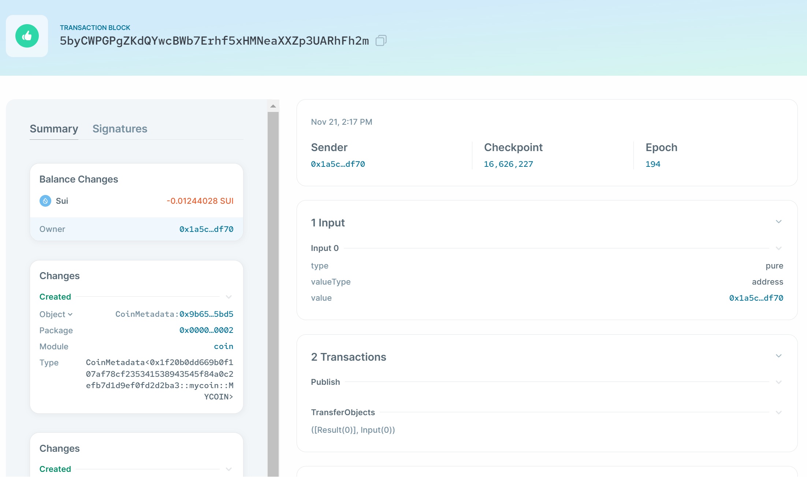

# Coin Development 
##### Auth:github/Euraxluo
##### Email:euraxluo@outlook.com


## 1. 创建一个新的coin package
<!--
footer: https://docs.sui.io/guides/developer/sui-101/create-coin
-->
1. 创建新的package:
    ```
    @Euraxluo ➜ .../SuiStartrek/members/euraxluo/code (main) $ sui move new mycoin
    ```
2. 检查使用的网络,确认使用的是测试网：
    ```toml
    [dependencies]
    Sui = { git = "https://github.com/MystenLabs/sui.git", subdir = "crates/sui-framework/packages/sui-framework", rev = "framework/testnet" }
    ```
## 2. 开发Coin
1. 核心点，Coin是一种一次性见证类型：
一次性见证类型是具有以下要求的结构: 它们的名称是模块名称的大写版本，它们没有字段(或单个布尔字段) ，它们没有类型参数，并且它们只有“ drop”功能。

2. 创建一个mycoin.move,并且编写以下内容：
    ```move
    module mycoin::mycoin {
        use std::option;
        use sui::coin;
        use sui::transfer;
        use sui::tx_context::{Self, TxContext};
        struct MYCOIN has drop {}
        fun init(witness: MYCOIN, ctx: &mut TxContext) {
            let (treasury, metadata) = coin::create_currency(witness, 6, b"MYCOIN", b"", b"", option::none(), ctx);
            transfer::public_freeze_object(metadata);
            transfer::public_transfer(treasury, tx_context::sender(ctx))
        }
    }
    ```
---
3. 测试：`sui move test`
    ```
    @Euraxluo ➜ .../members/euraxluo/code/mycoin (main) $ sui move test
    UPDATING GIT DEPENDENCY https://github.com/MystenLabs/sui.git
    INCLUDING DEPENDENCY Sui
    INCLUDING DEPENDENCY MoveStdlib
    BUILDING mycoin
    Running Move unit tests
    Test result: OK. Total tests: 0; passed: 0; failed: 0
    ```
4. 构建：`sui move build`
    ```
    @Euraxluo ➜ .../members/euraxluo/code/mycoin (main) $ sui move build
    UPDATING GIT DEPENDENCY https://github.com/MystenLabs/sui.git
    INCLUDING DEPENDENCY Sui
    INCLUDING DEPENDENCY MoveStdlib
    BUILDING mycoin
    ```
## 3. 准备发布
1. 检查网络
    ```
    @Euraxluo ➜ .../members/euraxluo/code/mycoin (main) $ sui client envs
    ╭──────────┬───────────────────────────────────────┬────────╮
    │ alias    │ url                                   │ active │
    ├──────────┼───────────────────────────────────────┼────────┤
    │ devnet   │ https://fullnode.devnet.sui.io:443    │        │
    │ localnet │ http://127.0.0.1:9000                 │        │
    │ testnet  │ https://fullnode.testnet.sui.io:443   │ *      │
    │ mainnet  │ https://sui-mainnet.nodeinfra.com:443 │        │
    ╰──────────┴───────────────────────────────────────┴────────╯
    ```
2. 切换网络
    ```
    @Euraxluo ➜ .../members/euraxluo/code/mycoin (main) $ sui client switch --env testnet
    Active environment switched to [testnet]
    ```
--- 
3. 发布package：`sui client publish --gas-budget 50000000`
```
[warn] Client/Server api version mismatch, client api version : 1.13.0, server api version : 1.14.1
UPDATING GIT DEPENDENCY https://github.com/MystenLabs/sui.git
INCLUDING DEPENDENCY Sui
INCLUDING DEPENDENCY MoveStdlib
BUILDING mycoin
Successfully verified dependencies on-chain against source.
----- Transaction Digest ----
5byCWPGPgZKdQYwcBWb7Erhf5xHMNeaXXZp3UARhFh2m
----- Transaction Data ----
Transaction Signature: [Signature(Ed25519SuiSignature(Ed25519SuiSignature([0, 83, 191, 235, 45, 116, 184, 241, 18, 149, 107, 84, 253, 182, 131, 184, 71, 0, 244, 204, 23, 17, 24, 28, 192, 92, 34, 97, 67, 198, 156, 194, 243, 242, 149, 28, 226, 188, 212, 29, 29, 105, 202, 10, 243, 31, 253, 134, 242, 119, 100, 26, 194, 206, 160, 129, 164, 209, 118, 123, 246, 50, 206, 171, 10, 240, 42, 51, 155, 18, 85, 124, 218, 144, 31, 57, 48, 205, 112, 117, 6, 35, 161, 17, 100, 143, 36, 91, 251, 22, 35, 70, 86, 180, 11, 248, 237])))]
Transaction Kind : Programmable
Inputs: [Pure(SuiPureValue { value_type: Some(Address), value: "0x1a5ca0b08b06f9996ce11edf7e2f6ddde7c8a05fbb0d053b787662a940fbdf70" })]
Commands: [
  Publish(<modules>,0x0000000000000000000000000000000000000000000000000000000000000001,0x0000000000000000000000000000000000000000000000000000000000000002),
  TransferObjects([Result(0)],Input(0)),
]

Sender: 0x1a5ca0b08b06f9996ce11edf7e2f6ddde7c8a05fbb0d053b787662a940fbdf70
Gas Payment: Object ID: 0x9d9431251ce33eb566a0aefe449e6f7d0882e8914338f7cdf2d8aac9a6c00a42, version: 0xd33e1, digest: BBAzorRVdjv86KBMyae2rTP99vuFEqgZNKQbZdNxHiNs 
Gas Owner: 0x1a5ca0b08b06f9996ce11edf7e2f6ddde7c8a05fbb0d053b787662a940fbdf70
Gas Price: 1000
Gas Budget: 50000000

----- Transaction Effects ----
Status : Success
Created Objects:
  - ID: 0x1f20b0dd669b0f107af78cf235341538943545f84a0c2efb7d1d9ef0fd2d2ba3 , Owner: Immutable
  - ID: 0x9b65fb6348fcfdb314ccb9fde2a3b1ba677379c4c6731e2b96ed18c6c6845bd5 , Owner: Immutable
  - ID: 0xaf6ab7e811cce9b9844057cb0e2881db7f0e868fbc00ae7a52a7e02c49a3c3b8 , Owner: Account Address ( 0x1a5ca0b08b06f9996ce11edf7e2f6ddde7c8a05fbb0d053b787662a940fbdf70 )
  - ID: 0xbae3e3d16013ef69df0d0f28b9e307af375f7668ca980791a753aaed4eed9964 , Owner: Account Address ( 0x1a5ca0b08b06f9996ce11edf7e2f6ddde7c8a05fbb0d053b787662a940fbdf70 )
Mutated Objects:
  - ID: 0x9d9431251ce33eb566a0aefe449e6f7d0882e8914338f7cdf2d8aac9a6c00a42 , Owner: Account Address ( 0x1a5ca0b08b06f9996ce11edf7e2f6ddde7c8a05fbb0d053b787662a940fbdf70 )

----- Events ----
Array []
----- Object changes ----
Array [
    Object {
        "type": String("mutated"),
        "sender": String("0x1a5ca0b08b06f9996ce11edf7e2f6ddde7c8a05fbb0d053b787662a940fbdf70"),
        "owner": Object {
            "AddressOwner": String("0x1a5ca0b08b06f9996ce11edf7e2f6ddde7c8a05fbb0d053b787662a940fbdf70"),
        },
        "objectType": String("0x2::coin::Coin<0x2::sui::SUI>"),
        "objectId": String("0x9d9431251ce33eb566a0aefe449e6f7d0882e8914338f7cdf2d8aac9a6c00a42"),
        "version": String("865250"),
        "previousVersion": String("865249"),
        "digest": String("3FdppQqK11Fcwirp5kNNRXh3X1146fRqXjKTM6oiAKSU"),
    },
    Object {
        "type": String("published"),
        "packageId": String("0x1f20b0dd669b0f107af78cf235341538943545f84a0c2efb7d1d9ef0fd2d2ba3"),
        "version": String("1"),
        "digest": String("A72eqidu6xNc6jXAzASyxikWpEULqf5yrNZ96ymXqo7o"),
        "modules": Array [
            String("mycoin"),
        ],
    },
    Object {
        "type": String("created"),
        "sender": String("0x1a5ca0b08b06f9996ce11edf7e2f6ddde7c8a05fbb0d053b787662a940fbdf70"),
        "owner": String("Immutable"),
        "objectType": String("0x2::coin::CoinMetadata<0x1f20b0dd669b0f107af78cf235341538943545f84a0c2efb7d1d9ef0fd2d2ba3::mycoin::MYCOIN>"),
        "objectId": String("0x9b65fb6348fcfdb314ccb9fde2a3b1ba677379c4c6731e2b96ed18c6c6845bd5"),
        "version": String("865250"),
        "digest": String("29vd4RBfaGVuhcdgC67saDdWiF5jShR6gBzbB1RAA8c5"),
    },
    Object {
        "type": String("created"),
        "sender": String("0x1a5ca0b08b06f9996ce11edf7e2f6ddde7c8a05fbb0d053b787662a940fbdf70"),
        "owner": Object {
            "AddressOwner": String("0x1a5ca0b08b06f9996ce11edf7e2f6ddde7c8a05fbb0d053b787662a940fbdf70"),
        },
        "objectType": String("0x2::package::UpgradeCap"),
        "objectId": String("0xaf6ab7e811cce9b9844057cb0e2881db7f0e868fbc00ae7a52a7e02c49a3c3b8"),
        "version": String("865250"),
        "digest": String("7bZ2vwhbT58Z5cehkdwGMo1i8SvbDvvewjM8oixVM5NQ"),
    },
    Object {
        "type": String("created"),
        "sender": String("0x1a5ca0b08b06f9996ce11edf7e2f6ddde7c8a05fbb0d053b787662a940fbdf70"),
        "owner": Object {
            "AddressOwner": String("0x1a5ca0b08b06f9996ce11edf7e2f6ddde7c8a05fbb0d053b787662a940fbdf70"),
        },
        "objectType": String("0x2::coin::TreasuryCap<0x1f20b0dd669b0f107af78cf235341538943545f84a0c2efb7d1d9ef0fd2d2ba3::mycoin::MYCOIN>"),
        "objectId": String("0xbae3e3d16013ef69df0d0f28b9e307af375f7668ca980791a753aaed4eed9964"),
        "version": String("865250"),
        "digest": String("Bo6N5QusymAbNKMDghznZpUaP7LLbkjJvdswzC6415B4"),
    },
]
----- Balance changes ----
Array [
    Object {
        "owner": Object {
            "AddressOwner": String("0x1a5ca0b08b06f9996ce11edf7e2f6ddde7c8a05fbb0d053b787662a940fbdf70"),
        },
        "coinType": String("0x2::sui::SUI"),
        "amount": String("-12440280"),
    },
]
```
---
4. `https://suiexplorer.com/txblock/5byCWPGPgZKdQYwcBWb7Erhf5xHMNeaXXZp3UARhFh2m?module=lib&network=testnet`

---
5. `https://suiexplorer.com/object/0x9d9431251ce33eb566a0aefe449e6f7d0882e8914338f7cdf2d8aac9a6c00a42?network=testnet`
