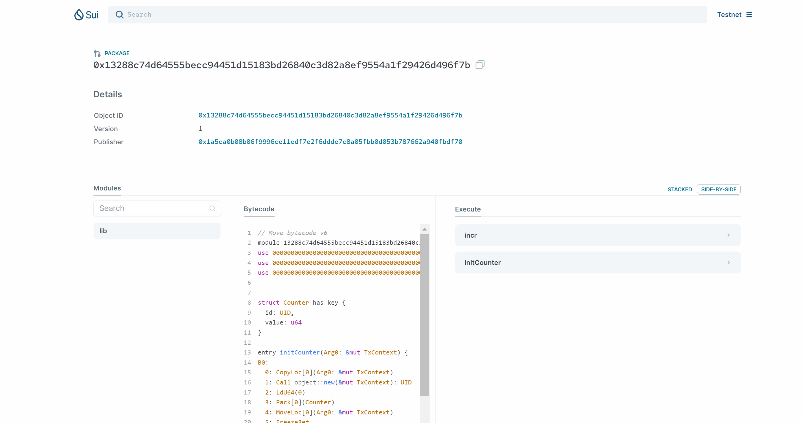
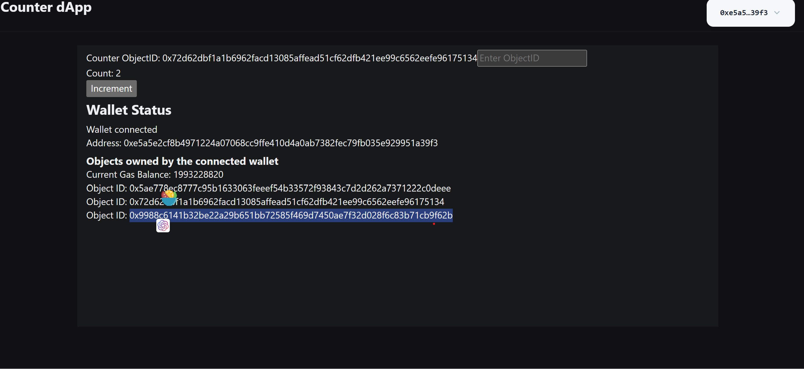

# 学习成果

1. counter package
- 源码：members/euraxluo/code/counter
- 部署事务：`https://suiexplorer.com/txblock/J92G5keFc3aLy22HsWLqMAzeTGsM4TigdGcGvxpPtgMp?network=testnet`
- package:`https://suiexplorer.com/object/0x13288c74d64555becc94451d15183bd26840c3d82a8ef9554a1f29426d496f7b?network=testnet`

2. counter dapp
- 源码：members/euraxluo/code/counter_dapp

3. coin package
- 源码：members/euraxluo/code/mycoin
- 部署事务：`https://suiexplorer.com/txblock/5byCWPGPgZKdQYwcBWb7Erhf5xHMNeaXXZp3UARhFh2m?module=lib&network=testnet`
- package：`https://suiexplorer.com/object/0x9d9431251ce33eb566a0aefe449e6f7d0882e8914338f7cdf2d8aac9a6c00a42?network=testnet`

4. nft package
- 源码：members/euraxluo/code/mynft
- 部署事务：`https://suiexplorer.com/txblock/FQsKgFSnBRx5gyGyjhGZhvaVnXoGdzS8FvuEnebJVvsc?network=mainnet`
- package：`https://suiexplorer.com/object/0x6a45ee1dbd7f8b56f2b09c99dc46e567832d3e7031939c241c7b60a90e3eb907?network=mainnet`
- nft-object:`https://suiexplorer.com/object/0x6a45ee1dbd7f8b56f2b09c99dc46e567832d3e7031939c241c7b60a90e3eb907?network=mainnet`

4. tictactoe package
- 源码：members/euraxluo/code/tictactoe
- 部署事务：`https://suiexplorer.com/txblock/BCX7cumTFNsixui2tnGuLq4Bpk4KziNQJAzw3Bhj54mm?network=testnet`
- package：`https://suiexplorer.com/object/0x1828137580fa60f0b6cec8a21965167759cbb00e3b373a58f624485e850bcfb0?network=testnet`

5. tictactoe dapp
- 源码：members/euraxluo/code/tictactoe-dapp
- deploy:`https://sui-startrek-euraxluo.vercel.app/`