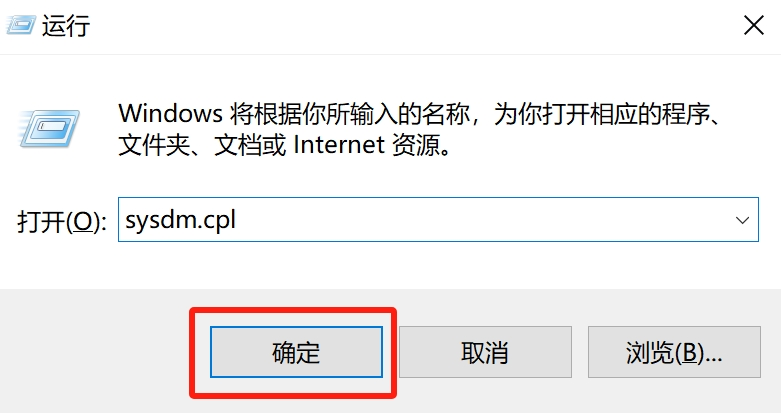

# Sui 开发环境配置

- 系统：Windows 10
- Windows 10（及以上）系统自带的包管理器 —— `winget`

## 安装 Rust

1. [下载 Rust 安装器](https://static.rust-lang.org/rustup/dist/x86_64-pc-windows-msvc/rustup-init.exe)

2. 双击运行 Rust 安装引导程序 —— `rustup-init.exe`，会自动检查是否是否安装有 Rust Visual C++ 相关依赖，没有就选择 `1`，会自动下载安装 Visual Studio。安装结束之后会继续执行 Rust 的安装程序，选择 `1`，使用默认配置安装。安装结束之后，Rust 的相关程序和数据存放在 `%USERPROFILE%\.cargo` 目录（即用户的主目录下的 `.cargo` 文件夹）下。

<details>
<summary>Output</summary>

```cmd
Rust Visual C++ prerequisites

Rust requires a linker and Windows API libraries but they don't seem to be
available.

These components can be acquired through a Visual Studio installer.

1) Quick install via the Visual Studio Community installer
   (free for individuals, academic uses, and open source).

2) Manually install the prerequisites
   (for enterprise and advanced users).

3) Don't install the prerequisites
   (if you're targeting the GNU ABI).

>1

info: downloading Visual Studio installer
  3.8 MiB /   3.8 MiB (100 %)   2.3 MiB/s in  2s ETA:  0s
info: running the Visual Studio install
info: rustup will continue once Visual Studio installation is complete


Welcome to Rust!

This will download and install the official compiler for the Rust
programming language, and its package manager, Cargo.

Rustup metadata and toolchains will be installed into the Rustup
home directory, located at:

  C:\Users\Joe\.rustup

This can be modified with the RUSTUP_HOME environment variable.

The Cargo home directory is located at:

  C:\Users\Joe\.cargo

This can be modified with the CARGO_HOME environment variable.

The cargo, rustc, rustup and other commands will be added to
Cargo's bin directory, located at:

  C:\Users\Joe\.cargo\bin

This path will then be added to your PATH environment variable by
modifying the HKEY_CURRENT_USER/Environment/PATH registry key.

You can uninstall at any time with rustup self uninstall and
these changes will be reverted.

Current installation options:


   default host triple: x86_64-pc-windows-msvc
     default toolchain: stable (default)
               profile: default
  modify PATH variable: yes

1) Proceed with installation (default)
2) Customize installation
3) Cancel installation
>1

info: profile set to 'default'
info: default host triple is x86_64-pc-windows-msvc
info: syncing channel updates for 'stable-x86_64-pc-windows-msvc'
703.8 KiB / 703.8 KiB (100 %) 202.9 KiB/s in  2s ETA:  0s
info: latest update on 2023-11-16, rust version 1.74.0 (79e9716c9 2023-11-13)
info: downloading component 'cargo'
  5.8 MiB /   5.8 MiB (100 %) 346.7 KiB/s in 16s ETA:  0s
info: downloading component 'clippy'
  2.1 MiB /   2.1 MiB (100 %) 323.4 KiB/s in  7s ETA:  0s
info: downloading component 'rust-docs'
 14.4 MiB /  14.4 MiB (100 %) 256.0 KiB/s in  2m  4s ETA:  0s
info: downloading component 'rust-std'
 19.7 MiB /  19.7 MiB (100 %) 310.3 KiB/s in  1m 29s ETA:  0s
info: downloading component 'rustc'
 58.4 MiB /  58.4 MiB (100 %) 245.8 KiB/s in  3m 55s ETA:  0s
info: downloading component 'rustfmt'
  1.6 MiB /   1.6 MiB (100 %) 208.0 KiB/s in  8s ETA:  0s
info: installing component 'cargo'
info: installing component 'clippy'
info: installing component 'rust-docs'
 14.4 MiB /  14.4 MiB (100 %)   3.4 MiB/s in  4s ETA:  0s
info: installing component 'rust-std'
 19.7 MiB /  19.7 MiB (100 %)  12.8 MiB/s in  1s ETA:  0s
info: installing component 'rustc'
 58.4 MiB /  58.4 MiB (100 %)  14.6 MiB/s in  4s ETA:  0s
info: installing component 'rustfmt'
info: default toolchain set to 'stable-x86_64-pc-windows-msvc'

  stable-x86_64-pc-windows-msvc installed - rustc 1.74.0 (79e9716c9 2023-11-13)


Rust is installed now. Great!

To get started you may need to restart your current shell.
This would reload its PATH environment variable to include
Cargo's bin directory (%USERPROFILE%\.cargo\bin).

Press the Enter key to continue.
```

</details>

3. 安装 Git

打开 Powershell，使用 winget 命令安装 Git：

```powershell
winget install --id Git.Git
```

<details>
<summary>Output</summary>

```powershell
PS C:\Users\Joe> winget install --id Git.Git
Found Git [Git.Git] Version 2.42.0.2
This application is licensed to you by its owner.
Microsoft is not responsible for, nor does it grant any licenses to, third-party packages.
Downloading https://github.com/git-for-windows/git/releases/download/v2.42.0.windows.2/Git-2.42.0.2-64-bit.exe
  ██████████████████████████████  58.4 MB / 58.4 MB
Successfully verified installer hash
Starting package install...
The installer will request to run as administrator, expect a prompt.
Successfully installed
```

</details>

4. 安装 LLVM

```powershell
winget install --id LLVM.LLVM
```

添加 LLVM 到 `PATH` 环境变量，让 Rust 编译链接程序能够使用 LLVM 的相应程序。

按下 `Win + R`，输入 `sysdm.cpl`，点击确定后会打开`系统属性`。



选择`高级`->`环境变量`-> `Path` ->`编辑`


选择`新建`->`浏览`，将 `C:\Program Files\LLVM\bin` 选择好（或者手动填写），点击`确定`保存即可。


<details>
<summary>Output</summary>

```powershell
PS C:\Users\Joe> winget install --id LLVM.LLVM
Found LLVM [LLVM.LLVM] Version 17.0.5
This application is licensed to you by its owner.
Microsoft is not responsible for, nor does it grant any licenses to, third-party packages.
Downloading https://github.com/llvm/llvm-project/releases/download/llvmorg-17.0.5/LLVM-17.0.5-win64.exe
  ██████████████████████████████   332 MB /  332 MB
Successfully verified installer hash
Starting package install...
Successfully installed
```

</details>

5. 编译安装 Sui

```
cargo install --locked --git https://github.com/MystenLabs/sui.git --branch devnet sui
```

这条命令表示从 Sui 的 GitHub 仓库下载 `devnet` 分支的 `sui` crate 的源码，并编译安装。安装成功后，可以在 `%USERPROFILE%\.cargo\bin` 目录下找到 `sui.exe` 二进制程序。

6. 当然，也可以选择编译 `main` 分支的代码，这种方式可以最快体验 Sui 的新特性，但也意味着，比稳定的分支更容易遇到 Bug。

使用 Powershell 克隆 Sui 的代码仓库：

```powershell
git clone git@github.com:MystenLabs/sui.git
```

<details>
<summary>Output</summary>

```powershell
PS C:\Users\Joe\i> git clone git@github.com:MystenLabs/sui.git
Cloning into 'sui'...
Enter passphrase for key '/c/Users/Joe/.ssh/id_ed25519':
remote: Enumerating objects: 257304, done.
remote: Counting objects: 100% (10073/10073), done.
remote: Compressing objects: 100% (4833/4833), done.
remote: Total 257304 (delta 6559), reused 8013 (delta 5108), pack-reused 247231
Receiving objects: 100% (257304/257304), 281.07 MiB | 5.75 MiB/s, done.
Resolving deltas: 100% (171390/171390), done.
Updating files: 100% (11359/11359), done.
```

</details>

再使用 `cd` 命令切换到 `sui` crate 的根目录，并执行安装命令，等待编译安装结束，`sui.exe` 就会自动添加到 `$HOME/.cargo/bin` 目录下：

```powershell
PS C:\Users\Joe\i\sui\crates\sui> cargo install --path .
```

> 注意：安装方法 5 和 6 任选一种即可，我个人倾向于使用最新的代码。

7. 检查 Sui 版本，确认是否成功安装：

```powershell
PS C:\Users\Joe\i\sui\crates\sui> sui --version

sui 1.15.0-6b9461d68a
```