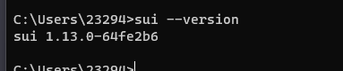

# 学习日志
# Roadmap 1

1. sui 环境的搭建
windows安装，按照官方文件安装所需组件
cURL
Rust and Cargo
Git CLI
CMake
C++ build tools
LLVM compiler
按照官方的方式安装没什么问题
sui的安装
二进制安装，为了方便使用，添加系统环境变量，但是不能更新

2. chorm安装sui钱包插件并创建账户
地址：0x0f8c0f0c599429b5d5ef728f14fd6a87b97caf256a72dd065cd57fb4c73b43f7

3. 创建发布包

sui move new <PACKAGE NAME> 启动 Sui 框架框架
Move.toml是包的清单文件，在项目根文件夹中自动生成。

Move.toml由三个部分组成：
[package]定义包的名称和版本号
[dependencies]定义该包所依赖的其他包，例如Sui标准库；其他第三方依赖项也应添加到此处
[addresses]为包源代码中的地址定义别名

sui move build 打包
sui move test 测试 需要些测试用例
sui client publish --gas-budget 1000000000 发布
sui client call --function mint --module my_first_package --package  0x1bf83ee168c3fd3c5f041810fd8ea782afe1bbd93fd3004128ff98a0410a1fc6 --gas-budget 10000000

结果
[warn] Client/Server api version mismatch, client api version : 1.13.0, server api version : 1.14.1
UPDATING GIT DEPENDENCY https://github.com/MystenLabs/sui.git
INCLUDING DEPENDENCY Sui
INCLUDING DEPENDENCY MoveStdlib
BUILDING my_first_package
warning[W09009]: unused struct field
   ┌─ .\sources\my_module.move:11:9
   │
11 │         id: UID,
   │         ^^ The 'id' field of the 'Sword' type is unused
   │
   = This warning can be suppressed with '#[allow(unused_field)]' applied to the 'module' or module member ('const', 'fun', or 'struct')

Successfully verified dependencies on-chain against source.
----- Transaction Digest ----
7R4xq9p9f3AjcdG5vmTeuXqANdyBxLRWE3xUJFZnw42f
----- Transaction Data ----
Transaction Signature: [Signature(Ed25519SuiSignature(Ed25519SuiSignature([0, 117, 11, 180, 161, 29, 7, 153, 156, 119, 225, 230, 96, 171, 38, 113, 82, 171, 97, 42, 121, 1, 195, 104, 186, 238, 227, 245, 142, 112, 39, 226, 234, 94, 131, 70, 201, 129, 157, 243, 37, 116, 156, 72, 79, 115, 58, 97, 54, 159, 224, 131, 206, 33, 87, 186, 67, 85, 74, 189, 243, 165, 157, 168, 7, 27, 170, 184, 50, 203, 128, 140, 228, 83, 213, 148, 157, 198, 88, 25, 162, 221, 242, 173, 85, 148, 91, 227, 119, 68, 82, 213, 244, 237, 225, 60, 149])))]
Transaction Kind : Programmable
Inputs: [Pure(SuiPureValue { value_type: Some(Address), value: "0x42c3c712f41eca8bdd00c4d59b21bf715ff21eeedb129686711fde9becb3b347" })]
Commands: [
  Publish(<modules>,0x0000000000000000000000000000000000000000000000000000000000000001,0x0000000000000000000000000000000000000000000000000000000000000002),
  TransferObjects([Result(0)],Input(0)),
]

Sender: 0x42c3c712f41eca8bdd00c4d59b21bf715ff21eeedb129686711fde9becb3b347
Gas Payment: Object ID: 0xa95a7894ad4a99138003a2f43c95c91d83550e9a5790d026e60d2444fd26ab80, version: 0xd, digest: HpWBtTZFoGVM5GvsJQXW4vnV85Ck6whVUAPpz5x8Hqnf
Gas Owner: 0x42c3c712f41eca8bdd00c4d59b21bf715ff21eeedb129686711fde9becb3b347
Gas Price: 1000
Gas Budget: 1000000000

----- Transaction Effects ----
Status : Success
Created Objects:
  - ID: 0x1bf83ee168c3fd3c5f041810fd8ea782afe1bbd93fd3004128ff98a0410a1fc6 , Owner: Immutable
  - ID: 0x1e9278d2250fceb7bb6a8ab3b97fb1de20b3c55c284c8a54ba3421ea6bb24d46 , Owner: Account Address ( 0x42c3c712f41eca8bdd00c4d59b21bf715ff21eeedb129686711fde9becb3b347 )
  - ID: 0x20764c2ba74775d0f3a8db07f705c49ca7b3dec90370bae648edf34922328a4a , Owner: Account Address ( 0x42c3c712f41eca8bdd00c4d59b21bf715ff21eeedb129686711fde9becb3b347 )
Mutated Objects:
  - ID: 0xa95a7894ad4a99138003a2f43c95c91d83550e9a5790d026e60d2444fd26ab80 , Owner: Account Address ( 0x42c3c712f41eca8bdd00c4d59b21bf715ff21eeedb129686711fde9becb3b347 )

----- Events ----
Array []
----- Object changes ----
Array [
    Object {
        "type": String("mutated"),
        "sender": String("0x42c3c712f41eca8bdd00c4d59b21bf715ff21eeedb129686711fde9becb3b347"),
        "owner": Object {
            "AddressOwner": String("0x42c3c712f41eca8bdd00c4d59b21bf715ff21eeedb129686711fde9becb3b347"),
        },
        "objectType": String("0x2::coin::Coin<0x2::sui::SUI>"),
        "objectId": String("0xa95a7894ad4a99138003a2f43c95c91d83550e9a5790d026e60d2444fd26ab80"),
        "version": String("14"),
        "previousVersion": String("13"),
        "digest": String("HBcsUhm1hmmsfQotU4z859bE8BxKSsiXmqeSyGxmUNBs"),
    },
    Object {
        "type": String("published"),
        "packageId": String("0x1bf83ee168c3fd3c5f041810fd8ea782afe1bbd93fd3004128ff98a0410a1fc6"),
        "version": String("1"),
        "digest": String("H7ciJ3EvMqueXLhvdYAdNrB3rnqvdE5EoRfapaBXakpY"),
        "modules": Array [
            String("my_module"),
        ],
    },
    Object {
        "type": String("created"),
        "sender": String("0x42c3c712f41eca8bdd00c4d59b21bf715ff21eeedb129686711fde9becb3b347"),
        "owner": Object {
            "AddressOwner": String("0x42c3c712f41eca8bdd00c4d59b21bf715ff21eeedb129686711fde9becb3b347"),
        },
        "objectType": String("0x1bf83ee168c3fd3c5f041810fd8ea782afe1bbd93fd3004128ff98a0410a1fc6::my_module::Forge"),
        "objectId": String("0x1e9278d2250fceb7bb6a8ab3b97fb1de20b3c55c284c8a54ba3421ea6bb24d46"),
        "version": String("14"),
        "digest": String("886fgU5Z1G91GUCjnBNkviJcjTVeApXCztmhVa73mUe5"),
    },
    Object {
        "type": String("created"),
        "sender": String("0x42c3c712f41eca8bdd00c4d59b21bf715ff21eeedb129686711fde9becb3b347"),
        "owner": Object {
            "AddressOwner": String("0x42c3c712f41eca8bdd00c4d59b21bf715ff21eeedb129686711fde9becb3b347"),
        },
        "objectType": String("0x2::package::UpgradeCap"),
        "objectId": String("0x20764c2ba74775d0f3a8db07f705c49ca7b3dec90370bae648edf34922328a4a"),
        "version": String("14"),
        "digest": String("2ga8AgedZimUEY4wMWTKNoHXiRhP7W6zGXU4pKKiYrnU"),
    },
]
----- Balance changes ----
Array [
    Object {
        "owner": Object {
            "AddressOwner": String("0x42c3c712f41eca8bdd00c4d59b21bf715ff21eeedb129686711fde9becb3b347"),
        },
        "coinType": String("0x2::sui::SUI"),
        "amount": String("-11437080"),
    },
]

