# 学习日志

# 第一周.web3入门

## 1.安装Move 开发环境 2023.11.13，14

- 1.1先安装rust

下载rustup-init.exe[Getting started - Rust Programming Language](https://www.rust-lang.org/learn/get-started)

教程：https://zhuanlan.zhihu.com/p/556088822

- 1.2安装sui

  替换cargo源https://blog.csdn.net/qq_46660921/article/details/128201244

  - 来到 .cargo 目录下，windows默认目录是C:\User\用户名\.cargo，若是修改过目录的话查看环境变量CARGO_HOME的变量值，总之，来到 .cargo 目录下
  - 打开或原地创建 config文件，无文件扩展名，内容如下：

  ~~~
  # `source` 就是存储有关要更换的来源名称
  [source.tuna]
  registry = "https://mirrors.tuna.tsinghua.edu.cn/git/crates.io-index.git"
  
  [source.crates-io]
  replace-with = 'tuna'
  ~~~

打开powershell，输入以下命令

~~~
cargo install --locked --git https://github.com/MystenLabs/sui.git --branch devnet sui
~~~

> cargo是Rust的构建工具和包管理器，是rustup安装后自带的，所以要先安转rust,类似于npm之于node,pip之于python

耐心等待。。。。。。。。记得开启全局梯子

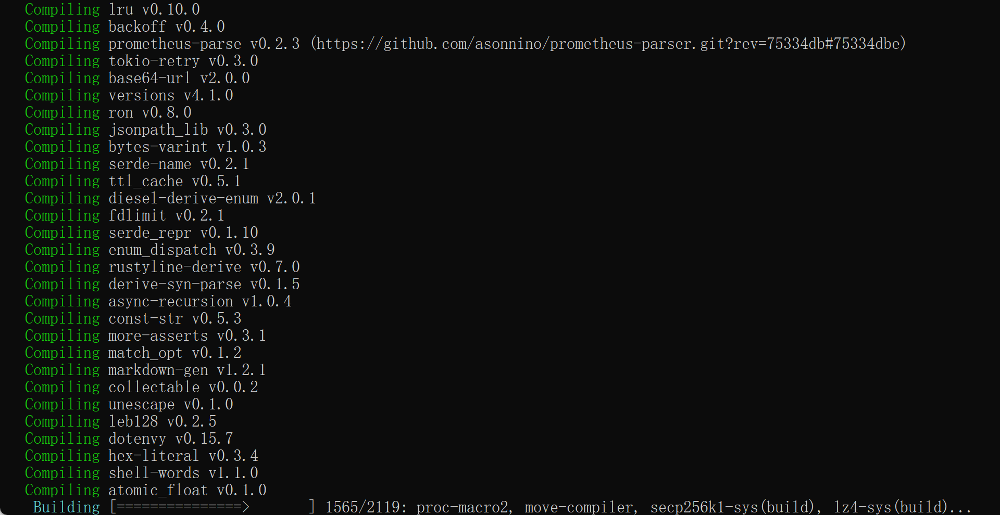

- 1.3安装失败，使用新的方法

https://jeffierw.notion.site/jeffierw/SuiStartrek-Problems-b0a25bbaefe14b679f71d0bf17e27e5a

https://github.com/MystenLabs/sui/releases

先下载sui二级制文件，

然后解压，修改对应exe文件名，

最后一步配置环境变量名即可

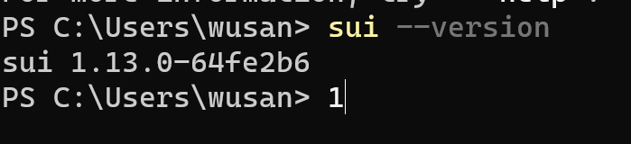

## 2.安装web3钱包

https://mp.weixin.qq.com/s/-_hCFUO-62hv9amPzmJdeg

- 2.1安装谷歌插件

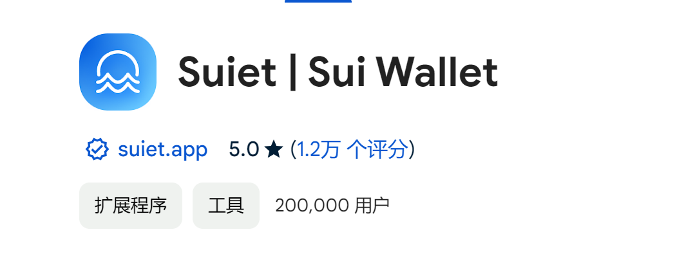

- 2.2创建新账户。密码需要复杂些

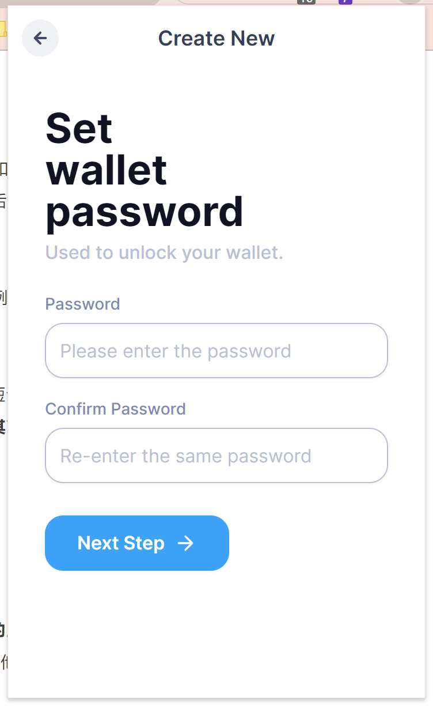

- 2.3创建完登录

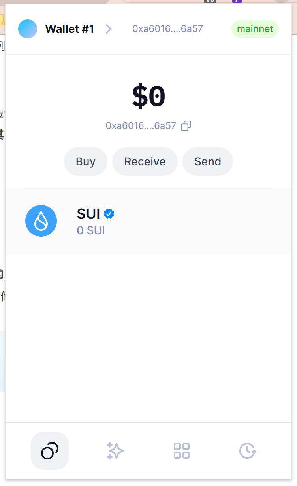

我的钱包：0x77cc74df936b450451825d188d1850d400351a87ab203e701dd10869d2899986

## 3.学习ERC20

ERC是"EthereumRequest for Comment"也就是“以太坊征求意见协议”的缩写。

借助ERC-20，用户可以通过持有其中**一种储值卡（token）很方便地享受整个生态的各种服务**；商户（开发者）则节约了开发运营成本、同时提升了获取用户的效率；而物业公司（以太坊基金会和矿工）则可以通过做大生态体量实现更多的租金（ETH增值）和储值卡结算手续费（Gas费用）收入。

https://docs.sui.io/guides/developer/first-app/write-package

- 3.1  创建程序包,打开powershell执行以下命令

~~~shell
sui move new my_first_package
~~~

执行成功，使用vscode打开文件如下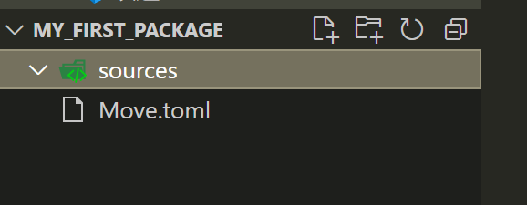

- 3.2 在sources下新建文件my_module.move

  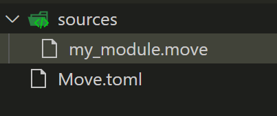

- 复制一下代码到my_module.move

- 以下代码分为三个部分，1.引入，2.类型定义，3.函数定义

~~~rust
module my_first_package::my_module {

    // Part 1: Imports
    use sui::object::{Self, UID};
    use sui::transfer;
    use sui::tx_context::{Self, TxContext};

    // Part 2: Struct definitions
    struct Sword has key, store {
        id: UID,
        magic: u64,
        strength: u64,
    }

    struct Forge has key, store {
        id: UID,
        swords_created: u64,
    }

    // Part 3: Module initializer to be executed when this module is published
    fun init(ctx: &mut TxContext) {
        let admin = Forge {
            id: object::new(ctx),
            swords_created: 0,
        };
        // Transfer the forge object to the module/package publisher
        transfer::transfer(admin, tx_context::sender(ctx));
    }

    // Part 4: Accessors required to read the struct attributes
    public fun magic(self: &Sword): u64 {
        self.magic
    }

    public fun strength(self: &Sword): u64 {
        self.strength
    }

    public fun swords_created(self: &Forge): u64 {
        self.swords_created
    }

    // Part 5: Public/entry functions (introduced later in the tutorial)

    // Part 6: Private functions (if any)

}
~~~

- 3.3打包
- 执行以下命令

~~~
sui move build
~~~

- 打包成功

  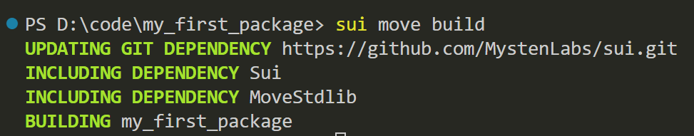

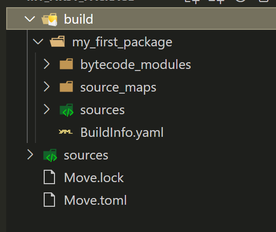

- 3.4测试打包

- 执行以下命令

  ~~~
  sui move test
  ~~~

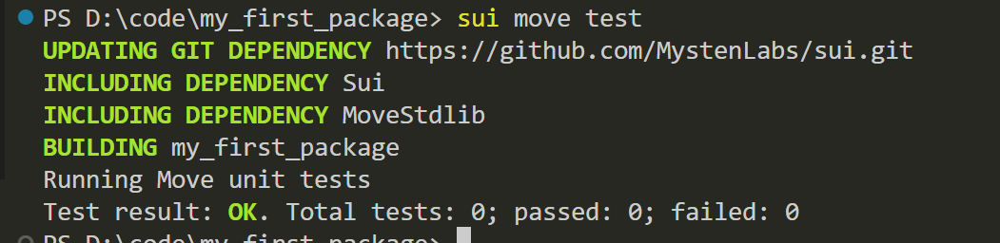

测试通过，因为测试为0，也就没有失败。

在my_module.move中加入以下代码

```rust
    #[test]
    public fun test_sword_create() {
    use sui::transfer;

        // Create a dummy TxContext for testing
        let ctx = tx_context::dummy();

        // Create a sword
        let sword = Sword {
            id: object::new(&mut ctx),
            magic: 42,
            strength: 7,
        };

        // Check if accessor functions return correct values
        assert!(magic(&sword) == 42 && strength(&sword) == 7, 1);
        // Create a dummy address and transfer the sword
        let dummy_address = @0xCAFE;
        transfer::transfer(sword, dummy_address);
    }
```

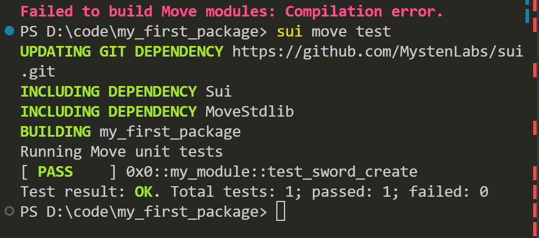

单元测试通过


增加以下特殊测试

~~~rust
    public entry fun sword_create(magic: u64, strength: u64, recipient: address, ctx: &mut TxContext) {
        use sui::transfer;

        // create a sword
        let sword = Sword {
            id: object::new(ctx),
            magic: magic,
            strength: strength,
        };
        // transfer the sword
        transfer::transfer(sword, recipient);
    }

    public entry fun sword_transfer(sword: Sword, recipient: address, _ctx: &mut TxContext) {
        use sui::transfer;
        // transfer the sword
        transfer::transfer(sword, recipient);
    }
~~~

~~~rust
    #[test]
    fun test_sword_transactions() {
        use sui::test_scenario;

        // create test addresses representing users
        let admin = @0xBABE;
        let initial_owner = @0xCAFE;
        let final_owner = @0xFACE;

        // first transaction to emulate module initialization
        let scenario_val = test_scenario::begin(admin);
        let scenario = &mut scenario_val;
        {
            init(test_scenario::ctx(scenario));
        };
        // second transaction executed by admin to create the sword
        test_scenario::next_tx(scenario, admin);
        {
            // create the sword and transfer it to the initial owner
            sword_create(42, 7, initial_owner, test_scenario::ctx(scenario));
        };
        // third transaction executed by the initial sword owner
        test_scenario::next_tx(scenario, initial_owner);
        {
            // extract the sword owned by the initial owner
            let sword = test_scenario::take_from_sender<Sword>(scenario);
            // transfer the sword to the final owner
            sword_transfer(sword, final_owner, test_scenario::ctx(scenario))
        };
        // fourth transaction executed by the final sword owner
        test_scenario::next_tx(scenario, final_owner);
        {
            // extract the sword owned by the final owner
            let sword = test_scenario::take_from_sender<Sword>(scenario);
            // verify that the sword has expected properties
            assert!(magic(&sword) == 42 && strength(&sword) == 7, 1);
            // return the sword to the object pool (it cannot be simply "dropped")
            test_scenario::return_to_sender(scenario, sword)
        };
        test_scenario::end(scenario_val);
    }
~~~

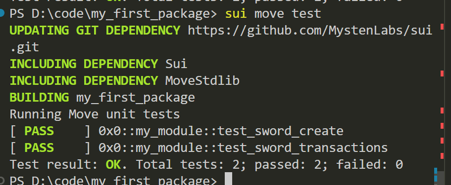

通过测试

- 3.5发布包

- ~~~
  sui client publish --gas-budget 10000000
  ~~~


## 4.完成ERC20的发布

~~~
查看地址
sui client addresses
切换地址
sui client switch --address <addr>

导入地址，用助记词
sui keytool import "<助记词>" ed25519


列出当前所有网络别名: 
sui client envs

添加新的网络别名: 
sui client new-env --alias <ALIAS> --rpc <RPC>

切换网络: 
sui client switch --env [network alias]


查询当前保存了密钥的地址: 
sui client addresses
查询当前启用的地址: 
sui client active-address

列出所拥有的 gas objects:
sui client gas

发布
sui client publish --gas-budget 10000000

~~~


- 发布成功

~~~
PS D:\code\Hello_sui> sui client publish --gas-budget 100000000
[warn] Client/Server api version mismatch, client api version : 1.14.0, server api version : 1.14.1
UPDATING GIT DEPENDENCY https://github.com/MystenLabs/sui.git
INCLUDING DEPENDENCY Sui
INCLUDING DEPENDENCY MoveStdlib
BUILDING Hello_sui
Successfully verified dependencies on-chain against source.
----- Transaction Digest ----
CN7Wxz4wdinnWSKgBp8AULJB9P5eS2esDmBcN414J6nD
╭─────────────────────────────────────────────────────────────────────────────────────────────────────────────────────────────────────────────────────────────╮
│ Transaction Data                                                                                                                                            │
├─────────────────────────────────────────────────────────────────────────────────────────────────────────────────────────────────────────────────────────────┤
│ Sender: 0x77cc74df936b450451825d188d1850d400351a87ab203e701dd10869d2899986                                                                                  │
│ Gas Owner: 0x77cc74df936b450451825d188d1850d400351a87ab203e701dd10869d2899986                                                                           
    │
│ Gas Budget: 100000000                                                                                                                                   
    │
│ Gas Price: 1000                                                                                                                                         
    │
│ Gas Payment:                                                                                                                                            
    │
│  ┌──                                                                                                                                                    
    │
│  │ ID: 0x6799bf7fe1de0e7ebc65572f4ab4263d3fa70f0352a278377cdbe6a1953b1bac                                                                               
    │
│  │ Version: 12675251                                                                                                                                    
    │
│  │ Digest: 6t5y3DJG5qk9gN8GB2PVxq4u9ZbYVJTMaBcYrCprsmVL                                                                                                 
    │
│  └──                                                                                                                                                    
    │
│                                                                                                                                                         
    │
│ Transaction Kind : Programmable                                                                                                                         
    │
│ Inputs: [Pure(SuiPureValue { value_type: Some(Address), value: "0x77cc74df936b450451825d188d1850d400351a87ab203e701dd10869d2899986" })]                 
    │
│ Commands: [                                                                                                                                             
    │
│   Publish(<modules>,0x0000000000000000000000000000000000000000000000000000000000000001,0x0000000000000000000000000000000000000000000000000000000000000002), │
│   TransferObjects([Result(0)],Input(0)),                                                                                                                
    │
│ ]                                                                                                                                                       
    │
│                                                                                                                                                         
    │
│                                                                                                                                                         
    │
│ Signatures:                                                                                                                                             
    │
│    oA/CQaZ6Pv7fMC5DpBwlSEl3iRsz5M8dTR8xuBmC3HZoIrCzv0El2XUDQql6iCD1s3AUjZYwMBnf+d4p0kJ5BQ==                                                             
    │
│                                                                                                                                                         
    │
╰─────────────────────────────────────────────────────────────────────────────────────────────────────────────────────────────────────────────────────────────╯
╭───────────────────────────────────────────────────────────────────────────────────────────────────╮
│ Transaction Effects                                                                               │
├───────────────────────────────────────────────────────────────────────────────────────────────────┤
│ Digest: CN7Wxz4wdinnWSKgBp8AULJB9P5eS2esDmBcN414J6nD                                              │
│ Status: Success                                                                                   │
│ Executed Epoch: 195                                                                               │
│                                                                                                   │
│ Created Objects:                                                                                  │
│  ┌──                                                                                              │
│  │ ID: 0x5e0e640f53503187a71c113ee360b6b084a1186d8a9fedab68c40335d34465f6                         │
│  │ Owner: Immutable                                                                               │
│  │ Version: 12675252                                                                              │
│  │ Digest: G52vrdJ4XnqMUDTTMNAs6ZWxEoRZHpt1YUgftEjoGS91                                           │
│  └──                                                                                              │
│  ┌──                                                                                              │
│  │ ID: 0x7b71979df0ea01c31e821719c38745529c24b2e1244ec5729c388f7b2f6e71b0                         │
│  │ Owner: Account Address ( 0x77cc74df936b450451825d188d1850d400351a87ab203e701dd10869d2899986 )  │
│  │ Version: 12675252                                                                              │
│  │ Digest: EgdW9dJ1beEY7fWBDKd62Fd2f4ePTR8W8ri1tHgnPXHf                                           │
│  └──                                                                                              │
│  ┌──                                                                                              │
│  │ ID: 0x9dcd2d63a6b69352c06eeb2e4237aa59a5f70cf78db4006de745b39ca673cd89                         │
│  │ Owner: Immutable                                                                               │
│  │ Version: 1                                                                                     │
│  │ Digest: 6GpkkyqePc2EB6dZjRppkZjh8ve8ke6Vw2areBtYKJWv                                           │
│  └──                                                                                              │
│  ┌──                                                                                              │
│  │ ID: 0xb5f03a400e1ccd1def0b1f866502e445131d58ec7aa60444f12f76df79cf9ea9                         │
│  │ Owner: Account Address ( 0x77cc74df936b450451825d188d1850d400351a87ab203e701dd10869d2899986 )  │
│  │ Version: 12675252                                                                              │
│  │ Digest: 21SBaMiHmw6ghhNVvTiRi4R1pSxjiZrUtYnigVN5soPJ                                           │
│  └──                                                                                              │
│                                                                                                   │
│ Mutated Objects:                                                                                  │
│  ┌──                                                                                              │
│  │ ID: 0x6799bf7fe1de0e7ebc65572f4ab4263d3fa70f0352a278377cdbe6a1953b1bac                         │
│  │ Owner: Account Address ( 0x77cc74df936b450451825d188d1850d400351a87ab203e701dd10869d2899986 )  │
│  │ Version: 12675252                                                                              │
│  │ Digest: A1xb77c4y5J7JAmWhqsEBv42vZN4EjU6xbg9DhsnQhRG                                           │
│  └──                                                                                              │
│                                                                                                   │
│ Gas Object:                                                                                       │
│  ┌──                                                                                              │
│  │ ID: 0x6799bf7fe1de0e7ebc65572f4ab4263d3fa70f0352a278377cdbe6a1953b1bac                         │
│  │ Owner: Account Address ( 0x77cc74df936b450451825d188d1850d400351a87ab203e701dd10869d2899986 )  │
│  │ Version: 12675252                                                                              │
│  │ Digest: A1xb77c4y5J7JAmWhqsEBv42vZN4EjU6xbg9DhsnQhRG                                           │
│  └──                                                                                              │
│                                                                                                   │
│ Gas Cost Summary:                                                                                 │
│    Storage Cost: 12418400                                                                         │
│    Computation Cost: 1000000                                                                      │
│    Storage Rebate: 978120                                                                         │
│    Non-refundable Storage Fee: 9880                                                               │
│                                                                                                   │
│ Transaction Dependencies:                                                                         │
│    3pcBpJcaTZJstk5Ssu13zXjSaNQX2Xw1U2F66C9dajq5                                                   │
│    Bkvb1fhqAgtZFiV16EweRNXFgutju5LV87tVA8W6c7za                                                   │
│    GZpbBA5MmZ3pxLWCF92G14bjv6j5HpRPA9RpqYhnToXB                                                   │
╰───────────────────────────────────────────────────────────────────────────────────────────────────╯
----- Events ----
Array []
----- Object changes ----

Created Objects:
 ┌──
 │ ObjectID: 0x5e0e640f53503187a71c113ee360b6b084a1186d8a9fedab68c40335d34465f6
 │ Sender: 0x77cc74df936b450451825d188d1850d400351a87ab203e701dd10869d2899986
 │ Owner: Immutable
 │ ObjectType: 0x2::coin::CoinMetadata<0x9dcd2d63a6b69352c06eeb2e4237aa59a5f70cf78db4006de745b39ca673cd89::mycoin::MYCOIN>
 │ Version: 12675252
 │ Digest: G52vrdJ4XnqMUDTTMNAs6ZWxEoRZHpt1YUgftEjoGS91
 └──
 ┌──
 │ ObjectID: 0x7b71979df0ea01c31e821719c38745529c24b2e1244ec5729c388f7b2f6e71b0
 │ Sender: 0x77cc74df936b450451825d188d1850d400351a87ab203e701dd10869d2899986
 │ Owner: Account Address ( 0x77cc74df936b450451825d188d1850d400351a87ab203e701dd10869d2899986 )
 │ ObjectType: 0x2::coin::TreasuryCap<0x9dcd2d63a6b69352c06eeb2e4237aa59a5f70cf78db4006de745b39ca673cd89::mycoin::MYCOIN>
 │ Version: 12675252
 │ Digest: EgdW9dJ1beEY7fWBDKd62Fd2f4ePTR8W8ri1tHgnPXHf
 └──
 ┌──
 │ ObjectID: 0xb5f03a400e1ccd1def0b1f866502e445131d58ec7aa60444f12f76df79cf9ea9
 │ Sender: 0x77cc74df936b450451825d188d1850d400351a87ab203e701dd10869d2899986
 │ Owner: Account Address ( 0x77cc74df936b450451825d188d1850d400351a87ab203e701dd10869d2899986 )
 │ ObjectType: 0x2::package::UpgradeCap
 │ Version: 12675252
 │ Digest: 21SBaMiHmw6ghhNVvTiRi4R1pSxjiZrUtYnigVN5soPJ
 └──

Mutated Objects:
 ┌──
 │ ObjectID: 0x6799bf7fe1de0e7ebc65572f4ab4263d3fa70f0352a278377cdbe6a1953b1bac
 │ Sender: 0x77cc74df936b450451825d188d1850d400351a87ab203e701dd10869d2899986
 │ Owner: Account Address ( 0x77cc74df936b450451825d188d1850d400351a87ab203e701dd10869d2899986 )
 │ ObjectType: 0x2::coin::Coin<0x2::sui::SUI>
 │ Version: 12675252
 │ Digest: A1xb77c4y5J7JAmWhqsEBv42vZN4EjU6xbg9DhsnQhRG
 └──

Published Objects:
 ┌──
 │ PackageID: 0x9dcd2d63a6b69352c06eeb2e4237aa59a5f70cf78db4006de745b39ca673cd89
 │ Version: 1
 │ Digest: 6GpkkyqePc2EB6dZjRppkZjh8ve8ke6Vw2areBtYKJWv
 | Modules: mycoin
 └──
----- Balance changes ----
 ┌──
 │ Owner: Account Address ( 0x77cc74df936b450451825d188d1850d400351a87ab203e701dd10869d2899986 )
 │ CoinType: 0x2::sui::SUI
 │ Amount: -12440280
 └──
~~~


## 5.前端方向的 Hello world

- 全局安装pnpm
- 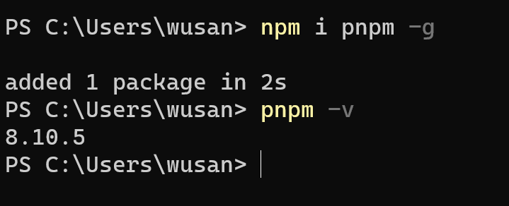
- 创建项目
- 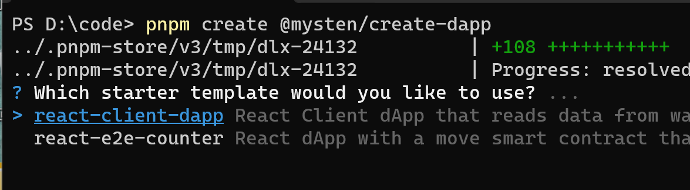

  - 

  - ```
    
    1.发布合约
    cd move
    sui client publish --gas-budget 100000000 counter
    
    2.把`src/constants.ts` 文件的PACKAGE_ID修改为发布的PACKAGE_ID
    
    注意devnet的放到devnet下
    
    3.启动项目
    pnpm dev
     
    链接钱包
    创建计数器
    ```

		- 
