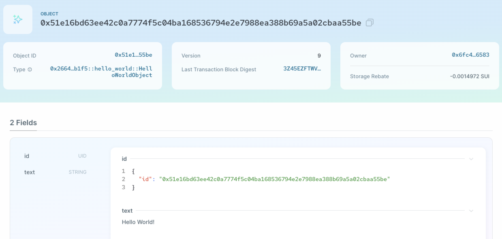
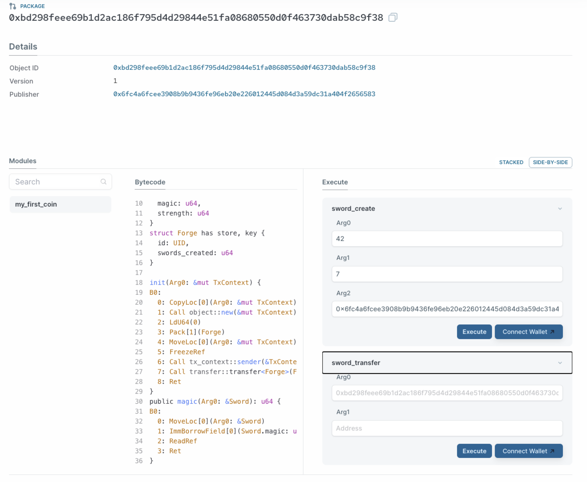
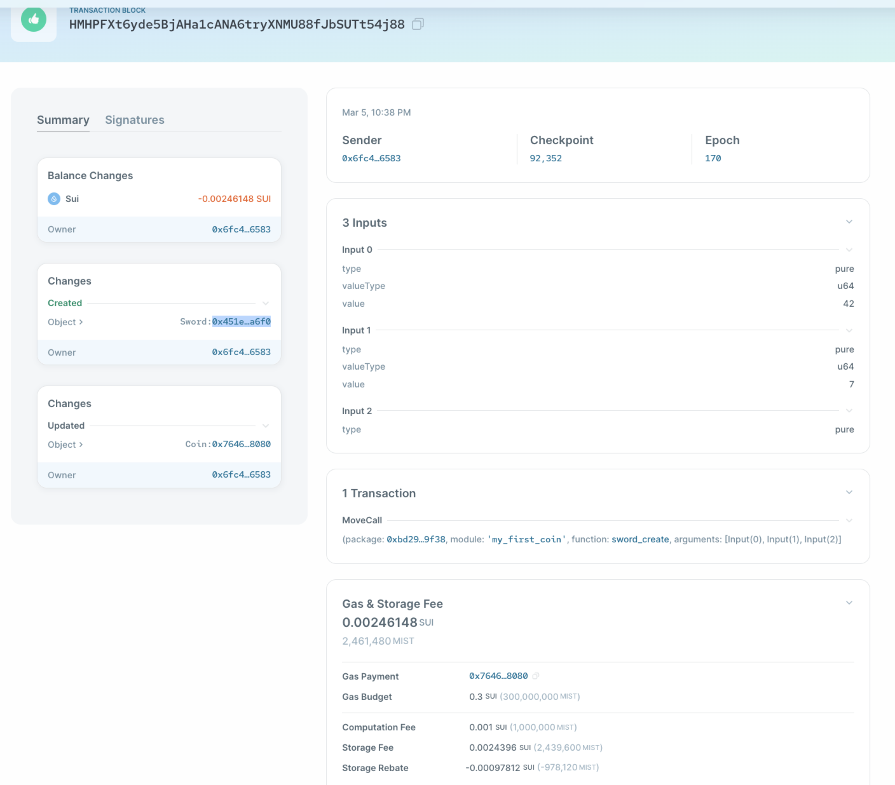
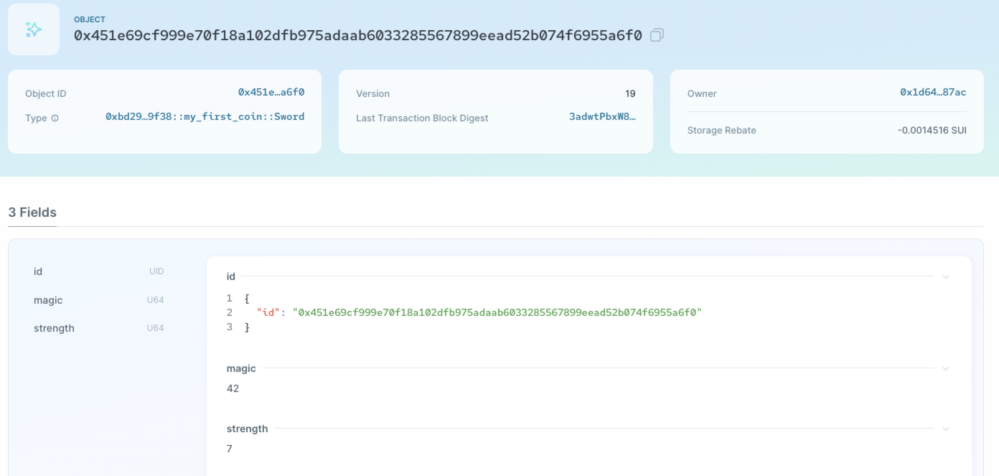
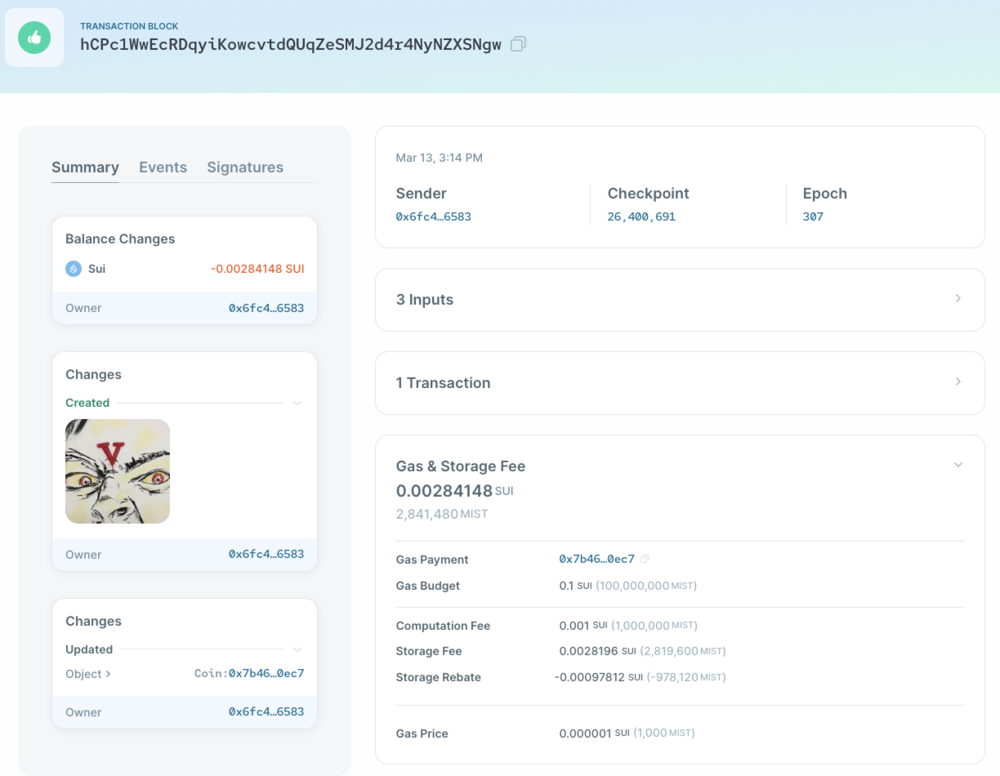
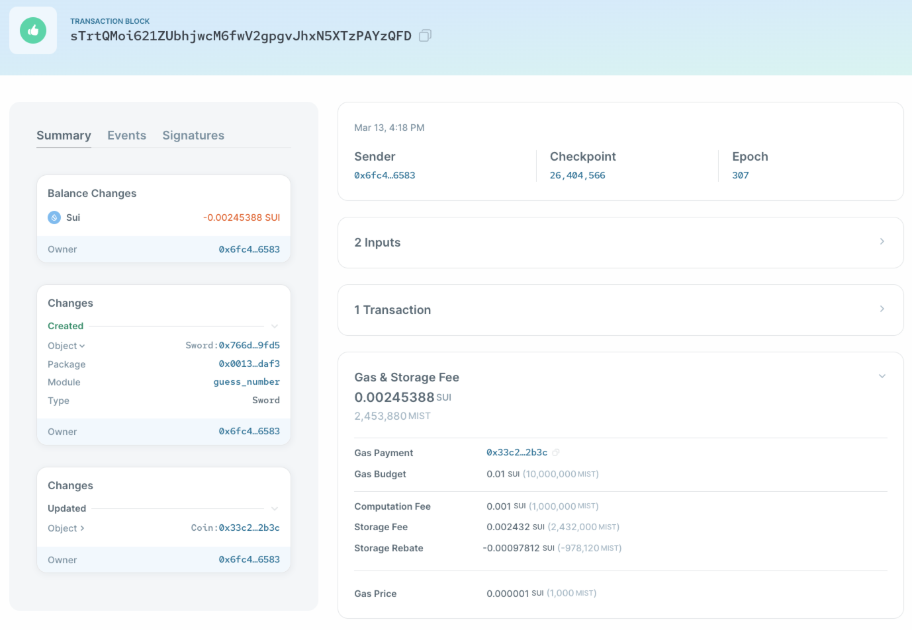
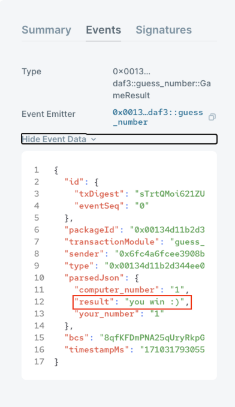
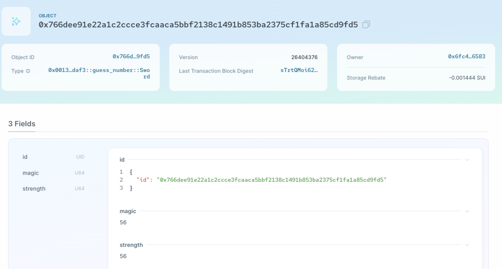

# 学习日志

# Roadmap 1

## 1 配置环境

### 1.1 安装依赖

根据官方文档，按需要安装一些依赖 [Install Sui](https://docs.sui.io/guides/developer/getting-started/sui-install#prerequisites)

### 1.2 安装Sui二进制文件

1. cargo install 直接下载sui binaries

```
cargo install --locked --git https://github.com/MystenLabs/sui.git --branch devnet sui
```
2. 检验binaries是否安装成功
```
sui --version
```
终端输出
```
sui 1.20.0-f9dd2b1e1
```

### 1.3 Sui CLI

1. sui client

```
sui-client 
Client for interacting with the Sui network

USAGE:
    sui client [OPTIONS] [SUBCOMMAND]

OPTIONS:
        --client.config <CONFIG>    Sets the file storing the state of our user accounts (an empty
                                    one will be created if missing)
    -h, --help                      Print help information
        --json                      Return command outputs in json format

SUBCOMMANDS:
    active-address            Default address used for commands when none specified
    active-env                Default environment used for commands when none specified
    addresses                 Obtain the Addresses managed by the client
    call                      Call Move function
    create-example-nft        Create an example NFT
    dynamic-field             Query a dynamic field by its address
    envs                      List all Sui environments
    execute-signed-tx         Execute a Signed Transaction. This is useful when the user prefers
                                  to sign elsewhere and use this command to execute
    gas                       Obtain all gas objects owned by the address
    help                      Print this message or the help of the given subcommand(s)
    merge-coin                Merge two coin objects into one coin
    new-address               Generate new address and keypair with keypair scheme flag {ed25519
                                  | secp256k1 | secp256r1} with optional derivation path, default to
                                  m/44'/784'/0'/0'/0' for ed25519 or m/54'/784'/0'/0/0 for secp256k1
                                  or m/74'/784'/0'/0/0 for secp256r1
    new-env                   Add new Sui environment
    object                    Get object info
    objects                   Obtain all objects owned by the address
    pay                       Pay coins to recipients following specified amounts, with input
                                  coins. Length of recipients must be the same as that of amounts
    pay_all_sui               Pay all residual SUI coins to the recipient with input coins,
                                  after deducting the gas cost. The input coins also include the
                                  coin for gas payment, so no extra gas coin is required
    pay_sui                   Pay SUI coins to recipients following following specified amounts,
                                  with input coins. Length of recipients must be the same as that of
                                  amounts. The input coins also include the coin for gas payment, so
                                  no extra gas coin is required
    publish                   Publish Move modules
    serialize-transfer-sui    Serialize a transfer that can be signed. This is useful when user
                                  prefers to take the data to sign elsewhere
    split-coin                Split a coin object into multiple coins
    switch                    Switch active address and network(e.g., devnet, local rpc server)
    transfer                  Transfer object
    transfer-sui              Transfer SUI, and pay gas with the same SUI coin object. If amount
                                  is specified, only the amount is transferred; otherwise the entire
                                  object is transferred
    verify-source             Verify local Move packages against on-chain packages, and
                                  optionally their dependencies
```

2. 管理网络
```
切换网络: sui client switch --env [network alias]
默认网络别名:
本地网 localnet: http://0.0.0.0:9000
开发网 devnet: https://fullnode.devnet.sui.io:443
列出当前所有网络别名: sui client envs
添加新的网络别名: sui client new-env --alias <ALIAS> --rpc <RPC>
```
3. 查询启用地址和Gas Object
```
查询当前保存了密钥的地址: sui client addresses
查询当前启用的地址: sui client active-address
列出所拥有的 gas objects: sui client gas
```

### 1.4 领水

devnet领水
```
curl --location --request POST 'https://faucet.devnet.sui.io/gas' --header 'Content-Type: application/json' --data-raw '{"FixedAmountRequest":{"recipient":"0x6fc4a6fcee3908b9b9436fe96eb20e226012445d084d3a59dc31a404f2656583"}}'
```
其他领水方法: https://docs.sui.io/guides/developer/getting-started/get-coins

## 2 发布合约
### 2.1 hello_world

```
sui move new hello_world
```

hello_world.move
```
module hello_world::hello_world {

    use std::string;
    use sui::object::{Self, UID};
    use sui::transfer;
    use sui::tx_context::{Self, TxContext};

    /// An object that contains an arbitrary string
    struct HelloWorldObject has key, store {
        id: UID,
        /// A string contained in the object
        text: string::String
    }

    #[lint_allow(self_transfer)]
    public fun mint(ctx: &mut TxContext) {
        let object = HelloWorldObject {
            id: object::new(ctx),
            text: string::utf8(b"Hello World!")
        };
        transfer::public_transfer(object, tx_context::sender(ctx));
    }

}
```

编译
```
sui move build
```

发布
```
sui client publish --gas-budget 10000000
```
部署成功，输出如下
```
UPDATING GIT DEPENDENCY https://github.com/MystenLabs/sui.git
INCLUDING DEPENDENCY Sui
INCLUDING DEPENDENCY MoveStdlib
BUILDING hello_world
Total number of linter warnings suppressed: 1 (filtered categories: 1)
Successfully verified dependencies on-chain against source.
Transaction Digest: GchW9TBRVSrdYnG7AtDaUJzhY5nQFAcmPHfsYJG6wV13
╭──────────────────────────────────────────────────────────────────────────────────────────────────────────────╮
│ Transaction Data                                                                                             │
├──────────────────────────────────────────────────────────────────────────────────────────────────────────────┤
│ Sender: 0x6fc4a6fcee3908b9b9436fe96eb20e226012445d084d3a59dc31a404f2656583                                   │
│ Gas Owner: 0x6fc4a6fcee3908b9b9436fe96eb20e226012445d084d3a59dc31a404f2656583                                │
│ Gas Budget: 10000000 MIST                                                                                    │
│ Gas Price: 1000 MIST                                                                                         │
│ Gas Payment:                                                                                                 │
│  ┌──                                                                                                         │
│  │ ID: 0x7646097ae1d9a9b850f7af0aa55a8c734eb5ab2a103e5fa23b5e8ca116598080                                    │
│  │ Version: 7                                                                                                │
│  │ Digest: G4JkD8GPmzNH7eac11skMb2vbKw3tRfADSi7cUr2H9r1                                                      │
│  └──                                                                                                         │
│                                                                                                              │
│ Transaction Kind: Programmable                                                                               │
│ ╭──────────────────────────────────────────────────────────────────────────────────────────────────────────╮ │
│ │ Input Objects                                                                                            │ │
│ ├──────────────────────────────────────────────────────────────────────────────────────────────────────────┤ │
│ │ 0   Pure Arg: Type: address, Value: "0x6fc4a6fcee3908b9b9436fe96eb20e226012445d084d3a59dc31a404f2656583" │ │
│ ╰──────────────────────────────────────────────────────────────────────────────────────────────────────────╯ │
│ ╭─────────────────────────────────────────────────────────────────────────╮                                  │
│ │ Commands                                                                │                                  │
│ ├─────────────────────────────────────────────────────────────────────────┤                                  │
│ │ 0  Publish:                                                             │                                  │
│ │  ┌                                                                      │                                  │
│ │  │ Dependencies:                                                        │                                  │
│ │  │   0x0000000000000000000000000000000000000000000000000000000000000001 │                                  │
│ │  │   0x0000000000000000000000000000000000000000000000000000000000000002 │                                  │
│ │  └                                                                      │                                  │
│ │                                                                         │                                  │
│ │ 1  TransferObjects:                                                     │                                  │
│ │  ┌                                                                      │                                  │
│ │  │ Arguments:                                                           │                                  │
│ │  │   Result 0                                                           │                                  │
│ │  │ Address: Input  0                                                    │                                  │
│ │  └                                                                      │                                  │
│ ╰─────────────────────────────────────────────────────────────────────────╯                                  │
│                                                                                                              │
│ Signatures:                                                                                                  │
│    dbrftfnBawmCKSl9lnp7rz9q0EleEYxMf52qTm9RfkN2gooD0uEGp9dhF7hgKcNoM8KTJu06OWT2IGunrnRSfA==                  │
│                                                                                                              │
╰──────────────────────────────────────────────────────────────────────────────────────────────────────────────╯
╭───────────────────────────────────────────────────────────────────────────────────────────────────╮
│ Transaction Effects                                                                               │
├───────────────────────────────────────────────────────────────────────────────────────────────────┤
│ Digest: GchW9TBRVSrdYnG7AtDaUJzhY5nQFAcmPHfsYJG6wV13                                              │
│ Status: Success                                                                                   │
│ Executed Epoch: 112                                                                               │
│                                                                                                   │
│ Created Objects:                                                                                  │
│  ┌──                                                                                              │
│  │ ID: 0x2664f32a48196d7e228f1ba82a4b8bf7bdd00d32284db5150b2329c90d42b1f5                         │
│  │ Owner: Immutable                                                                               │
│  │ Version: 1                                                                                     │
│  │ Digest: 8ptSXVz9HMbvKQDkME4WFmoj2ug8MWXwdVzoWKWV7a8z                                           │
│  └──                                                                                              │
│  ┌──                                                                                              │
│  │ ID: 0xcc8ab9a5b5af535f7828aaa88634bd61821a66f496bbb1a6e3089a2309c61011                         │
│  │ Owner: Account Address ( 0x6fc4a6fcee3908b9b9436fe96eb20e226012445d084d3a59dc31a404f2656583 )  │
│  │ Version: 8                                                                                     │
│  │ Digest: B3w3twPhoR988TU3PssRVQi2zkM6g4kKdz5odSJnxERj                                           │
│  └──                                                                                              │
│ Mutated Objects:                                                                                  │
│  ┌──                                                                                              │
│  │ ID: 0x7646097ae1d9a9b850f7af0aa55a8c734eb5ab2a103e5fa23b5e8ca116598080                         │
│  │ Owner: Account Address ( 0x6fc4a6fcee3908b9b9436fe96eb20e226012445d084d3a59dc31a404f2656583 )  │
│  │ Version: 8                                                                                     │
│  │ Digest: CXNrAuD4WtNRbGR92aeZhZNqkjyWudAvn8Lf4BYBDDes                                           │
│  └──                                                                                              │
│ Gas Object:                                                                                       │
│  ┌──                                                                                              │
│  │ ID: 0x7646097ae1d9a9b850f7af0aa55a8c734eb5ab2a103e5fa23b5e8ca116598080                         │
│  │ Owner: Account Address ( 0x6fc4a6fcee3908b9b9436fe96eb20e226012445d084d3a59dc31a404f2656583 )  │
│  │ Version: 8                                                                                     │
│  │ Digest: CXNrAuD4WtNRbGR92aeZhZNqkjyWudAvn8Lf4BYBDDes                                           │
│  └──                                                                                              │
│ Gas Cost Summary:                                                                                 │
│    Storage Cost: 7957200 MIST                                                                     │
│    Computation Cost: 1000000 MIST                                                                 │
│    Storage Rebate: 978120 MIST                                                                    │
│    Non-refundable Storage Fee: 9880 MIST                                                          │
│                                                                                                   │
│ Transaction Dependencies:                                                                         │
│    A39eLqHoDpw3oDMMrH5R7FsY85FMKbsBGjMNUk17X8BJ                                                   │
│    JCF8oEH8SuaAs2zZBoFHvoU29ty3gSrqqpw5DscZHA7x                                                   │
╰───────────────────────────────────────────────────────────────────────────────────────────────────╯
╭─────────────────────────────╮
│ No transaction block events │
╰─────────────────────────────╯
╭──────────────────────────────────────────────────────────────────────────────────────────────────╮
│ Object Changes                                                                                   │
├──────────────────────────────────────────────────────────────────────────────────────────────────┤
│ Created Objects:                                                                                 │
│  ┌──                                                                                             │
│  │ ObjectID: 0xcc8ab9a5b5af535f7828aaa88634bd61821a66f496bbb1a6e3089a2309c61011                  │
│  │ Sender: 0x6fc4a6fcee3908b9b9436fe96eb20e226012445d084d3a59dc31a404f2656583                    │
│  │ Owner: Account Address ( 0x6fc4a6fcee3908b9b9436fe96eb20e226012445d084d3a59dc31a404f2656583 ) │
│  │ ObjectType: 0x2::package::UpgradeCap                                                          │
│  │ Version: 8                                                                                    │
│  │ Digest: B3w3twPhoR988TU3PssRVQi2zkM6g4kKdz5odSJnxERj                                          │
│  └──                                                                                             │
│ Mutated Objects:                                                                                 │
│  ┌──                                                                                             │
│  │ ObjectID: 0x7646097ae1d9a9b850f7af0aa55a8c734eb5ab2a103e5fa23b5e8ca116598080                  │
│  │ Sender: 0x6fc4a6fcee3908b9b9436fe96eb20e226012445d084d3a59dc31a404f2656583                    │
│  │ Owner: Account Address ( 0x6fc4a6fcee3908b9b9436fe96eb20e226012445d084d3a59dc31a404f2656583 ) │
│  │ ObjectType: 0x2::coin::Coin<0x2::sui::SUI>                                                    │
│  │ Version: 8                                                                                    │
│  │ Digest: CXNrAuD4WtNRbGR92aeZhZNqkjyWudAvn8Lf4BYBDDes                                          │
│  └──                                                                                             │
│ Published Objects:                                                                               │
│  ┌──                                                                                             │
│  │ PackageID: 0x2664f32a48196d7e228f1ba82a4b8bf7bdd00d32284db5150b2329c90d42b1f5                 │
│  │ Version: 1                                                                                    │
│  │ Digest: 8ptSXVz9HMbvKQDkME4WFmoj2ug8MWXwdVzoWKWV7a8z                                          │
│  │ Modules: hello_world                                                                          │
│  └──                                                                                             │
╰──────────────────────────────────────────────────────────────────────────────────────────────────╯
╭───────────────────────────────────────────────────────────────────────────────────────────────────╮
│ Balance Changes                                                                                   │
├───────────────────────────────────────────────────────────────────────────────────────────────────┤
│  ┌──                                                                                              │
│  │ Owner: Account Address ( 0x6fc4a6fcee3908b9b9436fe96eb20e226012445d084d3a59dc31a404f2656583 )  │
│  │ CoinType: 0x2::sui::SUI                                                                        │
│  │ Amount: -7979080                                                                               │
│  └──                                                                                              │
╰───────────────────────────────────────────────────────────────────────────────────────────────────╯
```

suiexplorer：https://suiexplorer.com/object/0x2664f32a48196d7e228f1ba82a4b8bf7bdd00d32284db5150b2329c90d42b1f5?network=devnet

调用：
```
sui client call --function mint --module hello_world --package 0x2664f32a48196d7e228f1ba82a4b8bf7bdd00d32284db5150b2329c90d42b1f5 --gas-budget 300000000
```
```
Transaction Digest: 3Z45EZFTWV8oqw5EyBoeJy4fqv2Nud7g8JWWHt1j5PSj
╭─────────────────────────────────────────────────────────────────────────────────────────────╮
│ Transaction Data                                                                            │
├─────────────────────────────────────────────────────────────────────────────────────────────┤
│ Sender: 0x6fc4a6fcee3908b9b9436fe96eb20e226012445d084d3a59dc31a404f2656583                  │
│ Gas Owner: 0x6fc4a6fcee3908b9b9436fe96eb20e226012445d084d3a59dc31a404f2656583               │
│ Gas Budget: 300000000 MIST                                                                  │
│ Gas Price: 1000 MIST                                                                        │
│ Gas Payment:                                                                                │
│  ┌──                                                                                        │
│  │ ID: 0x7646097ae1d9a9b850f7af0aa55a8c734eb5ab2a103e5fa23b5e8ca116598080                   │
│  │ Version: 8                                                                               │
│  │ Digest: CXNrAuD4WtNRbGR92aeZhZNqkjyWudAvn8Lf4BYBDDes                                     │
│  └──                                                                                        │
│                                                                                             │
│ Transaction Kind: Programmable                                                              │
│   No input objects for this transaction                                                     │
│ ╭──────────────────────────────────────────────────────────────────────────────────╮        │
│ │ Commands                                                                         │        │
│ ├──────────────────────────────────────────────────────────────────────────────────┤        │
│ │ 0  MoveCall:                                                                     │        │
│ │  ┌                                                                               │        │
│ │  │ Function:  mint                                                               │        │
│ │  │ Module:    hello_world                                                        │        │
│ │  │ Package:   0x2664f32a48196d7e228f1ba82a4b8bf7bdd00d32284db5150b2329c90d42b1f5 │        │
│ │  └                                                                               │        │
│ ╰──────────────────────────────────────────────────────────────────────────────────╯        │
│                                                                                             │
│ Signatures:                                                                                 │
│    nBbZXu6+dxW6t+ADHIy0huQh7XMGFqn14wxNmIySvLkmS4FebN4XRkmF9poDEeagi8uTNW7e8BidUgePGG/xhw== │
│                                                                                             │
╰─────────────────────────────────────────────────────────────────────────────────────────────╯
╭───────────────────────────────────────────────────────────────────────────────────────────────────╮
│ Transaction Effects                                                                               │
├───────────────────────────────────────────────────────────────────────────────────────────────────┤
│ Digest: 3Z45EZFTWV8oqw5EyBoeJy4fqv2Nud7g8JWWHt1j5PSj                                              │
│ Status: Success                                                                                   │
│ Executed Epoch: 147                                                                               │
│                                                                                                   │
│ Created Objects:                                                                                  │
│  ┌──                                                                                              │
│  │ ID: 0x51e16bd63ee42c0a7774f5c04ba168536794e2e7988ea388b69a5a02cbaa55be                         │
│  │ Owner: Account Address ( 0x6fc4a6fcee3908b9b9436fe96eb20e226012445d084d3a59dc31a404f2656583 )  │
│  │ Version: 9                                                                                     │
│  │ Digest: 3HXLqqRTJyhbyvusf47MBMLpqCaZ2sp7WRgtKzUneQTy                                           │
│  └──                                                                                              │
│ Mutated Objects:                                                                                  │
│  ┌──                                                                                              │
│  │ ID: 0x7646097ae1d9a9b850f7af0aa55a8c734eb5ab2a103e5fa23b5e8ca116598080                         │
│  │ Owner: Account Address ( 0x6fc4a6fcee3908b9b9436fe96eb20e226012445d084d3a59dc31a404f2656583 )  │
│  │ Version: 9                                                                                     │
│  │ Digest: 7wRmhDBmL39aCvVfq4R2sfSmuHPtvLkNJ7FYPre2eBa2                                           │
│  └──                                                                                              │
│ Gas Object:                                                                                       │
│  ┌──                                                                                              │
│  │ ID: 0x7646097ae1d9a9b850f7af0aa55a8c734eb5ab2a103e5fa23b5e8ca116598080                         │
│  │ Owner: Account Address ( 0x6fc4a6fcee3908b9b9436fe96eb20e226012445d084d3a59dc31a404f2656583 )  │
│  │ Version: 9                                                                                     │
│  │ Digest: 7wRmhDBmL39aCvVfq4R2sfSmuHPtvLkNJ7FYPre2eBa2                                           │
│  └──                                                                                              │
│ Gas Cost Summary:                                                                                 │
│    Storage Cost: 2485200 MIST                                                                     │
│    Computation Cost: 1000000 MIST                                                                 │
│    Storage Rebate: 978120 MIST                                                                    │
│    Non-refundable Storage Fee: 9880 MIST                                                          │
│                                                                                                   │
│ Transaction Dependencies:                                                                         │
│    GchW9TBRVSrdYnG7AtDaUJzhY5nQFAcmPHfsYJG6wV13                                                   │
╰───────────────────────────────────────────────────────────────────────────────────────────────────╯
╭─────────────────────────────╮
│ No transaction block events │
╰─────────────────────────────╯
╭───────────────────────────────────────────────────────────────────────────────────────────────────────────────────╮
│ Object Changes                                                                                                    │
├───────────────────────────────────────────────────────────────────────────────────────────────────────────────────┤
│ Created Objects:                                                                                                  │
│  ┌──                                                                                                              │
│  │ ObjectID: 0x51e16bd63ee42c0a7774f5c04ba168536794e2e7988ea388b69a5a02cbaa55be                                   │
│  │ Sender: 0x6fc4a6fcee3908b9b9436fe96eb20e226012445d084d3a59dc31a404f2656583                                     │
│  │ Owner: Account Address ( 0x6fc4a6fcee3908b9b9436fe96eb20e226012445d084d3a59dc31a404f2656583 )                  │
│  │ ObjectType: 0x2664f32a48196d7e228f1ba82a4b8bf7bdd00d32284db5150b2329c90d42b1f5::hello_world::HelloWorldObject  │
│  │ Version: 9                                                                                                     │
│  │ Digest: 3HXLqqRTJyhbyvusf47MBMLpqCaZ2sp7WRgtKzUneQTy                                                           │
│  └──                                                                                                              │
│ Mutated Objects:                                                                                                  │
│  ┌──                                                                                                              │
│  │ ObjectID: 0x7646097ae1d9a9b850f7af0aa55a8c734eb5ab2a103e5fa23b5e8ca116598080                                   │
│  │ Sender: 0x6fc4a6fcee3908b9b9436fe96eb20e226012445d084d3a59dc31a404f2656583                                     │
│  │ Owner: Account Address ( 0x6fc4a6fcee3908b9b9436fe96eb20e226012445d084d3a59dc31a404f2656583 )                  │
│  │ ObjectType: 0x2::coin::Coin<0x2::sui::SUI>                                                                     │
│  │ Version: 9                                                                                                     │
│  │ Digest: 7wRmhDBmL39aCvVfq4R2sfSmuHPtvLkNJ7FYPre2eBa2                                                           │
│  └──                                                                                                              │
╰───────────────────────────────────────────────────────────────────────────────────────────────────────────────────╯
╭───────────────────────────────────────────────────────────────────────────────────────────────────╮
│ Balance Changes                                                                                   │
├───────────────────────────────────────────────────────────────────────────────────────────────────┤
│  ┌──                                                                                              │
│  │ Owner: Account Address ( 0x6fc4a6fcee3908b9b9436fe96eb20e226012445d084d3a59dc31a404f2656583 )  │
│  │ CoinType: 0x2::sui::SUI                                                                        │
│  │ Amount: -2507080                                                                               │
│  └──                                                                                              │
╰───────────────────────────────────────────────────────────────────────────────────────────────────╯
```

对应的object id：0x51e16bd63ee42c0a7774f5c04ba168536794e2e7988ea388b69a5a02cbaa55be


可以看到object的text字段为：Hello World!

### 2.2 ERC20

my_first_coin.move
```
module my_first_coin::my_first_coin {

    // Part 1: Imports
    use sui::object::{Self, UID};
    use sui::transfer;
    use sui::tx_context::{Self, TxContext};

    // Part 2: Struct definitions
    struct Sword has key, store {
        id: UID,
        magic: u64,
        strength: u64,
    }

    struct Forge has key, store {
        id: UID,
        swords_created: u64,
    }

    // Part 3: Module initializer to be executed when this module is published
    fun init(ctx: &mut TxContext) {
        let admin = Forge {
            id: object::new(ctx),
            swords_created: 0,
        };
        // Transfer the forge object to the module/package publisher
        transfer::transfer(admin, tx_context::sender(ctx));
    }

    // Part 4: Accessors required to read the struct attributes
    public fun magic(self: &Sword): u64 {
        self.magic
    }

    public fun strength(self: &Sword): u64 {
        self.strength
    }

    public fun swords_created(self: &Forge): u64 {
        self.swords_created
    }

    // Part 5: Public/entry functions (introduced later in the tutorial)

    // Part 6: Private functions (if any)

}

```


测试
```
sui move test
```
输出
```
BUILDING Sui
BUILDING MoveStdlib
BUILDING my_first_package
Running Move unit tests
Test result: OK. Total tests: 0; passed: 0; failed: 0
```

添加测试用例

```
    #[test]
    public fun test_sword_create() {

        // Create a dummy TxContext for testing
        let ctx = tx_context::dummy();

        // Create a sword
        let sword = Sword {
            id: object::new(&mut ctx),
            magic: 42,
            strength: 7,
        };

        // Check if accessor functions return correct values
        assert!(magic(&sword) == 42 && strength(&sword) == 7, 1);
        // Create a dummy address and transfer the sword
        let dummy_address = @0xCAFE;
        transfer::transfer(sword, dummy_address);
    }
```

再次测试
```
sui move test
```
测试通过
```
INCLUDING DEPENDENCY Sui
INCLUDING DEPENDENCY MoveStdlib
BUILDING my_first_coin
Running Move unit tests
[ PASS    ] 0x0::my_first_coin::test_sword_create
Test result: OK. Total tests: 1; passed: 1; failed: 0
```

添加特殊测试
```
    public entry fun sword_create(magic: u64, strength: u64, recipient: address, ctx: &mut TxContext) {
        use sui::transfer;

        // create a sword
        let sword = Sword {
            id: object::new(ctx),
            magic: magic,
            strength: strength,
        };
        // transfer the sword
        transfer::transfer(sword, recipient);
    }

    public entry fun sword_transfer(sword: Sword, recipient: address, _ctx: &mut TxContext) {
        use sui::transfer;
        // transfer the sword
        transfer::transfer(sword, recipient);
    }
```

```
    #[test]
    fun test_sword_transactions() {
        use sui::test_scenario;

        // create test addresses representing users
        let admin = @0xBABE;
        let initial_owner = @0xCAFE;
        let final_owner = @0xFACE;

        // first transaction to emulate module initialization
        let scenario_val = test_scenario::begin(admin);
        let scenario = &mut scenario_val;
        {
            init(test_scenario::ctx(scenario));
        };
        // second transaction executed by admin to create the sword
        test_scenario::next_tx(scenario, admin);
        {
            // create the sword and transfer it to the initial owner
            sword_create(42, 7, initial_owner, test_scenario::ctx(scenario));
        };
        // third transaction executed by the initial sword owner
        test_scenario::next_tx(scenario, initial_owner);
        {
            // extract the sword owned by the initial owner
            let sword = test_scenario::take_from_sender<Sword>(scenario);
            // transfer the sword to the final owner
            sword_transfer(sword, final_owner, test_scenario::ctx(scenario))
        };
        // fourth transaction executed by the final sword owner
        test_scenario::next_tx(scenario, final_owner);
        {
            // extract the sword owned by the final owner
            let sword = test_scenario::take_from_sender<Sword>(scenario);
            // verify that the sword has expected properties
            assert!(magic(&sword) == 42 && strength(&sword) == 7, 1);
            // return the sword to the object pool
            test_scenario::return_to_sender(scenario, sword)
            // or uncomment the line below to destroy the sword instead
            // test_utils::destroy(sword)
        };
        test_scenario::end(scenario_val);
    }
```

测试通过
```
Running Move unit tests
[ PASS    ] 0x0::my_first_coin::test_sword_create
[ PASS    ] 0x0::my_first_coin::test_sword_transactions
Test result: OK. Total tests: 2; passed: 2; failed: 0
```


发布，提高gas
```
sui client publish --gas-budget 20000000
```

```
Successfully verified dependencies on-chain against source.
Transaction Digest: 4Ww3oVCbcwDykxiajF61vQE2qSzHgexMvBV5VavdKDp2
╭──────────────────────────────────────────────────────────────────────────────────────────────────────────────╮
│ Transaction Data                                                                                             │
├──────────────────────────────────────────────────────────────────────────────────────────────────────────────┤
│ Sender: 0x6fc4a6fcee3908b9b9436fe96eb20e226012445d084d3a59dc31a404f2656583                                   │
│ Gas Owner: 0x6fc4a6fcee3908b9b9436fe96eb20e226012445d084d3a59dc31a404f2656583                                │
│ Gas Budget: 20000000 MIST                                                                                    │
│ Gas Price: 1000 MIST                                                                                         │
│ Gas Payment:                                                                                                 │
│  ┌──                                                                                                         │
│  │ ID: 0x7646097ae1d9a9b850f7af0aa55a8c734eb5ab2a103e5fa23b5e8ca116598080                                    │
│  │ Version: 16                                                                                               │
│  │ Digest: AQHhRTnwn9YATacFtQSSmuLhV3AioE8RoF98KkZPiuxa                                                      │
│  └──                                                                                                         │
│                                                                                                              │
│ Transaction Kind: Programmable                                                                               │
│ ╭──────────────────────────────────────────────────────────────────────────────────────────────────────────╮ │
│ │ Input Objects                                                                                            │ │
│ ├──────────────────────────────────────────────────────────────────────────────────────────────────────────┤ │
│ │ 0   Pure Arg: Type: address, Value: "0x6fc4a6fcee3908b9b9436fe96eb20e226012445d084d3a59dc31a404f2656583" │ │
│ ╰──────────────────────────────────────────────────────────────────────────────────────────────────────────╯ │
│ ╭─────────────────────────────────────────────────────────────────────────╮                                  │
│ │ Commands                                                                │                                  │
│ ├─────────────────────────────────────────────────────────────────────────┤                                  │
│ │ 0  Publish:                                                             │                                  │
│ │  ┌                                                                      │                                  │
│ │  │ Dependencies:                                                        │                                  │
│ │  │   0x0000000000000000000000000000000000000000000000000000000000000001 │                                  │
│ │  │   0x0000000000000000000000000000000000000000000000000000000000000002 │                                  │
│ │  └                                                                      │                                  │
│ │                                                                         │                                  │
│ │ 1  TransferObjects:                                                     │                                  │
│ │  ┌                                                                      │                                  │
│ │  │ Arguments:                                                           │                                  │
│ │  │   Result 0                                                           │                                  │
│ │  │ Address: Input  0                                                    │                                  │
│ │  └                                                                      │                                  │
│ ╰─────────────────────────────────────────────────────────────────────────╯                                  │
│                                                                                                              │
│ Signatures:                                                                                                  │
│    N5Z8AtlxH6LGjdKiQxQSCeBRCJb34RVCdm6O3jaebD0tKArutH1kkLQNH/hPpobHOz3AZIyd4r/mlKkJ99b7xw==                  │
│                                                                                                              │
╰──────────────────────────────────────────────────────────────────────────────────────────────────────────────╯
╭───────────────────────────────────────────────────────────────────────────────────────────────────╮
│ Transaction Effects                                                                               │
├───────────────────────────────────────────────────────────────────────────────────────────────────┤
│ Digest: 4Ww3oVCbcwDykxiajF61vQE2qSzHgexMvBV5VavdKDp2                                              │
│ Status: Success                                                                                   │
│ Executed Epoch: 168                                                                               │
│                                                                                                   │
│ Created Objects:                                                                                  │
│  ┌──                                                                                              │
│  │ ID: 0xbd298feee69b1d2ac186f795d4d29844e51fa08680550d0f463730dab58c9f38                         │
│  │ Owner: Immutable                                                                               │
│  │ Version: 1                                                                                     │
│  │ Digest: 6tjfuQnHxJ5S1WAB1FThrR6cWLZjJVShLgb2urjNbEdP                                           │
│  └──                                                                                              │
│  ┌──                                                                                              │
│  │ ID: 0xe3b5e997bdebcc93d815999383058717bcd81692545de78d7968e849f5ae5354                         │
│  │ Owner: Account Address ( 0x6fc4a6fcee3908b9b9436fe96eb20e226012445d084d3a59dc31a404f2656583 )  │
│  │ Version: 17                                                                                    │
│  │ Digest: Ezb1HC8YAbmubV6pGYRGbhLW8GwTyka2Dks9dWkWW4jC                                           │
│  └──                                                                                              │
│  ┌──                                                                                              │
│  │ ID: 0xee7fd4af516fd46e2bbe9def8819a0e22b55ce4169a7135661786c0b7134a130                         │
│  │ Owner: Account Address ( 0x6fc4a6fcee3908b9b9436fe96eb20e226012445d084d3a59dc31a404f2656583 )  │
│  │ Version: 17                                                                                    │
│  │ Digest: Fq56jthFEYTw9T2GqpEcdSWnMJLmZBxw9JHq1SjpAhHr                                           │
│  └──                                                                                              │
│ Mutated Objects:                                                                                  │
│  ┌──                                                                                              │
│  │ ID: 0x7646097ae1d9a9b850f7af0aa55a8c734eb5ab2a103e5fa23b5e8ca116598080                         │
│  │ Owner: Account Address ( 0x6fc4a6fcee3908b9b9436fe96eb20e226012445d084d3a59dc31a404f2656583 )  │
│  │ Version: 17                                                                                    │
│  │ Digest: tw1Tn68T38R8rov8vXuUnxtoMEcsvZEBTYr6epVL8EG                                            │
│  └──                                                                                              │
│ Gas Object:                                                                                       │
│  ┌──                                                                                              │
│  │ ID: 0x7646097ae1d9a9b850f7af0aa55a8c734eb5ab2a103e5fa23b5e8ca116598080                         │
│  │ Owner: Account Address ( 0x6fc4a6fcee3908b9b9436fe96eb20e226012445d084d3a59dc31a404f2656583 )  │
│  │ Version: 17                                                                                    │
│  │ Digest: tw1Tn68T38R8rov8vXuUnxtoMEcsvZEBTYr6epVL8EG                                            │
│  └──                                                                                              │
│ Gas Cost Summary:                                                                                 │
│    Storage Cost: 10419600 MIST                                                                    │
│    Computation Cost: 1000000 MIST                                                                 │
│    Storage Rebate: 978120 MIST                                                                    │
│    Non-refundable Storage Fee: 9880 MIST                                                          │
│                                                                                                   │
│ Transaction Dependencies:                                                                         │
│    A39eLqHoDpw3oDMMrH5R7FsY85FMKbsBGjMNUk17X8BJ                                                   │
│    CSAUQCDSGhw7ESip6b6SBkJokcAeLgdGqz7hpVMSv4tP                                                   │
╰───────────────────────────────────────────────────────────────────────────────────────────────────╯
╭─────────────────────────────╮
│ No transaction block events │
╰─────────────────────────────╯
╭──────────────────────────────────────────────────────────────────────────────────────────────────────────╮
│ Object Changes                                                                                           │
├──────────────────────────────────────────────────────────────────────────────────────────────────────────┤
│ Created Objects:                                                                                         │
│  ┌──                                                                                                     │
│  │ ObjectID: 0xe3b5e997bdebcc93d815999383058717bcd81692545de78d7968e849f5ae5354                          │
│  │ Sender: 0x6fc4a6fcee3908b9b9436fe96eb20e226012445d084d3a59dc31a404f2656583                            │
│  │ Owner: Account Address ( 0x6fc4a6fcee3908b9b9436fe96eb20e226012445d084d3a59dc31a404f2656583 )         │
│  │ ObjectType: 0xbd298feee69b1d2ac186f795d4d29844e51fa08680550d0f463730dab58c9f38::my_first_coin::Forge  │
│  │ Version: 17                                                                                           │
│  │ Digest: Ezb1HC8YAbmubV6pGYRGbhLW8GwTyka2Dks9dWkWW4jC                                                  │
│  └──                                                                                                     │
│  ┌──                                                                                                     │
│  │ ObjectID: 0xee7fd4af516fd46e2bbe9def8819a0e22b55ce4169a7135661786c0b7134a130                          │
│  │ Sender: 0x6fc4a6fcee3908b9b9436fe96eb20e226012445d084d3a59dc31a404f2656583                            │
│  │ Owner: Account Address ( 0x6fc4a6fcee3908b9b9436fe96eb20e226012445d084d3a59dc31a404f2656583 )         │
│  │ ObjectType: 0x2::package::UpgradeCap                                                                  │
│  │ Version: 17                                                                                           │
│  │ Digest: Fq56jthFEYTw9T2GqpEcdSWnMJLmZBxw9JHq1SjpAhHr                                                  │
│  └──                                                                                                     │
│ Mutated Objects:                                                                                         │
│  ┌──                                                                                                     │
│  │ ObjectID: 0x7646097ae1d9a9b850f7af0aa55a8c734eb5ab2a103e5fa23b5e8ca116598080                          │
│  │ Sender: 0x6fc4a6fcee3908b9b9436fe96eb20e226012445d084d3a59dc31a404f2656583                            │
│  │ Owner: Account Address ( 0x6fc4a6fcee3908b9b9436fe96eb20e226012445d084d3a59dc31a404f2656583 )         │
│  │ ObjectType: 0x2::coin::Coin<0x2::sui::SUI>                                                            │
│  │ Version: 17                                                                                           │
│  │ Digest: tw1Tn68T38R8rov8vXuUnxtoMEcsvZEBTYr6epVL8EG                                                   │
│  └──                                                                                                     │
│ Published Objects:                                                                                       │
│  ┌──                                                                                                     │
│  │ PackageID: 0xbd298feee69b1d2ac186f795d4d29844e51fa08680550d0f463730dab58c9f38                         │
│  │ Version: 1                                                                                            │
│  │ Digest: 6tjfuQnHxJ5S1WAB1FThrR6cWLZjJVShLgb2urjNbEdP                                                  │
│  │ Modules: my_first_coin                                                                                │
│  └──                                                                                                     │
╰──────────────────────────────────────────────────────────────────────────────────────────────────────────╯
╭───────────────────────────────────────────────────────────────────────────────────────────────────╮
│ Balance Changes                                                                                   │
├───────────────────────────────────────────────────────────────────────────────────────────────────┤
│  ┌──                                                                                              │
│  │ Owner: Account Address ( 0x6fc4a6fcee3908b9b9436fe96eb20e226012445d084d3a59dc31a404f2656583 )  │
│  │ CoinType: 0x2::sui::SUI                                                                        │
│  │ Amount: -10441480                                                                              │
│  └──                                                                                              │
╰───────────────────────────────────────────────────────────────────────────────────────────────────╯
```

suiexplorer：https://suiexplorer.com/object/0xbd298feee69b1d2ac186f795d4d29844e51fa08680550d0f463730dab58c9f38?network=devnet



调用sword_create

```
sui client call --function sword_create --module my_first_coin --package 0xbd298feee69b1d2ac186f795d4d29844e51fa08680550d0f463730dab58c9f38 --args 42 7 0x6fc4a6fcee3908b9b9436fe96eb20e226012445d084d3a59dc31a404f2656583 --gas-budget 300000000
```
调用成功
```
Transaction Digest: HMHPFXt6yde5BjAHa1cANA6tryXNMU88fJbSUTt54j88
╭──────────────────────────────────────────────────────────────────────────────────────────────────────────────╮
│ Transaction Data                                                                                             │
├──────────────────────────────────────────────────────────────────────────────────────────────────────────────┤
│ Sender: 0x6fc4a6fcee3908b9b9436fe96eb20e226012445d084d3a59dc31a404f2656583                                   │
│ Gas Owner: 0x6fc4a6fcee3908b9b9436fe96eb20e226012445d084d3a59dc31a404f2656583                                │
│ Gas Budget: 300000000 MIST                                                                                   │
│ Gas Price: 1000 MIST                                                                                         │
│ Gas Payment:                                                                                                 │
│  ┌──                                                                                                         │
│  │ ID: 0x7646097ae1d9a9b850f7af0aa55a8c734eb5ab2a103e5fa23b5e8ca116598080                                    │
│  │ Version: 17                                                                                               │
│  │ Digest: tw1Tn68T38R8rov8vXuUnxtoMEcsvZEBTYr6epVL8EG                                                       │
│  └──                                                                                                         │
│                                                                                                              │
│ Transaction Kind: Programmable                                                                               │
│ ╭──────────────────────────────────────────────────────────────────────────────────────────────────────────╮ │
│ │ Input Objects                                                                                            │ │
│ ├──────────────────────────────────────────────────────────────────────────────────────────────────────────┤ │
│ │ 0   Pure Arg: Type: u64, Value: "42"                                                                     │ │
│ │ 1   Pure Arg: Type: u64, Value: "7"                                                                      │ │
│ │ 2   Pure Arg: Type: address, Value: "0x6fc4a6fcee3908b9b9436fe96eb20e226012445d084d3a59dc31a404f2656583" │ │
│ ╰──────────────────────────────────────────────────────────────────────────────────────────────────────────╯ │
│ ╭──────────────────────────────────────────────────────────────────────────────────╮                         │
│ │ Commands                                                                         │                         │
│ ├──────────────────────────────────────────────────────────────────────────────────┤                         │
│ │ 0  MoveCall:                                                                     │                         │
│ │  ┌                                                                               │                         │
│ │  │ Function:  sword_create                                                       │                         │
│ │  │ Module:    my_first_coin                                                      │                         │
│ │  │ Package:   0xbd298feee69b1d2ac186f795d4d29844e51fa08680550d0f463730dab58c9f38 │                         │
│ │  │ Arguments:                                                                    │                         │
│ │  │   Input  0                                                                    │                         │
│ │  │   Input  1                                                                    │                         │
│ │  │   Input  2                                                                    │                         │
│ │  └                                                                               │                         │
│ ╰──────────────────────────────────────────────────────────────────────────────────╯                         │
│                                                                                                              │
│ Signatures:                                                                                                  │
│    zTEHw17zvi47o5OdLAemYw2aO274QplRU6+B52jy1wR2Nn1IOJ5wy4VLh0qpLZQquejpEql4fVcnp6agTfuxRQ==                  │
│                                                                                                              │
╰──────────────────────────────────────────────────────────────────────────────────────────────────────────────╯
╭───────────────────────────────────────────────────────────────────────────────────────────────────╮
│ Transaction Effects                                                                               │
├───────────────────────────────────────────────────────────────────────────────────────────────────┤
│ Digest: HMHPFXt6yde5BjAHa1cANA6tryXNMU88fJbSUTt54j88                                              │
│ Status: Success                                                                                   │
│ Executed Epoch: 170                                                                               │
│                                                                                                   │
│ Created Objects:                                                                                  │
│  ┌──                                                                                              │
│  │ ID: 0x451e69cf999e70f18a102dfb975adaab6033285567899eead52b074f6955a6f0                         │
│  │ Owner: Account Address ( 0x6fc4a6fcee3908b9b9436fe96eb20e226012445d084d3a59dc31a404f2656583 )  │
│  │ Version: 18                                                                                    │
│  │ Digest: 8c8z1yJvEp3qvPyZHXmstMjAZ5JJ5fVnqBH6jFuwebLV                                           │
│  └──                                                                                              │
│ Mutated Objects:                                                                                  │
│  ┌──                                                                                              │
│  │ ID: 0x7646097ae1d9a9b850f7af0aa55a8c734eb5ab2a103e5fa23b5e8ca116598080                         │
│  │ Owner: Account Address ( 0x6fc4a6fcee3908b9b9436fe96eb20e226012445d084d3a59dc31a404f2656583 )  │
│  │ Version: 18                                                                                    │
│  │ Digest: 5ecCXYHMN1hMmaA8BM6BNAMoBkTHviLiDxX3iDQVHQdn                                           │
│  └──                                                                                              │
│ Gas Object:                                                                                       │
│  ┌──                                                                                              │
│  │ ID: 0x7646097ae1d9a9b850f7af0aa55a8c734eb5ab2a103e5fa23b5e8ca116598080                         │
│  │ Owner: Account Address ( 0x6fc4a6fcee3908b9b9436fe96eb20e226012445d084d3a59dc31a404f2656583 )  │
│  │ Version: 18                                                                                    │
│  │ Digest: 5ecCXYHMN1hMmaA8BM6BNAMoBkTHviLiDxX3iDQVHQdn                                           │
│  └──                                                                                              │
│ Gas Cost Summary:                                                                                 │
│    Storage Cost: 2439600 MIST                                                                     │
│    Computation Cost: 1000000 MIST                                                                 │
│    Storage Rebate: 978120 MIST                                                                    │
│    Non-refundable Storage Fee: 9880 MIST                                                          │
│                                                                                                   │
│ Transaction Dependencies:                                                                         │
│    4Ww3oVCbcwDykxiajF61vQE2qSzHgexMvBV5VavdKDp2                                                   │
╰───────────────────────────────────────────────────────────────────────────────────────────────────╯
╭─────────────────────────────╮
│ No transaction block events │
╰─────────────────────────────╯
╭──────────────────────────────────────────────────────────────────────────────────────────────────────────╮
│ Object Changes                                                                                           │
├──────────────────────────────────────────────────────────────────────────────────────────────────────────┤
│ Created Objects:                                                                                         │
│  ┌──                                                                                                     │
│  │ ObjectID: 0x451e69cf999e70f18a102dfb975adaab6033285567899eead52b074f6955a6f0                          │
│  │ Sender: 0x6fc4a6fcee3908b9b9436fe96eb20e226012445d084d3a59dc31a404f2656583                            │
│  │ Owner: Account Address ( 0x6fc4a6fcee3908b9b9436fe96eb20e226012445d084d3a59dc31a404f2656583 )         │
│  │ ObjectType: 0xbd298feee69b1d2ac186f795d4d29844e51fa08680550d0f463730dab58c9f38::my_first_coin::Sword  │
│  │ Version: 18                                                                                           │
│  │ Digest: 8c8z1yJvEp3qvPyZHXmstMjAZ5JJ5fVnqBH6jFuwebLV                                                  │
│  └──                                                                                                     │
│ Mutated Objects:                                                                                         │
│  ┌──                                                                                                     │
│  │ ObjectID: 0x7646097ae1d9a9b850f7af0aa55a8c734eb5ab2a103e5fa23b5e8ca116598080                          │
│  │ Sender: 0x6fc4a6fcee3908b9b9436fe96eb20e226012445d084d3a59dc31a404f2656583                            │
│  │ Owner: Account Address ( 0x6fc4a6fcee3908b9b9436fe96eb20e226012445d084d3a59dc31a404f2656583 )         │
│  │ ObjectType: 0x2::coin::Coin<0x2::sui::SUI>                                                            │
│  │ Version: 18                                                                                           │
│  │ Digest: 5ecCXYHMN1hMmaA8BM6BNAMoBkTHviLiDxX3iDQVHQdn                                                  │
│  └──                                                                                                     │
╰──────────────────────────────────────────────────────────────────────────────────────────────────────────╯
╭───────────────────────────────────────────────────────────────────────────────────────────────────╮
│ Balance Changes                                                                                   │
├───────────────────────────────────────────────────────────────────────────────────────────────────┤
│  ┌──                                                                                              │
│  │ Owner: Account Address ( 0x6fc4a6fcee3908b9b9436fe96eb20e226012445d084d3a59dc31a404f2656583 )  │
│  │ CoinType: 0x2::sui::SUI                                                                        │
│  │ Amount: -2461480                                                                               │
│  └──                                                                                              │
╰───────────────────────────────────────────────────────────────────────────────────────────────────╯
```

suiexplorer：https://suiexplorer.com/txblock/HMHPFXt6yde5BjAHa1cANA6tryXNMU88fJbSUTt54j88?network=devnet



调用sword_transfer
```
sui client call --function sword_transfer --module my_first_coin --package 0xbd298feee69b1d2ac186f795d4d29844e51fa08680550d0f463730dab58c9f38 --args 0x451e69cf999e70f18a102dfb975adaab6033285567899eead52b074f6955a6f0 0x1d64dd7636bc11b4265f4720215841166c39d40056e1fdc3fef57d2c214e87ac --gas-budget 300000000
```
调用成功
```
Transaction Digest: 3adwtPbxW84Zw41nDtdRAMpJyhM2jopNffYze51QDoFb
╭──────────────────────────────────────────────────────────────────────────────────────────────────────────────╮
│ Transaction Data                                                                                             │
├──────────────────────────────────────────────────────────────────────────────────────────────────────────────┤
│ Sender: 0x6fc4a6fcee3908b9b9436fe96eb20e226012445d084d3a59dc31a404f2656583                                   │
│ Gas Owner: 0x6fc4a6fcee3908b9b9436fe96eb20e226012445d084d3a59dc31a404f2656583                                │
│ Gas Budget: 300000000 MIST                                                                                   │
│ Gas Price: 1000 MIST                                                                                         │
│ Gas Payment:                                                                                                 │
│  ┌──                                                                                                         │
│  │ ID: 0x7646097ae1d9a9b850f7af0aa55a8c734eb5ab2a103e5fa23b5e8ca116598080                                    │
│  │ Version: 18                                                                                               │
│  │ Digest: 5ecCXYHMN1hMmaA8BM6BNAMoBkTHviLiDxX3iDQVHQdn                                                      │
│  └──                                                                                                         │
│                                                                                                              │
│ Transaction Kind: Programmable                                                                               │
│ ╭──────────────────────────────────────────────────────────────────────────────────────────────────────────╮ │
│ │ Input Objects                                                                                            │ │
│ ├──────────────────────────────────────────────────────────────────────────────────────────────────────────┤ │
│ │ 0   Imm/Owned Object ID: 0x451e69cf999e70f18a102dfb975adaab6033285567899eead52b074f6955a6f0              │ │
│ │ 1   Pure Arg: Type: address, Value: "0x1d64dd7636bc11b4265f4720215841166c39d40056e1fdc3fef57d2c214e87ac" │ │
│ ╰──────────────────────────────────────────────────────────────────────────────────────────────────────────╯ │
│ ╭──────────────────────────────────────────────────────────────────────────────────╮                         │
│ │ Commands                                                                         │                         │
│ ├──────────────────────────────────────────────────────────────────────────────────┤                         │
│ │ 0  MoveCall:                                                                     │                         │
│ │  ┌                                                                               │                         │
│ │  │ Function:  sword_transfer                                                     │                         │
│ │  │ Module:    my_first_coin                                                      │                         │
│ │  │ Package:   0xbd298feee69b1d2ac186f795d4d29844e51fa08680550d0f463730dab58c9f38 │                         │
│ │  │ Arguments:                                                                    │                         │
│ │  │   Input  0                                                                    │                         │
│ │  │   Input  1                                                                    │                         │
│ │  └                                                                               │                         │
│ ╰──────────────────────────────────────────────────────────────────────────────────╯                         │
│                                                                                                              │
│ Signatures:                                                                                                  │
│    jr/ByzThJ3y4o9y02f3fiTLekSCQpyDTNbMIXrkT9cVjZ7yjWgTnzMeUhQHLeWgmUUqXmJM8r2SUwRgQ3Lk0ZQ==                  │
│                                                                                                              │
╰──────────────────────────────────────────────────────────────────────────────────────────────────────────────╯
╭───────────────────────────────────────────────────────────────────────────────────────────────────╮
│ Transaction Effects                                                                               │
├───────────────────────────────────────────────────────────────────────────────────────────────────┤
│ Digest: 3adwtPbxW84Zw41nDtdRAMpJyhM2jopNffYze51QDoFb                                              │
│ Status: Success                                                                                   │
│ Executed Epoch: 171                                                                               │
│ Mutated Objects:                                                                                  │
│  ┌──                                                                                              │
│  │ ID: 0x451e69cf999e70f18a102dfb975adaab6033285567899eead52b074f6955a6f0                         │
│  │ Owner: Account Address ( 0x1d64dd7636bc11b4265f4720215841166c39d40056e1fdc3fef57d2c214e87ac )  │
│  │ Version: 19                                                                                    │
│  │ Digest: UC2HpeJj7KSFWNmzaj3wniP4inHmjPgMgW1qBLEoXnU                                            │
│  └──                                                                                              │
│  ┌──                                                                                              │
│  │ ID: 0x7646097ae1d9a9b850f7af0aa55a8c734eb5ab2a103e5fa23b5e8ca116598080                         │
│  │ Owner: Account Address ( 0x6fc4a6fcee3908b9b9436fe96eb20e226012445d084d3a59dc31a404f2656583 )  │
│  │ Version: 19                                                                                    │
│  │ Digest: 46pB9YiMqJDgCLFSuw9oyN7QL7AQmYsGSZmLVWy9DC12                                           │
│  └──                                                                                              │
│ Gas Object:                                                                                       │
│  ┌──                                                                                              │
│  │ ID: 0x7646097ae1d9a9b850f7af0aa55a8c734eb5ab2a103e5fa23b5e8ca116598080                         │
│  │ Owner: Account Address ( 0x6fc4a6fcee3908b9b9436fe96eb20e226012445d084d3a59dc31a404f2656583 )  │
│  │ Version: 19                                                                                    │
│  │ Digest: 46pB9YiMqJDgCLFSuw9oyN7QL7AQmYsGSZmLVWy9DC12                                           │
│  └──                                                                                              │
│ Gas Cost Summary:                                                                                 │
│    Storage Cost: 2439600 MIST                                                                     │
│    Computation Cost: 1000000 MIST                                                                 │
│    Storage Rebate: 2415204 MIST                                                                   │
│    Non-refundable Storage Fee: 24396 MIST                                                         │
│                                                                                                   │
│ Transaction Dependencies:                                                                         │
│    4Ww3oVCbcwDykxiajF61vQE2qSzHgexMvBV5VavdKDp2                                                   │
│    HMHPFXt6yde5BjAHa1cANA6tryXNMU88fJbSUTt54j88                                                   │
╰───────────────────────────────────────────────────────────────────────────────────────────────────╯
╭─────────────────────────────╮
│ No transaction block events │
╰─────────────────────────────╯
╭──────────────────────────────────────────────────────────────────────────────────────────────────────────╮
│ Object Changes                                                                                           │
├──────────────────────────────────────────────────────────────────────────────────────────────────────────┤
│ Mutated Objects:                                                                                         │
│  ┌──                                                                                                     │
│  │ ObjectID: 0x451e69cf999e70f18a102dfb975adaab6033285567899eead52b074f6955a6f0                          │
│  │ Sender: 0x6fc4a6fcee3908b9b9436fe96eb20e226012445d084d3a59dc31a404f2656583                            │
│  │ Owner: Account Address ( 0x1d64dd7636bc11b4265f4720215841166c39d40056e1fdc3fef57d2c214e87ac )         │
│  │ ObjectType: 0xbd298feee69b1d2ac186f795d4d29844e51fa08680550d0f463730dab58c9f38::my_first_coin::Sword  │
│  │ Version: 19                                                                                           │
│  │ Digest: UC2HpeJj7KSFWNmzaj3wniP4inHmjPgMgW1qBLEoXnU                                                   │
│  └──                                                                                                     │
│  ┌──                                                                                                     │
│  │ ObjectID: 0x7646097ae1d9a9b850f7af0aa55a8c734eb5ab2a103e5fa23b5e8ca116598080                          │
│  │ Sender: 0x6fc4a6fcee3908b9b9436fe96eb20e226012445d084d3a59dc31a404f2656583                            │
│  │ Owner: Account Address ( 0x6fc4a6fcee3908b9b9436fe96eb20e226012445d084d3a59dc31a404f2656583 )         │
│  │ ObjectType: 0x2::coin::Coin<0x2::sui::SUI>                                                            │
│  │ Version: 19                                                                                           │
│  │ Digest: 46pB9YiMqJDgCLFSuw9oyN7QL7AQmYsGSZmLVWy9DC12                                                  │
│  └──                                                                                                     │
╰──────────────────────────────────────────────────────────────────────────────────────────────────────────╯
╭───────────────────────────────────────────────────────────────────────────────────────────────────╮
│ Balance Changes                                                                                   │
├───────────────────────────────────────────────────────────────────────────────────────────────────┤
│  ┌──                                                                                              │
│  │ Owner: Account Address ( 0x6fc4a6fcee3908b9b9436fe96eb20e226012445d084d3a59dc31a404f2656583 )  │
│  │ CoinType: 0x2::sui::SUI                                                                        │
│  │ Amount: -1024396                                                                               │
│  └──                                                                                              │
╰───────────────────────────────────────────────────────────────────────────────────────────────────╯
```

此时sword转移到另一个账户下


# Roadmap 2
## 1 NFT

### 1.1 合约
参考：
https://sui-book.com/nft/01.intro.html
https://docs.sui.io/guides/developer/sui-101/create-nft

显示nft需要调用display，参考：https://docs.sui.io/standards/display#sui-utility-objects

```
module my_first_nft::my_nft {
    use std::string::{utf8};
    use std::string;
    use sui::object::{Self, ID, UID};
    use sui::event;
    use sui::transfer;
    use sui::tx_context::{Self, TxContext};
    use sui::package;
    use sui::display;


    /// 一个允许任何人铸造NFT的示例
    /// An example NFT that can be minted by anybody
    struct NFT has key, store {
        id: UID,
        /// Name for the token 代币（NFT）名
        name: string::String,
        /// Description of the token 代币（NFT）描述
        description: string::String,
        /// URL for the token 代币（NFT）链接
        image_url: string::String,
        // TODO: allow custom attributes 
    }

    // ===== Events =====  事件

    struct NFTMinted has copy, drop {
        // The Object ID of the NFT 新铸造的NFT的ID
        object_id: ID,
        // The creator of the NFT 新铸造的NFT的创造者
        creator: address,
        // The name of the NFT 新铸造的NFT的名
        name: string::String,
    }

    // 模块的One-Time-Witness.
    struct MY_NFT has drop {}

    // 显示
    fun init(otw: MY_NFT, ctx: &mut TxContext) {
        let keys = vector[utf8(b"name"), utf8(b"description"), utf8(b"image_url")];
        let values = vector[utf8(b"{name}"), utf8(b"{description}"), utf8(b"{image_url}")];
        let publisher = package::claim(otw, ctx);

        let display = display::new_with_fields<NFT>(
            &publisher, keys, values, ctx
        );

        display::update_version(&mut display);

        transfer::public_transfer(publisher, tx_context::sender(ctx));
        transfer::public_transfer(display, tx_context::sender(ctx));
    }

    // ===== Public view functions ===== 公共视图函数


    /// 获取NFT的名称
    /// Get the NFT's `name` 
    public fun name(nft: &NFT): &string::String {
        &nft.name
    }
    
    /// 获取NFT的介绍
    /// Get the NFT's `description`
    public fun description(nft: &NFT): &string::String {
        &nft.description
    }

    /// 获取NFT的链接
    /// Get the NFT's `url`
    public fun image_url(nft: &NFT): &string::String{
        &nft.image_url
    }

    // ===== Entrypoints ===== 入口函数

    /// 创建新的NFT
    /// Create a new devnet_nft
    public entry fun mint_to_sender(
        name: vector<u8>,
        description: vector<u8>,
        image_url: vector<u8>,
        ctx: &mut TxContext
    ) {
        let sender = tx_context::sender(ctx);
        let nft = NFT {
            id: object::new(ctx),
            name: string::utf8(name),
            description: string::utf8(description),
            image_url: string::utf8(image_url)
        };

        event::emit(NFTMinted {
            object_id: object::id(&nft),
            creator: sender,
            name: nft.name,
        });

        transfer::public_transfer(nft, sender);
    }

    /// 转移NFT给新的所有者
    /// Transfer `nft` to `recipient`
    public entry fun transfer(
        nft: NFT, recipient: address, _: &mut TxContext
    ) {
        transfer::public_transfer(nft, recipient)
    }

    /// 更新NFT的介绍
    /// Update the `description` of `nft` to `new_description`
    public entry fun update_description(
        nft: &mut NFT,
        new_description: vector<u8>,
        _: &mut TxContext
    ) {
        nft.description = string::utf8(new_description)
    }

    /// 永久删除NFT
    /// Permanently delete `nft`
    public entry fun burn(nft: NFT, _: &mut TxContext) {
        let NFT { id, name: _, description: _, image_url: _ } = nft;
        object::delete(id)
    }
}


```

编译发布

```
sui move build
sui client publish --gas-budget 1000000000
```

```
Transaction Digest: 4SbvtzhSt4WNbyTd7GDDNtRs2ckeC3fd8JU9UL3f7isz
╭──────────────────────────────────────────────────────────────────────────────────────────────────────────────╮
│ Transaction Data                                                                                             │
├──────────────────────────────────────────────────────────────────────────────────────────────────────────────┤
│ Sender: 0x6fc4a6fcee3908b9b9436fe96eb20e226012445d084d3a59dc31a404f2656583                                   │
│ Gas Owner: 0x6fc4a6fcee3908b9b9436fe96eb20e226012445d084d3a59dc31a404f2656583                                │
│ Gas Budget: 1000000000 MIST                                                                                  │
│ Gas Price: 1000 MIST                                                                                         │
│ Gas Payment:                                                                                                 │
│  ┌──                                                                                                         │
│  │ ID: 0x7b4678f2fec8bd45b63926922a5276dc6cede5136c72cfe47dfc63adc1f50ec7                                    │
│  │ Version: 1053481                                                                                          │
│  │ Digest: FjuV8wYgP77wjRTKxGvk5XBiuFE4389BfY5ZQzEJcSxW                                                      │
│  └──                                                                                                         │
│                                                                                                              │
│ Transaction Kind: Programmable                                                                               │
│ ╭──────────────────────────────────────────────────────────────────────────────────────────────────────────╮ │
│ │ Input Objects                                                                                            │ │
│ ├──────────────────────────────────────────────────────────────────────────────────────────────────────────┤ │
│ │ 0   Pure Arg: Type: address, Value: "0x6fc4a6fcee3908b9b9436fe96eb20e226012445d084d3a59dc31a404f2656583" │ │
│ ╰──────────────────────────────────────────────────────────────────────────────────────────────────────────╯ │
│ ╭─────────────────────────────────────────────────────────────────────────╮                                  │
│ │ Commands                                                                │                                  │
│ ├─────────────────────────────────────────────────────────────────────────┤                                  │
│ │ 0  Publish:                                                             │                                  │
│ │  ┌                                                                      │                                  │
│ │  │ Dependencies:                                                        │                                  │
│ │  │   0x0000000000000000000000000000000000000000000000000000000000000001 │                                  │
│ │  │   0x0000000000000000000000000000000000000000000000000000000000000002 │                                  │
│ │  └                                                                      │                                  │
│ │                                                                         │                                  │
│ │ 1  TransferObjects:                                                     │                                  │
│ │  ┌                                                                      │                                  │
│ │  │ Arguments:                                                           │                                  │
│ │  │   Result 0                                                           │                                  │
│ │  │ Address: Input  0                                                    │                                  │
│ │  └                                                                      │                                  │
│ ╰─────────────────────────────────────────────────────────────────────────╯                                  │
│                                                                                                              │
│ Signatures:                                                                                                  │
│    FCbawxlw28uV0Vpf8SdGLmnmzvkfFBazT2NKP6V2GUE96ckoTg7Peg2orRUJRYN+0ZXIZPN8wHn6yNhmaDB3ag==                  │
│                                                                                                              │
╰──────────────────────────────────────────────────────────────────────────────────────────────────────────────╯
╭───────────────────────────────────────────────────────────────────────────────────────────────────╮
│ Transaction Effects                                                                               │
├───────────────────────────────────────────────────────────────────────────────────────────────────┤
│ Digest: 4SbvtzhSt4WNbyTd7GDDNtRs2ckeC3fd8JU9UL3f7isz                                              │
│ Status: Success                                                                                   │
│ Executed Epoch: 307                                                                               │
│                                                                                                   │
│ Created Objects:                                                                                  │
│  ┌──                                                                                              │
│  │ ID: 0x06cd0b8f114dd9f8f02e3db869160ad81d53276771060dec4344b12dc68aeadf                         │
│  │ Owner: Immutable                                                                               │
│  │ Version: 1                                                                                     │
│  │ Digest: 9ZTVUNULYbuLd8PjqcLKvonLjuViCo1Gaq9KF48uwsh2                                           │
│  └──                                                                                              │
│  ┌──                                                                                              │
│  │ ID: 0x2f275c4a94a90ec8128ebe10424fe7cd8d76fd36ece5c0a2427f6e6d5e02097e                         │
│  │ Owner: Account Address ( 0x6fc4a6fcee3908b9b9436fe96eb20e226012445d084d3a59dc31a404f2656583 )  │
│  │ Version: 1053482                                                                               │
│  │ Digest: HAm1W3zKcMom6Zkhpzr1bY13rHD4yKt35mQJSo2LRkZ                                            │
│  └──                                                                                              │
│  ┌──                                                                                              │
│  │ ID: 0x8abde455eec4dc7ef5ff7a4691a983cf55cefb2136d015fc82534ab3b4880980                         │
│  │ Owner: Account Address ( 0x6fc4a6fcee3908b9b9436fe96eb20e226012445d084d3a59dc31a404f2656583 )  │
│  │ Version: 1053482                                                                               │
│  │ Digest: AqndnJ1e8r3u5kTCLWWy1J85TFJAcGpCRTaqGKcKwK8d                                           │
│  └──                                                                                              │
│  ┌──                                                                                              │
│  │ ID: 0xde49cd9da560716304954c76c8cdfc801510e9fb60eda335b52c9ba69345a000                         │
│  │ Owner: Account Address ( 0x6fc4a6fcee3908b9b9436fe96eb20e226012445d084d3a59dc31a404f2656583 )  │
│  │ Version: 1053482                                                                               │
│  │ Digest: HSMKrfudwJW1L1tfFQvZPyRprVbUi924GzDXE3nD7Nxm                                           │
│  └──                                                                                              │
│ Mutated Objects:                                                                                  │
│  ┌──                                                                                              │
│  │ ID: 0x7b4678f2fec8bd45b63926922a5276dc6cede5136c72cfe47dfc63adc1f50ec7                         │
│  │ Owner: Account Address ( 0x6fc4a6fcee3908b9b9436fe96eb20e226012445d084d3a59dc31a404f2656583 )  │
│  │ Version: 1053482                                                                               │
│  │ Digest: 3mumhVYC9vka2RenhuMGDSJdrdWZP6MMkKkmkasyGaMe                                           │
│  └──                                                                                              │
│ Gas Object:                                                                                       │
│  ┌──                                                                                              │
│  │ ID: 0x7b4678f2fec8bd45b63926922a5276dc6cede5136c72cfe47dfc63adc1f50ec7                         │
│  │ Owner: Account Address ( 0x6fc4a6fcee3908b9b9436fe96eb20e226012445d084d3a59dc31a404f2656583 )  │
│  │ Version: 1053482                                                                               │
│  │ Digest: 3mumhVYC9vka2RenhuMGDSJdrdWZP6MMkKkmkasyGaMe                                           │
│  └──                                                                                              │
│ Gas Cost Summary:                                                                                 │
│    Storage Cost: 17928400 MIST                                                                    │
│    Computation Cost: 1000000 MIST                                                                 │
│    Storage Rebate: 978120 MIST                                                                    │
│    Non-refundable Storage Fee: 9880 MIST                                                          │
│                                                                                                   │
│ Transaction Dependencies:                                                                         │
│    5sxf3hvKDT3dMkRJq2asCKNL8gDfkyPizZdu1DnL5fr7                                                   │
│    6LXfXXK9Eyc6kd6eh2kHAsrMuNM2kuA1WwZ78K63k2s8                                                   │
│    GZcMfNx5jvGHsfSKEHJD7jZss7yCHqEGfhVk8Jx8a2N1                                                   │
╰───────────────────────────────────────────────────────────────────────────────────────────────────╯
╭────────────────────────────────────────────────────────────────────────────────────────────────────────────────────────────╮
│ Transaction Block Events                                                                                                   │
├────────────────────────────────────────────────────────────────────────────────────────────────────────────────────────────┤
│  ┌──                                                                                                                       │
│  │ EventID: 4SbvtzhSt4WNbyTd7GDDNtRs2ckeC3fd8JU9UL3f7isz:0                                                                 │
│  │ PackageID: 0x06cd0b8f114dd9f8f02e3db869160ad81d53276771060dec4344b12dc68aeadf                                           │
│  │ Transaction Module: my_nft                                                                                              │
│  │ Sender: 0x6fc4a6fcee3908b9b9436fe96eb20e226012445d084d3a59dc31a404f2656583                                              │
│  │ EventType: 0x2::display::DisplayCreated<0x6cd0b8f114dd9f8f02e3db869160ad81d53276771060dec4344b12dc68aeadf::my_nft::NFT> │
│  │ ParsedJSON:                                                                                                             │
│  │   ┌────┬────────────────────────────────────────────────────────────────────┐                                           │
│  │   │ id │ 0x2f275c4a94a90ec8128ebe10424fe7cd8d76fd36ece5c0a2427f6e6d5e02097e │                                           │
│  │   └────┴────────────────────────────────────────────────────────────────────┘                                           │
│  └──                                                                                                                       │
│  ┌──                                                                                                                       │
│  │ EventID: 4SbvtzhSt4WNbyTd7GDDNtRs2ckeC3fd8JU9UL3f7isz:1                                                                 │
│  │ PackageID: 0x06cd0b8f114dd9f8f02e3db869160ad81d53276771060dec4344b12dc68aeadf                                           │
│  │ Transaction Module: my_nft                                                                                              │
│  │ Sender: 0x6fc4a6fcee3908b9b9436fe96eb20e226012445d084d3a59dc31a404f2656583                                              │
│  │ EventType: 0x2::display::VersionUpdated<0x6cd0b8f114dd9f8f02e3db869160ad81d53276771060dec4344b12dc68aeadf::my_nft::NFT> │
│  │ ParsedJSON:                                                                                                             │
│  │   ┌─────────┬──────────┬───────┬─────────────────────────────────────────────────┐                                      │
│  │   │ fields  │ contents │ key   │ name                                            │                                      │
│  │   │         │          ├───────┼─────────────────────────────────────────────────┤                                      │
│  │   │         │          │ value │ {name}                                          │                                      │
│  │   │         │          ├───────┼─────────────────────────────────────────────────┤                                      │
│  │   │         │          │ key   │ description                                     │                                      │
│  │   │         │          ├───────┼─────────────────────────────────────────────────┤                                      │
│  │   │         │          │ value │ {description}                                   │                                      │
│  │   │         │          ├───────┼─────────────────────────────────────────────────┤                                      │
│  │   │         │          │ key   │ image_url                                       │                                      │
│  │   │         │          ├───────┼─────────────────────────────────────────────────┤                                      │
│  │   │         │          │ value │ {image_url}                                     │                                      │
│  │   ├─────────┼──────────┴───────┴─────────────────────────────────────────────────┤                                      │
│  │   │ id      │ 0x2f275c4a94a90ec8128ebe10424fe7cd8d76fd36ece5c0a2427f6e6d5e02097e │                                      │
│  │   ├─────────┼────────────────────────────────────────────────────────────────────┤                                      │
│  │   │ version │ 1                                                                  │                                      │
│  │   └─────────┴────────────────────────────────────────────────────────────────────┘                                      │
│  └──                                                                                                                       │
╰────────────────────────────────────────────────────────────────────────────────────────────────────────────────────────────╯╭───────────────────────────────────────────────────────────────────────────────────────────────────────────────────────╮
│ Object Changes                                                                                                        │
├───────────────────────────────────────────────────────────────────────────────────────────────────────────────────────┤
│ Created Objects:                                                                                                      │
│  ┌──                                                                                                                  │
│  │ ObjectID: 0x2f275c4a94a90ec8128ebe10424fe7cd8d76fd36ece5c0a2427f6e6d5e02097e                                       │
│  │ Sender: 0x6fc4a6fcee3908b9b9436fe96eb20e226012445d084d3a59dc31a404f2656583                                         │
│  │ Owner: Account Address ( 0x6fc4a6fcee3908b9b9436fe96eb20e226012445d084d3a59dc31a404f2656583 )                      │
│  │ ObjectType: 0x2::display::Display<0x6cd0b8f114dd9f8f02e3db869160ad81d53276771060dec4344b12dc68aeadf::my_nft::NFT>  │
│  │ Version: 1053482                                                                                                   │
│  │ Digest: HAm1W3zKcMom6Zkhpzr1bY13rHD4yKt35mQJSo2LRkZ                                                                │
│  └──                                                                                                                  │
│  ┌──                                                                                                                  │
│  │ ObjectID: 0x8abde455eec4dc7ef5ff7a4691a983cf55cefb2136d015fc82534ab3b4880980                                       │
│  │ Sender: 0x6fc4a6fcee3908b9b9436fe96eb20e226012445d084d3a59dc31a404f2656583                                         │
│  │ Owner: Account Address ( 0x6fc4a6fcee3908b9b9436fe96eb20e226012445d084d3a59dc31a404f2656583 )                      │
│  │ ObjectType: 0x2::package::UpgradeCap                                                                               │
│  │ Version: 1053482                                                                                                   │
│  │ Digest: AqndnJ1e8r3u5kTCLWWy1J85TFJAcGpCRTaqGKcKwK8d                                                               │
│  └──                                                                                                                  │
│  ┌──                                                                                                                  │
│  │ ObjectID: 0xde49cd9da560716304954c76c8cdfc801510e9fb60eda335b52c9ba69345a000                                       │
│  │ Sender: 0x6fc4a6fcee3908b9b9436fe96eb20e226012445d084d3a59dc31a404f2656583                                         │
│  │ Owner: Account Address ( 0x6fc4a6fcee3908b9b9436fe96eb20e226012445d084d3a59dc31a404f2656583 )                      │
│  │ ObjectType: 0x2::package::Publisher                                                                                │
│  │ Version: 1053482                                                                                                   │
│  │ Digest: HSMKrfudwJW1L1tfFQvZPyRprVbUi924GzDXE3nD7Nxm                                                               │
│  └──                                                                                                                  │
│ Mutated Objects:                                                                                                      │
│  ┌──                                                                                                                  │
│  │ ObjectID: 0x7b4678f2fec8bd45b63926922a5276dc6cede5136c72cfe47dfc63adc1f50ec7                                       │
│  │ Sender: 0x6fc4a6fcee3908b9b9436fe96eb20e226012445d084d3a59dc31a404f2656583                                         │
│  │ Owner: Account Address ( 0x6fc4a6fcee3908b9b9436fe96eb20e226012445d084d3a59dc31a404f2656583 )                      │
│  │ ObjectType: 0x2::coin::Coin<0x2::sui::SUI>                                                                         │
│  │ Version: 1053482                                                                                                   │
│  │ Digest: 3mumhVYC9vka2RenhuMGDSJdrdWZP6MMkKkmkasyGaMe                                                               │
│  └──                                                                                                                  │
│ Published Objects:                                                                                                    │
│  ┌──                                                                                                                  │
│  │ PackageID: 0x06cd0b8f114dd9f8f02e3db869160ad81d53276771060dec4344b12dc68aeadf                                      │
│  │ Version: 1                                                                                                         │
│  │ Digest: 9ZTVUNULYbuLd8PjqcLKvonLjuViCo1Gaq9KF48uwsh2                                                               │
│  │ Modules: my_nft                                                                                                    │
│  └──                                                                                                                  │
╰───────────────────────────────────────────────────────────────────────────────────────────────────────────────────────╯
╭───────────────────────────────────────────────────────────────────────────────────────────────────╮
│ Balance Changes                                                                                   │
├───────────────────────────────────────────────────────────────────────────────────────────────────┤
│  ┌──                                                                                              │
│  │ Owner: Account Address ( 0x6fc4a6fcee3908b9b9436fe96eb20e226012445d084d3a59dc31a404f2656583 )  │
│  │ CoinType: 0x2::sui::SUI                                                                        │
│  │ Amount: -17950280                                                                              │
│  └──                                                                                              │
╰───────────────────────────────────────────────────────────────────────────────────────────────────╯
```

### 1.2 调用合约
调用方法
```
sui client call --function mint_to_sender --module devnet_nft --package <PACKAGE-ID> --args <name> <description> <url> --gas-budget <GAS-AMOUNT>
```

```
sui client call --function mint_to_sender --module my_nft --package 0x06cd0b8f114dd9f8f02e3db869160ad81d53276771060dec4344b12dc68aeadf --args Joey itsjoeyrighthere https://avatars.githubusercontent.com/u/48686956?v=4 --gas-budget 100000000
```

输出
```
Transaction Digest: hCPc1WwEcRDqyiKowcvtdQUqZeSMJ2d4r4NyNZXSNgw
╭───────────────────────────────────────────────────────────────────────────────────────────────────╮
│ Transaction Data                                                                                  │
├───────────────────────────────────────────────────────────────────────────────────────────────────┤
│ Sender: 0x6fc4a6fcee3908b9b9436fe96eb20e226012445d084d3a59dc31a404f2656583                        │
│ Gas Owner: 0x6fc4a6fcee3908b9b9436fe96eb20e226012445d084d3a59dc31a404f2656583                     │
│ Gas Budget: 100000000 MIST                                                                        │
│ Gas Price: 1000 MIST                                                                              │
│ Gas Payment:                                                                                      │
│  ┌──                                                                                              │
│  │ ID: 0x7b4678f2fec8bd45b63926922a5276dc6cede5136c72cfe47dfc63adc1f50ec7                         │
│  │ Version: 1053482                                                                               │
│  │ Digest: 3mumhVYC9vka2RenhuMGDSJdrdWZP6MMkKkmkasyGaMe                                           │
│  └──                                                                                              │
│                                                                                                   │
│ Transaction Kind: Programmable                                                                    │
│ ╭───────────────────────────────────────────────────────────────────────────────────────────────╮ │
│ │ Input Objects                                                                                 │ │
│ ├───────────────────────────────────────────────────────────────────────────────────────────────┤ │
│ │ 0   Pure Arg: Type: vector<u8>, Value: "Joey"                                                 │ │
│ │ 1   Pure Arg: Type: vector<u8>, Value: "itsjoeyrighthere"                                     │ │
│ │ 2   Pure Arg: Type: vector<u8>, Value: "https://avatars.githubusercontent.com/u/48686956?v=4" │ │
│ ╰───────────────────────────────────────────────────────────────────────────────────────────────╯ │
│ ╭──────────────────────────────────────────────────────────────────────────────────╮              │
│ │ Commands                                                                         │              │
│ ├──────────────────────────────────────────────────────────────────────────────────┤              │
│ │ 0  MoveCall:                                                                     │              │
│ │  ┌                                                                               │              │
│ │  │ Function:  mint_to_sender                                                     │              │
│ │  │ Module:    my_nft                                                             │              │
│ │  │ Package:   0x06cd0b8f114dd9f8f02e3db869160ad81d53276771060dec4344b12dc68aeadf │              │
│ │  │ Arguments:                                                                    │              │
│ │  │   Input  0                                                                    │              │
│ │  │   Input  1                                                                    │              │
│ │  │   Input  2                                                                    │              │
│ │  └                                                                               │              │
│ ╰──────────────────────────────────────────────────────────────────────────────────╯              │
│                                                                                                   │
│ Signatures:                                                                                       │
│    966Wd28sIhK3VwlDEs2HPE9FpXWvvmaNExBPvAuLTbcyyqLiLvsSjrD3mHAQRLd+drcIM06JXoS1lGrRM/H8wQ==       │
│                                                                                                   │
╰───────────────────────────────────────────────────────────────────────────────────────────────────╯
╭───────────────────────────────────────────────────────────────────────────────────────────────────╮
│ Transaction Effects                                                                               │
├───────────────────────────────────────────────────────────────────────────────────────────────────┤
│ Digest: hCPc1WwEcRDqyiKowcvtdQUqZeSMJ2d4r4NyNZXSNgw                                               │
│ Status: Success                                                                                   │
│ Executed Epoch: 307                                                                               │
│                                                                                                   │
│ Created Objects:                                                                                  │
│  ┌──                                                                                              │
│  │ ID: 0x37c29c0a671efe0b7d30f69eeb1c75591d5d8ab44bafd1a09b8fc63d9218dfc3                         │
│  │ Owner: Account Address ( 0x6fc4a6fcee3908b9b9436fe96eb20e226012445d084d3a59dc31a404f2656583 )  │
│  │ Version: 1053483                                                                               │
│  │ Digest: 3sBuXMX3e9JYskxtTpFJqHAU1PDnhbck87he7qWEpagL                                           │
│  └──                                                                                              │
│ Mutated Objects:                                                                                  │
│  ┌──                                                                                              │
│  │ ID: 0x7b4678f2fec8bd45b63926922a5276dc6cede5136c72cfe47dfc63adc1f50ec7                         │
│  │ Owner: Account Address ( 0x6fc4a6fcee3908b9b9436fe96eb20e226012445d084d3a59dc31a404f2656583 )  │
│  │ Version: 1053483                                                                               │
│  │ Digest: 6kVmUEvugBHpvsp1YfAxhV4cnrYBY5zZUYPi2Emhd9CH                                           │
│  └──                                                                                              │
│ Gas Object:                                                                                       │
│  ┌──                                                                                              │
│  │ ID: 0x7b4678f2fec8bd45b63926922a5276dc6cede5136c72cfe47dfc63adc1f50ec7                         │
│  │ Owner: Account Address ( 0x6fc4a6fcee3908b9b9436fe96eb20e226012445d084d3a59dc31a404f2656583 )  │
│  │ Version: 1053483                                                                               │
│  │ Digest: 6kVmUEvugBHpvsp1YfAxhV4cnrYBY5zZUYPi2Emhd9CH                                           │
│  └──                                                                                              │
│ Gas Cost Summary:                                                                                 │
│    Storage Cost: 2819600 MIST                                                                     │
│    Computation Cost: 1000000 MIST                                                                 │
│    Storage Rebate: 978120 MIST                                                                    │
│    Non-refundable Storage Fee: 9880 MIST                                                          │
│                                                                                                   │
│ Transaction Dependencies:                                                                         │
│    4SbvtzhSt4WNbyTd7GDDNtRs2ckeC3fd8JU9UL3f7isz                                                   │
╰───────────────────────────────────────────────────────────────────────────────────────────────────╯
╭────────────────────────────────────────────────────────────────────────────────────────────────────╮
│ Transaction Block Events                                                                           │
├────────────────────────────────────────────────────────────────────────────────────────────────────┤
│  ┌──                                                                                               │
│  │ EventID: hCPc1WwEcRDqyiKowcvtdQUqZeSMJ2d4r4NyNZXSNgw:0                                          │
│  │ PackageID: 0x06cd0b8f114dd9f8f02e3db869160ad81d53276771060dec4344b12dc68aeadf                   │
│  │ Transaction Module: my_nft                                                                      │
│  │ Sender: 0x6fc4a6fcee3908b9b9436fe96eb20e226012445d084d3a59dc31a404f2656583                      │
│  │ EventType: 0x6cd0b8f114dd9f8f02e3db869160ad81d53276771060dec4344b12dc68aeadf::my_nft::NFTMinted │
│  │ ParsedJSON:                                                                                     │
│  │   ┌───────────┬────────────────────────────────────────────────────────────────────┐            │
│  │   │ creator   │ 0x6fc4a6fcee3908b9b9436fe96eb20e226012445d084d3a59dc31a404f2656583 │            │
│  │   ├───────────┼────────────────────────────────────────────────────────────────────┤            │
│  │   │ name      │ Joey                                                               │            │
│  │   ├───────────┼────────────────────────────────────────────────────────────────────┤            │
│  │   │ object_id │ 0x37c29c0a671efe0b7d30f69eeb1c75591d5d8ab44bafd1a09b8fc63d9218dfc3 │            │
│  │   └───────────┴────────────────────────────────────────────────────────────────────┘            │
│  └──                                                                                               │
╰────────────────────────────────────────────────────────────────────────────────────────────────────╯╭──────────────────────────────────────────────────────────────────────────────────────────────────╮
│ Object Changes                                                                                   │
├──────────────────────────────────────────────────────────────────────────────────────────────────┤
│ Created Objects:                                                                                 │
│  ┌──                                                                                             │
│  │ ObjectID: 0x37c29c0a671efe0b7d30f69eeb1c75591d5d8ab44bafd1a09b8fc63d9218dfc3                  │
│  │ Sender: 0x6fc4a6fcee3908b9b9436fe96eb20e226012445d084d3a59dc31a404f2656583                    │
│  │ Owner: Account Address ( 0x6fc4a6fcee3908b9b9436fe96eb20e226012445d084d3a59dc31a404f2656583 ) │
│  │ ObjectType: 0x6cd0b8f114dd9f8f02e3db869160ad81d53276771060dec4344b12dc68aeadf::my_nft::NFT    │
│  │ Version: 1053483                                                                              │
│  │ Digest: 3sBuXMX3e9JYskxtTpFJqHAU1PDnhbck87he7qWEpagL                                          │
│  └──                                                                                             │
│ Mutated Objects:                                                                                 │
│  ┌──                                                                                             │
│  │ ObjectID: 0x7b4678f2fec8bd45b63926922a5276dc6cede5136c72cfe47dfc63adc1f50ec7                  │
│  │ Sender: 0x6fc4a6fcee3908b9b9436fe96eb20e226012445d084d3a59dc31a404f2656583                    │
│  │ Owner: Account Address ( 0x6fc4a6fcee3908b9b9436fe96eb20e226012445d084d3a59dc31a404f2656583 ) │
│  │ ObjectType: 0x2::coin::Coin<0x2::sui::SUI>                                                    │
│  │ Version: 1053483                                                                              │
│  │ Digest: 6kVmUEvugBHpvsp1YfAxhV4cnrYBY5zZUYPi2Emhd9CH                                          │
│  └──                                                                                             │
╰──────────────────────────────────────────────────────────────────────────────────────────────────╯
╭───────────────────────────────────────────────────────────────────────────────────────────────────╮
│ Balance Changes                                                                                   │
├───────────────────────────────────────────────────────────────────────────────────────────────────┤
│  ┌──                                                                                              │
│  │ Owner: Account Address ( 0x6fc4a6fcee3908b9b9436fe96eb20e226012445d084d3a59dc31a404f2656583 )  │
│  │ CoinType: 0x2::sui::SUI                                                                        │
│  │ Amount: -2841480                                                                               │
│  └──                                                                                              │
╰───────────────────────────────────────────────────────────────────────────────────────────────────╯
```

suiexplorer：https://suiexplorer.com/txblock/hCPc1WwEcRDqyiKowcvtdQUqZeSMJ2d4r4NyNZXSNgw?network=testnet



(插曲：原本在devnet上发布，中间遇到版本升级，丢失了链上数据。)

## 2 小游戏

猜数字小游戏

### 2.1 玩法介绍：
1. 玩家猜测一个数字，范围在1-6之间
2. 合约生成一个随机数，范围在1-6之间
3. 如果用户与合约生成的数字相同，则玩家获胜，否则失败
4. 玩家获胜就向他发送一个合约自定义的sword

### 2.2 合约
```
module my_first_game::guess_number{
    use std::debug;
    use sui::clock::{Self, Clock};
    use std::string;
    use sui::event;
    use sui::object::{Self, UID};
    use sui::transfer;
    use sui::tx_context::{Self, TxContext};
    

    const EInvalidNumber: u64 = 0;

    struct GameResult has drop,copy{
        your_number: u64,
        computer_number: u64,
        result: string::String
    }
    
    //nft
    struct Sword has key, store {
        id: UID,
        magic: u64,
        strength: u64,
    }

    struct Forge has key, store {
        id: UID,
        swords_created: u64,
    }

    // Part 3: Module initializer to be executed when this module is published
    fun init(ctx: &mut TxContext) {
        let admin = Forge {
            id: object::new(ctx),
            swords_created: 0,
        };
        // Transfer the forge object to the module/package publisher
        transfer::public_transfer(admin, tx_context::sender(ctx));
    }

    // Part 4: Accessors required to read the struct attributes
    public fun magic(self: &Sword): u64 {
        self.magic
    }

    public fun strength(self: &Sword): u64 {
        self.strength
    }

    public fun swords_created(self: &Forge): u64 {
        self.swords_created
    }

    public fun sword_create(magic: u64, strength: u64, recipient: address, ctx: &mut TxContext) {
        use sui::transfer;

        // create a sword
        let sword = Sword {
            id: object::new(ctx),
            magic: magic,
            strength: strength,
        };
        // transfer the sword
        transfer::transfer(sword, recipient);
    }

    public fun sword_transfer(sword: Sword, recipient: address, _ctx: &mut TxContext) {
        use sui::transfer;
        // transfer the sword
        transfer::transfer(sword, recipient);
    }


    

    // number：玩家猜的数字 clock：填0x6，获取以 milliseconds 为单位的时间戳
    public entry fun play(number: u64, clock: &Clock, ctx: &mut TxContext){
        // 玩家输入数字范围应在1-6之间
        assert!(number >= 1 &&number <= 6, EInvalidNumber);
        let computer_number = get_random(6, clock) + 1;
        let resultstr = if (number == computer_number) {
            string::utf8(b"you win :)")
        } else {
            string::utf8(b"you lose :(")
        };
        

        // 结果
        let result = GameResult {
            your_number: number,
            computer_number: computer_number,
            result: resultstr
        };
        event::emit(result);

        //获胜则发给玩家随机sword
        if(number == computer_number){
            let sender = tx_context::sender(ctx);
            let magic = get_random(100,clock);
            let strength = get_random(100,clock);
            sword_create(magic, strength, sender, ctx);
        }
    }

    public fun get_random(max: u64, clock: &Clock):u64{
        let random_value = ((clock::timestamp_ms(clock) % max) as u64);
        debug::print(&random_value);
        random_value
    }
}
```

编译发布
```
sui move build
sui client publish --gas-budget 100000000
```

```
Transaction Digest: 4W3YdAXptsj7FeFeMSXNM6h259knZ5mFm2nrsQBb7vER
╭──────────────────────────────────────────────────────────────────────────────────────────────────────────────╮
│ Transaction Data                                                                                             │
├──────────────────────────────────────────────────────────────────────────────────────────────────────────────┤
│ Sender: 0x6fc4a6fcee3908b9b9436fe96eb20e226012445d084d3a59dc31a404f2656583                                   │
│ Gas Owner: 0x6fc4a6fcee3908b9b9436fe96eb20e226012445d084d3a59dc31a404f2656583                                │
│ Gas Budget: 100000000 MIST                                                                                   │
│ Gas Price: 1000 MIST                                                                                         │
│ Gas Payment:                                                                                                 │
│  ┌──                                                                                                         │
│  │ ID: 0x33c2b630557a4efa4d5391921e42193d4855d44ce8f56e7d12f5f31227482b3c                                    │
│  │ Version: 853044                                                                                           │
│  │ Digest: 5s5QaoAAiW5yGhEzMjWeqnazZ77bZYVYTksuFmgkRoXG                                                      │
│  └──                                                                                                         │
│                                                                                                              │
│ Transaction Kind: Programmable                                                                               │
│ ╭──────────────────────────────────────────────────────────────────────────────────────────────────────────╮ │
│ │ Input Objects                                                                                            │ │
│ ├──────────────────────────────────────────────────────────────────────────────────────────────────────────┤ │
│ │ 0   Pure Arg: Type: address, Value: "0x6fc4a6fcee3908b9b9436fe96eb20e226012445d084d3a59dc31a404f2656583" │ │
│ ╰──────────────────────────────────────────────────────────────────────────────────────────────────────────╯ │
│ ╭─────────────────────────────────────────────────────────────────────────╮                                  │
│ │ Commands                                                                │                                  │
│ ├─────────────────────────────────────────────────────────────────────────┤                                  │
│ │ 0  Publish:                                                             │                                  │
│ │  ┌                                                                      │                                  │
│ │  │ Dependencies:                                                        │                                  │
│ │  │   0x0000000000000000000000000000000000000000000000000000000000000001 │                                  │
│ │  │   0x0000000000000000000000000000000000000000000000000000000000000002 │                                  │
│ │  └                                                                      │                                  │
│ │                                                                         │                                  │
│ │ 1  TransferObjects:                                                     │                                  │
│ │  ┌                                                                      │                                  │
│ │  │ Arguments:                                                           │                                  │
│ │  │   Result 0                                                           │                                  │
│ │  │ Address: Input  0                                                    │                                  │
│ │  └                                                                      │                                  │
│ ╰─────────────────────────────────────────────────────────────────────────╯                                  │
│                                                                                                              │
│ Signatures:                                                                                                  │
│    Mpc2Cw/zAEpwqMGzx4eDUqxhLJ93riyXyVdTdUMxMch7gPC8WJANlnezgWdHG9aMvbkVKy5DWUVj9J3zCwwDkg==                  │
│                                                                                                              │
╰──────────────────────────────────────────────────────────────────────────────────────────────────────────────╯
╭───────────────────────────────────────────────────────────────────────────────────────────────────╮
│ Transaction Effects                                                                               │
├───────────────────────────────────────────────────────────────────────────────────────────────────┤
│ Digest: 4W3YdAXptsj7FeFeMSXNM6h259knZ5mFm2nrsQBb7vER                                              │
│ Status: Success                                                                                   │
│ Executed Epoch: 307                                                                               │
│                                                                                                   │
│ Created Objects:                                                                                  │
│  ┌──                                                                                              │
│  │ ID: 0x00134d11b2d344ee0d569d49c8975f460fff7ab266d2798895f90257d0d8daf3                         │
│  │ Owner: Immutable                                                                               │
│  │ Version: 1                                                                                     │
│  │ Digest: DJgPgEWvjQZW4QFEGxfZR8WA7YBHVtJvduf5My9cCc34                                           │
│  └──                                                                                              │
│  ┌──                                                                                              │
│  │ ID: 0x2df55bb5ed555a21fa05bf8fb40b610070093d9488edde703fdeb794152aa927                         │
│  │ Owner: Account Address ( 0x6fc4a6fcee3908b9b9436fe96eb20e226012445d084d3a59dc31a404f2656583 )  │
│  │ Version: 853045                                                                                │
│  │ Digest: 4foQCJurgW882HDkaWGnx23shwHzMqzWqvpYwYDfU69s                                           │
│  └──                                                                                              │
│  ┌──                                                                                              │
│  │ ID: 0xe6d8170fa3c7ef39948fd8dc97579ecc55ebeb052c6542921bca51318ef1b88a                         │
│  │ Owner: Account Address ( 0x6fc4a6fcee3908b9b9436fe96eb20e226012445d084d3a59dc31a404f2656583 )  │
│  │ Version: 853045                                                                                │
│  │ Digest: 5bHVPBcgxyUYQDsLG74zGyVr3qJExbokV7uyyKzMB6mG                                           │
│  └──                                                                                              │
│ Mutated Objects:                                                                                  │
│  ┌──                                                                                              │
│  │ ID: 0x33c2b630557a4efa4d5391921e42193d4855d44ce8f56e7d12f5f31227482b3c                         │
│  │ Owner: Account Address ( 0x6fc4a6fcee3908b9b9436fe96eb20e226012445d084d3a59dc31a404f2656583 )  │
│  │ Version: 853045                                                                                │
│  │ Digest: DYzy53mKATxTWWo56bGUKGeAi7Y6UFLJbECf1YCr1y8F                                           │
│  └──                                                                                              │
│ Gas Object:                                                                                       │
│  ┌──                                                                                              │
│  │ ID: 0x33c2b630557a4efa4d5391921e42193d4855d44ce8f56e7d12f5f31227482b3c                         │
│  │ Owner: Account Address ( 0x6fc4a6fcee3908b9b9436fe96eb20e226012445d084d3a59dc31a404f2656583 )  │
│  │ Version: 853045                                                                                │
│  │ Digest: DYzy53mKATxTWWo56bGUKGeAi7Y6UFLJbECf1YCr1y8F                                           │
│  └──                                                                                              │
│ Gas Cost Summary:                                                                                 │
│    Storage Cost: 14888400 MIST                                                                    │
│    Computation Cost: 1000000 MIST                                                                 │
│    Storage Rebate: 978120 MIST                                                                    │
│    Non-refundable Storage Fee: 9880 MIST                                                          │
│                                                                                                   │
│ Transaction Dependencies:                                                                         │
│    6LXfXXK9Eyc6kd6eh2kHAsrMuNM2kuA1WwZ78K63k2s8                                                   │
│    7KHCr12A5xijtConW8rBTdvonAQgaHpN7h7b6WkEsCMc                                                   │
│    GZcMfNx5jvGHsfSKEHJD7jZss7yCHqEGfhVk8Jx8a2N1                                                   │
╰───────────────────────────────────────────────────────────────────────────────────────────────────╯
╭─────────────────────────────╮
│ No transaction block events │
╰─────────────────────────────╯
╭───────────────────────────────────────────────────────────────────────────────────────────────────────╮
│ Object Changes                                                                                        │
├───────────────────────────────────────────────────────────────────────────────────────────────────────┤
│ Created Objects:                                                                                      │
│  ┌──                                                                                                  │
│  │ ObjectID: 0x2df55bb5ed555a21fa05bf8fb40b610070093d9488edde703fdeb794152aa927                       │
│  │ Sender: 0x6fc4a6fcee3908b9b9436fe96eb20e226012445d084d3a59dc31a404f2656583                         │
│  │ Owner: Account Address ( 0x6fc4a6fcee3908b9b9436fe96eb20e226012445d084d3a59dc31a404f2656583 )      │
│  │ ObjectType: 0x134d11b2d344ee0d569d49c8975f460fff7ab266d2798895f90257d0d8daf3::guess_number::Forge  │
│  │ Version: 853045                                                                                    │
│  │ Digest: 4foQCJurgW882HDkaWGnx23shwHzMqzWqvpYwYDfU69s                                               │
│  └──                                                                                                  │
│  ┌──                                                                                                  │
│  │ ObjectID: 0xe6d8170fa3c7ef39948fd8dc97579ecc55ebeb052c6542921bca51318ef1b88a                       │
│  │ Sender: 0x6fc4a6fcee3908b9b9436fe96eb20e226012445d084d3a59dc31a404f2656583                         │
│  │ Owner: Account Address ( 0x6fc4a6fcee3908b9b9436fe96eb20e226012445d084d3a59dc31a404f2656583 )      │
│  │ ObjectType: 0x2::package::UpgradeCap                                                               │
│  │ Version: 853045                                                                                    │
│  │ Digest: 5bHVPBcgxyUYQDsLG74zGyVr3qJExbokV7uyyKzMB6mG                                               │
│  └──                                                                                                  │
│ Mutated Objects:                                                                                      │
│  ┌──                                                                                                  │
│  │ ObjectID: 0x33c2b630557a4efa4d5391921e42193d4855d44ce8f56e7d12f5f31227482b3c                       │
│  │ Sender: 0x6fc4a6fcee3908b9b9436fe96eb20e226012445d084d3a59dc31a404f2656583                         │
│  │ Owner: Account Address ( 0x6fc4a6fcee3908b9b9436fe96eb20e226012445d084d3a59dc31a404f2656583 )      │
│  │ ObjectType: 0x2::coin::Coin<0x2::sui::SUI>                                                         │
│  │ Version: 853045                                                                                    │
│  │ Digest: DYzy53mKATxTWWo56bGUKGeAi7Y6UFLJbECf1YCr1y8F                                               │
│  └──                                                                                                  │
│ Published Objects:                                                                                    │
│  ┌──                                                                                                  │
│  │ PackageID: 0x00134d11b2d344ee0d569d49c8975f460fff7ab266d2798895f90257d0d8daf3                      │
│  │ Version: 1                                                                                         │
│  │ Digest: DJgPgEWvjQZW4QFEGxfZR8WA7YBHVtJvduf5My9cCc34                                               │
│  │ Modules: guess_number                                                                              │
│  └──                                                                                                  │
╰───────────────────────────────────────────────────────────────────────────────────────────────────────╯
╭───────────────────────────────────────────────────────────────────────────────────────────────────╮
│ Balance Changes                                                                                   │
├───────────────────────────────────────────────────────────────────────────────────────────────────┤
│  ┌──                                                                                              │
│  │ Owner: Account Address ( 0x6fc4a6fcee3908b9b9436fe96eb20e226012445d084d3a59dc31a404f2656583 )  │
│  │ CoinType: 0x2::sui::SUI                                                                        │
│  │ Amount: -14910280                                                                              │
│  └──                                                                                              │
╰───────────────────────────────────────────────────────────────────────────────────────────────────╯
```

### 2.3 调用合约

调用方法：
```
sui client call --package 0x00134d11b2d344ee0d569d49c8975f460fff7ab266d2798895f90257d0d8daf3 --module guess_number --function play --args 1 0x6  --gas-budget 10000000
```


失败lose
```
Transaction Digest: EVVQTKCUUX452d33wtJatFphzQRawmkMk8Vy16po16ED
╭─────────────────────────────────────────────────────────────────────────────────────────────────╮
│ Transaction Data                                                                                │
├─────────────────────────────────────────────────────────────────────────────────────────────────┤
│ Sender: 0x6fc4a6fcee3908b9b9436fe96eb20e226012445d084d3a59dc31a404f2656583                      │
│ Gas Owner: 0x6fc4a6fcee3908b9b9436fe96eb20e226012445d084d3a59dc31a404f2656583                   │
│ Gas Budget: 10000000 MIST                                                                       │
│ Gas Price: 1000 MIST                                                                            │
│ Gas Payment:                                                                                    │
│  ┌──                                                                                            │
│  │ ID: 0x33c2b630557a4efa4d5391921e42193d4855d44ce8f56e7d12f5f31227482b3c                       │
│  │ Version: 853045                                                                              │
│  │ Digest: DYzy53mKATxTWWo56bGUKGeAi7Y6UFLJbECf1YCr1y8F                                         │
│  └──                                                                                            │
│                                                                                                 │
│ Transaction Kind: Programmable                                                                  │
│ ╭─────────────────────────────────────────────────────────────────────────────────────────────╮ │
│ │ Input Objects                                                                               │ │
│ ├─────────────────────────────────────────────────────────────────────────────────────────────┤ │
│ │ 0   Pure Arg: Type: u64, Value: "1"                                                         │ │
│ │ 1   Shared Object    ID: 0x0000000000000000000000000000000000000000000000000000000000000006 │ │
│ ╰─────────────────────────────────────────────────────────────────────────────────────────────╯ │
│ ╭──────────────────────────────────────────────────────────────────────────────────╮            │
│ │ Commands                                                                         │            │
│ ├──────────────────────────────────────────────────────────────────────────────────┤            │
│ │ 0  MoveCall:                                                                     │            │
│ │  ┌                                                                               │            │
│ │  │ Function:  play                                                               │            │
│ │  │ Module:    guess_number                                                       │            │
│ │  │ Package:   0x00134d11b2d344ee0d569d49c8975f460fff7ab266d2798895f90257d0d8daf3 │            │
│ │  │ Arguments:                                                                    │            │
│ │  │   Input  0                                                                    │            │
│ │  │   Input  1                                                                    │            │
│ │  └                                                                               │            │
│ ╰──────────────────────────────────────────────────────────────────────────────────╯            │
│                                                                                                 │
│ Signatures:                                                                                     │
│    Dity9ycYJI/rBVUm1rlV2TSaBbJ1uq9wYfbmftQFPDoHpKXx6e01E5Zx2sZXUT1epRvUFmIjquHdwlcpQM9p5A==     │
│                                                                                                 │
╰─────────────────────────────────────────────────────────────────────────────────────────────────╯
╭───────────────────────────────────────────────────────────────────────────────────────────────────╮
│ Transaction Effects                                                                               │
├───────────────────────────────────────────────────────────────────────────────────────────────────┤
│ Digest: EVVQTKCUUX452d33wtJatFphzQRawmkMk8Vy16po16ED                                              │
│ Status: Success                                                                                   │
│ Executed Epoch: 307                                                                               │
│ Mutated Objects:                                                                                  │
│  ┌──                                                                                              │
│  │ ID: 0x33c2b630557a4efa4d5391921e42193d4855d44ce8f56e7d12f5f31227482b3c                         │
│  │ Owner: Account Address ( 0x6fc4a6fcee3908b9b9436fe96eb20e226012445d084d3a59dc31a404f2656583 )  │
│  │ Version: 26404366                                                                              │
│  │ Digest: 9EF6ahCBhwnCivZ74bzQgjSNiAx8T5EyVEn2XL2h1FNy                                           │
│  └──                                                                                              │
│ Shared Objects:                                                                                   │
│  ┌──                                                                                              │
│  │ ID: 0x0000000000000000000000000000000000000000000000000000000000000006                         │
│  │ Version: 26404365                                                                              │
│  │ Digest: C9hgcVSketnhCjVqtrw1Xv2zyuKhnKjCUJwy8zGRjA5w                                           │
│  └──                                                                                              │
│ Gas Object:                                                                                       │
│  ┌──                                                                                              │
│  │ ID: 0x33c2b630557a4efa4d5391921e42193d4855d44ce8f56e7d12f5f31227482b3c                         │
│  │ Owner: Account Address ( 0x6fc4a6fcee3908b9b9436fe96eb20e226012445d084d3a59dc31a404f2656583 )  │
│  │ Version: 26404366                                                                              │
│  │ Digest: 9EF6ahCBhwnCivZ74bzQgjSNiAx8T5EyVEn2XL2h1FNy                                           │
│  └──                                                                                              │
│ Gas Cost Summary:                                                                                 │
│    Storage Cost: 988000 MIST                                                                      │
│    Computation Cost: 1000000 MIST                                                                 │
│    Storage Rebate: 978120 MIST                                                                    │
│    Non-refundable Storage Fee: 9880 MIST                                                          │
│                                                                                                   │
│ Transaction Dependencies:                                                                         │
│    4W3YdAXptsj7FeFeMSXNM6h259knZ5mFm2nrsQBb7vER                                                   │
│    FhqJLnV9ejANNfPVRJurDB39GSotmyTV1GLMy19NhyJi                                                   │
╰───────────────────────────────────────────────────────────────────────────────────────────────────╯
╭──────────────────────────────────────────────────────────────────────────────────────────────────────────╮
│ Transaction Block Events                                                                                 │
├──────────────────────────────────────────────────────────────────────────────────────────────────────────┤
│  ┌──                                                                                                     │
│  │ EventID: EVVQTKCUUX452d33wtJatFphzQRawmkMk8Vy16po16ED:0                                               │
│  │ PackageID: 0x00134d11b2d344ee0d569d49c8975f460fff7ab266d2798895f90257d0d8daf3                         │
│  │ Transaction Module: guess_number                                                                      │
│  │ Sender: 0x6fc4a6fcee3908b9b9436fe96eb20e226012445d084d3a59dc31a404f2656583                            │
│  │ EventType: 0x134d11b2d344ee0d569d49c8975f460fff7ab266d2798895f90257d0d8daf3::guess_number::GameResult │
│  │ ParsedJSON:                                                                                           │
│  │   ┌─────────────────┬─────────────┐                                                                   │
│  │   │ computer_number │ 4           │                                                                   │
│  │   ├─────────────────┼─────────────┤                                                                   │
│  │   │ result          │ you lose :( │                                                                   │
│  │   ├─────────────────┼─────────────┤                                                                   │
│  │   │ your_number     │ 1           │                                                                   │
│  │   └─────────────────┴─────────────┘                                                                   │
│  └──                                                                                                     │
╰──────────────────────────────────────────────────────────────────────────────────────────────────────────╯╭──────────────────────────────────────────────────────────────────────────────────────────────────╮
│ Object Changes                                                                                   │
├──────────────────────────────────────────────────────────────────────────────────────────────────┤
│ Mutated Objects:                                                                                 │
│  ┌──                                                                                             │
│  │ ObjectID: 0x33c2b630557a4efa4d5391921e42193d4855d44ce8f56e7d12f5f31227482b3c                  │
│  │ Sender: 0x6fc4a6fcee3908b9b9436fe96eb20e226012445d084d3a59dc31a404f2656583                    │
│  │ Owner: Account Address ( 0x6fc4a6fcee3908b9b9436fe96eb20e226012445d084d3a59dc31a404f2656583 ) │
│  │ ObjectType: 0x2::coin::Coin<0x2::sui::SUI>                                                    │
│  │ Version: 26404366                                                                             │
│  │ Digest: 9EF6ahCBhwnCivZ74bzQgjSNiAx8T5EyVEn2XL2h1FNy                                          │
│  └──                                                                                             │
╰──────────────────────────────────────────────────────────────────────────────────────────────────╯
╭───────────────────────────────────────────────────────────────────────────────────────────────────╮
│ Balance Changes                                                                                   │
├───────────────────────────────────────────────────────────────────────────────────────────────────┤
│  ┌──                                                                                              │
│  │ Owner: Account Address ( 0x6fc4a6fcee3908b9b9436fe96eb20e226012445d084d3a59dc31a404f2656583 )  │
│  │ CoinType: 0x2::sui::SUI                                                                        │
│  │ Amount: -1009880                                                                               │
│  └──                                                                                              │
╰───────────────────────────────────────────────────────────────────────────────────────────────────╯
```

成功win，向玩家发送随机sword
```
Transaction Digest: sTrtQMoi621ZUbhjwcM6fwV2gpgvJhxN5XTzPAYzQFD
╭─────────────────────────────────────────────────────────────────────────────────────────────────╮
│ Transaction Data                                                                                │
├─────────────────────────────────────────────────────────────────────────────────────────────────┤
│ Sender: 0x6fc4a6fcee3908b9b9436fe96eb20e226012445d084d3a59dc31a404f2656583                      │
│ Gas Owner: 0x6fc4a6fcee3908b9b9436fe96eb20e226012445d084d3a59dc31a404f2656583                   │
│ Gas Budget: 10000000 MIST                                                                       │
│ Gas Price: 1000 MIST                                                                            │
│ Gas Payment:                                                                                    │
│  ┌──                                                                                            │
│  │ ID: 0x33c2b630557a4efa4d5391921e42193d4855d44ce8f56e7d12f5f31227482b3c                       │
│  │ Version: 26404366                                                                            │
│  │ Digest: 9EF6ahCBhwnCivZ74bzQgjSNiAx8T5EyVEn2XL2h1FNy                                         │
│  └──                                                                                            │
│                                                                                                 │
│ Transaction Kind: Programmable                                                                  │
│ ╭─────────────────────────────────────────────────────────────────────────────────────────────╮ │
│ │ Input Objects                                                                               │ │
│ ├─────────────────────────────────────────────────────────────────────────────────────────────┤ │
│ │ 0   Pure Arg: Type: u64, Value: "1"                                                         │ │
│ │ 1   Shared Object    ID: 0x0000000000000000000000000000000000000000000000000000000000000006 │ │
│ ╰─────────────────────────────────────────────────────────────────────────────────────────────╯ │
│ ╭──────────────────────────────────────────────────────────────────────────────────╮            │
│ │ Commands                                                                         │            │
│ ├──────────────────────────────────────────────────────────────────────────────────┤            │
│ │ 0  MoveCall:                                                                     │            │
│ │  ┌                                                                               │            │
│ │  │ Function:  play                                                               │            │
│ │  │ Module:    guess_number                                                       │            │
│ │  │ Package:   0x00134d11b2d344ee0d569d49c8975f460fff7ab266d2798895f90257d0d8daf3 │            │
│ │  │ Arguments:                                                                    │            │
│ │  │   Input  0                                                                    │            │
│ │  │   Input  1                                                                    │            │
│ │  └                                                                               │            │
│ ╰──────────────────────────────────────────────────────────────────────────────────╯            │
│                                                                                                 │
│ Signatures:                                                                                     │
│    GvUHO7ZK6XfDR4pF8GQ7Cl+VKBVt/6ZnCpKlKNJ4kxVLVp2Gr2qhRSod3eW3h0Uj+bnOSxrqA6t6e0+YNWFiJQ==     │
│                                                                                                 │
╰─────────────────────────────────────────────────────────────────────────────────────────────────╯
╭───────────────────────────────────────────────────────────────────────────────────────────────────╮
│ Transaction Effects                                                                               │
├───────────────────────────────────────────────────────────────────────────────────────────────────┤
│ Digest: sTrtQMoi621ZUbhjwcM6fwV2gpgvJhxN5XTzPAYzQFD                                               │
│ Status: Success                                                                                   │
│ Executed Epoch: 307                                                                               │
│                                                                                                   │
│ Created Objects:                                                                                  │
│  ┌──                                                                                              │
│  │ ID: 0x766dee91e22a1c2ccce3fcaaca5bbf2138c1491b853ba2375cf1fa1a85cd9fd5                         │
│  │ Owner: Account Address ( 0x6fc4a6fcee3908b9b9436fe96eb20e226012445d084d3a59dc31a404f2656583 )  │
│  │ Version: 26404376                                                                              │
│  │ Digest: 2DyR17YSncrkdtUNCH1PkYfhhT2PEZ9jwjabCDpGceXW                                           │
│  └──                                                                                              │
│ Mutated Objects:                                                                                  │
│  ┌──                                                                                              │
│  │ ID: 0x33c2b630557a4efa4d5391921e42193d4855d44ce8f56e7d12f5f31227482b3c                         │
│  │ Owner: Account Address ( 0x6fc4a6fcee3908b9b9436fe96eb20e226012445d084d3a59dc31a404f2656583 )  │
│  │ Version: 26404376                                                                              │
│  │ Digest: 7zbtkuBqAUyK6se7dqQCkzvpeQcfMPzqs98DG9PPnUNr                                           │
│  └──                                                                                              │
│ Shared Objects:                                                                                   │
│  ┌──                                                                                              │
│  │ ID: 0x0000000000000000000000000000000000000000000000000000000000000006                         │
│  │ Version: 26404375                                                                              │
│  │ Digest: DyZpAndViDEK2Amr3pJ12oazYtbNXWeXVgQBVqCzCQY2                                           │
│  └──                                                                                              │
│ Gas Object:                                                                                       │
│  ┌──                                                                                              │
│  │ ID: 0x33c2b630557a4efa4d5391921e42193d4855d44ce8f56e7d12f5f31227482b3c                         │
│  │ Owner: Account Address ( 0x6fc4a6fcee3908b9b9436fe96eb20e226012445d084d3a59dc31a404f2656583 )  │
│  │ Version: 26404376                                                                              │
│  │ Digest: 7zbtkuBqAUyK6se7dqQCkzvpeQcfMPzqs98DG9PPnUNr                                           │
│  └──                                                                                              │
│ Gas Cost Summary:                                                                                 │
│    Storage Cost: 2432000 MIST                                                                     │
│    Computation Cost: 1000000 MIST                                                                 │
│    Storage Rebate: 978120 MIST                                                                    │
│    Non-refundable Storage Fee: 9880 MIST                                                          │
│                                                                                                   │
│ Transaction Dependencies:                                                                         │
│    4W3YdAXptsj7FeFeMSXNM6h259knZ5mFm2nrsQBb7vER                                                   │
│    91BHceeEW2vuRfakmsirrGB5jgNmRmB45ndkwgAXpbAT                                                   │
│    EVVQTKCUUX452d33wtJatFphzQRawmkMk8Vy16po16ED                                                   │
╰───────────────────────────────────────────────────────────────────────────────────────────────────╯
╭──────────────────────────────────────────────────────────────────────────────────────────────────────────╮
│ Transaction Block Events                                                                                 │
├──────────────────────────────────────────────────────────────────────────────────────────────────────────┤
│  ┌──                                                                                                     │
│  │ EventID: sTrtQMoi621ZUbhjwcM6fwV2gpgvJhxN5XTzPAYzQFD:0                                                │
│  │ PackageID: 0x00134d11b2d344ee0d569d49c8975f460fff7ab266d2798895f90257d0d8daf3                         │
│  │ Transaction Module: guess_number                                                                      │
│  │ Sender: 0x6fc4a6fcee3908b9b9436fe96eb20e226012445d084d3a59dc31a404f2656583                            │
│  │ EventType: 0x134d11b2d344ee0d569d49c8975f460fff7ab266d2798895f90257d0d8daf3::guess_number::GameResult │
│  │ ParsedJSON:                                                                                           │
│  │   ┌─────────────────┬────────────┐                                                                    │
│  │   │ computer_number │ 1          │                                                                    │
│  │   ├─────────────────┼────────────┤                                                                    │
│  │   │ result          │ you win :) │                                                                    │
│  │   ├─────────────────┼────────────┤                                                                    │
│  │   │ your_number     │ 1          │                                                                    │
│  │   └─────────────────┴────────────┘                                                                    │
│  └──                                                                                                     │
╰──────────────────────────────────────────────────────────────────────────────────────────────────────────╯╭───────────────────────────────────────────────────────────────────────────────────────────────────────╮
│ Object Changes                                                                                        │
├───────────────────────────────────────────────────────────────────────────────────────────────────────┤
│ Created Objects:                                                                                      │
│  ┌──                                                                                                  │
│  │ ObjectID: 0x766dee91e22a1c2ccce3fcaaca5bbf2138c1491b853ba2375cf1fa1a85cd9fd5                       │
│  │ Sender: 0x6fc4a6fcee3908b9b9436fe96eb20e226012445d084d3a59dc31a404f2656583                         │
│  │ Owner: Account Address ( 0x6fc4a6fcee3908b9b9436fe96eb20e226012445d084d3a59dc31a404f2656583 )      │
│  │ ObjectType: 0x134d11b2d344ee0d569d49c8975f460fff7ab266d2798895f90257d0d8daf3::guess_number::Sword  │
│  │ Version: 26404376                                                                                  │
│  │ Digest: 2DyR17YSncrkdtUNCH1PkYfhhT2PEZ9jwjabCDpGceXW                                               │
│  └──                                                                                                  │
│ Mutated Objects:                                                                                      │
│  ┌──                                                                                                  │
│  │ ObjectID: 0x33c2b630557a4efa4d5391921e42193d4855d44ce8f56e7d12f5f31227482b3c                       │
│  │ Sender: 0x6fc4a6fcee3908b9b9436fe96eb20e226012445d084d3a59dc31a404f2656583                         │
│  │ Owner: Account Address ( 0x6fc4a6fcee3908b9b9436fe96eb20e226012445d084d3a59dc31a404f2656583 )      │
│  │ ObjectType: 0x2::coin::Coin<0x2::sui::SUI>                                                         │
│  │ Version: 26404376                                                                                  │
│  │ Digest: 7zbtkuBqAUyK6se7dqQCkzvpeQcfMPzqs98DG9PPnUNr                                               │
│  └──                                                                                                  │
╰───────────────────────────────────────────────────────────────────────────────────────────────────────╯
╭───────────────────────────────────────────────────────────────────────────────────────────────────╮
│ Balance Changes                                                                                   │
├───────────────────────────────────────────────────────────────────────────────────────────────────┤
│  ┌──                                                                                              │
│  │ Owner: Account Address ( 0x6fc4a6fcee3908b9b9436fe96eb20e226012445d084d3a59dc31a404f2656583 )  │
│  │ CoinType: 0x2::sui::SUI                                                                        │
│  │ Amount: -2453880                                                                               │
│  └──                                                                                              │
╰───────────────────────────────────────────────────────────────────────────────────────────────────╯
```

suiexplorer：https://suiexplorer.com/object/0x00134d11b2d344ee0d569d49c8975f460fff7ab266d2798895f90257d0d8daf3?network=testnet

lose：https://suiexplorer.com/txblock/EVVQTKCUUX452d33wtJatFphzQRawmkMk8Vy16po16ED?network=testnet

win：https://suiexplorer.com/txblock/sTrtQMoi621ZUbhjwcM6fwV2gpgvJhxN5XTzPAYzQFD?network=testnet




sword id:0x766dee91e22a1c2ccce3fcaaca5bbf2138c1491b853ba2375cf1fa1a85cd9fd5

