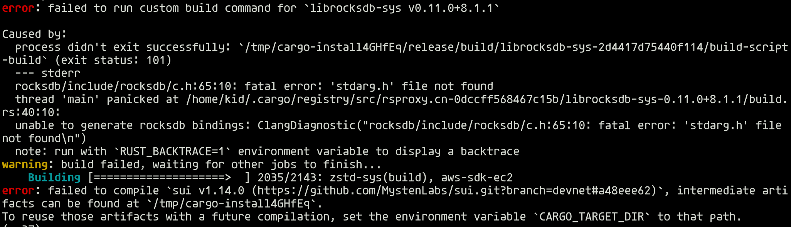
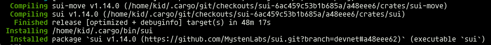
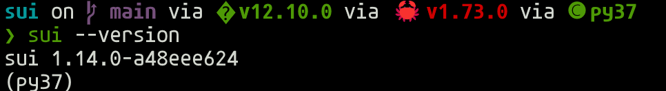

# 学习日志
# 第一课 安装环境搭建
由于有过一定的Rust开发经验，本机上已经有了对应的Cargo环境。同时为了节省时间，这里使用Cargo安装二进制文件  

```bash
 cargo install --locked --git https://github.com/MystenLabs/sui.git --branch devnet sui
```  
这里由于环境的问题碰到了一个error，如下所示
  

这里是由于没有对应的clang环境，因此需要在安装环境上安装clang
```bash
sudo apt install clang
```  

然后再重新执行  

```bash
 cargo install --locked --git https://github.com/MystenLabs/sui.git --branch devnet sui
```  
安装成功
  

命令行验证  
```bash
sui --version
```  
