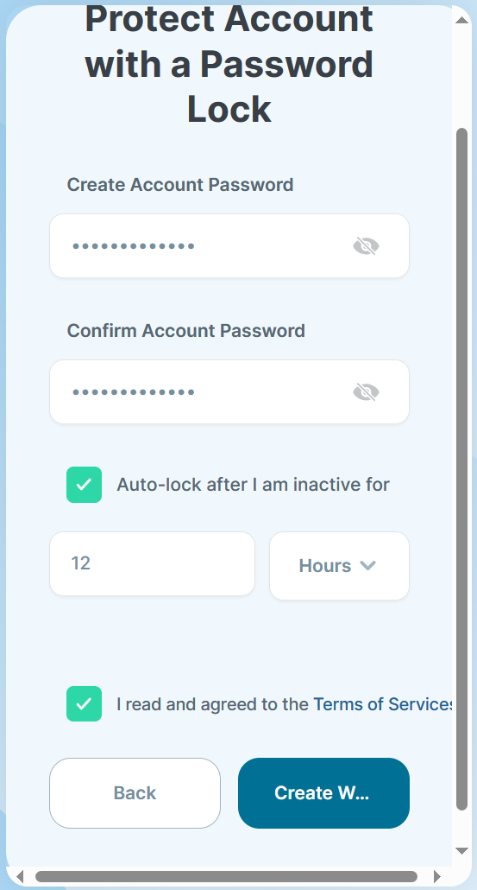

# 学习日志

## 2023-11-10
安装SUI钱包浏览器插件, EDGE浏览器的插件中心里, SUI插件版本存在落后, 需要在Chrome的插件中心安装, 链接为https://chrome.google.com/webstore/detail/sui-wallet/opcgpfmipidbgpenhmajoajpbobppdil/related

可以使用Google账号登录, 获取钱包地址

## 2023-11-11

### 1. windows搭建环境
#### 1) 在https://github.com/MystenLabs/sui/releases中下载windows工具包


#### 2) 解压后配置环境变量, 路径按实际路径配置

`D:\sui-mainnet-v1.13.0-windows-x86_64\external-crates\move\target\release`

`D:\sui-mainnet-v1.13.0-windows-x86_64\target\release`


#### 3) 简化命令
把exe文件名称中`-windows-x86_64`删除


#### 4) 测试命令


### 2. 浏览器插件连接Sui开发链
#### 1) 在Sui浏览器插件中切换到开发链


#### 2) 直接点击按钮即可获取token


### 3. 命令行工具连接Sui开发链
#### 1) 连接
```bash
sui client envs
```

默认则是连接到开发链, 会创建钱包地址和恢复码
```
addr: [0x1f0663c112ee1f1a75566039d849557a972293d99f71e45e9b9b72caed9b71a2]
Secret Recovery Phrase: [grant indicate avocado rail state minimum defense balcony pupil very attend sentence]
```


#### 2) 在浏览器插件里尝试导入
输入前面生成的恢复码


输入密码


可以看到成功导入


#### 3) 请求测试用的tokens
```
curl --location --request POST 'https://faucet.devnet.sui.io/gas' --header 'Content-Type: application/json' --data-raw '{"FixedAmountRequest": {"recipient": "钱包地址"}}'
```

请求一次会获取`10 SUI`


## 2023-11-18

### 1. 智能合约

#### 1. 创建move项目
```
sui move new hello_world
```

#### 2. 在`sources`文件夹中创建`hello.move`

```rust
#[lint_allow(self_transfer)]
module hello_world::hello_world {

    use std::string;
    use sui::object::{Self, UID};
    use sui::transfer;
    use sui::tx_context::{Self, TxContext};

    /// 一个包含一个任意的字符串
    struct HelloWorldObject has key, store {
        id: UID,
        text: string::String
    }

    // 这个函数创建了 HelloWoirldObject 定制类型的一个新实例，然后使用 Sui 系统中的转移函数 transfer 将其发送给交易的调用者
    public fun mint(ctx: &mut TxContext) {
        let object = HelloWorldObject {
            id: object::new(ctx),
            text: string::utf8(b"Hello World!")
        };
        transfer::public_transfer(object, tx_context::sender(ctx));
    }

}
```

#### 3. 构建项目
```
sui move build
```

#### 4. 切换到开发链
```
sui client switch --env devnet
```

#### 5. 发布
```
sui client publish --gas-budget 1000000000
```


## 2023-11-19
### 创建一个token coin
```rust
module zcoin::zcoin {
    use std::option;
    use sui::coin;
    use sui::transfer;
    use sui::tx_context::{Self, TxContext};

    struct ZCOIN has drop {}

    fun init(witness: ZCOIN, ctx: &mut TxContext) {
        let (treasury, metadata) = coin::create_currency(witness, 6, b"ZCOIN", b"", b"", option::none(), ctx);
        transfer::public_freeze_object(metadata);
        transfer::public_transfer(treasury, tx_context::sender(ctx))
    }
}
```

### 创建dapp应用

#### 1. 安装依赖
```
mkdir dapp
cd dapp

pnpm init
pnpm add -D @mysten/sui.js
```

#### 2. 新建`index.js`, 写从开发环境获取sui的程序
```js
import { getFullnodeUrl, SuiClient } from '@mysten/sui.js/client';
import { getFaucetHost, requestSuiFromFaucetV0 } from '@mysten/sui.js/faucet';
import { MIST_PER_SUI } from '@mysten/sui.js/utils';
 
// replace <YOUR_SUI_ADDRESS> with your actual address, which is in the form 0x123...
const MY_ADDRESS = '0x1f0663c112ee1f1a75566039d849557a972293d99f71e45e9b9b72caed9b71a2';
 
// create a new SuiClient object pointing to the network you want to use
const suiClient = new SuiClient({ url: getFullnodeUrl('devnet') });
 
// Convert MIST to Sui
const balance = (balance) => {
	return Number.parseInt(balance.totalBalance) / Number(MIST_PER_SUI);
};
 
// store the JSON representation for the SUI the address owns before using faucet
const suiBefore = await suiClient.getBalance({
	owner: MY_ADDRESS,
});
 
await requestSuiFromFaucetV0({
	// use getFaucetHost to make sure you're using correct faucet address
	// you can also just use the address (see Sui TypeScript SDK Quick Start for values)
    // 获取对应环境的水龙头地址(测试环境, 开发环境, 本地环境)
	host: getFaucetHost('devnet'),
	recipient: MY_ADDRESS,
});
 
// store the JSON representation for the SUI the address owns after using faucet
const suiAfter = await suiClient.getBalance({
	owner: MY_ADDRESS,
});
 
// Output result to console.
console.log(
	`Balance before faucet: ${balance(suiBefore)} SUI. Balance after: ${balance(
		suiAfter,
	)} SUI. Hello, SUI!`,
);
```

### 3. 新建vue3项目, 图形化查询钱包的coins
