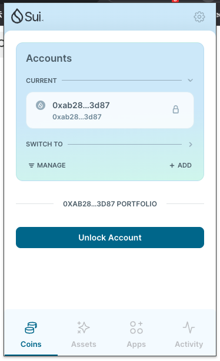
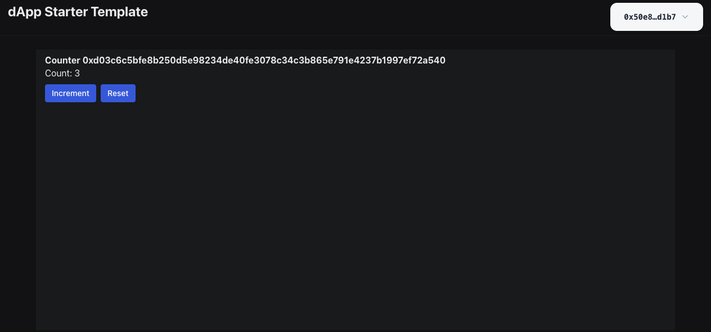

# Journey

## 相关资料

- [星航计划](https://www.notion.so/Move-fd0d4b3a92844a83b17124d0904c6257?pvs=21)
- [https://github.com/movefuns/SuiStartrek](https://github.com/movefuns/SuiStartrek)

## 开发环境

```bash
# rust
# https://www.rust-lang.org/tools/install
curl --proto '=https' --tlsv1.2 -sSf https://sh.rustup.rs | sh
rustup update stable

# additional prerequisites
brew install curl cmake git

# sui 
# https://docs.sui.io/guides/developer/getting-started/sui-install
cargo install --locked --git https://github.com/MystenLabs/sui.git --branch testnet sui

# move
cargo install --git https://github.com/move-language/move move-analyzer --branch sui-move --features "address32"

# vscode
extension：sui-move-analyzer

```

## 注册钱包

使用 sui wallet，chrome 的扩展

Mainnet 钱包地址

[0xab28d53b0e6b0614388fea9803db75f562b73e884d4d9d71ba2cf82583fc3d87](https://suiexplorer.com/address/0xab28d53b0e6b0614388fea9803db75f562b73e884d4d9d71ba2cf82583fc3d87)

```bash
0xab28d53b0e6b0614388fea9803db75f562b73e884d4d9d71ba2cf82583fc3d87
```



## 集成 DAPP

### dapp template

[https://github.com/luxcgo/luxcgo-first-sui-dapp](https://github.com/luxcgo/luxcgo-first-sui-dapp)

```bash
# install
$ pnpm -v
8.10.5
$ node -v
v20.9.0

pnpm config set auto-install-peers true

# init
pnpm create @mysten/create-dapp
.../Library/pnpm/store/v3/tmp/dlx-6581   | +108 +++++++++++
.../Library/pnpm/store/v3/tmp/dlx-6581   | Progress: resolved 108, reused 108, downloaded 0, added 108, done
✔ Which starter template would you like to use? · react-e2e-counter
✔ What is the name of your dApp? (this will be used as the directory name) · luxcgo-first-sui-dapp
```

### sui 基础命令

Devnet 钱包地址

[0x39c8c989540b9e5382d29c84437d6f9bd4543856631c93848f5c618849828894](https://suiexplorer.com/address/0x39c8c989540b9e5382d29c84437d6f9bd4543856631c93848f5c618849828894?network=devnet)

```bash
sui client new-env --alias devnet --rpc https://fullnode.devnet.sui.io:443
sui client switch --env devnet
sui client active-address
sui client active-env
sui client addresses
sui client new-address secp256k1
sui client switch --address 0x39c8c989540b9e5382d29c84437d6f9bd4543856631c93848f5c618849828894

# get gas
curl --location --request POST 'https://faucet.devnet.sui.io/gas' \
--header 'Content-Type: application/json' \
--data-raw '{
    "FixedAmountRequest": {
        "recipient": "0x39c8c989540b9e5382d29c84437d6f9bd4543856631c93848f5c618849828894"
    }
}

sui client publish --gas-budget 100000000 counter
```

```bash
UPDATING GIT DEPENDENCY https://github.com/MystenLabs/sui.git
INCLUDING DEPENDENCY Sui
INCLUDING DEPENDENCY MoveStdlib
BUILDING counter
Successfully verified dependencies on-chain against source.
----- Transaction Digest ----
G5zF2B4wazJhrHcjenQvC1wttpD6MaGkkaV5c5pkkQws
╭─────────────────────────────────────────────────────────────────────────────────────────────────────────────────────────────────────────────────────────────╮
│ Transaction Data                                                                                                                                            │
├─────────────────────────────────────────────────────────────────────────────────────────────────────────────────────────────────────────────────────────────┤
│ Sender: 0x39c8c989540b9e5382d29c84437d6f9bd4543856631c93848f5c618849828894                                                                                  │
│ Gas Owner: 0x39c8c989540b9e5382d29c84437d6f9bd4543856631c93848f5c618849828894                                                                               │
│ Gas Budget: 100000000                                                                                                                                       │
│ Gas Price: 1000                                                                                                                                             │
│ Gas Payment:                                                                                                                                                │
│  ┌──                                                                                                                                                        │
│  │ ID: 0x1c2f252c2887a4517f753eeb29951ad9b41814a2a8ee78aaa205c4f7fa40279a                                                                                   │
│  │ Version: 56                                                                                                                                              │
│  │ Digest: 2sLkgXhCCrJ4H4sEHvqWfxRGSte7JLHdB9jGGXxCTsYy                                                                                                     │
│  └──                                                                                                                                                        │
│                                                                                                                                                             │
│ Transaction Kind : Programmable                                                                                                                             │
│ Inputs: [Pure(SuiPureValue { value_type: Some(Address), value: "0x39c8c989540b9e5382d29c84437d6f9bd4543856631c93848f5c618849828894" })]                     │
│ Commands: [                                                                                                                                                 │
│   Publish(<modules>,0x0000000000000000000000000000000000000000000000000000000000000001,0x0000000000000000000000000000000000000000000000000000000000000002), │
│   TransferObjects([Result(0)],Input(0)),                                                                                                                    │
│ ]                                                                                                                                                           │
│                                                                                                                                                             │
│                                                                                                                                                             │
│ Signatures:                                                                                                                                                 │
│    2b37joObdtdfSTAKRYr0q4P+hzz8vNRsiybBxPRL9olw+htNfBXrlq+C9yuoGJJxC3TjB/OlYgjIf1lUrHGLuA==                                                                 │
│                                                                                                                                                             │
╰─────────────────────────────────────────────────────────────────────────────────────────────────────────────────────────────────────────────────────────────╯
╭───────────────────────────────────────────────────────────────────────────────────────────────────╮
│ Transaction Effects                                                                               │
├───────────────────────────────────────────────────────────────────────────────────────────────────┤
│ Digest: G5zF2B4wazJhrHcjenQvC1wttpD6MaGkkaV5c5pkkQws                                              │
│ Status: Success                                                                                   │
│ Executed Epoch: 4                                                                                 │
│                                                                                                   │
│ Created Objects:                                                                                  │
│  ┌──                                                                                              │
│  │ ID: 0xff2e60d41b327565eb1bcef2dca14b9b425ac21d88de502659a60e11bd8ac6b8                         │
│  │ Owner: Account Address ( 0x39c8c989540b9e5382d29c84437d6f9bd4543856631c93848f5c618849828894 )  │
│  │ Version: 57                                                                                    │
│  │ Digest: 9eKhXLuTLzUcXLP9KaoPXEs5YSHSi3hgWDmUve2hbgbs                                           │
│  └──                                                                                              │
│  ┌──                                                                                              │
│  │ ID: 0xff6e1b6d0a65f2d47bec7225a902db02370a676846cce7239b03abf9b7cd1712                         │
│  │ Owner: Immutable                                                                               │
│  │ Version: 1                                                                                     │
│  │ Digest: C2ezkfC4uS4yzsE2vh1fcB8F6cqewAQjr2UKrBSyiiUQ                                           │
│  └──                                                                                              │
│                                                                                                   │
│ Mutated Objects:                                                                                  │
│  ┌──                                                                                              │
│  │ ID: 0x1c2f252c2887a4517f753eeb29951ad9b41814a2a8ee78aaa205c4f7fa40279a                         │
│  │ Owner: Account Address ( 0x39c8c989540b9e5382d29c84437d6f9bd4543856631c93848f5c618849828894 )  │
│  │ Version: 57                                                                                    │
│  │ Digest: Da1U4bcWwvMqcCHwN4LvNjwo9EhjXQeeiuumn3d8Tk3x                                           │
│  └──                                                                                              │
│                                                                                                   │
│ Gas Object:                                                                                       │
│  ┌──                                                                                              │
│  │ ID: 0x1c2f252c2887a4517f753eeb29951ad9b41814a2a8ee78aaa205c4f7fa40279a                         │
│  │ Owner: Account Address ( 0x39c8c989540b9e5382d29c84437d6f9bd4543856631c93848f5c618849828894 )  │
│  │ Version: 57                                                                                    │
│  │ Digest: Da1U4bcWwvMqcCHwN4LvNjwo9EhjXQeeiuumn3d8Tk3x                                           │
│  └──                                                                                              │
│                                                                                                   │
│ Gas Cost Summary:                                                                                 │
│    Storage Cost: 8747600                                                                          │
│    Computation Cost: 1000000                                                                      │
│    Storage Rebate: 978120                                                                         │
│    Non-refundable Storage Fee: 9880                                                               │
│                                                                                                   │
│ Transaction Dependencies:                                                                         │
│    ZpVxWJUmtenvBPjS84sFhAsAhwdvUHyQVafiybgE9CX                                                    │
│    HUKvecodFjttC4143fQ7LKpCNEwswvq8QyLJHiN8bJBg                                                   │
╰───────────────────────────────────────────────────────────────────────────────────────────────────╯
----- Events ----
Array []
----- Object changes ----

Created Objects:
 ┌──
 │ ObjectID: 0xff2e60d41b327565eb1bcef2dca14b9b425ac21d88de502659a60e11bd8ac6b8
 │ Sender: 0x39c8c989540b9e5382d29c84437d6f9bd4543856631c93848f5c618849828894
 │ Owner: Account Address ( 0x39c8c989540b9e5382d29c84437d6f9bd4543856631c93848f5c618849828894 )
 │ ObjectType: 0x2::package::UpgradeCap
 │ Version: 57
 │ Digest: 9eKhXLuTLzUcXLP9KaoPXEs5YSHSi3hgWDmUve2hbgbs
 └──

Mutated Objects:
 ┌──
 │ ObjectID: 0x1c2f252c2887a4517f753eeb29951ad9b41814a2a8ee78aaa205c4f7fa40279a
 │ Sender: 0x39c8c989540b9e5382d29c84437d6f9bd4543856631c93848f5c618849828894
 │ Owner: Account Address ( 0x39c8c989540b9e5382d29c84437d6f9bd4543856631c93848f5c618849828894 )
 │ ObjectType: 0x2::coin::Coin<0x2::sui::SUI>
 │ Version: 57
 │ Digest: Da1U4bcWwvMqcCHwN4LvNjwo9EhjXQeeiuumn3d8Tk3x
 └──

Published Objects:
 ┌──
 │ PackageID: 0xff6e1b6d0a65f2d47bec7225a902db02370a676846cce7239b03abf9b7cd1712
 │ Version: 1
 │ Digest: C2ezkfC4uS4yzsE2vh1fcB8F6cqewAQjr2UKrBSyiiUQ
 | Modules: counter
 └──
----- Balance changes ----
 ┌──
 │ Owner: Account Address ( 0x39c8c989540b9e5382d29c84437d6f9bd4543856631c93848f5c618849828894 )
 │ CoinType: 0x2::sui::SUI
 │ Amount: -8769480
 └──
```

[TRANSACTION BLOCK](https://suiexplorer.com/txblock/G5zF2B4wazJhrHcjenQvC1wttpD6MaGkkaV5c5pkkQws?network=devnet)

```bash
export const DEVNET_COUNTER_PACKAGE_ID = "0xff6e1b6d0a65f2d47bec7225a902db02370a676846cce7239b03abf9b7cd1712";

pnpm install
pnpm dev
```

[https://suiexplorer.com/object/0xd03c6c5bfe8b250d5e98234de40fe3078c34c3b865e791e4237b1997ef72a540?network=devnet](https://suiexplorer.com/object/0xd03c6c5bfe8b250d5e98234de40fe3078c34c3b865e791e4237b1997ef72a540?network=devnet)

