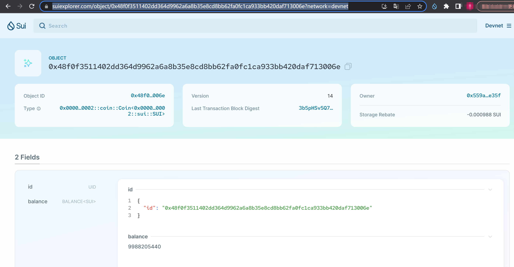
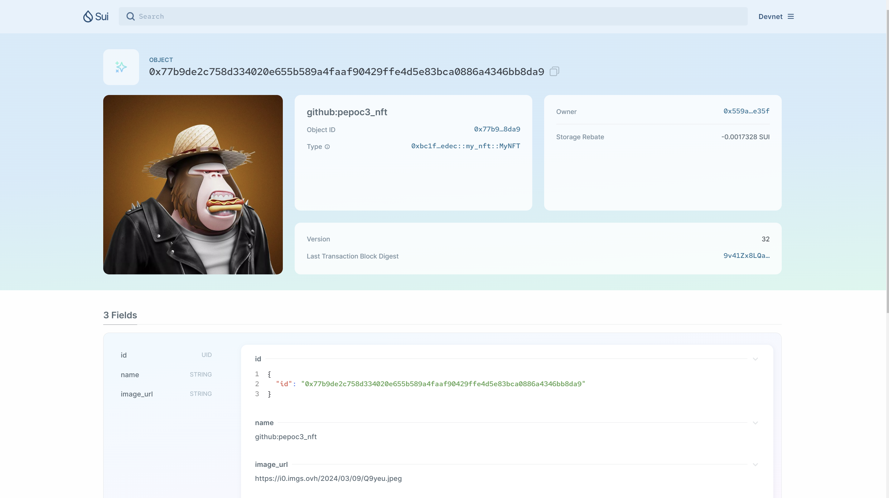
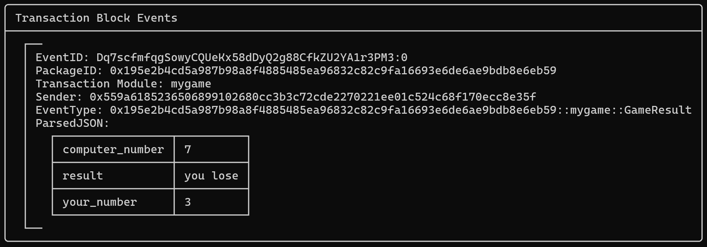

# 学习成果

## 阶段一任务：部署HelloWorld

[代码仓库](https://github.com/pepoc3/Sui_Study/blob/main/hello_world.move)

https://suiexplorer.com/txblock/8N8BBULE6vCr5UABiTJPTricjGtn56f8iUYpg8QE97sU?network=testnet
packageID：0xae4ac1d66188478fc8abebbcb5c5fa7927e77bde1369daf1e028d1e34f322964

## 阶段二任务

### 计数器
[代码仓库](https://github.com/pepoc3/Sui_Study/blob/main/Counter.move)

  - PackageID: 0x48f0f3511402dd364d9962a6a8b35e8cd8bb62fa0fc1ca933bb420daf713006e
  - [链上记录](https://suiexplorer.com/object/0x48f0f3511402dd364d9962a6a8b35e8cd8bb62fa0fc1ca933bb420daf713006e?network=devnet)
  


### NFT部署及Mint

- 发行
  - [代码仓库](https://github.com/pepoc3/Sui_Study/blob/main/nft.move)
  - PackageID: 0xbc1f090b59fee57b30c1bb29e8a3971f28db9fd30b1197304e4973d41775edec
- mint
  - objectID: 0x77b9de2c758d334020e655b589a4faaf90429ffe4d5e83bca0886a4346bb8da9
  - [object查看](https://suiexplorer.com/object/0x77b9de2c758d334020e655b589a4faaf90429ffe4d5e83bca0886a4346bb8da9?network=devnet)
  

### 猜数字游戏

**游戏玩法:**

```sui client call --function play --module guess_number_game  --package <package_id> --args <你的数字> 0x6 --gas-budget <gas_budget>```

控制台会打印，你的数字，电脑数字，比较大小，谁大就赢，并打印游戏结果

[代码仓库](https://github.com/pepoc3/Sui_Study/blob/main/mygame.move)
packageID：0x195e2b4cd5a987b98a8f4885485ea96832c82c9fa16693e6de6ae9bdb8e6eb59 

[链上记录](https://suiexplorer.com/txblock/Dq7scfmfqgSowyCQUeKx58dDyQ2g88CfkZU2YA1r3PM3?network=devnet)


play命令：只需要把第一个参数3换为你想输入的数字即可

```sui client call --function play --module mygame --package 0x195e2b4cd5a987b98a8f4885485ea96832c82c9fa16693e6de6ae9bdb8e6eb59 --args 3 0x6 --gas-budget 10000000```

游戏结果展示：




 
