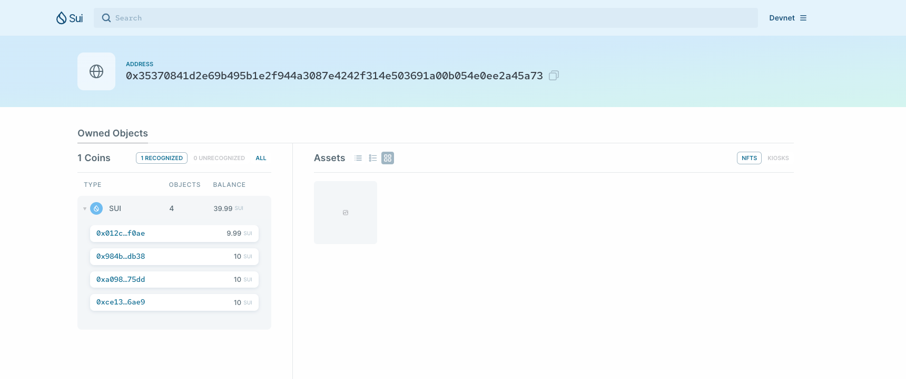
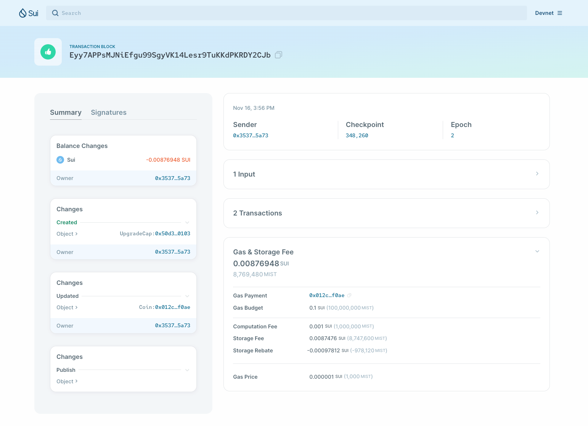
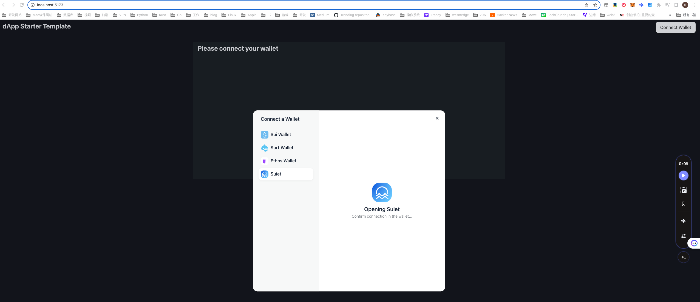

# 学习日志

## 安装

相关资料：

- <https://github.com/movefuns/co-learn-sui/blob/main/courses/unit-1/1-get-start/README.md>
- <https://docs.sui.io/guides/developer/getting-started/sui-install#prerequisites>
- <https://www.rust-lang.org/zh-CN/learn/get-started>

### 安装Rust环境及相关依赖

```shell
curl --proto '=https' --tlsv1.2 -sSf https://sh.rustup.rs | sh

rustup update stable

brew install curl cmake git
```

### 安装 sui

```shell
cargo install --locked --git https://github.com/MystenLabs/sui.git --branch devnet sui

sui --version

sui help
```

### 安装sui-cli 和 Move IDEs and plugins

- <https://docs.sui.io/references/cli/client>
- <https://docs.sui.io/guides/developer/getting-started/sui-environment#move-ides-and-plugins>

```shell
cargo install --git https://github.com/move-language/move move-analyzer --branch sui-move --features "address32"

move-analyzer --version

sui client help

sui client -h
```

#### vscode 扩展配置

```shell
/Users/qiaopengjun/.cargo/bin/move-analyzer
```

## 项目

### 创建项目并用vscode打开

```shell
cd Code/

mcd sui # mkdir sui cd sui

git clone git@github.com:qiaopengjun5162/SuiStartrek.git

ls

cd SuiStartrek/

c # code .
```

## 前端方向的 Hello world

- <https://sui-typescript-docs.vercel.app/dapp-kit>
- <https://sui-typescript-docs.vercel.app/dapp-kit/create-dapp>

```shell
pnpm create @mysten/create-dapp
.../Library/pnpm/store/v3/tmp/dlx-29582  | +108 +++++++++++
.../Library/pnpm/store/v3/tmp/dlx-29582  | Progress: resolved 108, reused 19, downloaded 89, added 108, done
✔ Which starter template would you like to use? · react-e2e-counter
✔ What is the name of your dApp? (this will be used as the directory name) · hello-world

ls

cd hello-world/

c

sui/dapp/hello-world via ⬢ v21.2.0 via 🅒 base 
➜ sui client new-env --alias devnet --rpc https://fullnode.devnet.sui.io:443

Config file ["/Users/qiaopengjun/.sui/sui_config/client.yaml"] doesn't exist, do you want to connect to a Sui Full node server [y/N]?y
Sui Full node server URL (Defaults to Sui Devnet if not specified) : 
Select key scheme to generate keypair (0 for ed25519, 1 for secp256k1, 2: for secp256r1):
0
Generated new keypair for address with scheme "ed25519" [0x35370841d2e69b495b1e2f944a3087e4242f314e503691a00b054e0ee2a45a73]
Secret Recovery Phrase : [lend chicken payment powder glove core labor crop kidney wet brisk museum]
Environment config with name [devnet] already exists.

sui/dapp/hello-world via ⬢ v21.2.0 via 🅒 base took 6m 27.4s 
➜ sui client switch --env devnet

Active environment switched to [devnet]

sui/dapp/hello-world via ⬢ v21.2.0 via 🅒 base 
➜ ls
README.md           index.html          move                package.json        prettier.config.cjs src                 tsconfig.json       tsconfig.node.json  vite.config.ts

sui/dapp/hello-world via ⬢ v21.2.0 via 🅒 base 
➜ sui client active-address     
0x35370841d2e69b495b1e2f944a3087e4242f314e503691a00b054e0ee2a45a73

sui/dapp/hello-world via ⬢ v21.2.0 via 🅒 base 
➜ cd move        

dapp/hello-world/move via ⬢ v21.2.0 via 🅒 base 
➜ sui client publish --gas-budget 100000000 counter
FETCHING GIT DEPENDENCY https://github.com/MystenLabs/sui.git
INCLUDING DEPENDENCY Sui
INCLUDING DEPENDENCY MoveStdlib
BUILDING counter
Successfully verified dependencies on-chain against source.
----- Transaction Digest ----
Eyy7APPsMJNiEfgu99SgyVK14Lesr9TuKKdPKRDY2CJb
╭─────────────────────────────────────────────────────────────────────────────────────────────────────────────────────────────────────────────────────────────╮
│ Transaction Data                                                                                                                                            │
├─────────────────────────────────────────────────────────────────────────────────────────────────────────────────────────────────────────────────────────────┤
│ Sender: 0x35370841d2e69b495b1e2f944a3087e4242f314e503691a00b054e0ee2a45a73                                                                                  │
│ Gas Owner: 0x35370841d2e69b495b1e2f944a3087e4242f314e503691a00b054e0ee2a45a73                                                                               │
│ Gas Budget: 100000000                                                                                                                                       │
│ Gas Price: 1000                                                                                                                                             │
│ Gas Payment:                                                                                                                                                │
│  ┌──                                                                                                                                                        │
│  │ ID: 0x012caa4fdc1870f67c658d2e562f94775fae0c3b9cc92ca332782747c40bf0ae                                                                                   │
│  │ Version: 29                                                                                                                                              │
│  │ Digest: 4YeJAax1JcfJ2ELqQv5sVoaNgxnXcFpK6UCHyW1sqwoM                                                                                                     │
│  └──                                                                                                                                                        │
│                                                                                                                                                             │
│ Transaction Kind : Programmable                                                                                                                             │
│ Inputs: [Pure(SuiPureValue { value_type: Some(Address), value: "0x35370841d2e69b495b1e2f944a3087e4242f314e503691a00b054e0ee2a45a73" })]                     │
│ Commands: [                                                                                                                                                 │
│   Publish(<modules>,0x0000000000000000000000000000000000000000000000000000000000000001,0x0000000000000000000000000000000000000000000000000000000000000002), │
│   TransferObjects([Result(0)],Input(0)),                                                                                                                    │
│ ]                                                                                                                                                           │
│                                                                                                                                                             │
│                                                                                                                                                             │
│ Signatures:                                                                                                                                                 │
│    TgCNxeWl/CYCnb2xXUi1b/06u88rvYWlwLa244RkhKdWA35p9gst65sIkBdEqjJPR4FCPROhhVn3g4ui2WQJDg==                                                                 │
│                                                                                                                                                             │
╰─────────────────────────────────────────────────────────────────────────────────────────────────────────────────────────────────────────────────────────────╯
╭───────────────────────────────────────────────────────────────────────────────────────────────────╮
│ Transaction Effects                                                                               │
├───────────────────────────────────────────────────────────────────────────────────────────────────┤
│ Digest: Eyy7APPsMJNiEfgu99SgyVK14Lesr9TuKKdPKRDY2CJb                                              │
│ Status: Success                                                                                   │
│ Executed Epoch: 2                                                                                 │
│                                                                                                   │
│ Created Objects:                                                                                  │
│  ┌──                                                                                              │
│  │ ID: 0x50d3f2afa79c5c968e393d4df2382007248f2bb0e1e62c38cbb6b7e6b5890103                         │
│  │ Owner: Account Address ( 0x35370841d2e69b495b1e2f944a3087e4242f314e503691a00b054e0ee2a45a73 )  │
│  │ Version: 30                                                                                    │
│  │ Digest: 7RanVZNHRpUMZ5wXB86tKZZvQERjvw7BHpfHTYsJV8h4                                           │
│  └──                                                                                              │
│  ┌──                                                                                              │
│  │ ID: 0x731343deca3fd478e01e45a9eda62a13c33feca5a591b97fd4f96ee9c467fec0                         │
│  │ Owner: Immutable                                                                               │
│  │ Version: 1                                                                                     │
│  │ Digest: 8YHQrA9aBhbpE9gebRcdpXn3GbQzF8MsQyVbMVvfPbJ9                                           │
│  └──                                                                                              │
│                                                                                                   │
│ Mutated Objects:                                                                                  │
│  ┌──                                                                                              │
│  │ ID: 0x012caa4fdc1870f67c658d2e562f94775fae0c3b9cc92ca332782747c40bf0ae                         │
│  │ Owner: Account Address ( 0x35370841d2e69b495b1e2f944a3087e4242f314e503691a00b054e0ee2a45a73 )  │
│  │ Version: 30                                                                                    │
│  │ Digest: 2ZcU8bwkWbs5nzbexH4sJfFTG2isVMj82UPTjVaXJj7k                                           │
│  └──                                                                                              │
│                                                                                                   │
│ Gas Object:                                                                                       │
│  ┌──                                                                                              │
│  │ ID: 0x012caa4fdc1870f67c658d2e562f94775fae0c3b9cc92ca332782747c40bf0ae                         │
│  │ Owner: Account Address ( 0x35370841d2e69b495b1e2f944a3087e4242f314e503691a00b054e0ee2a45a73 )  │
│  │ Version: 30                                                                                    │
│  │ Digest: 2ZcU8bwkWbs5nzbexH4sJfFTG2isVMj82UPTjVaXJj7k                                           │
│  └──                                                                                              │
│                                                                                                   │
│ Gas Cost Summary:                                                                                 │
│    Storage Cost: 8747600                                                                          │
│    Computation Cost: 1000000                                                                      │
│    Storage Rebate: 978120                                                                         │
│    Non-refundable Storage Fee: 9880                                                               │
│                                                                                                   │
│ Transaction Dependencies:                                                                         │
│    5UoRRuH7SQqQzdTDgdZBRAXBod1Cn7C4yYsCDyKSPiTH                                                   │
│    HUKvecodFjttC4143fQ7LKpCNEwswvq8QyLJHiN8bJBg                                                   │
╰───────────────────────────────────────────────────────────────────────────────────────────────────╯
----- Events ----
Array []
----- Object changes ----

Created Objects: 
 ┌──
 │ ObjectID: 0x50d3f2afa79c5c968e393d4df2382007248f2bb0e1e62c38cbb6b7e6b5890103
 │ Sender: 0x35370841d2e69b495b1e2f944a3087e4242f314e503691a00b054e0ee2a45a73 
 │ Owner: Account Address ( 0x35370841d2e69b495b1e2f944a3087e4242f314e503691a00b054e0ee2a45a73 )
 │ ObjectType: 0x2::package::UpgradeCap 
 │ Version: 30
 │ Digest: 7RanVZNHRpUMZ5wXB86tKZZvQERjvw7BHpfHTYsJV8h4
 └──

Mutated Objects: 
 ┌──
 │ ObjectID: 0x012caa4fdc1870f67c658d2e562f94775fae0c3b9cc92ca332782747c40bf0ae
 │ Sender: 0x35370841d2e69b495b1e2f944a3087e4242f314e503691a00b054e0ee2a45a73 
 │ Owner: Account Address ( 0x35370841d2e69b495b1e2f944a3087e4242f314e503691a00b054e0ee2a45a73 )
 │ ObjectType: 0x2::coin::Coin<0x2::sui::SUI> 
 │ Version: 30
 │ Digest: 2ZcU8bwkWbs5nzbexH4sJfFTG2isVMj82UPTjVaXJj7k
 └──

Published Objects: 
 ┌──
 │ PackageID: 0x731343deca3fd478e01e45a9eda62a13c33feca5a591b97fd4f96ee9c467fec0 
 │ Version: 1 
 │ Digest: 8YHQrA9aBhbpE9gebRcdpXn3GbQzF8MsQyVbMVvfPbJ9
 | Modules: counter
 └──
----- Balance changes ----
 ┌──
 │ Owner: Account Address ( 0x35370841d2e69b495b1e2f944a3087e4242f314e503691a00b054e0ee2a45a73 ) 
 │ CoinType: 0x2::sui::SUI 
 │ Amount: -8769480
 └──

dapp/hello-world/move via ⬢ v21.2.0 via 🅒 base took 46.0s 
➜ 


sui client active-address
0x35370841d2e69b495b1e2f944a3087e4242f314e503691a00b054e0ee2a45a73

~ via 🅒 base
➜
sui client envs
╭────────┬────────────────────────────────────┬────────╮
│ alias  │ url                                │ active │
├────────┼────────────────────────────────────┼────────┤
│ devnet │ https://fullnode.devnet.sui.io:443 │ *      │
╰────────┴────────────────────────────────────┴────────╯

~ via 🅒 base
➜
sui client active-env
devnet

sui client addresses
╭───────────────┬──────────────────────────────────────────────────────────────────────────╮
│ activeAddress │  0x35370841d2e69b495b1e2f944a3087e4242f314e503691a00b054e0ee2a45a73      │
│ addresses     │ ╭──────────────────────────────────────────────────────────────────────╮ │
│               │ │  0x35370841d2e69b495b1e2f944a3087e4242f314e503691a00b054e0ee2a45a73  │ │
│               │ ╰──────────────────────────────────────────────────────────────────────╯ │
╰───────────────┴──────────────────────────────────────────────────────────────────────────╯
```

### 获得开发网 Devnet 的 Sui Tokens

- <https://github.com/movefuns/co-learn-sui/blob/main/courses/unit-1/1-get-start/README.md>

```shell
picurl --location --request POST 'https://faucet.devnet.sui.io/gas' --header 'Content-Type: application/json' --data-raw '{"FixedAmountRequest":{"recipient":"0x35370841d2e69b495b1e2f944a3087e4242f314e503691a00b054e0ee2a45a73"}}'
{"transferredGasObjects":[{"amount":10000000000,"id":"0xce1387a530436078410d9c18b270a23814e3de097e725ca52d322bffdcf56ae9","transferTxDigest":"9U85kP6BgTnJJTMiPzc6oC821SxS9Z8UsjZCFauWXKgy"}],"error":null}%

sui client gas
╭────────────────────────────────────────────────────────────────────┬─────────────╮
│ gasCoinId                                                          │ gasBalance  │
├────────────────────────────────────────────────────────────────────┼─────────────┤
│ 0x984bf22106be161d5fe2cb5082fe95cdd0dfcac0e94ff95ddce012e3483fdb38 │ 10000000000 │
│ 0xa0989c981c3ea7eb437fd544954a1d6d6cda2dc9ce310c82abc36f8b09e875dd │ 10000000000 │
│ 0xce1387a530436078410d9c18b270a23814e3de097e725ca52d322bffdcf56ae9 │ 10000000000 │
╰────────────────────────────────────────────────────────────────────┴─────────────╯

```

- <https://suiexplorer.com/address/0x35370841d2e69b495b1e2f944a3087e4242f314e503691a00b054e0ee2a45a73?network=devnet>



- <https://suiexplorer.com/txblock/Eyy7APPsMJNiEfgu99SgyVK14Lesr9TuKKdPKRDY2CJb?network=devnet>



- <https://suiexplorer.com/object/0x731343deca3fd478e01e45a9eda62a13c33feca5a591b97fd4f96ee9c467fec0?network=devnet>


### You'll want to save that package ID to the `src/constants.ts` file as `PACKAGE_ID`

```ts
export const DEVNET_COUNTER_PACKAGE_ID = "0x731343deca3fd478e01e45a9eda62a13c33feca5a591b97fd4f96ee9c467fec0";
```

## Starting hello world

```shell
dapp/hello-world/move via ⬢ v21.2.0 via 🅒 base 
➜ cd ..  

sui/dapp/hello-world via ⬢ v21.2.0 via 🅒 base 
➜ pnpm install                   

   ╭──────────────────────────────────────────────────────────────────╮
   │                                                                  │
   │                Update available! 8.8.0 → 8.10.5.                 │
   │   Changelog: https://github.com/pnpm/pnpm/releases/tag/v8.10.5   │
   │                Run "pnpm add -g pnpm" to update.                 │
   │                                                                  │
   │      Follow @pnpmjs for updates: https://twitter.com/pnpmjs      │
   │                                                                  │
   ╰──────────────────────────────────────────────────────────────────╯

Downloading registry.npmjs.org/typescript/5.2.2: 7.23 MB/7.23 MB, done
Downloading registry.npmjs.org/@swc/core-darwin-arm64/1.3.96: 13.32 MB/13.32 MB, done
Packages: +269
+++++++++++++++++++++++++++++++++++++++++++++++++++++++++++++++++++++++++++++++++++++++++++++++++++++++++++++++++++++++++++++++++++++++++++++++++++++++++++++++++++++++++++++++++++++++++++++
Progress: resolved 299, reused 189, downloaded 80, added 269, done
node_modules/.pnpm/@swc+core@1.3.96/node_modules/@swc/core: Running postinstall script, done in 85ms
node_modules/.pnpm/esbuild@0.18.20/node_modules/esbuild: Running postinstall script, done in 79ms

dependencies:
+ @mysten/dapp-kit 0.9.0
+ @mysten/sui.js 0.46.1
+ @radix-ui/colors 3.0.0
+ @radix-ui/react-icons 1.3.0
+ @radix-ui/themes 2.0.1
+ @tanstack/react-query 5.8.4
+ react 18.2.0
+ react-dom 18.2.0

devDependencies:
+ @types/react 18.2.37
+ @types/react-dom 18.2.15
+ @typescript-eslint/eslint-plugin 6.11.0
+ @typescript-eslint/parser 6.11.0
+ @vitejs/plugin-react-swc 3.4.1
+ eslint 8.53.0
+ eslint-plugin-react-hooks 4.6.0
+ eslint-plugin-react-refresh 0.4.4
+ prettier 3.1.0
+ typescript 5.2.2
+ vite 4.5.0

Done in 29.6s

sui/dapp/hello-world via ⬢ v21.2.0 via 🅒 base took 29.9s 
➜ pnpm add -g pnpm
Nothing to stop. No server is running for the store at /Users/qiaopengjun/Library/pnpm/store/v3
 WARN  deprecated ganache-cli@6.12.2: ganache-cli is now ganache; visit https://trfl.io/g7 for details
Packages: +1 -1
+-
Progress: resolved 11, reused 10, downloaded 1, added 1, done

/Users/qiaopengjun/Library/pnpm/global/5:
- pnpm 8.8.0
+ pnpm 8.10.5

Done in 12s

sui/dapp/hello-world via ⬢ v21.2.0 via 🅒 base took 12.3s 
➜ pnpm dev        

> hello-world@0.0.0 dev /Users/qiaopengjun/Code/sui/dapp/hello-world
> vite


  VITE v4.5.0  ready in 208 ms

  ➜  Local:   http://localhost:5173/
  ➜  Network: use --host to expose
  ➜  press h to show help
```


