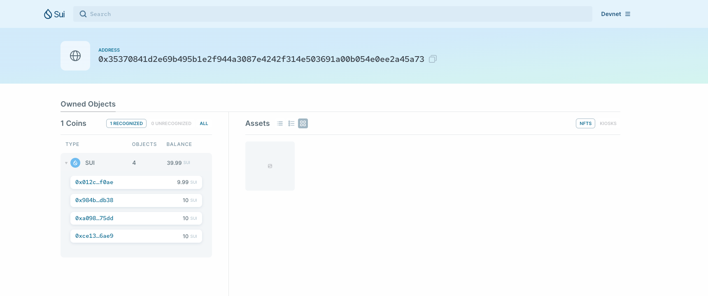
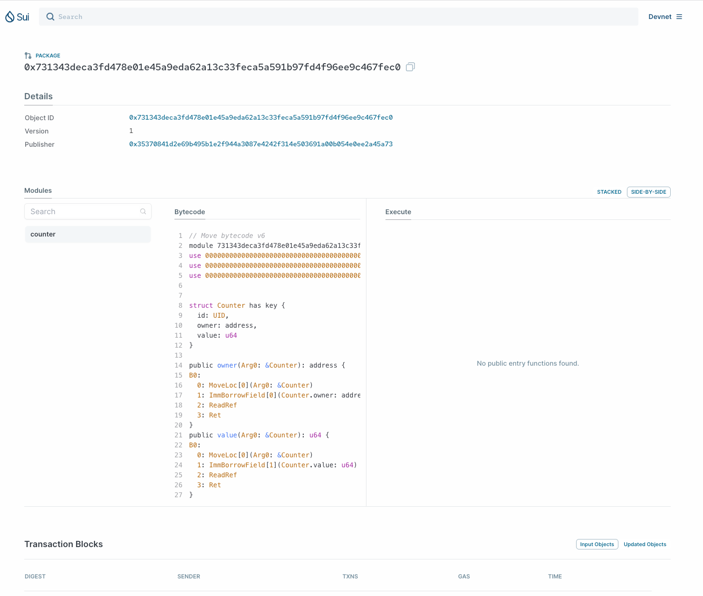
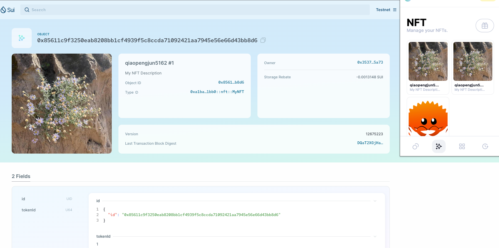
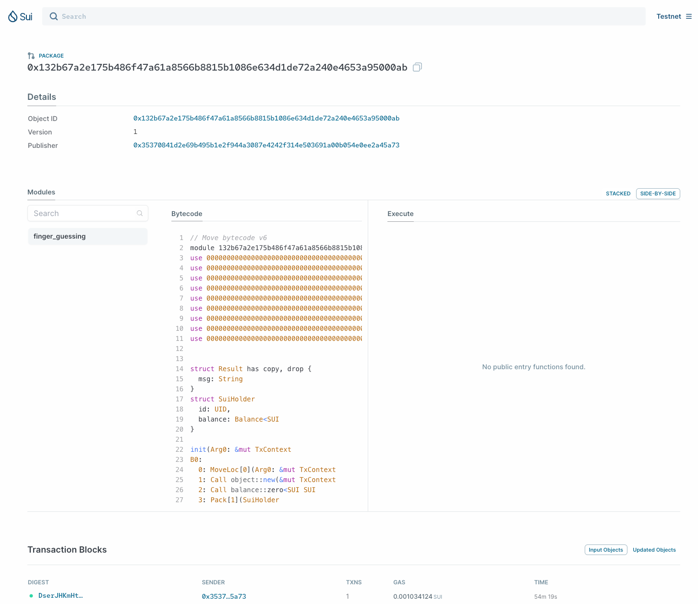

# 学习日志

## 安装

相关资料：

- <https://github.com/movefuns/co-learn-sui/blob/main/courses/unit-1/1-get-start/README.md>
- <https://docs.sui.io/guides/developer/getting-started/sui-install#prerequisites>
- <https://www.rust-lang.org/zh-CN/learn/get-started>

### 安装Rust环境及相关依赖

```shell
curl --proto '=https' --tlsv1.2 -sSf https://sh.rustup.rs | sh

rustup update stable

brew install curl cmake git
```

### 安装 sui

```shell
cargo install --locked --git https://github.com/MystenLabs/sui.git --branch devnet sui

sui --version

sui help
```

### 安装sui-cli 和 Move IDEs and plugins

- <https://docs.sui.io/references/cli/client>
- <https://docs.sui.io/guides/developer/getting-started/sui-environment#move-ides-and-plugins>

```shell
cargo install --git https://github.com/move-language/move move-analyzer --branch sui-move --features "address32"

move-analyzer --version

sui client help

sui client -h
```

#### vscode 扩展配置

```shell
/Users/qiaopengjun/.cargo/bin/move-analyzer
```

## 项目

### 创建项目并用vscode打开

```shell
cd Code/

mcd sui # mkdir sui cd sui

git clone git@github.com:qiaopengjun5162/SuiStartrek.git

ls

cd SuiStartrek/

c # code .
```

## 前端方向的 Hello world

- <https://sui-typescript-docs.vercel.app/dapp-kit>
- <https://sui-typescript-docs.vercel.app/dapp-kit/create-dapp>

```shell
pnpm create @mysten/create-dapp
.../Library/pnpm/store/v3/tmp/dlx-29582  | +108 +++++++++++
.../Library/pnpm/store/v3/tmp/dlx-29582  | Progress: resolved 108, reused 19, downloaded 89, added 108, done
✔ Which starter template would you like to use? · react-e2e-counter
✔ What is the name of your dApp? (this will be used as the directory name) · hello-world

ls

cd hello-world/

c

sui/dapp/hello-world via ⬢ v21.2.0 via 🅒 base 
➜ sui client new-env --alias devnet --rpc https://fullnode.devnet.sui.io:443

Config file ["/Users/qiaopengjun/.sui/sui_config/client.yaml"] doesn't exist, do you want to connect to a Sui Full node server [y/N]?y
Sui Full node server URL (Defaults to Sui Devnet if not specified) : 
Select key scheme to generate keypair (0 for ed25519, 1 for secp256k1, 2: for secp256r1):
0
Generated new keypair for address with scheme "ed25519" [0x35370841d2e69b495b1e2f944a3087e4242f314e503691a00b054e0ee2a45a73]
Secret Recovery Phrase : [lend chicken payment powder glove core labor crop kidney wet brisk museum]
Environment config with name [devnet] already exists.

sui/dapp/hello-world via ⬢ v21.2.0 via 🅒 base took 6m 27.4s 
➜ sui client switch --env devnet

Active environment switched to [devnet]

sui/dapp/hello-world via ⬢ v21.2.0 via 🅒 base 
➜ ls
README.md           index.html          move                package.json        prettier.config.cjs src                 tsconfig.json       tsconfig.node.json  vite.config.ts

sui/dapp/hello-world via ⬢ v21.2.0 via 🅒 base 
➜ sui client active-address     
0x35370841d2e69b495b1e2f944a3087e4242f314e503691a00b054e0ee2a45a73

sui/dapp/hello-world via ⬢ v21.2.0 via 🅒 base 
➜ cd move        

dapp/hello-world/move via ⬢ v21.2.0 via 🅒 base 
➜ sui client publish --gas-budget 100000000 counter
FETCHING GIT DEPENDENCY https://github.com/MystenLabs/sui.git
INCLUDING DEPENDENCY Sui
INCLUDING DEPENDENCY MoveStdlib
BUILDING counter
Successfully verified dependencies on-chain against source.
----- Transaction Digest ----
Eyy7APPsMJNiEfgu99SgyVK14Lesr9TuKKdPKRDY2CJb
╭─────────────────────────────────────────────────────────────────────────────────────────────────────────────────────────────────────────────────────────────╮
│ Transaction Data                                                                                                                                            │
├─────────────────────────────────────────────────────────────────────────────────────────────────────────────────────────────────────────────────────────────┤
│ Sender: 0x35370841d2e69b495b1e2f944a3087e4242f314e503691a00b054e0ee2a45a73                                                                                  │
│ Gas Owner: 0x35370841d2e69b495b1e2f944a3087e4242f314e503691a00b054e0ee2a45a73                                                                               │
│ Gas Budget: 100000000                                                                                                                                       │
│ Gas Price: 1000                                                                                                                                             │
│ Gas Payment:                                                                                                                                                │
│  ┌──                                                                                                                                                        │
│  │ ID: 0x012caa4fdc1870f67c658d2e562f94775fae0c3b9cc92ca332782747c40bf0ae                                                                                   │
│  │ Version: 29                                                                                                                                              │
│  │ Digest: 4YeJAax1JcfJ2ELqQv5sVoaNgxnXcFpK6UCHyW1sqwoM                                                                                                     │
│  └──                                                                                                                                                        │
│                                                                                                                                                             │
│ Transaction Kind : Programmable                                                                                                                             │
│ Inputs: [Pure(SuiPureValue { value_type: Some(Address), value: "0x35370841d2e69b495b1e2f944a3087e4242f314e503691a00b054e0ee2a45a73" })]                     │
│ Commands: [                                                                                                                                                 │
│   Publish(<modules>,0x0000000000000000000000000000000000000000000000000000000000000001,0x0000000000000000000000000000000000000000000000000000000000000002), │
│   TransferObjects([Result(0)],Input(0)),                                                                                                                    │
│ ]                                                                                                                                                           │
│                                                                                                                                                             │
│                                                                                                                                                             │
│ Signatures:                                                                                                                                                 │
│    TgCNxeWl/CYCnb2xXUi1b/06u88rvYWlwLa244RkhKdWA35p9gst65sIkBdEqjJPR4FCPROhhVn3g4ui2WQJDg==                                                                 │
│                                                                                                                                                             │
╰─────────────────────────────────────────────────────────────────────────────────────────────────────────────────────────────────────────────────────────────╯
╭───────────────────────────────────────────────────────────────────────────────────────────────────╮
│ Transaction Effects                                                                               │
├───────────────────────────────────────────────────────────────────────────────────────────────────┤
│ Digest: Eyy7APPsMJNiEfgu99SgyVK14Lesr9TuKKdPKRDY2CJb                                              │
│ Status: Success                                                                                   │
│ Executed Epoch: 2                                                                                 │
│                                                                                                   │
│ Created Objects:                                                                                  │
│  ┌──                                                                                              │
│  │ ID: 0x50d3f2afa79c5c968e393d4df2382007248f2bb0e1e62c38cbb6b7e6b5890103                         │
│  │ Owner: Account Address ( 0x35370841d2e69b495b1e2f944a3087e4242f314e503691a00b054e0ee2a45a73 )  │
│  │ Version: 30                                                                                    │
│  │ Digest: 7RanVZNHRpUMZ5wXB86tKZZvQERjvw7BHpfHTYsJV8h4                                           │
│  └──                                                                                              │
│  ┌──                                                                                              │
│  │ ID: 0x731343deca3fd478e01e45a9eda62a13c33feca5a591b97fd4f96ee9c467fec0                         │
│  │ Owner: Immutable                                                                               │
│  │ Version: 1                                                                                     │
│  │ Digest: 8YHQrA9aBhbpE9gebRcdpXn3GbQzF8MsQyVbMVvfPbJ9                                           │
│  └──                                                                                              │
│                                                                                                   │
│ Mutated Objects:                                                                                  │
│  ┌──                                                                                              │
│  │ ID: 0x012caa4fdc1870f67c658d2e562f94775fae0c3b9cc92ca332782747c40bf0ae                         │
│  │ Owner: Account Address ( 0x35370841d2e69b495b1e2f944a3087e4242f314e503691a00b054e0ee2a45a73 )  │
│  │ Version: 30                                                                                    │
│  │ Digest: 2ZcU8bwkWbs5nzbexH4sJfFTG2isVMj82UPTjVaXJj7k                                           │
│  └──                                                                                              │
│                                                                                                   │
│ Gas Object:                                                                                       │
│  ┌──                                                                                              │
│  │ ID: 0x012caa4fdc1870f67c658d2e562f94775fae0c3b9cc92ca332782747c40bf0ae                         │
│  │ Owner: Account Address ( 0x35370841d2e69b495b1e2f944a3087e4242f314e503691a00b054e0ee2a45a73 )  │
│  │ Version: 30                                                                                    │
│  │ Digest: 2ZcU8bwkWbs5nzbexH4sJfFTG2isVMj82UPTjVaXJj7k                                           │
│  └──                                                                                              │
│                                                                                                   │
│ Gas Cost Summary:                                                                                 │
│    Storage Cost: 8747600                                                                          │
│    Computation Cost: 1000000                                                                      │
│    Storage Rebate: 978120                                                                         │
│    Non-refundable Storage Fee: 9880                                                               │
│                                                                                                   │
│ Transaction Dependencies:                                                                         │
│    5UoRRuH7SQqQzdTDgdZBRAXBod1Cn7C4yYsCDyKSPiTH                                                   │
│    HUKvecodFjttC4143fQ7LKpCNEwswvq8QyLJHiN8bJBg                                                   │
╰───────────────────────────────────────────────────────────────────────────────────────────────────╯
----- Events ----
Array []
----- Object changes ----

Created Objects: 
 ┌──
 │ ObjectID: 0x50d3f2afa79c5c968e393d4df2382007248f2bb0e1e62c38cbb6b7e6b5890103
 │ Sender: 0x35370841d2e69b495b1e2f944a3087e4242f314e503691a00b054e0ee2a45a73 
 │ Owner: Account Address ( 0x35370841d2e69b495b1e2f944a3087e4242f314e503691a00b054e0ee2a45a73 )
 │ ObjectType: 0x2::package::UpgradeCap 
 │ Version: 30
 │ Digest: 7RanVZNHRpUMZ5wXB86tKZZvQERjvw7BHpfHTYsJV8h4
 └──

Mutated Objects: 
 ┌──
 │ ObjectID: 0x012caa4fdc1870f67c658d2e562f94775fae0c3b9cc92ca332782747c40bf0ae
 │ Sender: 0x35370841d2e69b495b1e2f944a3087e4242f314e503691a00b054e0ee2a45a73 
 │ Owner: Account Address ( 0x35370841d2e69b495b1e2f944a3087e4242f314e503691a00b054e0ee2a45a73 )
 │ ObjectType: 0x2::coin::Coin<0x2::sui::SUI> 
 │ Version: 30
 │ Digest: 2ZcU8bwkWbs5nzbexH4sJfFTG2isVMj82UPTjVaXJj7k
 └──

Published Objects: 
 ┌──
 │ PackageID: 0x731343deca3fd478e01e45a9eda62a13c33feca5a591b97fd4f96ee9c467fec0 
 │ Version: 1 
 │ Digest: 8YHQrA9aBhbpE9gebRcdpXn3GbQzF8MsQyVbMVvfPbJ9
 | Modules: counter
 └──
----- Balance changes ----
 ┌──
 │ Owner: Account Address ( 0x35370841d2e69b495b1e2f944a3087e4242f314e503691a00b054e0ee2a45a73 ) 
 │ CoinType: 0x2::sui::SUI 
 │ Amount: -8769480
 └──

dapp/hello-world/move via ⬢ v21.2.0 via 🅒 base took 46.0s 
➜ 


sui client active-address
0x35370841d2e69b495b1e2f944a3087e4242f314e503691a00b054e0ee2a45a73

~ via 🅒 base
➜
sui client envs
╭────────┬────────────────────────────────────┬────────╮
│ alias  │ url                                │ active │
├────────┼────────────────────────────────────┼────────┤
│ devnet │ https://fullnode.devnet.sui.io:443 │ *      │
╰────────┴────────────────────────────────────┴────────╯

~ via 🅒 base
➜
sui client active-env
devnet

sui client addresses
╭───────────────┬──────────────────────────────────────────────────────────────────────────╮
│ activeAddress │  0x35370841d2e69b495b1e2f944a3087e4242f314e503691a00b054e0ee2a45a73      │
│ addresses     │ ╭──────────────────────────────────────────────────────────────────────╮ │
│               │ │  0x35370841d2e69b495b1e2f944a3087e4242f314e503691a00b054e0ee2a45a73  │ │
│               │ ╰──────────────────────────────────────────────────────────────────────╯ │
╰───────────────┴──────────────────────────────────────────────────────────────────────────╯
```

### 获得开发网 Devnet 的 Sui Tokens

- <https://github.com/movefuns/co-learn-sui/blob/main/courses/unit-1/1-get-start/README.md>

```shell
picurl --location --request POST 'https://faucet.devnet.sui.io/gas' --header 'Content-Type: application/json' --data-raw '{"FixedAmountRequest":{"recipient":"0x35370841d2e69b495b1e2f944a3087e4242f314e503691a00b054e0ee2a45a73"}}'
{"transferredGasObjects":[{"amount":10000000000,"id":"0xce1387a530436078410d9c18b270a23814e3de097e725ca52d322bffdcf56ae9","transferTxDigest":"9U85kP6BgTnJJTMiPzc6oC821SxS9Z8UsjZCFauWXKgy"}],"error":null}%

sui client gas
╭────────────────────────────────────────────────────────────────────┬─────────────╮
│ gasCoinId                                                          │ gasBalance  │
├────────────────────────────────────────────────────────────────────┼─────────────┤
│ 0x984bf22106be161d5fe2cb5082fe95cdd0dfcac0e94ff95ddce012e3483fdb38 │ 10000000000 │
│ 0xa0989c981c3ea7eb437fd544954a1d6d6cda2dc9ce310c82abc36f8b09e875dd │ 10000000000 │
│ 0xce1387a530436078410d9c18b270a23814e3de097e725ca52d322bffdcf56ae9 │ 10000000000 │
╰────────────────────────────────────────────────────────────────────┴─────────────╯

```

- <https://suiexplorer.com/address/0x35370841d2e69b495b1e2f944a3087e4242f314e503691a00b054e0ee2a45a73?network=devnet>



- <https://suiexplorer.com/txblock/Eyy7APPsMJNiEfgu99SgyVK14Lesr9TuKKdPKRDY2CJb?network=devnet>


- <https://suiexplorer.com/object/0x731343deca3fd478e01e45a9eda62a13c33feca5a591b97fd4f96ee9c467fec0?network=devnet>



### You'll want to save that package ID to the `src/constants.ts` file as `PACKAGE_ID`

```ts
export const DEVNET_COUNTER_PACKAGE_ID = "0x731343deca3fd478e01e45a9eda62a13c33feca5a591b97fd4f96ee9c467fec0";
```

## Starting hello world

```shell
dapp/hello-world/move via ⬢ v21.2.0 via 🅒 base 
➜ cd ..  

sui/dapp/hello-world via ⬢ v21.2.0 via 🅒 base 
➜ pnpm install                   

   ╭──────────────────────────────────────────────────────────────────╮
   │                                                                  │
   │                Update available! 8.8.0 → 8.10.5.                 │
   │   Changelog: https://github.com/pnpm/pnpm/releases/tag/v8.10.5   │
   │                Run "pnpm add -g pnpm" to update.                 │
   │                                                                  │
   │      Follow @pnpmjs for updates: https://twitter.com/pnpmjs      │
   │                                                                  │
   ╰──────────────────────────────────────────────────────────────────╯

Downloading registry.npmjs.org/typescript/5.2.2: 7.23 MB/7.23 MB, done
Downloading registry.npmjs.org/@swc/core-darwin-arm64/1.3.96: 13.32 MB/13.32 MB, done
Packages: +269
+++++++++++++++++++++++++++++++++++++++++++++++++++++++++++++++++++++++++++++++++++++++++++++++++++++++++++++++++++++++++++++++++++++++++++++++++++++++++++++++++++++++++++++++++++++++++++++
Progress: resolved 299, reused 189, downloaded 80, added 269, done
node_modules/.pnpm/@swc+core@1.3.96/node_modules/@swc/core: Running postinstall script, done in 85ms
node_modules/.pnpm/esbuild@0.18.20/node_modules/esbuild: Running postinstall script, done in 79ms

dependencies:
+ @mysten/dapp-kit 0.9.0
+ @mysten/sui.js 0.46.1
+ @radix-ui/colors 3.0.0
+ @radix-ui/react-icons 1.3.0
+ @radix-ui/themes 2.0.1
+ @tanstack/react-query 5.8.4
+ react 18.2.0
+ react-dom 18.2.0

devDependencies:
+ @types/react 18.2.37
+ @types/react-dom 18.2.15
+ @typescript-eslint/eslint-plugin 6.11.0
+ @typescript-eslint/parser 6.11.0
+ @vitejs/plugin-react-swc 3.4.1
+ eslint 8.53.0
+ eslint-plugin-react-hooks 4.6.0
+ eslint-plugin-react-refresh 0.4.4
+ prettier 3.1.0
+ typescript 5.2.2
+ vite 4.5.0

Done in 29.6s

sui/dapp/hello-world via ⬢ v21.2.0 via 🅒 base took 29.9s 
➜ pnpm add -g pnpm
Nothing to stop. No server is running for the store at /Users/qiaopengjun/Library/pnpm/store/v3
 WARN  deprecated ganache-cli@6.12.2: ganache-cli is now ganache; visit https://trfl.io/g7 for details
Packages: +1 -1
+-
Progress: resolved 11, reused 10, downloaded 1, added 1, done

/Users/qiaopengjun/Library/pnpm/global/5:
- pnpm 8.8.0
+ pnpm 8.10.5

Done in 12s

sui/dapp/hello-world via ⬢ v21.2.0 via 🅒 base took 12.3s 
➜ pnpm dev        

> hello-world@0.0.0 dev /Users/qiaopengjun/Code/sui/dapp/hello-world
> vite


  VITE v4.5.0  ready in 208 ms

  ➜  Local:   http://localhost:5173/
  ➜  Network: use --host to expose
  ➜  press h to show help
```


## MyCoin

```shell

~/Code/sui via 🅒 base
➜
sui client active-address
0x35370841d2e69b495b1e2f944a3087e4242f314e503691a00b054e0ee2a45a73

~/Code/sui via 🅒 base
➜
cat ~/.sui/sui_config/sui.keystore
[
  "AHhb3qSyECiCSlMrYJ9S1xYKgwjbhz337TjyTMc9CLKi"
]%                                                                                                                                                    

~/Code/sui via 🅒 base
➜
sui keytool convert AHhb3qSyECiCSlMrYJ9S1xYKgwjbhz337TjyTMc9CLKi
╭─────┬────────────────────────────────────────────────────────────────────╮
│ hex │  785bdea4b21028824a532b609f52d7160a8308db873df7ed38f24cc73d08b2a2  │
╰─────┴────────────────────────────────────────────────────────────────────╯

~/Code/sui via 🅒 base
➜
ls
SuiStartrek dapp        hello_world

~/Code/sui via 🅒 base
➜
sui move new mycoin

~/Code/sui via 🅒 base
➜
ls
SuiStartrek dapp        hello_world mycoin

~/Code/sui via 🅒 base
➜
cd mycoin/

Code/sui/mycoin via 🅒 base
➜
c


Code/sui/mycoin via 🅒 base took 1m 0.4s 
➜ sui move build
UPDATING GIT DEPENDENCY https://github.com/MystenLabs/sui.git
INCLUDING DEPENDENCY Sui
INCLUDING DEPENDENCY MoveStdlib
BUILDING mycoin

Code/sui/mycoin via 🅒 base took 33.2s 
➜ sui client publish --gas-budget 10000000000 --skip-fetch-latest-git-deps         
[warn] Client/Server api version mismatch, client api version : 1.14.0, server api version : 1.14.1
INCLUDING DEPENDENCY Sui
INCLUDING DEPENDENCY MoveStdlib
BUILDING mycoin
Successfully verified dependencies on-chain against source.
Cannot find gas coin for signer address [0x35370841d2e69b495b1e2f944a3087e4242f314e503691a00b054e0ee2a45a73] with amount sufficient for the required gas amount [10000000000].

Code/sui/mycoin via 🅒 base took 4.0s 
➜ sui client publish --gas-budget 100000000 --skip-fetch-latest-git-deps  
[warn] Client/Server api version mismatch, client api version : 1.14.0, server api version : 1.14.1
INCLUDING DEPENDENCY Sui
INCLUDING DEPENDENCY MoveStdlib
BUILDING mycoin
Successfully verified dependencies on-chain against source.
----- Transaction Digest ----
6PYh4V4TpHGaABXHB57CMYBNhjhuD1Pgx8irXyGQK57k
╭─────────────────────────────────────────────────────────────────────────────────────────────────────────────────────────────────────────────────────────────╮
│ Transaction Data                                                                                                                                            │
├─────────────────────────────────────────────────────────────────────────────────────────────────────────────────────────────────────────────────────────────┤
│ Sender: 0x35370841d2e69b495b1e2f944a3087e4242f314e503691a00b054e0ee2a45a73                                                                                  │
│ Gas Owner: 0x35370841d2e69b495b1e2f944a3087e4242f314e503691a00b054e0ee2a45a73                                                                               │
│ Gas Budget: 100000000                                                                                                                                       │
│ Gas Price: 1000                                                                                                                                             │
│ Gas Payment:                                                                                                                                                │
│  ┌──                                                                                                                                                        │
│  │ ID: 0x3fb5d73b96a9fcdfd9c30e952e1413e9615b76a9cfe9fa0d65d30e0289488f59                                                                                   │
│  │ Version: 837423                                                                                                                                          │
│  │ Digest: GGVDyPdpEJtGw4TeaShL4dKArWA4d7Qp1rXUKvpTYFio                                                                                                     │
│  └──                                                                                                                                                        │
│                                                                                                                                                             │
│ Transaction Kind : Programmable                                                                                                                             │
│ Inputs: [Pure(SuiPureValue { value_type: Some(Address), value: "0x35370841d2e69b495b1e2f944a3087e4242f314e503691a00b054e0ee2a45a73" })]                     │
│ Commands: [                                                                                                                                                 │
│   Publish(<modules>,0x0000000000000000000000000000000000000000000000000000000000000001,0x0000000000000000000000000000000000000000000000000000000000000002), │
│   TransferObjects([Result(0)],Input(0)),                                                                                                                    │
│ ]                                                                                                                                                           │
│                                                                                                                                                             │
│                                                                                                                                                             │
│ Signatures:                                                                                                                                                 │
│    /DrFyPzdt3HnN5JJVAmRquOKV4SYwniSNniiWz2hQ9mi5+PpUscFTTZbQAXllJWapvxJlN5rS+j4NZYssA25AA==                                                                 │
│                                                                                                                                                             │
╰─────────────────────────────────────────────────────────────────────────────────────────────────────────────────────────────────────────────────────────────╯
╭───────────────────────────────────────────────────────────────────────────────────────────────────╮
│ Transaction Effects                                                                               │
├───────────────────────────────────────────────────────────────────────────────────────────────────┤
│ Digest: 6PYh4V4TpHGaABXHB57CMYBNhjhuD1Pgx8irXyGQK57k                                              │
│ Status: Success                                                                                   │
│ Executed Epoch: 193                                                                               │
│                                                                                                   │
│ Created Objects:                                                                                  │
│  ┌──                                                                                              │
│  │ ID: 0xb2ec6903d87ab9351a4472eb9bdd10d975bdee621108b4c8ba6af23ac44f34f9                         │
│  │ Owner: Immutable                                                                               │
│  │ Version: 1                                                                                     │
│  │ Digest: 9kytQVE65c6kfrDvemvhFohYZvxq3xB9QqiEgn8PKD1q                                           │
│  └──                                                                                              │
│  ┌──                                                                                              │
│  │ ID: 0xc07cbb2261205f3eba6cd6f235042010fb1991d0dc7c553a3238b1e1575a9895                         │
│  │ Owner: Account Address ( 0x35370841d2e69b495b1e2f944a3087e4242f314e503691a00b054e0ee2a45a73 )  │
│  │ Version: 837424                                                                                │
│  │ Digest: Aq84YhWXC3qFX737nGz7fJziFFRQLQNJYR5FV73wNh1U                                           │
│  └──                                                                                              │
│  ┌──                                                                                              │
│  │ ID: 0xe4cd48f08ac9e51a8ff0011b34837922bf4f8bd445fda5020a30a5488e81066d                         │
│  │ Owner: Immutable                                                                               │
│  │ Version: 837424                                                                                │
│  │ Digest: 2Xi39xd1jTGx2A4pRoV54BF12ebpferTsuyJHazv9xE3                                           │
│  └──                                                                                              │
│  ┌──                                                                                              │
│  │ ID: 0xfc68199bb0462b5b4e428b8e377e7b6580ab35279e36189ffb9f7773d6f71c35                         │
│  │ Owner: Account Address ( 0x35370841d2e69b495b1e2f944a3087e4242f314e503691a00b054e0ee2a45a73 )  │
│  │ Version: 837424                                                                                │
│  │ Digest: 6yLCtRZbfFQnpGBWRQ6kvwXHCYFZH3YcfJEutqR2ysfT                                           │
│  └──                                                                                              │
│                                                                                                   │
│ Mutated Objects:                                                                                  │
│  ┌──                                                                                              │
│  │ ID: 0x3fb5d73b96a9fcdfd9c30e952e1413e9615b76a9cfe9fa0d65d30e0289488f59                         │
│  │ Owner: Account Address ( 0x35370841d2e69b495b1e2f944a3087e4242f314e503691a00b054e0ee2a45a73 )  │
│  │ Version: 837424                                                                                │
│  │ Digest: 2VAgNNqnnJSrFShv3LLBMi7QDiQn2KhAN2oc1YMeVKxf                                           │
│  └──                                                                                              │
│                                                                                                   │
│ Gas Object:                                                                                       │
│  ┌──                                                                                              │
│  │ ID: 0x3fb5d73b96a9fcdfd9c30e952e1413e9615b76a9cfe9fa0d65d30e0289488f59                         │
│  │ Owner: Account Address ( 0x35370841d2e69b495b1e2f944a3087e4242f314e503691a00b054e0ee2a45a73 )  │
│  │ Version: 837424                                                                                │
│  │ Digest: 2VAgNNqnnJSrFShv3LLBMi7QDiQn2KhAN2oc1YMeVKxf                                           │
│  └──                                                                                              │
│                                                                                                   │
│ Gas Cost Summary:                                                                                 │
│    Storage Cost: 12418400                                                                         │
│    Computation Cost: 1000000                                                                      │
│    Storage Rebate: 978120                                                                         │
│    Non-refundable Storage Fee: 9880                                                               │
│                                                                                                   │
│ Transaction Dependencies:                                                                         │
│    3pcBpJcaTZJstk5Ssu13zXjSaNQX2Xw1U2F66C9dajq5                                                   │
│    Bkvb1fhqAgtZFiV16EweRNXFgutju5LV87tVA8W6c7za                                                   │
│    EsDEM6Mi2xAFM3Z65LKJ4rye1jUqfx1LrMNKWcSAaviL                                                   │
╰───────────────────────────────────────────────────────────────────────────────────────────────────╯
----- Events ----
Array []
----- Object changes ----

Created Objects: 
 ┌──
 │ ObjectID: 0xc07cbb2261205f3eba6cd6f235042010fb1991d0dc7c553a3238b1e1575a9895
 │ Sender: 0x35370841d2e69b495b1e2f944a3087e4242f314e503691a00b054e0ee2a45a73 
 │ Owner: Account Address ( 0x35370841d2e69b495b1e2f944a3087e4242f314e503691a00b054e0ee2a45a73 )
 │ ObjectType: 0x2::coin::TreasuryCap<0xb2ec6903d87ab9351a4472eb9bdd10d975bdee621108b4c8ba6af23ac44f34f9::mycoin::MYCOIN> 
 │ Version: 837424
 │ Digest: Aq84YhWXC3qFX737nGz7fJziFFRQLQNJYR5FV73wNh1U
 └──
 ┌──
 │ ObjectID: 0xe4cd48f08ac9e51a8ff0011b34837922bf4f8bd445fda5020a30a5488e81066d
 │ Sender: 0x35370841d2e69b495b1e2f944a3087e4242f314e503691a00b054e0ee2a45a73 
 │ Owner: Immutable
 │ ObjectType: 0x2::coin::CoinMetadata<0xb2ec6903d87ab9351a4472eb9bdd10d975bdee621108b4c8ba6af23ac44f34f9::mycoin::MYCOIN> 
 │ Version: 837424
 │ Digest: 2Xi39xd1jTGx2A4pRoV54BF12ebpferTsuyJHazv9xE3
 └──
 ┌──
 │ ObjectID: 0xfc68199bb0462b5b4e428b8e377e7b6580ab35279e36189ffb9f7773d6f71c35
 │ Sender: 0x35370841d2e69b495b1e2f944a3087e4242f314e503691a00b054e0ee2a45a73 
 │ Owner: Account Address ( 0x35370841d2e69b495b1e2f944a3087e4242f314e503691a00b054e0ee2a45a73 )
 │ ObjectType: 0x2::package::UpgradeCap 
 │ Version: 837424
 │ Digest: 6yLCtRZbfFQnpGBWRQ6kvwXHCYFZH3YcfJEutqR2ysfT
 └──

Mutated Objects: 
 ┌──
 │ ObjectID: 0x3fb5d73b96a9fcdfd9c30e952e1413e9615b76a9cfe9fa0d65d30e0289488f59
 │ Sender: 0x35370841d2e69b495b1e2f944a3087e4242f314e503691a00b054e0ee2a45a73 
 │ Owner: Account Address ( 0x35370841d2e69b495b1e2f944a3087e4242f314e503691a00b054e0ee2a45a73 )
 │ ObjectType: 0x2::coin::Coin<0x2::sui::SUI> 
 │ Version: 837424
 │ Digest: 2VAgNNqnnJSrFShv3LLBMi7QDiQn2KhAN2oc1YMeVKxf
 └──

Published Objects: 
 ┌──
 │ PackageID: 0xb2ec6903d87ab9351a4472eb9bdd10d975bdee621108b4c8ba6af23ac44f34f9 
 │ Version: 1 
 │ Digest: 9kytQVE65c6kfrDvemvhFohYZvxq3xB9QqiEgn8PKD1q
 | Modules: mycoin
 └──
----- Balance changes ----
 ┌──
 │ Owner: Account Address ( 0x35370841d2e69b495b1e2f944a3087e4242f314e503691a00b054e0ee2a45a73 ) 
 │ CoinType: 0x2::sui::SUI 
 │ Amount: -12440280
 └──

```

## 第二周 NFT_GAME

### 完成一个主网NFT的发布合约 ,并mint一个名称为自己githubid 名称或者微信名称名字的nft  图片用自己的github头像或者微信头像

```shell
Code/sui/sui-my-nft via 🅒 base took 4.1s 
➜ sui move build

Code/sui/sui-my-nft via 🅒 base 
➜ sui client gas 

Code/sui/sui-my-nft via 🅒 base took 2.3s 
➜ sui client publish --gas-budget 100000000 --skip-fetch-latest-git-deps

Code/sui/sui-my-nft via 🅒 base took 2.7s 
➜ sui client call --package 0xb17a753df48c8adda735401b549a4e189ffa675a8f98eeacf252e51392d8a988 --module nft --function mint --args 0x0c3a41d94a0bf4eb3708f1845787e3930122d4731c2ea68f7e3b5d7865f49770 --gas-budget 10000000

Code/sui/sui-my-nft via 🅒 base took 5.7s 
➜ sui client call --package 0xa1baf38255c569cfadf54250b6686ff3051933e79bef330b5526fee281541bb0 --module nft --function mint --args 0x9a7103488d62554a6221400cde3b1cbd81e8a29522cb644dce0453a36cd7f03b --gas-budget 10000000
```

- <https://suiexplorer.com/object/0x685c3019d1c7c4c2e3b254ca659aa29e38ab68c1c8bf7f506247d27086e7cf80?network=testnet>
- <https://suiexplorer.com/object/0x85611c9f3250eab8208bb1cf4939f5c8ccda71092421aa7945e56e66d43bb8d6?network=testnet>



### 完成一个简单小游戏 ，并且能通过命令行调用或者网页端调用和合约比大小 ，石头剪刀布等都可以 不追求完全正确，但是要可玩

```shell
sui move new Rock-Scissors-Paper
cd Rock-Scissors-Paper/
c
sui move build
```

- 编译报错

```shell
Code/sui/Rock-Scissors-Paper via 🅒 base took 3.1s 
➜ sui move build
UPDATING GIT DEPENDENCY https://github.com/MystenLabs/sui.git
INCLUDING DEPENDENCY Sui
INCLUDING DEPENDENCY MoveStdlib
BUILDING Rock-Scissors-Paper
error[Sui E01001]: invalid object construction
   ┌─ /Users/qiaopengjun/.move/https___github_com_MystenLabs_sui_git_framework__testnet/crates/sui-framework/packages/sui-framework/sources/random.move:53:20
   │  
53 │           let self = Random {
   │ ╭────────────────────^
54 │ │             id: object::randomness_state(),
   │ │             --  -------------------------- Non fresh UID from this position
   │ │             │    
   │ │             The UID must come directly from sui::object::new. Or for tests, it can come from sui::test_scenario::new_object
55 │ │             inner: versioned::create(version, inner, ctx),
56 │ │         };
   │ ╰─────────^ Invalid object creation without a newly created UID.

Total number of linter warnings suppressed: 2 (filtered categories: 1)
Failed to build Move modules: Compilation error.
```

- 问题解决
- <https://github.com/MystenLabs/sui/issues/15239>
修改 toml 文件(实际操作不用修改)

```shell
Sui = { git = "https://github.com/MystenLabs/sui/tree/releases/sui-v1.15.0-release", subdir = "crates/sui-framework/packages/sui-framework", rev = "framework/mainnet" }
```

```shell
cargo install --locked --git https://github.com/MystenLabs/sui.git sui

Code/sui/Rock-Scissors-Paper via 🅒 base took 17.2s 
➜ sui move build
UPDATING GIT DEPENDENCY https://github.com/MystenLabs/sui.git
INCLUDING DEPENDENCY Sui
INCLUDING DEPENDENCY MoveStdlib
BUILDING Rock-Scissors-Paper
Total number of linter warnings suppressed: 2 (filtered categories: 1)

Code/sui/Rock-Scissors-Paper via 🅒 base took 4.5s 
➜ sui client envs          
╭─────────┬───────────────────────────────────────┬────────╮
│ alias   │ url                                   │ active │
├─────────┼───────────────────────────────────────┼────────┤
│ devnet  │ https://fullnode.devnet.sui.io:443    │        │
│ mainnet │ https://sui-mainnet.nodeinfra.com:443 │ *      │
│ testnet │ https://fullnode.testnet.sui.io:443   │        │
╰─────────┴───────────────────────────────────────┴────────╯

Code/sui/Rock-Scissors-Paper via 🅒 base 
➜ sui client switch --env testnet
Active environment switched to [testnet]

Code/sui/Rock-Scissors-Paper via 🅒 base 
➜ sui move build                 
UPDATING GIT DEPENDENCY https://github.com/MystenLabs/sui.git
INCLUDING DEPENDENCY Sui
INCLUDING DEPENDENCY MoveStdlib
BUILDING Rock-Scissors-Paper
Total number of linter warnings suppressed: 2 (filtered categories: 1)

```

**执行 cargo install --locked --git <https://github.com/MystenLabs/sui.git> sui 命令后即可 ， 不用修改move.toml 文件**

### Deploy contract

```shell
Code/sui/Rock-Scissors-Paper via 🅒 base took 18.3s 
➜ sui client publish --gas-budget 100000000 --skip-fetch-latest-git-deps

Code/sui/Rock-Scissors-Paper via 🅒 base took 6.3s 
➜ sui client call --package 0x132b67a2e175b486f47a61a8566b8815b1086e634d1de72a240e4653a95000ab --module finger_guessing --function play --args 0xb59c5a296a44f2f14bbe69f759c7a7938f49676f30fc9a55e3ff7c9c11c8c8bb Scissors 0x3d1c101413a5668bfe8bdfcbfe871702e2198f0624b0d89d440aa9461943eb74 0x6 --gas-budget 10000000
```

- <https://suiexplorer.com/object/0x132b67a2e175b486f47a61a8566b8815b1086e634d1de72a240e4653a95000ab?network=testnet>

