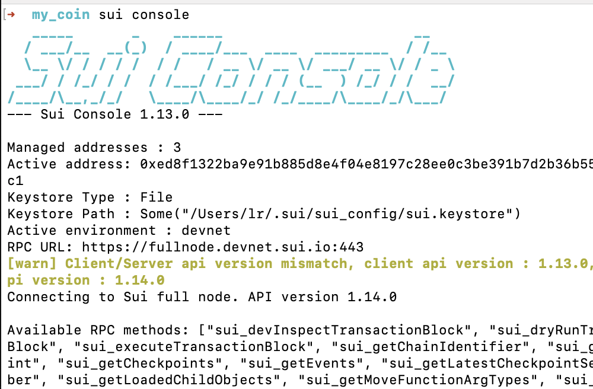

# 学习日志
## 环境搭建
因为我电脑是mac，并且之前安装过brew，并已经配置过国内镜像，所以没有遇到过什么问题。
安装Rust的时候，也是用[国内镜像的方法](https://www.cnblogs.com/hustcpp/p/12341098.html)，很是丝滑。

## 安装Sui
使用二进制文件安装
```
cargo install --locked --git <https://github.com/MystenLabs/sui.git> --tag sui-v1.0.0 sui
```
安装成功后，执行```sui --version```判断是否安装成功

> tips: 安装过程建议选择默认```ed25519```算法（会生成一个地址），因为这是和钱包互通的算法，方便把导入到钱包。

## Sui相关命令熟悉
和其它工具的命令一样，用多了就会熟悉。
不过Sui CLI大致分成了四类：Sui Client CLI、Sui Console CLI、Sui Keytool CLI、Sui Move CLI

### Sui Client CLI 
这个命令主要是和 Sui 网络交互相关的命令，包括但不限于管理地址、发布合约等
下面是我这两天经常使用的：

#### 管理网络
- 切换网络 sui client switch --env [network alias]
- 列出所有网络 sui client envs
- 添加新的网络: sui client new-env --alias <ALIAS> --rpc <RPC>
```
# 添加主网rpc到本地cli环境
sui client new-env --alias mainnet --rpc <https://sui-mainnet.nodeinfra.com:443>
```

1.sui client publish 发布Move合约
1.sui client publish 发布Move合约

#### 查询启用地址和 Gas Objects
- 查询所有地址：sui client addresses
- 查询当前启用地址：sui client active-address
- 创建新地址: sui client new-address
- 列出所有的gas: sui client gas

#### Move相关
- 发布Move模块：sui client publish
- 调用Move函数：sui client call

### Sui Console CLI 
会打印出Sui相关信息
```
sui console
```


### Sui Keytool CLI
这几天用得不多，主要用了两个：
- 查询所有的公钥和算法方案等：sui keytool list
- 转换私钥格式(hex-sui.keystore): sui keytool convert

### Sui Move CLI
处理Move语言编译等命令，主要有以下几个命令
- 创建新包：sui move new 
- 本地构建并测试：sui move build 
- 单元测试：sui move test

## 前端与sui的交互
快速创建一个新的 dApp 项目
```
pnpm create @mysten/create-dapp
```
demo: https://github.com/ruizer/sui-client-dapp

```
React技术栈

React
TypeScript
Vite
Radix UI
ESLint
@mysten/dapp-kit
```
### @mysten/dapp-kit
主要就是一些和钱包交互的hook或组件

- SuiClientProvider
- Rpc Hooks
- WalletProvider
- Wallet Components
- Wallet Hooks

[文档](https://sui-typescript-docs.vercel.app/dapp-kit)

## 发布ERC20合约

### 1. 新建Move项目
```
sui move new <PACKAGE NAME>
```

### 2. Move.toml配置

```
[package]
name = "my_coin"
version = "0.0.1"

// 注意网络要一致
[dependencies]
Sui = { git = "https://github.com/MystenLabs/sui.git", subdir = "crates/sui-framework/packages/sui-framework", rev = "framework/devnet" }

[addresses]
my_coin = "0x0"
```

### 3. 创建合约
根据[示例](https://examples.sui-book.com/samples/coin.html)创建ERC20合约

### 4. 部署合约
```
sui client publish --gas-budget 20000000 ##gas-budget 参数表示部署合约gas预算，预算根据每次合约的复杂度来算

----部署成功将打印出如下信息----

----- Transaction Digest ----
7kQWMaLvmufcJhyhetjvhk8WWCqZXW4vNQEffvvRQhGC
----- Transaction Data ----
Transaction Signature: [Signature(Ed25519SuiSignature(Ed25519SuiSignature([0, 62, 43, 222, 142, 179, 160, 196, 148, 214, 11, 15, 198, 121, 68, 126, 161, 95, 54, 132, 42, 214, 21, 153, 120, 77, 111, 77, 131, 63, 202, 235, 8, 163, 221, 177, 60, 235, 49, 69, 118, 66, 92, 208, 19, 175, 221, 84, 30, 189, 36, 31, 63, 95, 68, 38, 164, 79, 140, 11, 239, 101, 50, 99, 10, 231, 161, 130, 221, 198, 201, 193, 40, 110, 132, 23, 11, 37, 225, 200, 26, 99, 156, 192, 201, 162, 248, 181, 28, 61, 50, 83, 130, 240, 243, 18, 183])))]
Transaction Kind : Programmable
Inputs: [Pure(SuiPureValue { value_type: Some(Address), value: "0xed8f1322ba9e91b885d8e4f04e8197c28ee0c3be391b7d2b36b55dcbc170b8c1" })]
Commands: [
  Publish(<modules>,0x0000000000000000000000000000000000000000000000000000000000000001,0x0000000000000000000000000000000000000000000000000000000000000002),
  TransferObjects([Result(0)],Input(0)),
]

Sender: 0xed8f1322ba9e91b885d8e4f04e8197c28ee0c3be391b7d2b36b55dcbc170b8c1
Gas Payment: Object ID: 0x32abaa60161f1e0ccb427582836e080925d367443a0a40be89a432e8308a731b, version: 0x10, digest: CDpGeoUmcazwyxvxaBLfqxiHxoNTVeGRga9pvRTHrjmn 
Gas Owner: 0xed8f1322ba9e91b885d8e4f04e8197c28ee0c3be391b7d2b36b55dcbc170b8c1
Gas Price: 1000
Gas Budget: 100000000

----- Transaction Effects ----
Status : Success
Created Objects:
  - ID: 0x0ce9a1686c9bd7041fc605e6740d205bf91853e11cb42656e065e0e289584828 , Owner: Account Address ( 0xed8f1322ba9e91b885d8e4f04e8197c28ee0c3be391b7d2b36b55dcbc170b8c1 )
  - ID: 0x791c6161e7244bb55caf4df9b4b0ef5d92a169f01dd21c739eae84acfe38129c , Owner: Account Address ( 0xed8f1322ba9e91b885d8e4f04e8197c28ee0c3be391b7d2b36b55dcbc170b8c1 )
  - ID: 0xaa94642b73e5d8a3a2ca9a9f5b6c294e8b6af9a8e151727016ed2855964e79e1 , Owner: Immutable
  - ID: 0xef046e50168b9f640737d07cbf1ecce4dfcd9e870e48496672b076ab9070314a , Owner: Immutable
Mutated Objects:
  - ID: 0x32abaa60161f1e0ccb427582836e080925d367443a0a40be89a432e8308a731b , Owner: Account Address ( 0xed8f1322ba9e91b885d8e4f04e8197c28ee0c3be391b7d2b36b55dcbc170b8c1 )

----- Events ----
Array []
----- Object changes ----
Array [
    Object {
        "type": String("mutated"),
        "sender": String("0xed8f1322ba9e91b885d8e4f04e8197c28ee0c3be391b7d2b36b55dcbc170b8c1"),
        "owner": Object {
            "AddressOwner": String("0xed8f1322ba9e91b885d8e4f04e8197c28ee0c3be391b7d2b36b55dcbc170b8c1"),
        },
        "objectType": String("0x2::coin::Coin<0x2::sui::SUI>"),
        "objectId": String("0x32abaa60161f1e0ccb427582836e080925d367443a0a40be89a432e8308a731b"),
        "version": String("17"),
        "previousVersion": String("16"),
        "digest": String("Gb2X5cSznAHo4osygoPxkYG7nmCfxHGzRXvSQ8YmcFK4"),
    },
    Object {
        "type": String("created"),
        "sender": String("0xed8f1322ba9e91b885d8e4f04e8197c28ee0c3be391b7d2b36b55dcbc170b8c1"),
        "owner": Object {
            "AddressOwner": String("0xed8f1322ba9e91b885d8e4f04e8197c28ee0c3be391b7d2b36b55dcbc170b8c1"),
        },
        "objectType": String("0x2::package::UpgradeCap"),
        "objectId": String("0x0ce9a1686c9bd7041fc605e6740d205bf91853e11cb42656e065e0e289584828"),
        "version": String("17"),
        "digest": String("FQL1ZUPnp4VoLcfoyCn738eNj4Lb5swzxm7kQCubgYm1"),
    },
    Object {
        "type": String("created"),
        "sender": String("0xed8f1322ba9e91b885d8e4f04e8197c28ee0c3be391b7d2b36b55dcbc170b8c1"),
        "owner": Object {
            "AddressOwner": String("0xed8f1322ba9e91b885d8e4f04e8197c28ee0c3be391b7d2b36b55dcbc170b8c1"),
        },
        "objectType": String("0x2::coin::TreasuryCap<0xaa94642b73e5d8a3a2ca9a9f5b6c294e8b6af9a8e151727016ed2855964e79e1::mycoin::MYCOIN>"),
        "objectId": String("0x791c6161e7244bb55caf4df9b4b0ef5d92a169f01dd21c739eae84acfe38129c"),
        "version": String("17"),
        "digest": String("FccUE85EHgtzWZHajtc69TBMRyC6AqRrTHpoxnBe1951"),
    },
    Object {
        "type": String("published"),
        "packageId": String("0xaa94642b73e5d8a3a2ca9a9f5b6c294e8b6af9a8e151727016ed2855964e79e1"),
        "version": String("1"),
        "digest": String("4hjVCxGoJXV1cfnz1GCYNgeKA6gs9N2DWwYzLVWdzyaG"),
        "modules": Array [
            String("mycoin"),
        ],
    },
    Object {
        "type": String("created"),
        "sender": String("0xed8f1322ba9e91b885d8e4f04e8197c28ee0c3be391b7d2b36b55dcbc170b8c1"),
        "owner": String("Immutable"),
        "objectType": String("0x2::coin::CoinMetadata<0xaa94642b73e5d8a3a2ca9a9f5b6c294e8b6af9a8e151727016ed2855964e79e1::mycoin::MYCOIN>"),
        "objectId": String("0xef046e50168b9f640737d07cbf1ecce4dfcd9e870e48496672b076ab9070314a"),
        "version": String("17"),
        "digest": String("CLLUWXGuQih2xMmL5mpVBHQfsUCZRx5ifL8AYgzzoUJS"),
    },
]
----- Balance changes ----
Array [
    Object {
        "owner": Object {
            "AddressOwner": String("0xed8f1322ba9e91b885d8e4f04e8197c28ee0c3be391b7d2b36b55dcbc170b8c1"),
        },
        "coinType": String("0x2::sui::SUI"),
        "amount": String("-12440280"),
    },
]

```
