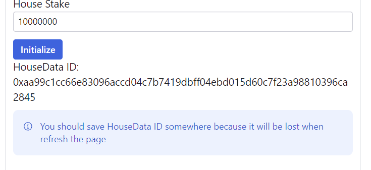
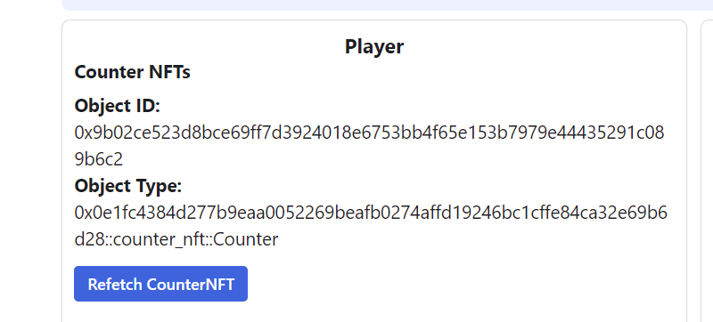
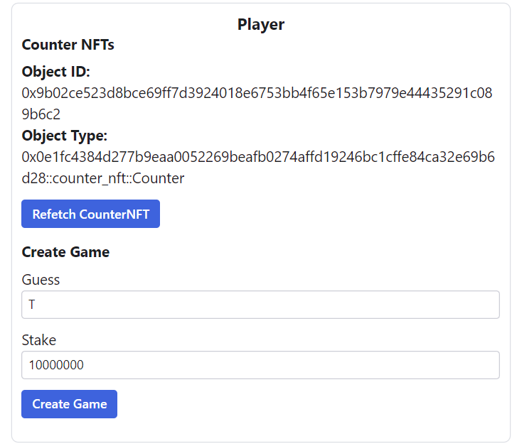
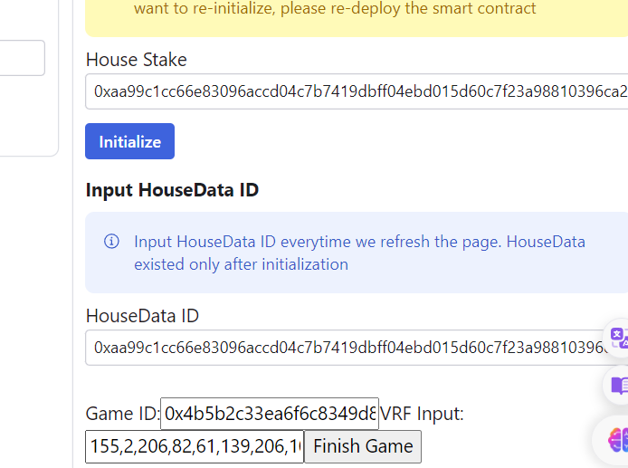
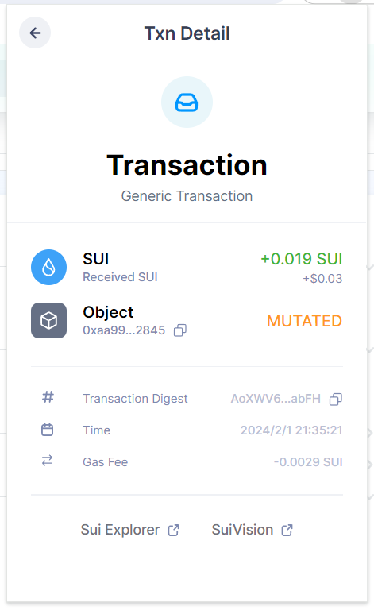

# coin-filp 小游戏测试

* 部署move package
package: 0x0e1fc4384d277b9eaa0052269beafb0274affd19246bc1cffe84ca32e69b6d28

* 运行客户端，连接钱包
注：需要package部署者调用
* 首先点击generate  生成一个公钥私钥对  
需要保存  

```
Private Key:
6f3b9cb60f7b4d260e275a660d7a5654e1e5d2d9785f266732cd108ee545f93c
Public Key:
8158564df454c05e724bdb89e75cf98fc03350970b0e5fc61e5846cc7624b7f9613757ddf95322c372f01914c25c52f3
```
* 输入生成的private Key和house质押的sui数目  点击initlize  生成house_data

需要将House Data保存

* 玩家点击create Counter创建一个Counter


* 玩家输入Guess的结果和要质押的代币数   注意不能超过最大质押数  不能小于最小质押数  也不能大于house中的余额


* 通过钱包可以查到已经成功创建

* 保持private Key和house_data正确输入 输出刚刚创建game的id和vrf 点击finish_game 可以判断胜负


* 可以看到我本局获胜



