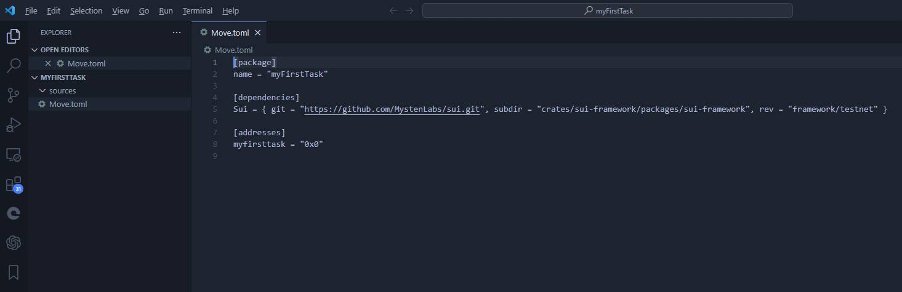
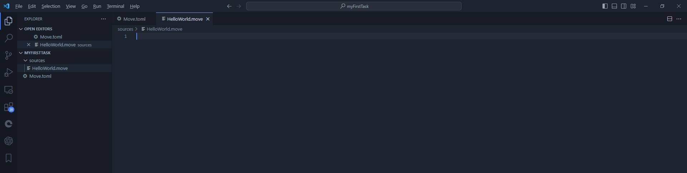
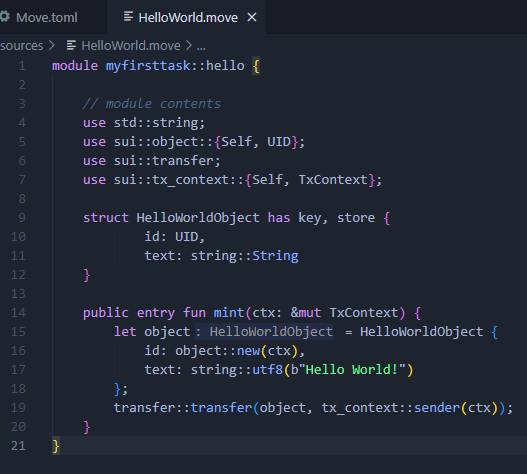
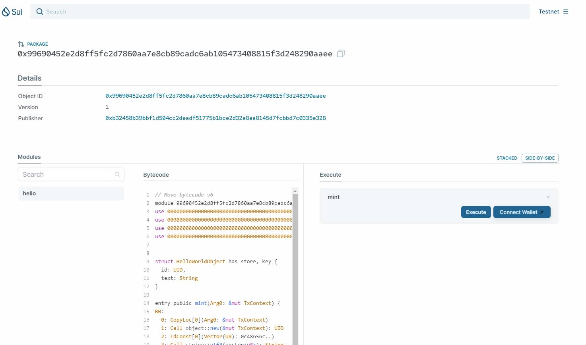
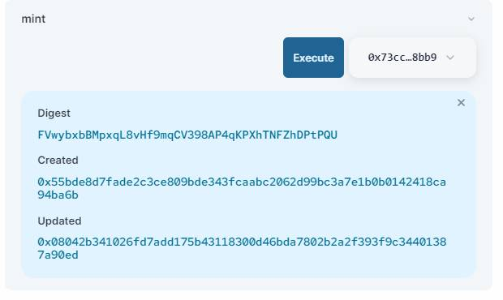
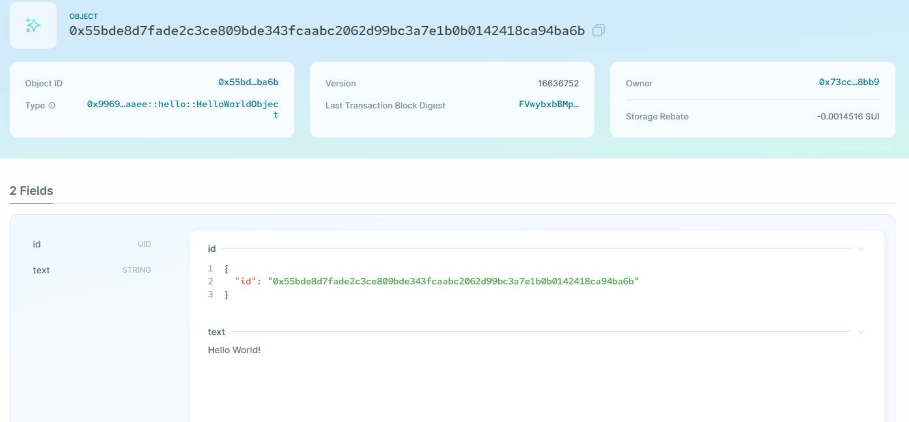

# 星航计划第一阶段完成攻略

近期发现很多新来的小伙伴，想加入星航计划，但是不知道如何开始。
本文将介绍星航计划的第一阶段，如何开始，如何完成。给小伙伴们打个样。
写本文的目的也是想抛砖引玉一下，如果有小伙伴觉得我写的不好，也请写一份更详细的攻略，有奖哦！

### 首先第一阶段的几个目标
* 完成第一个简单的Move智能合约
* 成功部署到测试网络
* 提交认证：

其实第一阶段的目标很简单，就是完成第一个Move智能合约，然后部署到测试网络。（ 好像什么都没说。。。）
### 准备工作
* 安装好Move语言，并配置好环境变量。
* 资料基本汇总地 https://github.com/movefuns/SuiStartrek
* 通读 Sui Book 中文 这篇文章，对Move语言有基本的了解。
* 仔细了解编译部署的hello world 文章 https://intro-zh.sui-book.com/unit-one/lessons/5_hello_world.html

### 以上准备工作做全后，就可以开始写第一个Move智能合约了。
首先建立一个文件夹，命名为 `myFirstTask`
```
md myFirstTask
```

然后进入文件夹，运行命令
```
sui move new myFirstTask
```

不出意外的话，会建立一个目录 myFirstTask
```
cd myFirstTask
dir
```

这个目录下，会有一个 `sources` 文件夹，和一个 `Move.toml` 文件。

可以用vscode打开myFirstTask这个文件夹,可以看得更清楚一些。


然后，在 `sources` 文件夹下，建立一个文件 `HelloWorld.move`


输入一个空的结构
```
module myfirsttask::hello {

    // module contents
    
}
```

引入一下 modules:
```
use std::string;
use sui::object::{Self, UID};
use sui::transfer;
use sui::tx_context::{Self, TxContext};
```

增加一个结构体
```
struct HelloWorldObject has key, store {
        id: UID,
        text: string::String
}
```

增加一个函数
```
public entry fun mint(ctx: &mut TxContext) {
    let object = HelloWorldObject {
        id: object::new(ctx),
        text: string::utf8(b"Hello World!")
    };
    transfer::transfer(object, tx_context::sender(ctx));
}
```

一个完整的 Move 智能合约就写完了。


然后，编译这个合约
```
sui move build
```

没有报错的情况是这样显示
```
INCLUDING DEPENDENCY Sui
INCLUDING DEPENDENCY MoveStdlib
BUILDING myFirstTask
```

开发环境确认
```
╭─────────┬─────────────────────────────────────┬────────╮
│ alias   │ url                                 │ active │
├─────────┼─────────────────────────────────────┼────────┤
│ devnet  │ https://fullnode.devnet.sui.io:443  │        │
│ mainnet │ https://fullnode.mainnet.sui.io:443 │        │
│ testnet │ https://fullnode.testnet.sui.io:443 │ *      │
╰─────────┴─────────────────────────────────────┴────────╯
```

发布合约到测试网
```
sui client publish  --gas-budget 100000000
```

控制台会出现一大堆输出,找到
```
Published Objects:                                                                                 │
│  ┌──                                                                                             │
│  │ PackageID: 0x99690452e2d8ff5fc2d7860aa7e8cb89cadc6ab105473408815f3d248290aaee                 │
│  │ Version: 1                                                                                    │
│  │ Digest: 2FGA4eEpXE4HG2qUgmx2LswaLGPeLRJp9ediiWxvSfzn                                          │
│  │ Modules: hello
```


复制 PackageID 0x99690452e2d8ff5fc2d7860aa7e8cb89cadc6ab105473408815f3d248290aaee

到 https://suiexplorer.com/

查找PackageID的时候记得切刀 Testnet环境


执行 Execute 前记得链接钱包并调整到 testnet模式


查看 0x55bde8d7fade2c3ce809bde343fcaabc2062d99bc3a7e1b0b0142418ca94ba6b 这个object的内容


看见 hello world 已经上链

第一阶段已经基本大功告成了！
然后在git上根据要求提交pr，如何pr在官网也有详细介绍，找如何参与那一段，写的很详细。

GitHub - movefuns/SuiStartrek

就可以联系助教，通过审核后就可以获取巨额奖金了！


Move语言学习交流QQ群: 79489587

Sui官方中文开发者电报群: https://t.me/sui_dev_cn

