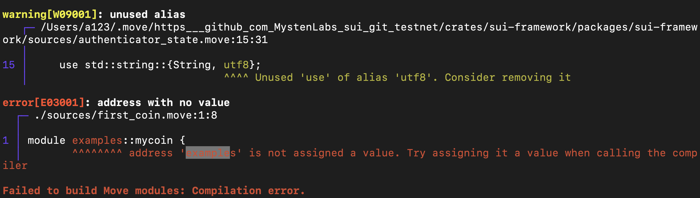

# 学习日志

## 第一周任务

> - 安装Move 开发环境
> - 安装Web3 钱包
> - 学习ERC 20
> - 完成ERC 20 合约的发布

### 开发环境

> 此日志仅包含本人安装路径，更多安装方法请参考 [**星航计划**](https://github.com/movefuns/SuiStartrek)

**二进制安装**

1. 进入sui的仓库下下载最新的release版本（按照自己的设计型号）
2. 解压文件，选择 Target - release
3. 将 release 文件内的所有内容移动到/Users/a123/.cargo/bin
4. 输入指令 sui --version 
5. 但是mac提示警告，需要在set-privacy security里面点击允许从app store和可信的开发者安装文件
6. 输入指令 sui --version

### Web3钱包

**sui官方钱包**

1. 从chrome商店下载浏览器拓展
2. 通过导入助记词的方式来讲sui cli的地址导入钱包中

### ERC20 

> 注意，仅限小白的
> 在完成mycoin合约准备编译的时候，如果有下面错误
> 是因为在move.toml文件中，配置了模块的地址，只要将文件中的模块名字对example位置进行替换即可
